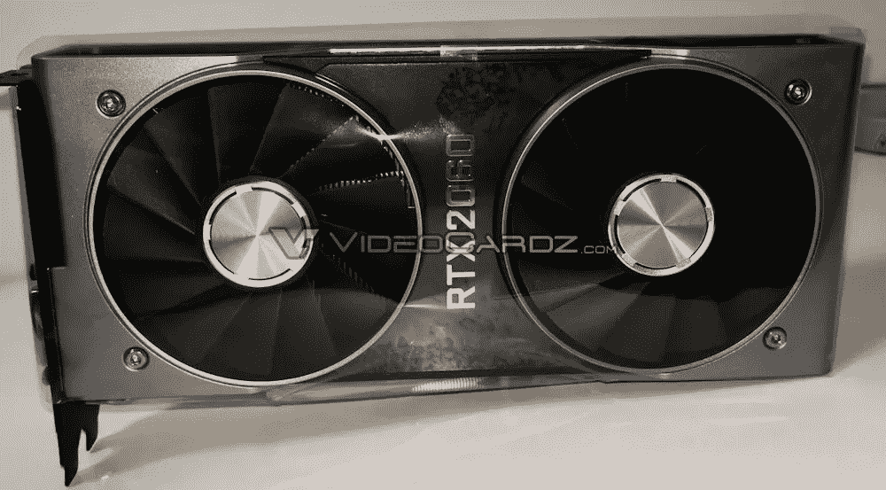
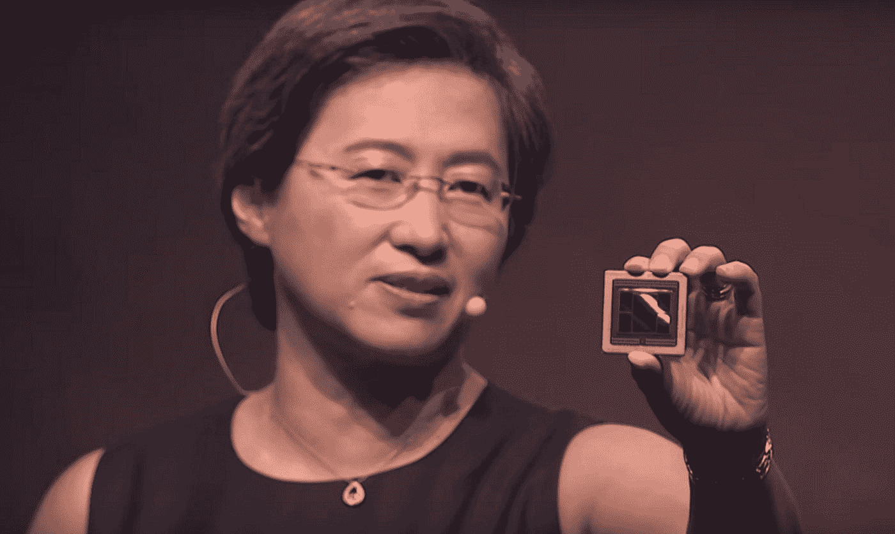
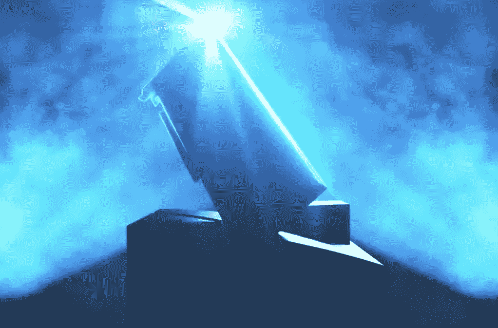

# 2019 年电脑技术预测

> 原文：<https://medium.datadriveninvestor.com/2019-cpu-and-gpu-predictions-7f18532ec001?source=collection_archive---------15----------------------->

**两个字。七纳米。这确实是计算的未来。**

7 纳米将成为 2019 年 CPU 和 GPU 的最新热潮。这是所有主要台式机公司(英伟达、AMD 和英特尔)多年来最大的芯片萎缩。14 纳米长期以来一直是主要的晶体管尺寸，自从他们的 Skylake 处理器发布以来，英特尔一直使用它。他们一直在努力让 10 纳米发挥作用，多年来一直没有结果或他们技术的消息。

# 英伟达:

另一方面，Nvidia 终于将他们的 12 纳米图灵架构带到了廉价市场。目前还不清楚这些卡是否支持他们的旗舰功能，光线追踪，但即使不支持，我敢肯定没有多少人会关心它糟糕的帧速率和功率低得多的几个用例。

[(Picture/leak by VideoCardz.com)](https://wccftech.com/nvidia-geforce-rtx-2060-and-gtx-1160-pictures-specs-custom-model-leak/)

RTX/GTX 2060/1160 和 2050 将是他们今年关注的焦点，同时(希望)有更多的驱动程序更新来帮助在游戏中实现实时光线跟踪，以及在游戏中更好地支持 DLSS。如果 Nvidia 希望将他们 1200 美元的显卡变成一个更好的专业人士和游戏玩家的 GPU，这些驱动程序更新将是必要的。

# AMD:

(Worlds first 7nm GPU die announced by Lisa Su earlier this year)

AMD 是这一次值得关注的公司。他们用他们的 CPU 和 GPU 引领 7 nm 宣传列车进入 2019 年。我预计 AMD *将* 改变今年的游戏，从 1 月上半月的 CES 开始，我相信他们会透露他们的 CPU 和 GPU 的 7 nm 计划，并可能给我们一个发布日期。

除此之外，他们将与锐龙 3000 一起发布 X570 主板，今年晚些时候将发布 B550 主板。事实上，我预计两种主板都将使用 PCIe 4.0，这可能意味着他们的新 Navi 架构也将使用它。

# 英特尔:

英特尔也是英特尔。我们也希望他们能缩小芯片，但是可能会再次推迟。正如本文前面所述，英特尔在芯片收缩方面并不是很准时。他们一直在不断推迟，他们给我们的只是同一流程节点的刷新。在 2019 年，特别是接近尾声时，我们*可能最终*看到英特尔的芯片萎缩，但我们也可能不得不再等一年。

(Intel teasing their new Dedicated Graphics card)

他们可能会让我们看看他们的新集成 GPU (Gen 11)，速度将是上一代的 2 倍，你可以在这里了解更多关于[的信息](https://www.extremetech.com/computing/282303-intel-shows-off-new-gen11-graphics-teases-xe-discrete-gpu)。希望他们能让我们一窥 2020 年他们新的专用 GPU 的前景，并希望它有能力与 AMD 和 Nvidia 等公司竞争。

这些只是我对明年我们可以期待的一些预测。对于技术来说，这似乎将成为伟大的一年，我对此充满期待！如果 AMD 真的在今年的 CES 上宣布他们的 7 纳米产品，我会报道它，以及芯片尺寸缩小的好处和它们为什么如此重要。

**新年快乐！**