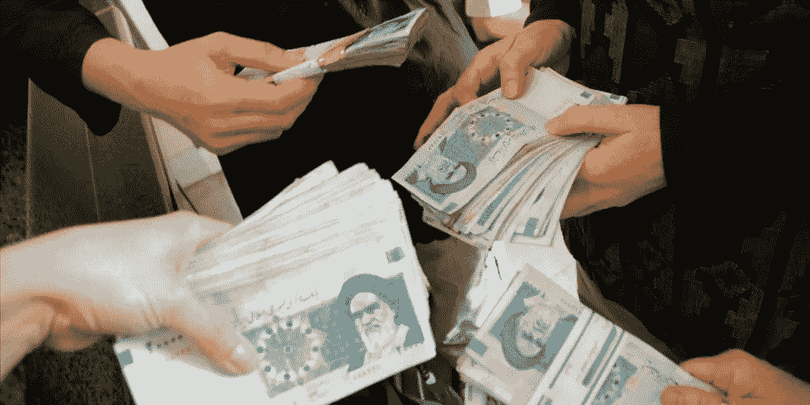

# 2019 年可能是国家加密货币年

> 原文：<https://medium.datadriveninvestor.com/2019-might-be-the-year-of-national-cryptocurrencies-4a812bf93b09?source=collection_archive---------18----------------------->

## …但比特币将无可替代。

当中国当局正在打击该国的虚拟货币时，伊朗政府宣布推出一种国家加密货币。

对加密货币交易的限制背后的主要原因可能不是当局对公民福利的担忧(公民可能会因投资失败而破产)，也不是试图废黜美元，而是该国打击洗钱和腐败的斗争。

# 那么与伊朗的协议是什么？

伊朗推出国家加密货币有着完全不同的原因。这个国家更像委内瑞拉。现在，伊朗正受到美国经济制裁的威胁:国际支付系统 Visa 和 Mastercard 在该国无法使用，经济受到限制，伊朗里亚尔贬值。

引入国家加密货币的准备工作早在 2018 年春天就开始了，当时当局禁止在该国使用加密货币，2018 年 5 月，伊朗用户开始在访问最大的加密货币交易所时遇到问题。

中国、伊朗和委内瑞拉并不是唯一认真考虑引入本国加密货币可能性的国家。根据来自 Bloomberg.com 的记者进行的研究，几乎所有发达国家的央行都在一年前开始考虑创建国家加密货币。

然而，根据 Akin Fernandez 的文章，所有政府项目的主要问题是，试图引入加密货币的人对加密货币的工作原理没有丝毫了解。

> 所有国家加密货币的项目都有一个共同点——完全控制的理念——追踪该国金融运作的可能性。因此，几乎所有发达国家的央行都对区块链感兴趣就不足为奇了。

但是有一点非常重要。如果我们谈论由国家财富支持的加密货币(如委内瑞拉的 El Petro ),或者价格与国家货币汇率挂钩的加密货币(如中国或以色列的加密货币项目),并且集中发行，那么它们都不是加密货币。因为加密货币的主要特征是去中心化和匿名性——没有这些品质，加密货币的概念就失去了所有意义。

## 有一种情况剥夺了国家加密货币取得成功的机会——那就是比特币。

问题是，所有替代货币都是用比特币或有时是以太币来兑换和购买的。因此，尽管比特币已经失去了近 50%的原有价值，但它仍然是世界上最受欢迎和最有价值的加密货币。尽管事实上全球超过一半的比特币都集中在一小撮人手中，并由他们控制，但区块链仍然保持分散化，并保证所有网络参与者的匿名性。

这使得任何加密货币，至少是国家加密货币，都不可能取代比特币，或者仅仅成为比特币的替代品。只有在单个国家，在全面禁止其他加密货币的条件下才有可能，就像伊朗和中国现在做的那样。另一种国家加密货币的出现将成为像比特币或美元一样在世界上有影响力的货币，这似乎是一个绝对梦幻的场景。

# 跟随[费尔温](http://fairwin.io/):

推特:【https://twitter.com/FairwinGambling[T4:](https://twitter.com/FairwinGambling)[https://www.facebook.com/fairwin.gambling/](https://www.facebook.com/fairwin.gambling/)insta gram:[https://www.instagram.com/fairwin_team/](https://www.instagram.com/fairwin_team/)

# 与我们聊天:

不和:[https://discord.gg/Hbardp2](https://discord.gg/Hbardp2)
Reddit:[https://www.reddit.com/user/fair-win](https://www.reddit.com/user/fair-win)
电报:[https://t.me/fair_win](https://t.me/fair_win)