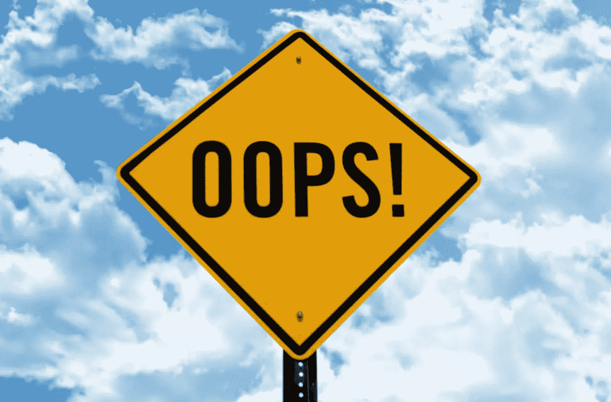

# 作为投资者，对市场的三大误解可能会伤害你

> 原文：<https://medium.datadriveninvestor.com/3-big-misconceptions-about-the-market-that-could-hurt-you-as-an-investor-a0815b21d577?source=collection_archive---------12----------------------->

*本文最初是为与* [*发表在吉卜林*](https://www.kiplinger.com/article/investing/T038-C032-S014-3-big-misconceptions-about-market-that-could-hurt.html) *上而写的。*

作为投资者，你能说的最有价值的三个词可能是:“我不知道。”

当你不知道某事时，承认它打开了提问、寻求信息和学习新事物的大门。从那里，你可以更好地定位自己，做出更高质量的决策。

 [## 算法交易的机器学习|数据驱动的投资者

### 当你的一个朋友在脸书上传你的新海滩照，平台建议给你的脸加上标签，这是…

www.datadriveninvestor.com](https://www.datadriveninvestor.com/2019/01/30/machine-learning-for-stock-market-investing/) 

但是，投资者并没有说出这三个字，而是倾向于成为三大错误观念的受害者，这三大错误观念让他们的投资损失惨重。

以下是在股市中经常被误解的地方，你可以避免犯同样的错误。

# 误解:你投资于标准普尔 500，所以你是多元化的

另一种表达这种误解的方式是，你假设 S&P 或道琼斯指数*就是股票市场*——但事实并非如此。

当然，投资标准普尔 500 比你把所有的钱都放在一只股票上更分散。但你只在一个细分市场中进行了多元化；标准普尔 500 占全球股票市场的份额不到 40%。

[真正的多元化对降低投资风险很重要](https://beyondyourhammock.com/11/)同时从整个市场获取尽可能多的回报。坚持只看 S & P 500 会让你错失良机。

以 2000 年至 2009 年的回报率为例。这十年的年化总回报率为-0.95%。

但如果你看看同期的 MSCI 新兴市场指数，年化总回报率为 9.78%。

你可能错过了显著的增长，因为你认为你通过把钱投入一只跟踪 S&P 的基金已经“足够多样化”了——而且你也因为缺乏多样化而承担了更多的风险。

在这十年中，缺乏多样化的风险表现为 10 年的虚拟 0%回报率。我说这些不仅仅是为了让 S&P 看起来糟糕，也不是说投资这个指数总体上是件坏事。

它可能会成为你投资组合中很好的一部分，这才是真正的要点:单单标准普尔 500 *并没有广泛地多元化。*

事实上，如果你看看 2009 年到 2019 年，你会看到一幅不同的画面。在此期间，该指数的年化回报率为 9.7%，而摩根士丹利资本国际新兴市场等指数表现不佳，回报率略高于 5%。

再说一次，我不打算挑标准普尔 500 的毛病——我在这里用它作为我的主要例子，因为如果我们开始谈论“市场”，大多数美国人都会指向它

这就是在整整十年里，任何一个方向缺乏多样化都会对你的投资组合造成的影响。如果你试图创造自己的财富，你必须考虑几十年，而不仅仅是几个月甚至几年。

从大处着眼来建立你的投资组合，这样你就可以建立一个投资计划，将长期表现考虑在内，并适当分散你的投资，以抵御你未来 30 至 40 年可能投资的一些投资风险。

# 误解:你投资于市场——所以无论“市场”做什么，你的投资组合也会做什么

使用像“市场”这样的词确实是含糊不清的，实际上并没有具体说明你在说什么…因为有一个股票市场。还有债券市场。还有其他市场。

[创建一个符合你的需求和风险承受能力的投资组合的整体目标](https://beyondyourhammock.com/become-a-better-investor/)是在股票、债券和细分市场之间取得恰当的平衡。一般来说，债券的表现可能与“股票市场”并不完全相同。

你特定的资产配置和分散投资的方式可能会导致你的业绩看起来与标准普尔 500 这样的一般衡量标准非常不同。

底线呢？你不知道你的投资组合在做什么，直到你看着*你的*投资组合。

这种误解通常发生在观看或阅读大量金融新闻的人身上，这往往是你最不想去了解你的具体投资发生了什么的地方。

警惕对当前市场表现*和*下一步可能发生的预测的泛化。它们可能会让你对自己的投资组合做出一些不明智的决定，而你可以通过简单地[排除噪音](https://www.kiplinger.com/article/investing/T031-C032-S014-managing-your-risk-in-a-24-hour-news-world.html)来轻松避免这些决定。

# 误解:在过去的两年里，你的投资组合比别人的差，所以你应该改变你的投资组合

过去两年，大型成长型股票表现非常好。小型股的表现没有 T11 好。因此，如果你的投资组合中小盘股多于成长股，那么你的投资组合在这段时间的表现可能低于市场。

如果你在比较两个投资组合，一个价值更小，另一个增长更大——这只是一个例子，你可以比较任何两个资产类别——错误会是说，“因为我的两年来表现不如某某，我需要做出调整，追求与某某相同的回报。”

为什么？因为任何两年的时间都不能决定一个投资策略的成败。但追逐这些回报可以。

这有点像在车流中试图变道；当你意识到你旁边的车道比你的车道移动得快，你向那边移动时，它停了下来——猜猜现在哪条车道在移动？你刚离开的那个。

这就是普通投资者在市场中的损失。

当他们意识到他们投资的资产类别之外的另一个资产类别表现良好时，他们可能已经错过了上涨，当他们调整投资组合时，他们承担了该细分市场表现不佳的巨大风险。他们也冒着在他们*投资的资产*开始升值之前放弃策略的风险！

你不仅需要[了解你是如何投资的](https://beyondyourhammock.com/stock-market-basics/)(什么资产类别和百分比)，而且你还需要考虑这些资产类别的历史、长期、10 年以上的表现。

选取任何两到五年期间的一小部分，都不会给你足够的信息来做出重大决策——比如将你的投资组合完全转向另一个方向，试图追逐回报。

你应该根据你的长期信念来制定你的策略，并长期坚持下去。

获得更多你可以在生活中实际运用的金融知识、见解和信息。查看博客 [***超越你的吊床***](http://beyondyourhammock.com/blog) ***或订阅*** [***超越财经播客***](http://beyondyourhammock.com/beyondfinances) ***。***