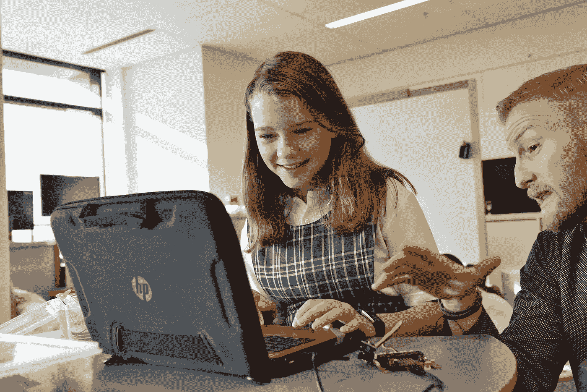

# 你应该听播客的 4 个理由

> 原文：<https://medium.datadriveninvestor.com/4-reasons-why-you-should-listen-to-podcasts-c0907fbf6c1a?source=collection_archive---------7----------------------->

Photo by [Siddharth Bhogra](https://unsplash.com/@thefakebhogra?utm_source=unsplash&utm_medium=referral&utm_content=creditCopyText) on [Unsplash](https://unsplash.com/search/photos/podcast?utm_source=unsplash&utm_medium=referral&utm_content=creditCopyText)

我在生活中一直在看书，看视频，但我花了一段时间才明白听播客的深刻错综复杂。

播客这种媒介教会我清晰地与人交流，跳出框框思考，练习倾听的艺术，并在这个世界上变得脆弱。

 [## 幸福的算法？数据驱动的投资者

### 从一开始，我们就认为技术正在使我们的生活变得更好、更快、更容易和更实用。社交媒体…

www.datadriveninvestor.com](https://www.datadriveninvestor.com/2019/03/08/an-algorithm-for-happiness/) 

# 清楚

大多数播客邀请客人谈论他们的生活，以便听众可以学习特定主题的新观点和方法。

作家、科学家、教师和冒险家只有有限的时间来表达他们的想法，所以他们非常专注于用最少的词来传达信息。

> 如果极简主义必须用一种媒介来表现。这绝对是一个播客。

采访录完之后，剪辑就开始了。

> 最终的结果是一个完全一致的信息源。

# 创造力

大多数播客都在给出生活建议。

在自我探索中，你会了解到，照搬套路，是比较直截了当的；你按照给定的模板。

将一个习惯变成你的原则是很难的。

所有的受访者都将某些智慧教导作为自己的智慧，并解释了自我整合的道路。

这个过程邀请听众去试验一个系统，直到他们找到适合他们的地方。

> 生活中的小习惯构成了成功的原则。

# 倾听

在今天这个时代，倾听是一种罕见的技能。

当你听播客时，你会进入被动听的模式。

大多数人练习积极倾听，即你安慰听者，问正确的问题，总结信息，而消极倾听正在消失。

当我们上小学的时候，我们常常惊奇地听我们的启蒙老师讲述他或她对这个奇妙世界的看法。

Photo by [stem.T4L](https://unsplash.com/@stem_t4l?utm_source=unsplash&utm_medium=referral&utm_content=creditCopyText) on [Unsplash](https://unsplash.com/search/photos/teacher?utm_source=unsplash&utm_medium=referral&utm_content=creditCopyText)

在这种模式下，你接受“所有被给予的”，而不急于下结论，这就是被动倾听。

播客模拟一两个小时的被动听力。

> 开放空间是通过不间断地倾听个人的真实而创造的。

# 诚实

大多数人很难对自己坦诚相待。

因此，容易受到他人伤害就更难了。

在播客上，人们发自内心地讲述他们面临的所有挑战，以得出某些结论。

听众将会明白，分享变成了一种发泄负面能量或储存创伤的工具。

> 只有面对真相，我们才能解放自己的业力债务。

# 结论

听播客激励你成为生活中更好的人。

因为听播客会刺激:

*   思维和语言的清晰
*   习惯的个性化整合
*   被动倾听的练习
*   诚实面对自己和世界的空间

因此，每个人都应该偶尔听听播客。

Photo by [Annie Spratt](https://unsplash.com/@anniespratt?utm_source=unsplash&utm_medium=referral&utm_content=creditCopyText) on [Unsplash](https://unsplash.com/search/photos/yeah?utm_source=unsplash&utm_medium=referral&utm_content=creditCopyText)

这篇博客是 30 天博客挑战的第 21 篇。