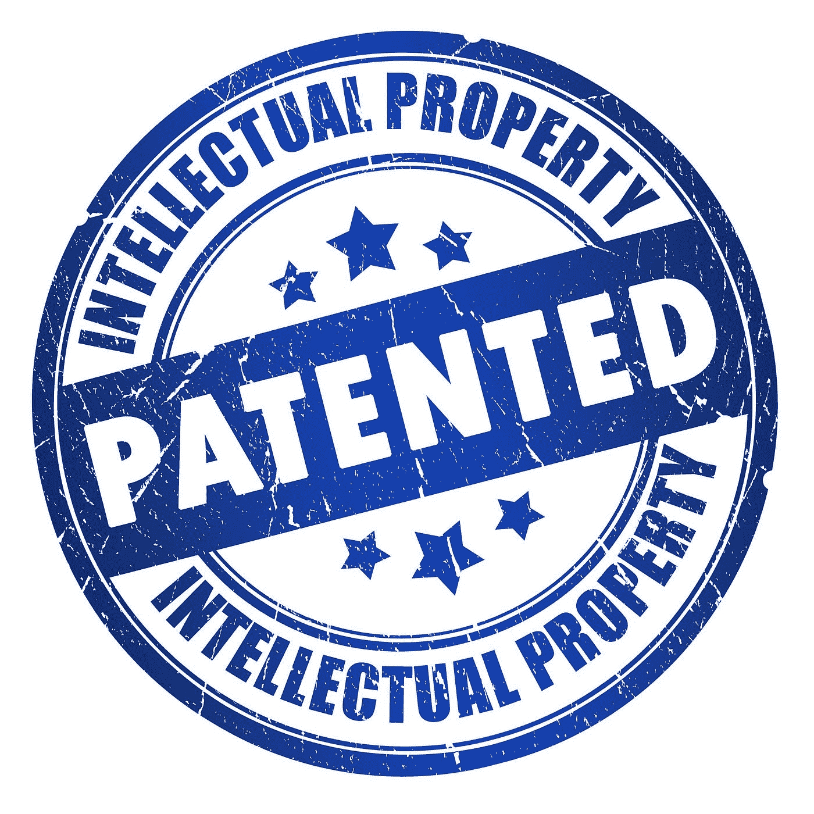

# 每个开发人员必须知道的关于知识产权的 5 件事

> 原文：<https://medium.datadriveninvestor.com/5-things-every-developer-must-know-about-intellectual-property-rights-1a3d789981f8?source=collection_archive---------0----------------------->

今天任何参与软件开发的人都必须对知识产权的来龙去脉有敏锐的理解，包括版权法和专利开发。但是这个领域是如此之大，以至于很难从最重要的点开始缩小范围。

在这里，我们将概述开发人员和软件行业中的其他人应该清楚了解的五个关键领域。这个列表对于专注于开发自己产品的独立企业家或者刚进入科技行业的人来说可能特别有用。

# 1.商标

商标保护你的名字、域名、图像以及一切与产品设计相关的东西。您必须注册您的商标，以确保您的品牌受到全面完整的法律保护。

很简单，任何开发软件的人都应该在他们进入开发过程之前，尤其是在他们与任何人合作之前，就建立起保护机制，以稳固地保护你的品牌名称。

软件开发人员对商标如何运作有一个现代的理解是很重要的，这不仅是为了保护他们自己，也是为了意识到你最终可能与之合作的其他人的权利和责任。

# 2.开源协议

当涉及到知识产权时，一个特别棘手的领域是像[开源代码](https://opensource.com/resources/what-open-source)这样有目的共享的知识产权领域。要知道的主要事情是，这种类型的软件实际上是受版权保护的，开发者需要根据特定的许可来使用它。

如果开发者将完成的作品作为开源发布，有[不同类型的开源许可](https://en.wikipedia.org/wiki/Open_source_license)，开发者应该提前熟悉这些许可。根据许可证的不同，将授予软件用户不同的权限。然而，开发者创建软件程序的目的是让它成为开源平台的一部分，他们不需要遵守许可规则。

# 3.作者对所有者

所有权的确定可能很复杂，尤其是在开源软件的情况下。然而，就雇员-雇主关系而言，只要某人是雇员，他们开发的任何东西都不是他们自己的——雇主将永远拥有版权，无论开发者在开发过程中扮演什么角色都是如此。

如果开发商是一个独立的承包商，他们可能会被视为业主，除非有一个具有法律约束力的合同概述其他条款。

# 4.商业秘密

对一些专注于知识共享以利于创新的人来说，保密似乎是不道德的，但有时这是必要的，因为其他形式的版权既公开又有一定的限制。

如果一个开发人员发现自己有一个高度原创和有价值的想法，他们可能想[保密](https://sourcecodecontrol.co/trade-secrets/)以保持对源代码的完全控制，而没有任何人复制它的风险。保护计划将包括保密协议、密码保护等。

商业秘密可以永久保存，但它们确实需要采取大量措施来确保隐私——这当然会变得更加复杂，取决于团队的规模。

# 5.专利

一项专利的有效期通常为 20 年。开发者可以获得软件方面的[专利](http://www.ipwatchdog.com/software-patents/)，但前提是该发明极具原创性——在软件领域，这将涉及软件本身(例如应用程序)和/或设计中包含的算法。专利还要求你公开你发明的细节。

# 最后

在实际签订工作协议或开始开发自己独特的产品线之前，所有开发人员都需要清楚地了解他们在任何合作雇佣场景中的权利。

双方之间的任何协议都应该以明确的书面形式和合同为基础，并且应该概述未来的条款和权利，如果不是永久的话。

*原载于 2018 年 5 月 17 日*[*www.datadriveninvestor.com*](http://www.datadriveninvestor.com/2018/05/17/5-things-every-developer-must-know-about-intellectual-property-rights/)*。*

