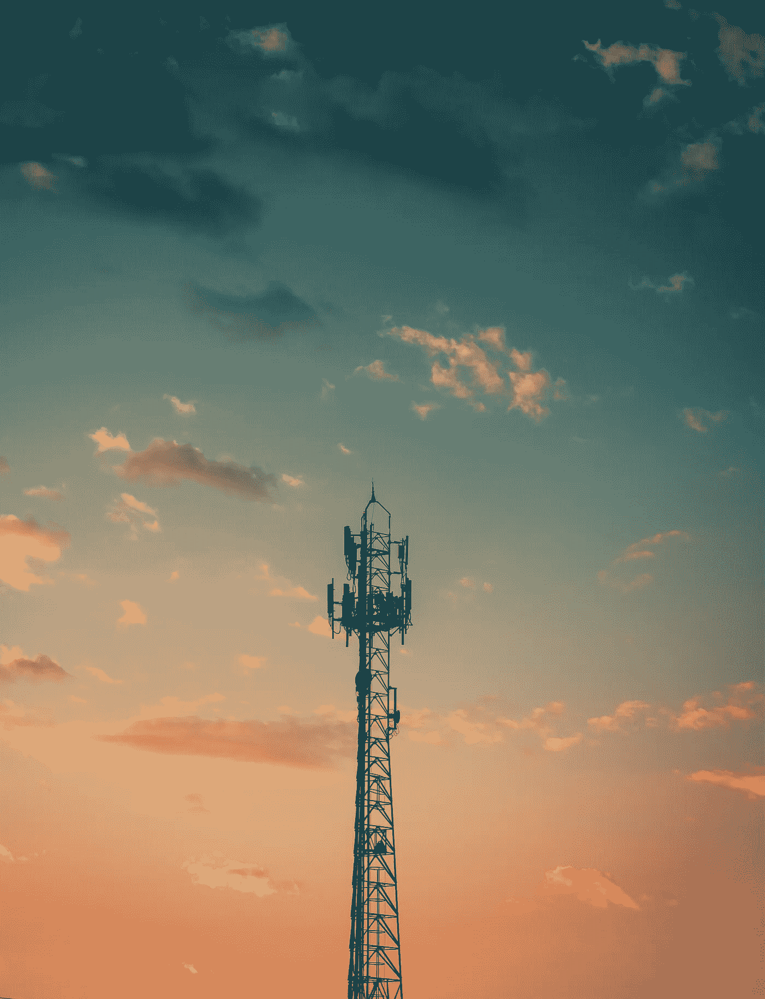

# 5G 将改变医疗保健的 5 种方式

> 原文：<https://medium.datadriveninvestor.com/5-ways-5g-will-transform-healthcare-9187493ae898?source=collection_archive---------3----------------------->

> “我认为这是第四代工业革命的开始。5G 将成为连接数十亿设备的平台。” *——*坎·泰尔齐奥鲁

**5G，第五代蜂窝无线技术**，将提供巨大的连接能力和快速的速度，可能会极大地改变当今医疗保健的提供方式。

在远程医疗出现之前的时代，当我们生病需要医疗护理时，我们只有一个选择:去医生办公室或医院。

 [## 医疗保健的未来正在被一场巨大的技术入侵所塑造——数据驱动的投资者

### 过去十年，全球经济的所有部门都经历了大规模的数字颠覆，而卫生部门现在…

www.datadriveninvestor.com](https://www.datadriveninvestor.com/2018/11/02/the-future-of-healthcare-is-being-shaped-by-a-big-tech-invasion/) 

对于农村地区的人来说，医生位于几英里之外，至少可以说，生病时旅行是有挑战性和耗时的。幸运的是，远程医疗和远程家庭监控系统的出现使我们有可能在家中舒适地接受医疗护理。医生可以在与患者进行简短的视频聊天后提出建议，甚至提交处方请求。

然而，远程患者监护系统和复杂的成像设备的结合会给医疗保健业务网络带来额外的压力。这经常会使网络速度不堪重负和变慢，这对于每天与大量患者打交道的医疗保健提供者来说尤其令人担忧。

虽然这种延迟可能会让用户感到沮丧，但糟糕的网络质量可能会损害用户体验并延迟患者护理，从长远来看，这可能会对结果产生不利影响。随着物联网(IoT)技术的使用不断增长，网络上的数据量将呈指数级增长，这种情况甚至更加可怕。

毫无疑问，5G 技术为这些挑战提供了及时且急需的解决方案。在我们迎来数字健康的未来之际，我认为 5G 对医疗保健机构有五个方面的价值。

## 1.大型成像文件的快速传输

CT 扫描、核磁共振成像和其他图像通常是非常大的文件，在大多数情况下必须发送给专家进行审查。通过带宽较低的网络发送如此大的文件可能会大大延迟传输时间，甚至在某些情况下根本无法传输。这可能会导致患者的等待时间更长，并大大减少在相同时间内提供者可以看到的患者数量。

向现有架构添加高速 5G 网络将提高效率，改善访问和护理质量，因为现在可以可靠快速地传输巨大的数据文件。以奥斯汀癌症中心为例，该中心的 PET 扫描仪在每项研究中为每位患者生成了高达 1g 的信息。具体来说，有了 1GB 的数据，你可以在 *WhatsApp* 上发送超过 150 万条消息，在 *Instagram* 上上传 4000 张照片，发送 10000 封电子邮件，在 *Spotify* 上听 160 首歌曲，或者观看 310 分钟的 *YouTube* 。

奥斯汀癌症中心的首席信息官 Jason Lindgren 在最近的一次采访中描述了这种情况，他解释说:“要将如此多的数据从城镇的一边传输到另一边，你必须有处理这些数据的网络性能。我们过去常常不得不在下班后发送文件。现在，病人一离开扫描仪，研究就已经开始了。这对医生来说是有益的，因为他们可以更快地得到他们需要的结果。”

## 2.远程医疗的发展

最近的一份报告预测，到 2025 年，全球远程医疗市场将从目前的 383 亿美元增长到 1305 亿美元。这意味着 2019 年至 2025 年的复合年增长率为 17%。大约一半的市场将在美国，尽管印度和中国也准备增长。

远程医疗需要一个能够支持实时高质量视频的网络，在当今世界，这通常意味着有线网络。借助 5G，医疗保健系统可以允许移动网络处理远程医疗预约，这可以大大扩展该计划在城市和农村地区的覆盖范围。

医疗保健系统采用 5G 将有助于降低医疗成本，增加医疗服务，并为患者提供更多选择。

## 3.打破语言障碍

在美国的大多数大都市，临床医生经常会遇到母语不是英语的病人。这些患者在紧急情况下不可避免地处于不利地位，因为他们并不总是能够交流自己的健康史或症状。此外，这些患者可能不理解他们的诊断，也不理解后续护理的说明。我的祖母就属于这一类，她在喀麦隆长大，没有接受过正规教育，最后几年她在 DC 的华盛顿州度过，患有心脏衰竭。

许多医疗保健系统使用语言翻译来帮助工作人员克服语言障碍，对此我表示赞赏。然而，这些语言翻译员通常是集中的，这意味着不常用语言的翻译员可能不在医院，从而可能妨碍护理。我奶奶说话了*八方*。祝你在当地医院找到一名八方翻译。

如今，翻译可以与病人和医生进行实时视频会议。然而，随着 5G 的出现，这一过程将变得更加可及、可靠和高效。

## 4.实时患者远程监控

可穿戴设备和其他互联设备的使用越来越多，这使得研究人员和医疗保健提供商能够远程监控患者，被动收集现实世界中的大量数据，这些数据可用于预测、预防、拦截疾病和个性化护理。这是我梦想并倡导的医疗保健的未来。

根据一些报告，可穿戴设备将在未来几年内将医院成本降低 16%或更多。例如，Apple Watch 现在可以检测房颤，从而进行早期干预，并减少因房颤导致的死亡。这只是未来几年的一瞥。

但是我们不要忘乎所以。在当今世界，尽管远程患者监护技术具有诸多优势，但其广泛应用受到网络处理海量数据能力的限制。缓慢的网络速度和变化无常的连接意味着临床医生无能为力，因为他们无法实时获得数据来做出医疗决策。5G 提供的低延迟和高容量将使医疗系统能够自信、高效地远程实时监控患者，并及时做出决定，从而挽救无数生命。

5G 技术具有更低的延迟和更高的容量，医疗保健系统可以为更多患者提供远程监控。然后，提供者可以确信他们将实时收到他们需要的数据，并可以提供他们的患者需要和期望的护理。

## 5.人工智能

所有这些互联设备产生的数据量如此之大，以至于没有人能够处理它。我们最近进行了一项研究，使用可穿戴手表连续监测 140 名心力衰竭患者的活动，为期三个月。到最后，我们从这些病人身上收集了 41 年的纵向数据。至少可以说，处理和理解所有这些数据是一项艰巨的任务。这就是人工智能具有颠覆性和变革性的地方。

人工智能可以帮助我们分析大量的健康数据，甚至预测哪些患者更有可能患中风、抑郁症、自杀等。这使得医疗保健提供商和系统能够及时干预，以防止最坏的情况发生。

在 5G 网络上运行人工智能算法将使医疗保健变得更好，并迎来预测医学时代。一个医疗保健主动而非被动的时代。

# 想了解更多？

我在我的书《医疗保健的未来:人类和机器合作获得更好的结果》中更多地谈到了新技术及其对医疗保健行业的影响。点击此处为自己购买一份。