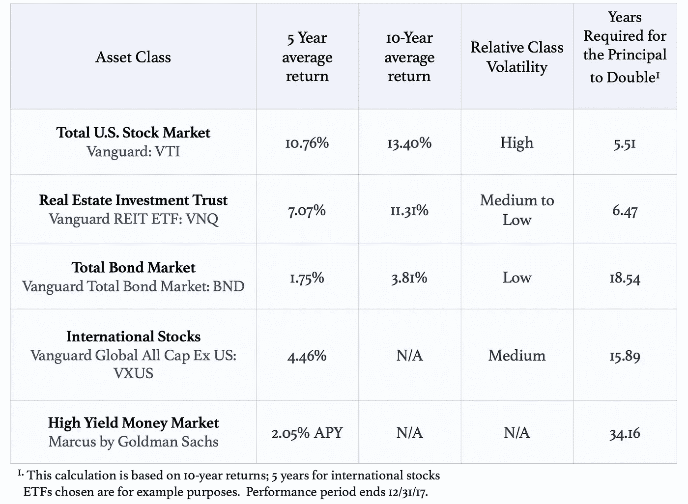
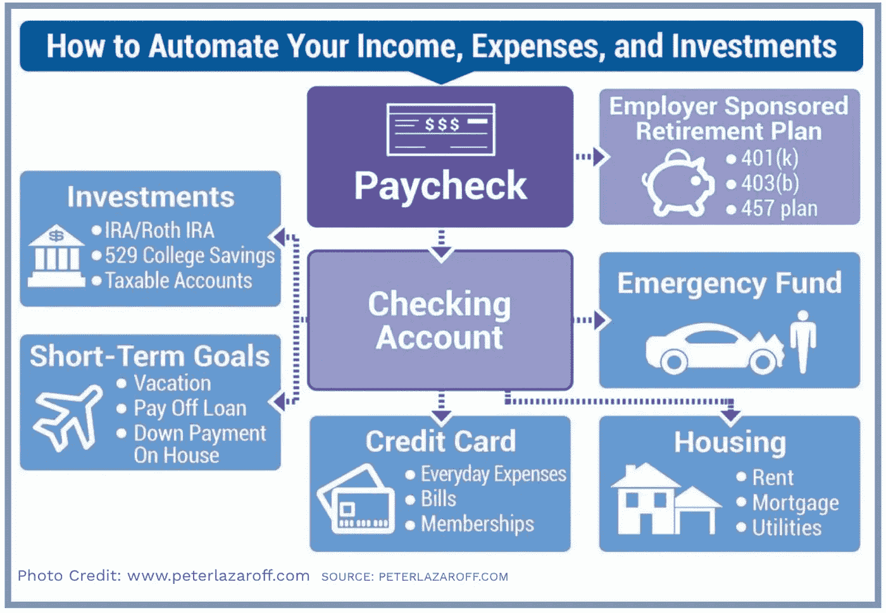

# 千禧一代提前退休的 6 个理财建议。

> 原文：<https://medium.datadriveninvestor.com/6-tips-for-millennials-to-reach-retirement-sooner-2001d6a669bf?source=collection_archive---------18----------------------->

我的一代我的一代社会一代…

千禧一代，年龄在 22 岁到 36 岁之间，你们是历史上受教育最多的一代，也是负债最多的一代。

你可能还没有规划好你的职业生涯，但是我打赌你已经确定你不会像你的父母一样在 65 岁之前做一份平庸的办公室工作。相反，总有一天你会开创自己的事业，建造一些令人惊叹的东西。或者，你会加入一家目标导向的初创公司，提供灵活的工作时间。乐观的理由有很多。

*   如果不是因为你的学生贷款债务。
*   要是你的工资高一些或者生活费用低一些就好了。
*   要是拥有一栋房子更实惠就好了。

大多数时候，你会像喝温啤酒一样对这些担忧不屑一顾，但有时它们会让你充满焦虑。接下来你知道的是凌晨 2 点，你醒着躺在床上数着天花板上的裂缝。

20 多岁、30 多岁如何理财和收益，会对你的人生产生重大影响，所以焦虑很正常。你正在平衡工作、个人财务、职业发展和你的生活。这其中很多都是新的，所以难怪它会感觉像在激流中逆流而上！

这里有六个应该会有帮助的想法。不是你以前听说过的通常的重新散列的废话，如“*现在就开始你的 401(k)计划”和“避免高利息的信用卡债务”(你知道的)，*这些是基本的但鲜为人知，或至少很少使用的策略，将产生巨大的影响。

好处越来越多，所以越早开始，收获就越多。让我们开始吧:

# **1。设定激励性的生活方式目标。**

生活在紧缩的预算中以尽早还清债务，加班，把周末奉献给你的兼职…这些都很难。久而久之，你就筋疲力尽了。然而，当你朝着一个激励的目标努力时，他们并不会感觉很糟糕。节俭和工作优先成为一种选择，而不是一种惩罚，所以你要坚持下去。

研究表明，设定目标的人获得的财富是没有设定目标的人的三倍。他们更快实现经济独立，有更多的时间追求自己的道路。

如果你没有设定目标，可以查阅数千篇关于设定目标的论文，包括 SMART 目标。

如果仅仅是财务目标对你没有多大帮助，试着设定生活方式目标。生活方式的目标不仅仅是财富。它们包括你将挣多少，你将如何挣，你将如何度过你的时间，甚至你将有多少空闲时间。

一旦我开始设想生活方式的目标，我的动力就会暴涨，同样的情况也适用于你。

如果事情没有按照计划进行，你可以调整目标，仍然可以获得大部分的利益。设定目标*然后改变目标*的投资者与那些从未偏离原始计划的投资者相差不到 10%。

# **2。根据你的时间范围进行投资**

千禧一代是保守的投资者。随着三位数的股市波动几乎每天都在发生，谁能责怪他们呢？

除了，千禧一代持有太多现金。根据[贝莱德](https://www.blackrock.com/investing/insights/investor-pulse)的一项调查，他们 65%的资产是现金和低收益存款，这个比例只有二战后的一代才能与之匹敌。

当你考虑到银行存款跟不上通货膨胀时，现金并不像你想象的那么安全。因此，当你需要钱来支付诸如房子、孩子的教育或退休等主要开支时，你可能会缺钱。

> 以 2%的利率(高收益银行存款的当前收益率)，你将等待 35 年，让你的钱翻倍。

这张图表列出了精选的广泛市场基金和 ETF 的近期回报，以及原始本金翻倍所需的年数。

对千禧一代来说，一个更安全的策略是将一些资产放在高回报投资中，以超越通胀并保持购买力。大多数投资公司都提供了可供效仿的投资组合模型。下面是来自 [Fidelity](https://www.fidelity.com/mutual-funds/fidelity-fund-portfolios/overview) 的模型的高级摘要。

# **3。利用技术实现资金管理自动化**

特别的资金管理系统通常是这样的:

1.你的薪水打到你的支票账户上。你付账单，还贷款。你花在必需品和生活方式选择上。如果月底还有剩余，你可以把钱转到投资账户或应急基金。

如果这是你的方法，考虑通过自动化你的资金管理来节省时间和避免滞纳金。有了自动化，账单和贷款都可以按时支付。您可以每月设定一个固定金额，存入投资账户、储蓄账户或各种应计账户，如圣诞节用钱或每年的 Roth IRA 和 HSA 供款。

你将创建一个预算并设置一次，然后每月监控你的账户，必要时定期调整。

Peter Lazaroff 在 Forbes.com 上写道:

[How to Automate Your Finances in 5 Easy Steps](https://www.forbes.com/sites/peterlazaroff/2018/01/17/how-to-automate-your-finances-in-5-easy-steps/#258bf33329a6)

# ***4。像专家一样协商你的薪水***

不管你喜不喜欢，你目前的薪水几乎影响了你未来的所有收入。无法像同事和同龄人一样有效地谈判可能意味着你落后了。

如果你认为这无关紧要，考虑两个理论上的员工:丽莎和特德都被提供了类似的工作，起薪为 45，000 美元。

丽莎接受了这个提议。
-泰德同意起薪提高 5000 美元。

两者表现差不多。
-丽莎接受每年平均 1.5%的年度加薪。
——泰德协商并获得了每年 2.25%的加薪。

30 年后，Ted 现在每年比 Lisa 多挣 20，000 美元。在 40 年的职业生涯中，泰德将比丽莎多赚 60 万美元。

对于公司的高层管理人员来说，理论上 Ted 似乎是一名优秀的员工(毕竟，他比 Lisa 挣得多得多)。结果，泰德得到了提升，而丽莎却被忽略了，因为她只是一般水平。

> 雇主根据你的收入来评判你，所以你的职业轨迹部分取决于你的谈判能力。

提高你的谈判技巧，学会做一个 Ted 而不是 Lisa。
如果谈判不是你的强项，那就找个教练或者花钱请专业培训。为了调整或一些新的想法，寻找研讨会，课程和书籍。

但如果是周日早上，而你的年度评估是在明天，至少拿出你的手机，在你向你的经理推销时给自己录像，并让一个朋友扮演老板的角色。

# **5。谈到培训，像博士一样思考**

随着今天的快速变化，我们五年前使用的技能可能会过时。大多数专业人士希望在他们的职业生涯中需要额外的培训，受教育程度较高的成年人对此感受更深。

然而，在报名参加昂贵的编程课程之前，根据普华永道的调查，考虑一下首席执行官们的技能差距:

> 77%的首席执行官认为年轻员工缺乏软技能是对他们业务的竞争威胁。

杰出的软技能可能是帮助你更快晋升、挣更多钱和更早退休的关键因素。

根据专家的说法，以下是千禧一代必备的四项软技能:

*   强烈的文化意识。
*   良好的社交和情商。
*   高个人生产力和组织能力。
*   自我管理和责任。

除了软技能，雇主和招聘人员更看重这些硬技能:

*   计算机和 IT 技能。
*   数字营销和品牌方面的专业知识。
*   公开演讲和说服。
*   你专业领域的进修课程。

# **6。早点开始，这样时间对你有利。**

因为起步晚，你无法收回你没有投资于 401(k)或其他储蓄的钱的回报。从非常现实的意义上来说，这些都是投资亏损！

然而，尽早开始，额外的回报就像年复一年到达你账户的免费资金。

考虑一下这些数字:年薪 6 万美元，如果你最大化 401(k)和 Roth IRA 缴款，平均回报率为 8%，那么你的钱将比你 43 岁时赚得更多(不包括公司匹配)。

到 60 岁时，你已经积累了 290 万美元。但是推迟到 40 岁开始，这个数字下降到 124 万美元。*多出来的 166 万美元你能做什么？*

# **底线**

今天，几乎任何人都可以实现财务独立，并有时间追求自己的道路。但是你必须掌握主动权，因为没有人会为你做这件事。这并不总是容易或舒适的，但你越早开始，好处就越大。

选择一些转型战略，比如这里提到的六个。一旦你采取行动，你的凌晨 2:00 焦虑将开始消失，一种新的生活乐观主义将取而代之。你会有一个方向和目的，所以你坚持你的目标。

实现工资独立意味着你将有更多的时间尝试新事物，也许还能创造出一些令人惊叹的东西。你会旅行更多，建造更多，留下更丰富的遗产。