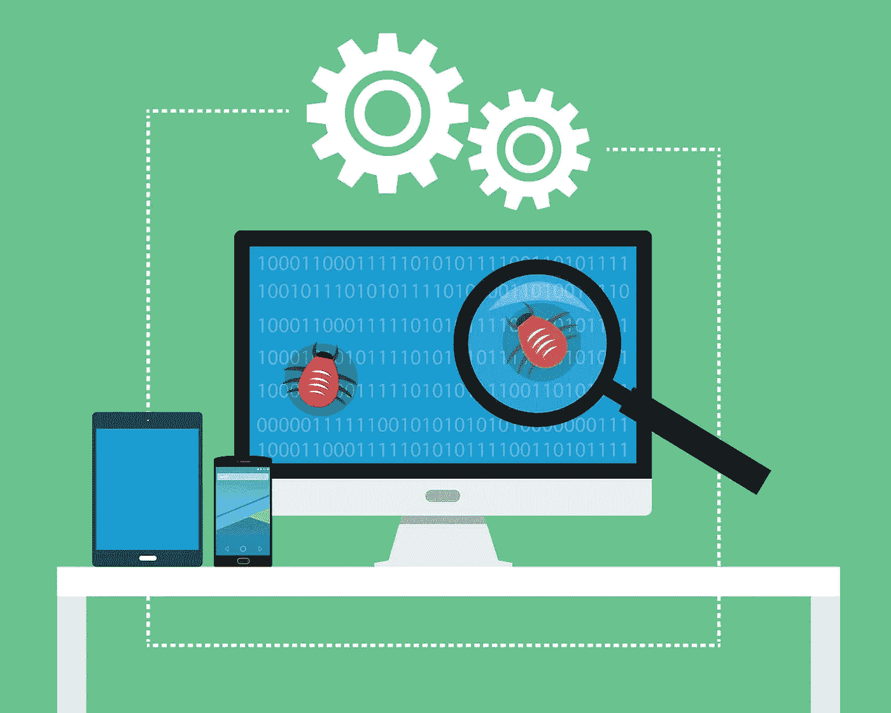

# 编写更好代码的 6 种方法

> 原文：<https://medium.datadriveninvestor.com/6-ways-to-write-better-code-447eb7ce6132?source=collection_archive---------11----------------------->

Writing better code

不管你使用哪种编程语言，这里有 6 种方法可以帮助你写出更好的代码。

# **1 —花更多时间设计**

他们说，花 90%的时间计划，10%的时间去做，这是真的。没有好的设计(明确的目标和路线图),你的一切努力都是徒劳。

使用完整的规范和详尽的文档，确保您完全掌握软件解决方案要解决的问题。

与所有相关方合作，包括测试人员、利益相关者、产品经理，并将测试驱动的开发作为实现计划的一部分。

编写代码既是一门艺术也是一门科学，所以在设计项目时要平衡创造性和逻辑性。项目的规划和设计阶段是降低复杂性和巩固软件的最佳时机，以确保您能够产生高质量的结果。

# **2 —保持干净**

使用编码标准，尤其是在记录代码的时候。确保你的代码有一个逻辑流程，避免过于巧妙的语法，而是注重可读性。请记住，当你离开很久以后，你的代码将由开发人员维护，所以要同情他们。

过度设计您的解决方案和尽全力满足规范之间只有一线之隔。

避免过度工程化，不要用过于复杂的设计来解决简单的问题。不要实现不需要的(或者将来可能需要的)特性。避免工程师心态蔓延，即为了建筑的乐趣而建筑。

保持事情简单，复杂会带来更多的问题。通过开发和部署降低设计阶段的复杂性，以提供更强大和相关的解决方案。

# **三大块代码**

处理大型复杂项目时，根据功能将解决方案分成模块或代码块。

模块化增加了容错能力，使调试更容易。

将代码模块化可以提高代码的可重用性，并加快功能开发，因为您不需要在每次请求新功能或报告错误时都从头开始。

# **4 —可读性就是一切**

这些年来，软件项目变得越来越复杂。程序员不再能够孤立地工作来构思解决方案。随着开放源码的出现以及从定制 RTOS 向嵌入式 Linux 的转移，协作的需求比以往任何时候都更加强烈。

当然，仍有许多嵌入式项目不需要 RTOS，但随着微控制器越来越便宜，以及强大的免费开发工具链和开源库的出现，程序员不再重复发明轮子，从而缩短了嵌入式产品的上市时间。

因此，请记住这一点，努力使您的代码在逻辑上易于遵循，并确保它有良好的文档记录，易于理解。

糟糕的编码实践使得代码难以阅读、难以重用并且性能差。

# 5-记录一切

如果您的代码难以理解或阅读，那么其他开发人员会发现它很难维护，从而减慢了修复和增强的上市时间。

适当的文档和代码注释将使你保持正确的方向，并总是提醒你为什么这样做，以及帮助未来的开发人员阅读、理解和重用你的代码。

# 6 —整合测试

测试被程序员低估了，通常是事后才想到的——大错特错。

从一开始就包含测试——如果可以的话，在开发周期中使用测试驱动开发。与 QA 团队合作，了解您的软件将如何集成和回归测试。

进行单元和功能测试，并调试您的代码以快速消除错误。

使用静态分析工具和硬件调试器，如在线仿真器、逻辑分析仪和示波器来调试您的代码。

在计划阶段开发测试用例，并在开发周期中使用它们。

重构代码以提高非功能属性，如可读性、可维护性和可扩展性。重构可以通过简化程序和降低复杂性来帮助发现软件中隐藏的错误和漏洞。

编写健壮的软件需要仔细的计划、协作和逻辑思维。这不仅仅是一种技能，还是一种习惯。始终努力使您的代码简单，考虑多种观点，并坚持最佳实践，以制作经得起时间考验的软件。

如果你是一名寻求改变的工程师，或者是一名招聘经理或人力资源专业人士，希望与专业的工程招聘人员合作，请通过[lance@runtimerec.com](mailto:lance@runtimerec.com)联系我