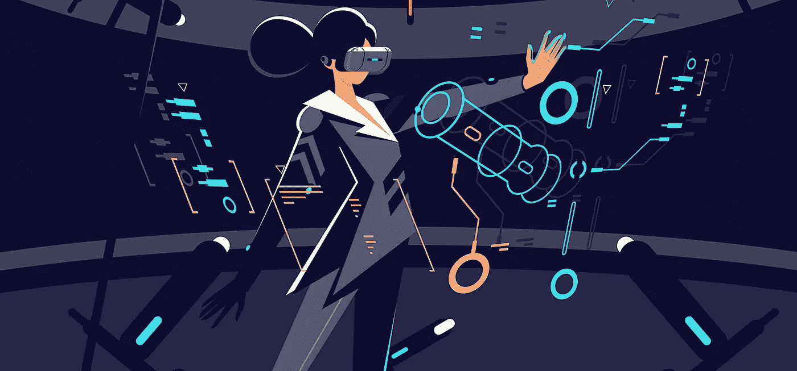

# 人工智能将如何改变你的工作场所，以及你为什么应该关心

> 原文：<https://medium.datadriveninvestor.com/7-ways-how-ai-will-change-your-workplace-12c6cdd332f7?source=collection_archive---------1----------------------->

*Image:* [*Kit8.net/Shutterstock*](https://www.shutterstock.com/g/portfolio)

在接下来的五到十年里，你的工作场所将会发生根本性的变化。由于有了人工智能等技术，物联网和机器人技术将会发生巨大的变化。未来的工作会给组织带来巨大的机遇，但也会带来大量的挑战。这将要求员工和管理层适应并更聪明地工作。人工智能将增加你的工作，物联网将为你提供细节洞察力，机器人将取代许多工作。

在未来十年，你的工作场所将被数据化和数字化。数字化是指将信息转换为数字格式，例如将音乐转换为 MP3 文件，将照片转换为 JPEG，将文本转换为 HTML，将模拟视频转换为 YouTube 视频。这样做将成倍地增加您的可用数据。因此，数字化意味着以数字形式捕捉人类的想法，以便传输、处理、重复使用和分析。

另一方面，数据化是指将模拟流程和客户接触点转变为数字流程和数字客户接触点。数据化是通过将社会行为转化为量化数据来推动业务数据化的过程。它包括使用互联设备从各种来源和流程收集(新)数据或创建详细的客户资料。

数据化工作始于让你的办公室、工作场所、流程和产品智能化。这将使以前“不可见”的过程变得可追溯，以便对其进行监控、分析和优化。由于传感器成本的降低，低成本带宽的增加，云计算和处理能力的廉价可用性以及众多互联设备，使这些过程变得智能并帮助您跨不同过程、产品和工作场所一致和通用地捕获数据变得更加容易和廉价。数据化和数字化是未来工作的催化剂。

因此，没有数据，就没有工作的未来。正如我之前分享的，T2 有三个概念定义了工作的未来:数据、去中心化和自动化。这些技术将从根本上改变你的工作场所。因此，让我们来看看新兴技术将如何影响未来的工作场所:

# 1.发现、雇佣和留住人才

人工智能是改善招聘流程的完美技术。你可以使用这项技术，通过分析数百万份社交资料、数千份简历，快速发现潜在候选人名单，从而在大海捞针。然后，人工智能可以以一种引人入胜的方式自动与这些候选人互动，建立一个最佳候选人的健康管道。Arya 公司是为组织提供情报驱动的人才获取的公司之一。

一旦你确定了候选人的渠道，或者有一大群候选人对工作申请做出回应，你就可以使用人工智能来帮助为你的公司选择合适的候选人。有几十种人工智能驱动的工具可以帮助招聘人员雇佣(远程)员工。你可以用人工智能来评估候选人的技能、个性，甚至是组织适应性。例如，T4 过滤公司为数据科学家和工程师提供评估服务。每个评估都使用人工智能进行分析。面部识别有助于检测作弊，结果在进入你的收件箱之前就会被过滤，从而在招聘最佳工程师时节省招聘人员的宝贵时间。

面部识别是招聘人员越来越多地用来评估候选人的技术之一。包括沃达丰、新加坡航空和联合利华在内的公司通过用人工智能代替人力招聘人员每年节省数百万美元。由于 HireVue 开发的技术，这些公司可以在更短的时间内筛选更多的候选人，从而找到更好的候选人。

# 2.工作人员之间的协作

在未来的组织中，人类和机器将越来越多地合作。根据[埃森哲](https://www.accenture.com/gb-en/insights/artificial-intelligence-index)的研究，在未来几年，人机合作将提高 38%的生产率和收入。[三分之二的商业领袖](https://interestingengineering.com/human-machine-collaboration-work-in-the-age-of-artificial-intelligence)认为这种人机合作将有助于更快更有效地实现战略优先事项。当机器和人类合作时，结果是积极的。

特别是对于大型组织来说，人工智能将使地理上分散的员工更容易捕捉、发现、共享和维护知识。对于大多数组织来说，获取和分享知识并不是问题。有许多工具可以做到这一点，如维基和内部网。然而，组织越大，为合适的员工找到合适的知识就越困难。这就是人工智能的用武之地。

语义搜索和自然语言处理将更容易找到正确的知识。类似于谷歌，最近[更新了](https://searchengineland.com/why-you-may-not-have-noticed-the-google-bert-update-324103)他们的搜索算法，以更好地理解更复杂的搜索查询，组织可以[使用人工智能更快地直观地找到正确的信息](https://www.askspoke.com/blog/knowledge-management/search-is-broken/)。

[人工智能还可以帮助](https://www.askspoke.com/blog/knowledge-management/ai-helps-knowledge-management/)连接分散但相关的数据源，保持你的知识库最新，并提供重要的信息指标，帮助你的员工和管理层更有效地合作。员工越能找到正确的知识，合作就越容易。

人工智能在组织内部的另一个应用是内部使用的聊天机器人。公司 ServiceNow 开发了一个虚拟代理平台来帮助员工解决人力资源请求和咨询。通过向人工智能代理提供足够的数据源，聊天机器人可以理解上下文，并能够快速正确地回答问题。

# 3.智能远程工作

人工智能可以用来改善远程工作人员的雇用，但它也可以用来改善远程工作本身。远程人工智能将通过自动化通常需要手动完成的管理任务来帮助远程工作人员节省大量时间。

此外，人工智能使远程机器人成为可能，远程机器人是指由人类远程操作的机器。这些半自动机器人可以远程控制，可以完全重塑工作空间，特别是当与[虚拟现实](https://www.virtualvocations.com/blog/telecommuting-survival/virtual-reality-shaping-remote-landscape/)集成时。远程机器人技术可以让更多的员工在家工作，这是目前不可能做到的。举个[的例子](https://www.virtualvocations.com/blog/telecommuting-survival/artificial-intelligence-remote-work/)，一个机械工程师可以操作一个机器人，修理一个漏水的地下管道，而不用离开他们的家庭办公室。更进一步，由于虚拟现实，管理层可以举行虚拟的“面对面”会议，而每个人都在世界的其他地方。

在未来几年，人工智能将实现更高效的远程工作人员，并显著提高员工的工作和生活平衡。

# 4.优化您的工作场所

任何过程、设备、基础设施或客户接触点都可以通过包含连接到互联网的传感器而变得智能。随着可用的联网设备数量呈指数级增长，这比以往任何时候都更容易。在不久的将来，传感器和互联设备将催生智能家居、智能办公室和智能城市。因此，员工应该为智能工作场所做好准备，人工智能将创造个性化的员工体验。

2015 年，当时世界上最智能的建筑在阿姆斯特丹开放。这栋楼知道谁在楼里，他们的喜好是什么，你喜欢你的咖啡。从那以后，由于传感器、机器学习和无线(虚拟)信标技术，数字工作场所变得越来越智能。传感器和人工智能可以改善照明控制、房间控制、空间管理，并优化整体设施管理。智能工作场所的目标是通过为员工创造最佳、个性化的工作场所来提高生产力。

# 5.领导力和文化

您的文化需要改变，成为一种数据驱动的文化，在这种文化中，可以实时采取行动，自动做出决策，并赋予员工权力。人工智能改善了你在整个组织中的决策，并帮助你了解哪些机会最好抓住。在不久的将来，人工智能将促进高级自动化分析，用自动化决策取代人工决策。例如，这种分析将使组织能够自动选择最佳营销信息，而不是需要营销经理来做出这样的决定。

因此，人工智能将使用描述性、预测性和规范性分析为您的管理层和员工提供先进的见解。这意味着基于经验和专业知识的传统决策方式被数据驱动的决策所取代。当组织为更多的人提供获取知识的机会时，权力会更加平等地分配，从而在组织内增强员工的权能。这种权力转移对于充分受益于大数据分析是必要的，它将显著改变你的文化。

# 6.生产力

当人工智能将增强人类的工作能力时，生产率就会提高。机器人不会生病，不需要休息，可以全天候工作。因此，在工作场所中引入人工智能的公司已经看到了[生产力和收入的显著提升。AI 可以处理平凡而单调的任务，而人类可以专注于更复杂的问题。因此，一个实施人工智能的](https://www.infosys.com/newsroom/press-releases/Pages/leadership-workforce-implications-vital.aspx)[组织将变得更加人性化](https://vanrijmenam.nl/why-ai-will-make-organisations-more-humane/)。

例如，人工智能聊天机器人可以为您的客户提供无缝体验，并立即解决最基本的问题。或者，人工智能可以分析销售电话，并为销售经理提供实时提示，以改善与客户的沟通。公司[合唱](https://www.chorus.ai/)有助于从对话中发掘隐藏的洞察力，以达成更多交易。

如果组织成功地实施了人工智能，这些利益相关者(人类和人工)之间新的合作方式将确保生产力的持续增长。

# 7.培训和发展

最后，但肯定不是最不重要的，是人工智能改进的培训和发展。在竞争激烈的市场中，企业培训变得越来越重要，员工希望不断提高技能。个性化的培训和发展计划无疑有助于留住你的员工。

聊天机器人可以在正确的时间向正确的客户提供微型学习课程。正如[霍奇斯-梅斯](https://www.hodgesmace.com/?zd_source=hrt&zd_campaign=2673&zd_term=chiradeepbasumallick)、[和](https://www.hrtechnologist.com/articles/learning-development/3-ways-ai-will-transform-learning-and-development/)的学习与发展总监米盖尔·卡拉巴略所说，“想象一下，你的菜鸟销售人员将要拜访一位客户。当她把车开进停车场时，公司的学习机器人 pings 她的手机，显示一个关于积极的第一印象的微型学习课程，以及一个链接到潜在客户的“关于我们”页面和她的经理的最后一次辅导笔记。这是一种个性化的学习体验”。

此外，与人工智能在招聘过程中如何分析评估类似，人工智能可以分析培训结果，并根据缺少的技能提供个性化的培训计划。公司[蜂巢学习](https://www.hivelearning.com/site/)利用 AI 帮助员工更好、更快、更高效地学习。该公司专注于移动优先的点对点学习，人工智能有助于推动行为改变。

# 工作的未来将会不同

未来的工作将会更先进、更有效率、更有成果，而且有希望更人性化。在当今的组织中，员工必须处理大量的行政任务和官僚程序。然而，在明天的组织中，这样的任务和流程将由 AI 来管理。在明天的组织中，人类和人工智能将一起工作。从而增加了人类的数量并消除了世俗的任务。

人工智能将自动完成越来越多的任务。它将扰乱、扩大和改进许多现有的工作流程。因此，人类可以更多地关注组织内的人(您的员工和客户)，使您的组织更加人性化。那些在工作场所适应和拥抱 AI 的组织将变得更加高效，提高生产力，变得更加人性化。但是，那些会忽视 AI 的组织会迅速变得多余。

如果我设法让你注意到这一点，请留下评论或订阅我的每周简讯，以获得更多此类内容:

Mark van Rijmenam 博士是 [Datafloq](https://datafloq.com/) 和 [Mavin](https://mavin.org/) 的创始人，他是全球公认的关于大数据、区块链、人工智能和工作未来的[演讲者。他是一名战略家，著有三本管理书籍:](https://vanrijmenam.nl/) [Think Bigger](https://vanrijmenam.nl/think-bigger-mark-van-rijmenam/) 、 [Blockchain](https://vanrijmenam.nl/blockchain-transforming-your-business-and-our-world/) 和[The organization of Tomorrow](https://vanrijmenam.nl/the-organisation-of-tomorrow/)。

Mark van Rijmenam 博士是数字演讲者****，他提供了关于未来工作的鼓舞人心的(虚拟)主题演讲，无论是亲自出席，还是以虚拟形象或全息图的形式，都将您的活动推向了一个新的高度:****