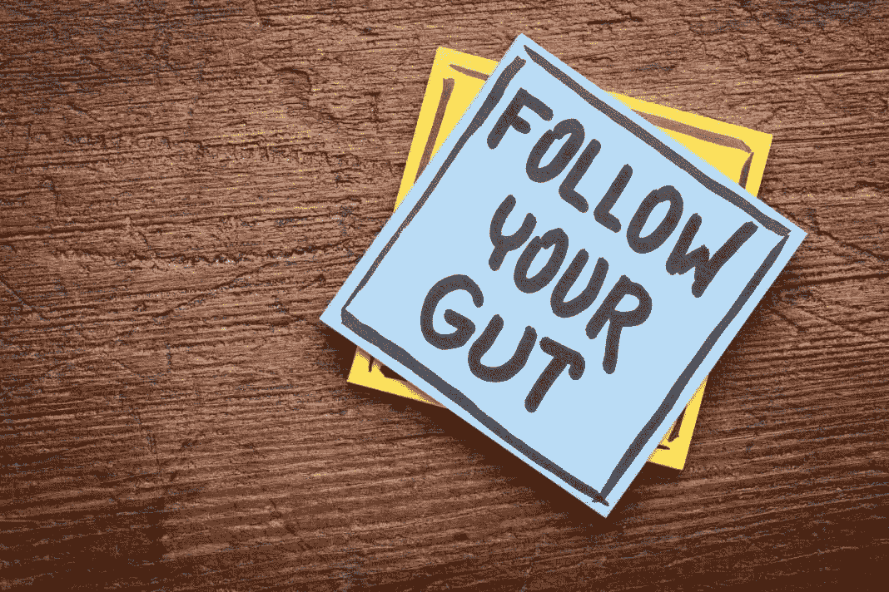

# 企业在肚子上移动:如何顾及直觉

> 原文：<https://medium.datadriveninvestor.com/a-business-moves-on-its-stomach-how-to-make-allowances-for-gut-feelings-7be012bb6860?source=collection_archive---------8----------------------->

事实证明，直觉不仅仅是一种感觉。科学很清楚:你的直觉知道的比你可能意识到的要多，当需要做出重大决定时，大多数时候会把 CEO 引向正确的方向。

已故苹果公司创始人史蒂夫·乔布斯相信这一点。维珍集团创始人[理查德·布兰森](https://blog.taskque.com/gut-feeling-helps-you-make-complex-business-decisions/)也是如此。事实上，参与由财富知识集团开展的 2014 年[研究](https://www.gyro.com/onlyhuman/Only%20Human%20Executive%20Summary.pdf)的 62%的高管表示，在决策过程中依靠直觉和软因素往往是必要的。

在那项研究的总结中，与《财富》杂志合作的 Gyro 公司首席执行官兼首席合规官克里斯托弗·贝克尔(Christopher Becker)一针见血地写道，“商业决策是由情感做出的，并被理性地证明是合理的。”这与 Lululemon 创始人 Chip Wilson [为福布斯](https://www.forbes.com/sites/chipwilson/2018/06/14/trusting-your-gut-is-the-best-business-tool-youve-got-if-you-can-listen/#1725944a4b16)撰写的文章一致:他做任何决定的出发点都是直觉。然后，他召集了一个专家小组来覆盖他的盲点，给他一些他可能没有考虑到的东西。

人们可能会认为情况正好相反——像威尔逊这样的高管首先会集思广益，然后艰难地做出决定。尽管不可否认的是，在这个时代有这么多信息可用的情况下，这种方法是谨慎的，但威尔逊认为直觉是大数据。他的观点是，在你不知道的情况下，你的身体每天处理数百万个数据点。这导致了我们所知的直觉现象。

威尔逊的结论得到了 2016 年 Nature.com 的科学报告的支持，该报告得出结论说，这种感觉实际上并不局限于肠道。相反，它们是几个器官感受到的外部刺激的结果。换句话说，根据你以前的经历，你的身体会给你一个积极或消极的反馈。

另一种观点来自柏林马克斯-普朗克人类发展研究所的 Gerd Gigerenzer，他写了《直觉:无意识的智慧》一书。他发现直觉使我们能够在特定情况下关注最重要的因素，剔除无关紧要的信息。反过来，这让我们能够做出最好的决定。

当然，直觉并不是万无一失的。例如，一份报告指出，1998 年，摩托罗拉首席执行官格雷戈里·布朗[让他的公司损失了 80 亿美元](https://www.allbusiness.com/gut-instinct-data-more-important-business-decision-17420-1.html)，他凭直觉在卫星电话技术上投入巨资，而不是移动电话。

话说回来，数据也不是绝对可靠的。信息可能会被曲解或误解，而且经常如此。一份报告中举了一个例子，一家网页设计公司的分析师[在检查客户的购买行为](https://blog.taskque.com/gut-feeling-helps-you-make-complex-business-decisions/)时出错，导致结果没有达到公司的预期——并重新调整了策略。

所以，是的，可以提出一个论点，在头脑和心灵之间，在直觉和信息之间寻找一个快乐的媒介。但应该永远记住，直觉知道的比你可能意识到的要多。

*本文原载于 2018 年 11 月 9 日* [*数据驱动投资人*](https://www.datadriveninvestor.com/2018/11/09/a-business-moves-on-its-stomach-how-to-make-allowances-for-gut-feelings/) *。一定要看其他 DDI 文章作者*[*Marc Weisberg*](https://www.datadriveninvestor.com/author/marcweisberg/)*！*