# 自我分类和自我平衡的树(极客的 2-3 棵树)

> 原文：<https://medium.datadriveninvestor.com/a-self-sorting-and-self-balancing-tree-for-geeks-b886817abcf5?source=collection_archive---------3----------------------->

从学生数据到医疗数据，每天都有大量数据需要存储和访问。所有这些数据都需要按照一定的逻辑顺序快速访问。为此，发明、实现并使用了各种数据结构，其中每种结构都有其特点，并用于那些特定的用例。2-3 树就是这种结构之一，它的特点是总是排序的，总是平衡的，因此非常高效(具体来说，是 logN 查找和插入，其中 N 是存储的项目数)。

# 什么是树，它的节点是什么？

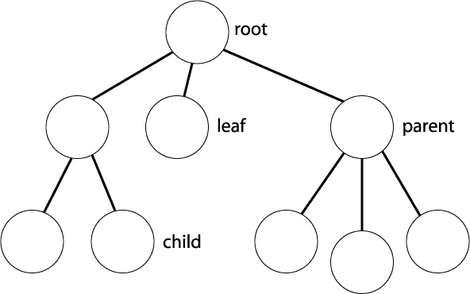

上图显示了树的结构。上图中的每个气泡称为一个节点。这是存储数据元素的地方。每棵树都有一个引用最顶层节点的根。这是用来访问树的。如果这是你第一次看到一棵树，查一下二叉树和二分搜索法树，以便更好地理解树的核心是如何工作的。

 [## 创建折衷书架的程序员指南——数据驱动的投资者

### 每个开发者都应该有一个书架。他的内阁中可能的文本集合是无数的，但不是每一个集合…

www.datadriveninvestor.com](https://www.datadriveninvestor.com/2019/03/25/a-programmers-guide-to-creating-an-eclectic-bookshelf/) 

# 什么是 2–3 树？

2–3 树是计算机科学中的一种数据结构，其中每个节点有两个或三个节点，每个节点有一个或两个元素。从客户端进行的每个添加都被添加到最低的有效叶节点，其中叶节点被定义为没有子节点的节点，并且当节点中达到 3 个项目时，树自平衡，在左、右和中间节点之间划分。下图中的五个案例展示了该树的功能。

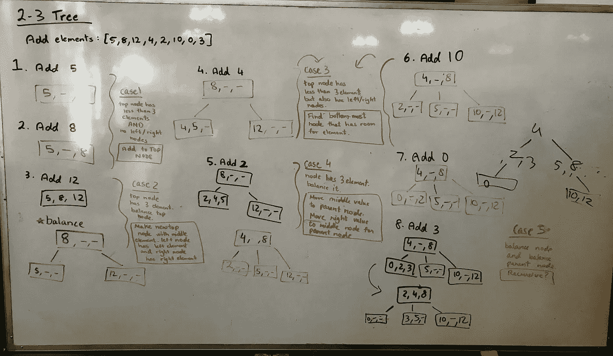

# **实施**

## **节点结构**

我们从定义我们知道对这个树总是正确的属性开始:

*   一个有效的节点总是被排序并且少于三个元素。(注意:可以向节点中添加第三个元素，但是在树平衡并且节点返回到一个或两个元素状态之前，它是无效的)
*   有效的节点可以是叶子或分支。
*   叶子被定义为没有子节点。
*   如果节点中有一个元素，则分支被定义为只有两个子节点，如果节点中有两个元素，则只有三个元素。

让我们在节点类结构中实现它。

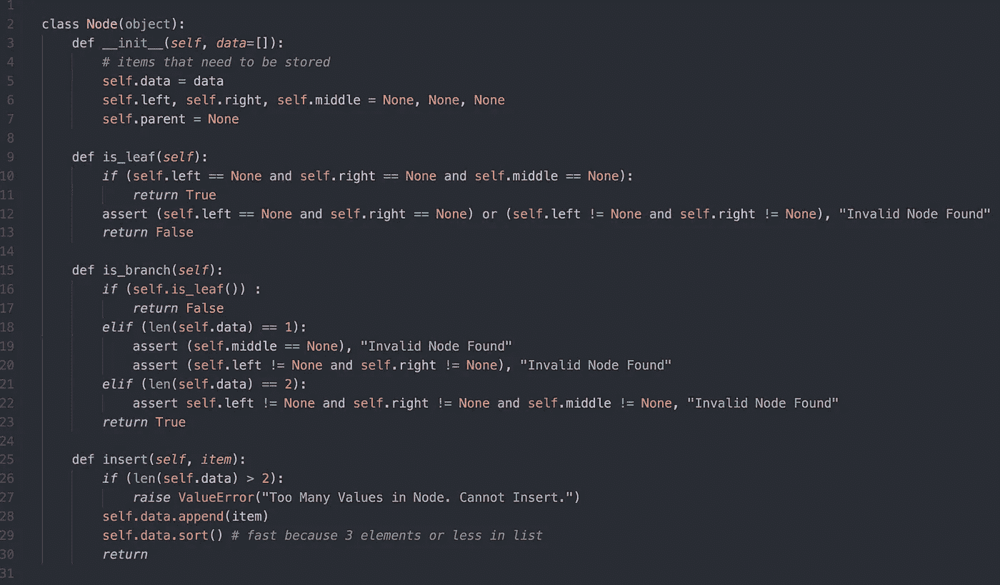

注意:我们使用 assert 语句来检查有效状态，并确保我们的函数正常工作。这有助于测试阶段的调试。

## **我们的树形结构**

我们将在树结构中存储的只是根节点。

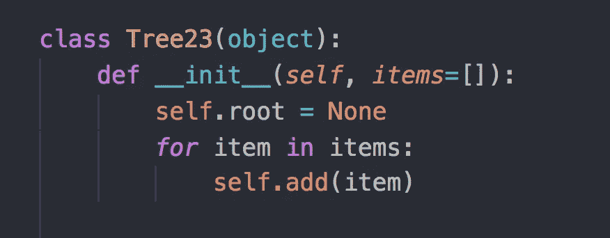

注意:我们将使用自顶向下的方法来处理我们的树类的方法函数。自顶向下的方法意味着我们编写的函数使用了我们还没有实现的助手函数，但是我们承担了工作。在实现了顶层函数之后，我们实现了我们之前假设可以工作的助手函数。这有助于我们将问题分解成小块，这样我们就能更好地理解和解决它。这也简化了调试过程。

## **插入我们的树**

在 2–3 树中，我们总是在叶节点插入元素。我们有两种情况要考虑:

*   如果我们的树是空的:我们用需要添加的项目初始化我们的根节点。因为我们将数据存储为列表，所以我们将在初始化时将列表中的项目添加到我们的根节点。
*   如果它不为空:我们将不得不首先找到一个有效的节点来插入，这是一个我们将分配给我们的助手函数' findValidNode '的任务，并相信它能够工作。然后，我们将使用节点的 insert 方法将项目添加到节点的数据中。

我们还必须确保树在这个变化之后仍然是*平衡的*，所以我们在刚刚添加了一个元素的节点上调用我们的树的平衡方法(我们将在后面实现它，所以我们相信它使用自顶向下的方法工作)。

**找到插入的有效节点**

首先，让我们来了解一下节点对于元素的插入是有效的意味着什么:

*   *必须是叶节点。*
*   *如果它在左边，父数据元素的第一个数据元素必须更大。*
*   *如果它在中间，它应该落在父数据元素的第一个和第二个数据元素之间。*
*   *如果它在右边，它应该大于父项的第二个数据元素。*

如果我们正在检查的节点是一个叶子，那么我们知道我们必须添加到那个节点。如果不是，我们需要找到我们的节点在哪个方向。因为我们必须知道要去哪个方向，所以让我们将测向任务分配给我们的助手函数，并相信它能够工作。我们将在以后实现它。

如果我们有了方向，我们递归地调用 findValidNode，因为它会检查我们这个节点是否是一个叶子，因此有效，或者它是否是一个分支，我们需要进一步遍历。

在这个函数结束时，我们找到了节点，可以通过 add 方法访问它。

**为节点搜索寻找方向**

那么，我们到底如何找到方向呢？

我们的节点有两种情况。它可以有一个或两个数据元素，在每种情况下，测向过程都会略有不同，因为我们必须考虑所有的值。在这个阶段，绝不会有一个节点没有元素或者有 3 个以上的元素。

*案例 1:节点只存储一个元素。*

在这种情况下，我们只需要将我们的项目与一个元素进行比较，以确定它是小于还是大于，并给出相应的方向。

*情况 2:节点只存储 2 个元素。*

在这种情况下，为了查看我们是否需要向左，我们需要检查我们的项目是否小于第一个元素。为了向右，我们需要检查我们的项目是否多于第二个元素。要进入中间，我们需要检查我们的项目是否在两个元素之间。

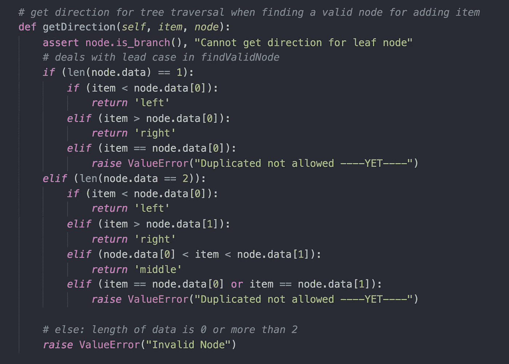

注意:目前，我们不处理重复，但我们稍后会解决这个问题。

## 平衡树

我们需要考虑四种不同的天平情况:

*   案例 1:当根节点没有子节点时，我们平衡它。
*   案例 2:我们正在平衡一个左/右叶节点
*   案例 3:我们正在平衡一个左/右分支节点
*   案例 4:我们正在平衡一个中间节点

我们将编写一个顶级平衡函数来处理每一种情况，假设我们不同的平衡函数(我们将在后面实现)按预期工作。

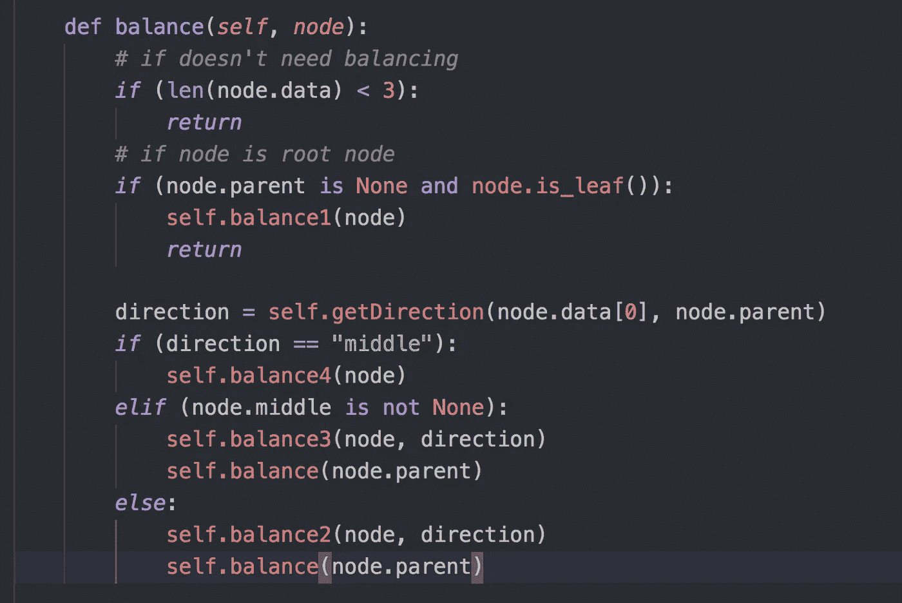

下面是上述每种情况的示例及其实现。通过手动处理每个案例来浏览代码，以便更好地理解指针分配。

## 案例 1:当根节点没有子节点时，我们平衡它。

在这种情况下，我们将通过保留中间值来保留顶部节点。我们弹出最小值和最大值，并用这个值创建新的节点。这样做可以保留根节点。然后，我们将根的左边设置为最小值节点，右边设置为右值节点。

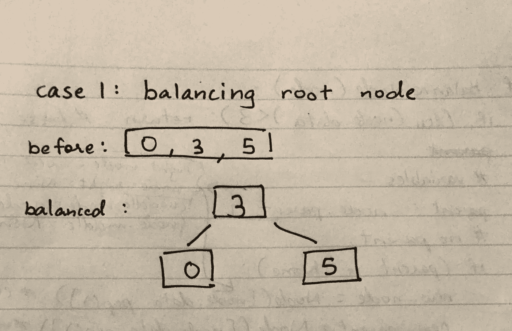

Illustrated example for case 1.

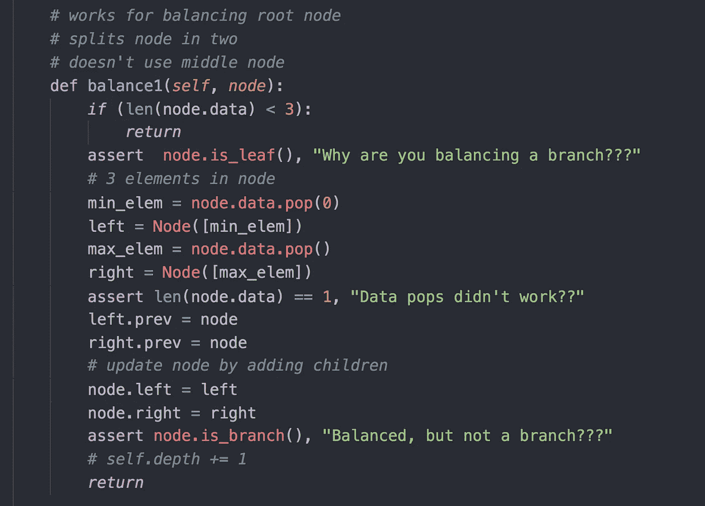

Implementation for case 1

## 案例 2:我们正在平衡一个左/右叶节点

在这种情况下，我们将通过保留最小值来保留节点。我们将把中间值移动到父节点，把右边的节点移动到父节点的中间节点。

Illustrated example for case 2.

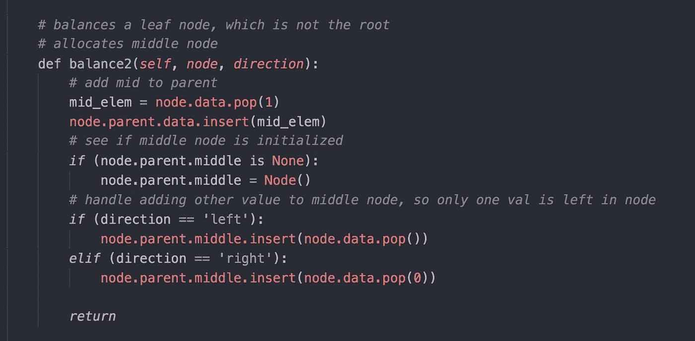

Implementation of case 2.

## 案例 3:我们正在平衡一个左/右分支节点

在这种情况下，我们将平衡第二步达到的状态，如下所示。可能必须平衡节点是分支并且具有中间节点的状态。在这种情况下，我们可以在分支节点上使用案例 1，将它的左侧、右侧和中间存储在不同的变量中。然后，我们可以通过将新节点的 left 设置为原始 left (-3)来恢复状态。我们将通过将新节点的 right(3)的 right 设置为原始 right (5)来对 right 进行同样的操作。这将保留左侧和右侧的子树。然后，我们通过拆分中间节点(Node (-1)和 Node(2))中的值来创建两个新节点。我们将中间节点(节点(-1))中的最小值设置为节点左边的(-2)，将中间节点(节点(2))中的最大值设置为节点右边的(3)。

## 案例 4:我们正在平衡一个中间节点

在这种情况下，我们将中间值的中间值(在下面的状态 2 中)推入其父节点，然后类似于情况 3 进行平衡。

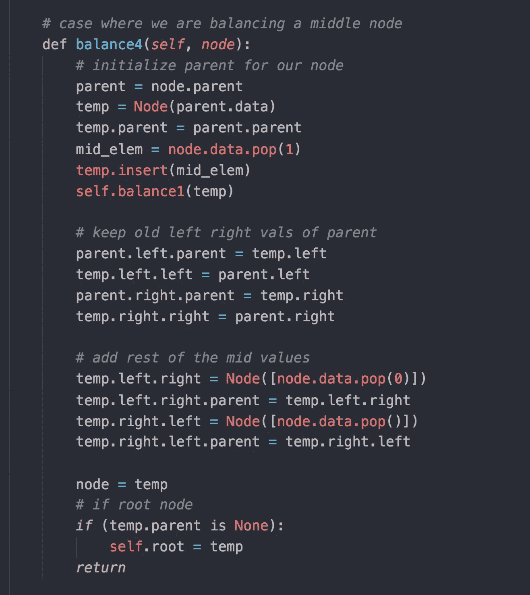

## 在树中查找值

为了在树中找到值，我们将做一些非常类似于树遍历的事情，除了我们将只沿着项目可能存在的方向前进。因为这棵树总是排序的，我们知道基于值的比较是向左、中间还是向右，我们的 getDirection 函数已经为我们做了。

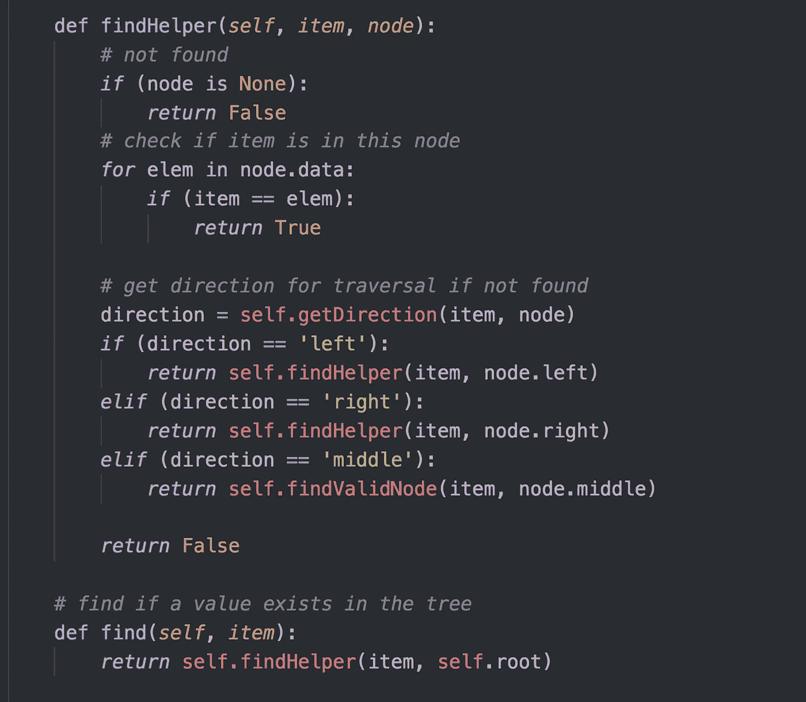

## 遍历并打印树

要按顺序打印树中的所有值，我们需要自下而上遍历并打印左侧树中的所有值，然后打印根节点，再往下遍历并打印右侧树中的所有值。

为此，我们递归调用左树中的打印函数。然后我们打印当前数据，以及中间节点的任何数据，方法是递归地调用我们的 print。最后，我们递归调用右边的树，然后返回。

这将导致所有值按排序顺序打印。

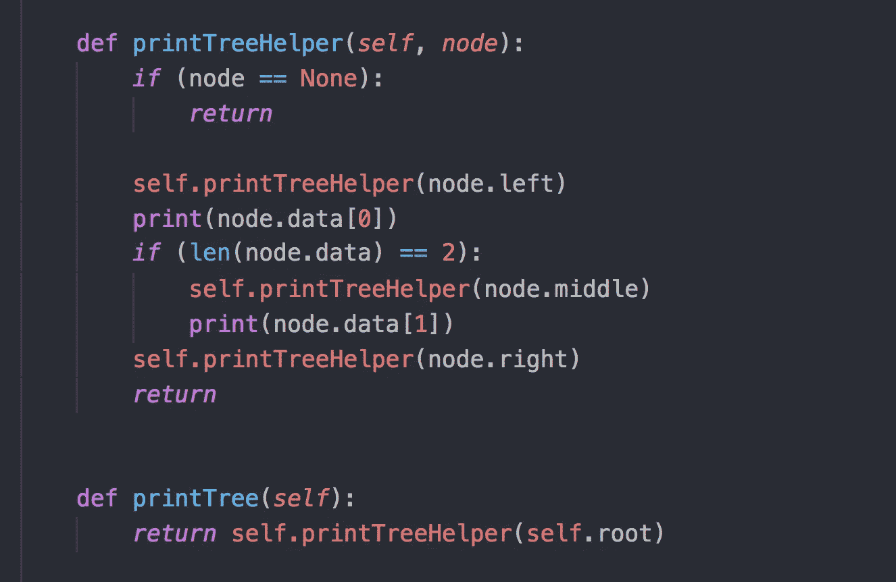

当然，可以传入一个结果列表参数，如果我们希望返回一个排序后的列表，我们可以添加到列表中，并从我们的 top 函数打印列表。

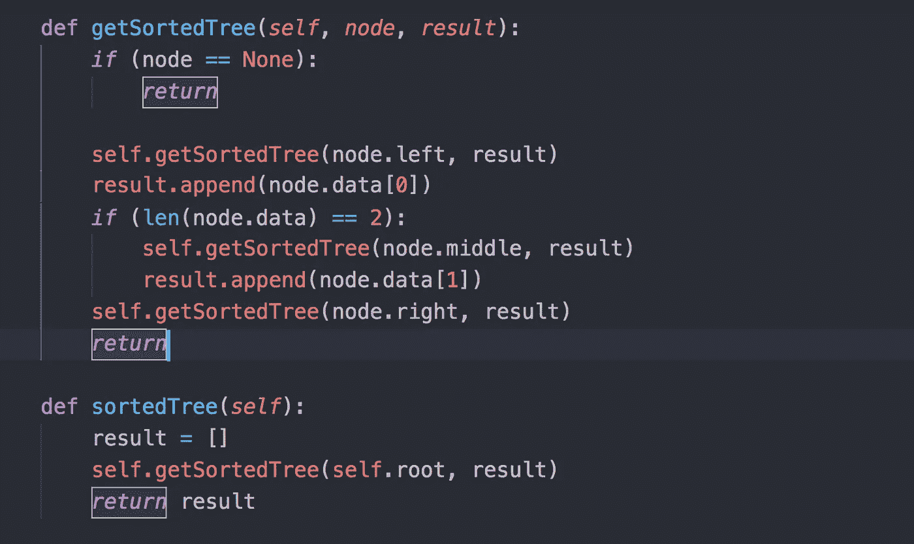

## **测试**

让我们运行一个简单的测试，看看这是否可行:

我们的添加和打印方法:

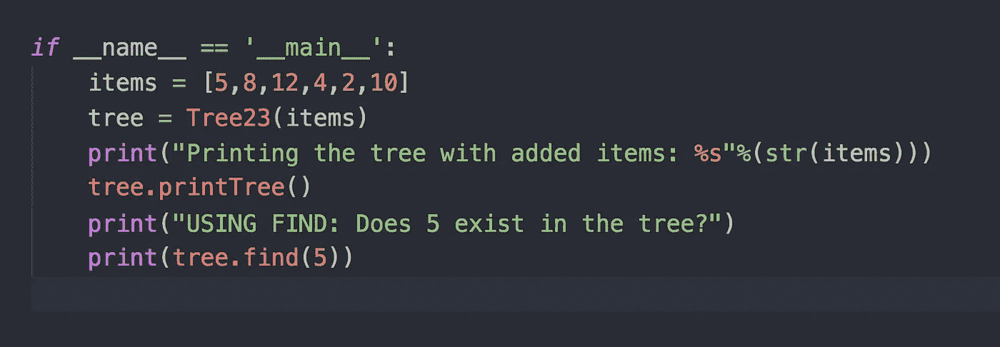

Test case in our file

The result in our terminal

我们的分类树方法:

Test case in file

Result in terminal

## 希望你喜欢这个过程！

我们讨论了 2-3 棵树在高效存储和访问大量数据方面的优势。我们还实现了一个 2–3 树，其中包含向其中添加数据的方法，包括自平衡特性和查找数据的方法。

*如果您有任何问题、意见或建议，欢迎在下面发表评论。谢谢:)*

 [## anisha 7/树木项目

### 在这个项目中，我实现了 2-3 树和 B 树- Anisha7/Trees-Project

github.com](https://github.com/Anisha7/Trees-Project)