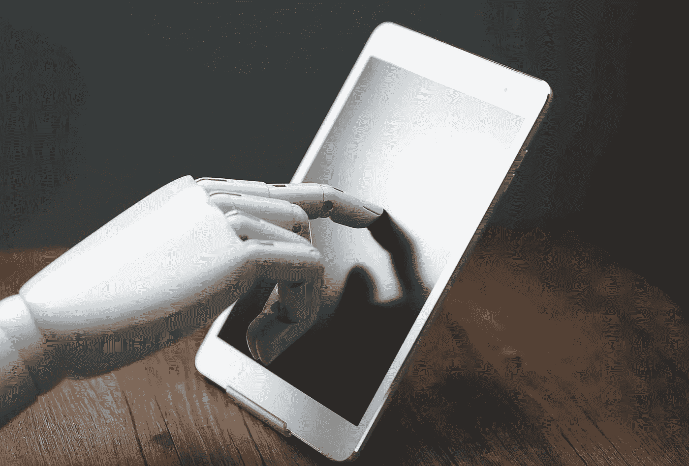

# 一个全新的世界

> 原文：<https://medium.datadriveninvestor.com/a-whole-new-world-60e8d11d2817?source=collection_archive---------22----------------------->

*智能城市将在人工智能交易上运行*

**Elisa Harca 和 Eugene Lai** |一段时间以来，人工智能刺激了媒体从各个角度进行报道——它将如何把我们从更平凡的任务中拯救出来，它将如何改变零售和服务人员的工作，可以学习的机器的出现将如何预示着我们在我们所知的世界中的生存方式的根本转变。

预计到 2030 年，全球 GDP 将增长 14%(相当于 15.7 万亿美元)，这一技术将支撑所有旨在发展智能城市的重大举措，以实现成功的长期未来。

**早期采用者引领潮流** 亚洲将在这场特殊的科技革命中引领世界。目前，全球超过 14 亿移动聊天应用程序用户中，有 8.05 亿人来自亚太地区——聊天应用程序是聊天机器人和人工智能功能“生活”的地方。

从进行银行交易到点餐，用户乐于与虚拟助手互动——从微信的微信秘书和百度的杜尔到 JD.com 子公司玲珑的亚马逊回声挑战者丁咚。

亚洲对建设智能城市的承诺水平也领先于世界——仅中国就在开展 285 个试点项目，新加坡已表示其目标是成为世界上第一个智能国家。

再加上用户对对话式商务和虚拟互动的热情，有一个巨大的机会将人工智能带到一个令人兴奋的新水平——一个将简单的交易功能抛在身后，开始实际工作并提供用户想要的东西的水平。

*Credit: Freepik*

**虚拟助手将成为生活方式的推动者** 未来的虚拟助手和聊天机器人将成为完全互联的生活方式的推动者，它们不仅会按照命令行事，还会使用机器学习来预测需求。这是因为他们将可以访问用户生成的数百万个数据点，这些用户已经通过消息平台、智能扬声器和任何数量的依赖个人信息的生活方式应用程序利用了人工智能。

挖掘这些数据并将其应用到工作中，将是智能城市规划的核心，不仅会影响零售商的战略，还会影响整个智能城市基础设施的战略——从公共建筑和教育到私人住宅、娱乐和通信。

人工智能将成为市民和智能城市基础设施之间新关系的核心。整个环境中的“始终在线”智能设备将从个人活动中学习，形成他们的需求和需要，随着时间的推移，这些需求和需要将变得更加清晰和详细，而不是保持休眠状态，直到被用户请求激活。

**这意味着**
用户和服务/产品提供商将能够根据对用户购买和消费模式的识别，为智能交易设置参数:

自动订购标准采购项目，提示减少定期采购和促销相关/废弃的篮子项目；

预先安排的服务，如设备和建筑维护，甚至健康和教育检查；

“智能”监控公共设施，根据实际而非预测的行为进行以用户为中心的设施管理，减少浪费并提高效率；

通过能够相互“对话”的互联建筑实现更好的资产管理，并通过自动化流程和减少停机时间提高安全性。

零售商将不再局限于实体店或网站:

每个屏幕和设备都将成为潜在的个人购物渠道，通过用户接近和选择加入移动服务(如 GPS、支付设施、加速度计、过去购买和个人资料)来激活；

战略家将需要开发通过从公共汽车站到广告牌和娱乐场所的非标准网点进行无现金、无接触、智能购物的流程；

广告将高度个性化，因为当用户带着智能设备经过时，每个商店/数据点都有可能了解和学习用户的购物历史；

互动将基于许可——用户将同意提前分享他们的一系列服务的详细信息，以便向他们提供的促销和信息将根据他们的需求专门定制，并且只会出现在用户批准的屏幕上。

那些智能城市发展的背后将需要远见和信念，以超越头条新闻，并认识到机器学习和认知计算必须改变我们的生活以及我们与技术的关系的潜力。

原文发布在 JumpStartMag:[https://jumpstartmag.com/a-whole-new-world/](https://jumpstartmag.com/a-whole-new-world/)