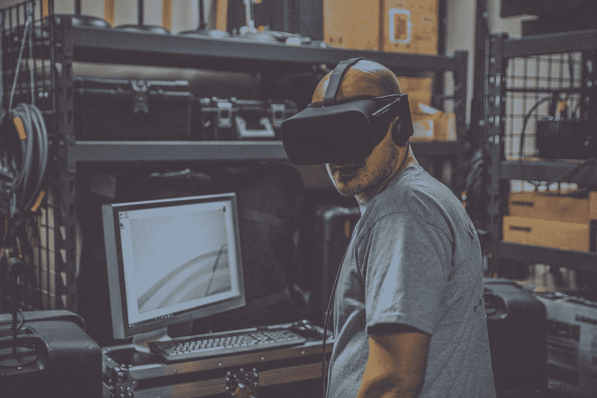
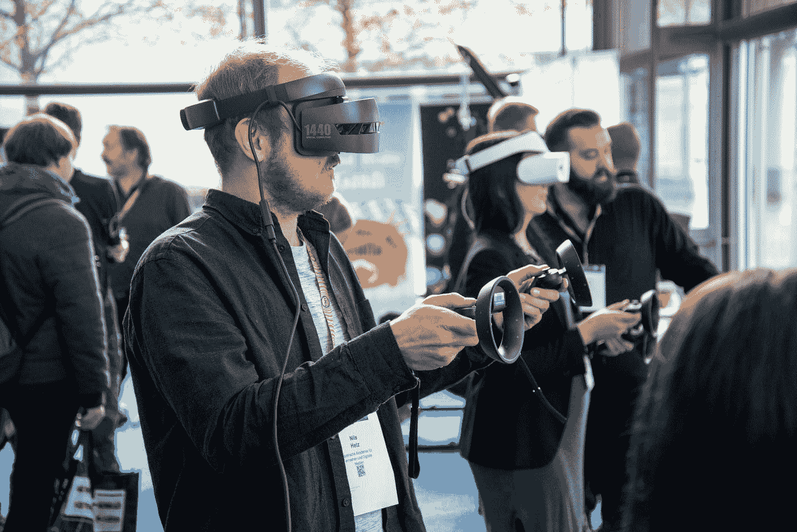
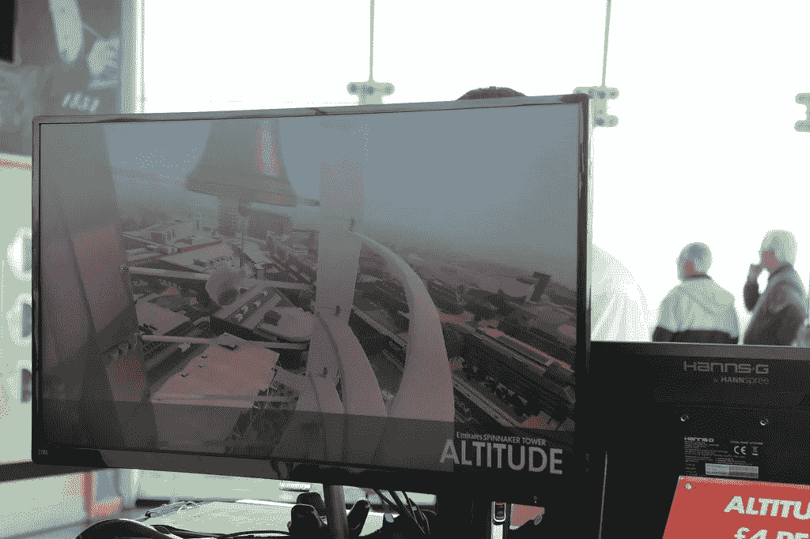

# 虚拟现实一年——我学到了什么

> 原文：<https://medium.datadriveninvestor.com/a-year-in-vr-what-ive-learned-4d39f7f68f9d?source=collection_archive---------7----------------------->

在过去的几年里，从 2014 年脸书以 20 亿美元收购 Oculus 开始，VR 的命运一直是人们谈论的话题。

过去一年我一直在虚拟现实领域工作，对这一事实的反应从冷漠的不感兴趣到对技术的真正兴趣，至少有一个人觉得我“侮辱了他们的智慧”，当被要求解释我用虚拟现实做什么工作时，他说“这太复杂了”。这是问题的一部分，这是一个复杂的行业，需要 10 分钟的讲座(或简洁的博客帖子)来提供 VR 如何工作以及为什么它很重要的完整画面。

 [## 人工智能和虚拟现实的融合-你能期待什么|数据驱动的投资者

### 在技术领域，融合是合乎逻辑的一步。就在几十年前，你可能需要一个专门的…

www.datadriveninvestor.com](https://www.datadriveninvestor.com/2018/08/30/the-convergence-of-ai-rv-what-you-can-expect/) 

在过去的一年里，我一直发现的一件事是，许多人对虚拟现实技术及其应用受到了错误的教育，认为这是一个噱头，只对游戏有用，或者更糟的是，他们已经尝试过虚拟现实，但有了糟糕的第一次体验，他们决定发誓不再尝试。这些是经常发生的令人沮丧的事情。

在这篇文章中，我将简要介绍虚拟现实世界以及我在过去一年中学到的一些关键知识，为您提供虚拟现实的简要历史，并深入研究致力于使虚拟现实获得成功的创新者和创意者的协作社区。

# 我们是怎么到这里的？

虚拟现实的历史可以追溯到 20 世纪 80 年代杰伦·拉尼尔在 Atari 和 VPL Research 的工作，尽管大多数人第一次接触虚拟现实是在 1995 年任天堂命运多舛的虚拟男孩。为了这篇文章，我们将涉及虚拟现实的最近历史和这个行业面临的成长的烦恼。

Photo by [Eddie Kopp](https://unsplash.com/@fiveohfilms?utm_source=medium&utm_medium=referral) on [Unsplash](https://unsplash.com?utm_source=medium&utm_medium=referral)

2014 年，人们严重质疑脸书收购 Oculus 背后的思维过程，这是一家勇敢的初创公司，通过 Kickstarter 筹集了 240 万美元，并在约翰·卡马克(当时的 Id 软件技术总监，现在的 Oculus CTO)的支持下发展，但对于一家只生产单一开发套件的公司来说，估值极高，Oculus 与脸书通常的收购战略相去甚远。

事实上，收购 Oculus 是试图进入利润丰厚的娱乐行业，并“拥有”新兴的虚拟现实市场和软件生态系统。这是一场昂贵的赌博，但却是合乎逻辑的。在过去的一年里，我们看到其余所谓的“四大”纷纷效仿，进入游戏行业并涉足 VR；谷歌推出了流媒体服务 Stadia，亚马逊创立了亚马逊游戏工作室，收购了 Twitch，并在 2015 年创建了亚马逊 Lumberyard，而苹果最近推出了 Apple Arcade。

## VR 已死，VR 万岁

2014 年至 2018 年期间，虚拟现实市场一直在三大玩家之间争夺:PSVR 的 Playstation，Rift 和 Go 的 Oculus，以及 Vive 的 HTC。在这 4 年期间，该行业的特点是停滞感，被 VR 头戴设备过高的成本所困扰，这阻碍了硬件和软件的销售。

另一个大障碍是缺乏跨所有平台的高质量虚拟现实内容，软件生态系统正在逐步增长，但如果没有大量的体验，600 美元至 900 美元的虚拟现实耳机的价值主张是不存在的。对于有兴趣开发虚拟现实的中小企业和游戏工作室来说，[进入市场的壁垒巨大，开发成本高昂](https://theoutline.com/post/6443/virtual-reality-dream-is-dead-hype-oculus-rift-facebook-playstation?zd=1&zi=h4uhlgng)，这使得开发者和消费者都无法接触到虚拟现实。

Palmer Luckey 是 Oculus VR 的创始人，也是臭名昭著的行业坏男孩，他将目标对准了现有 VR 硬件的质量和高端内容的缺乏:

> “降低现有虚拟现实技术的价格有助于扩大活跃和参与用户群的规模，但远没有达到许多人预期的程度[……]我想更进一步，做出一个大胆的声明:没有任何现有或即将推出的虚拟现实硬件足以成为真正的主流，即使价格为 0.00 美元。你可以免费给发达国家的每个人一台 Rift+PC，大多数人会在几周或几个月内停止使用它。”— Palmer Luckey，Oculus VR 创始人

更糟糕的是，大型游戏工作室不愿意为 VR 平台开发，因为用户群太小了，当你可以为拥有 4000 万用户群的 PS4 开发时，为什么要为拥有 4000 万用户群的[PSVR](https://www.theverge.com/2019/3/27/18284297/sony-psvr-4-million-sold-sega-cd-kinect-comparison-ps4-playstation)开发呢？没有直接的动机去放弃开发相对安全的 PC 平台或传统游戏机。这导致 Bethesda 等工作室通过将《天际》和《辐射 4》等 AAA 级游戏移植到 VR 来“试水”VR 市场。诚然，这些港口令人印象深刻，但没有原创知识产权，缺乏高质量内容的问题仍未解决。

Photo by [stephan sorkin](https://unsplash.com/@sorkin?utm_source=medium&utm_medium=referral) on [Unsplash](https://unsplash.com?utm_source=medium&utm_medium=referral)

这一时期的增长乏力进一步加剧了对 2026 年前潜在的 380 亿美元产业的天价预测的回落。虚拟现实面临的众多挑战的总体结果是创造了一个不稳定的市场，这让位于规避风险的投资者，他们将注意力从虚拟现实转移开。

像谷歌和 Jaunt XR 这样的知名公司关闭了他们的虚拟现实业务，或者开始[转向增强现实。](https://www.roadtovr.com/report-jaunt-in-talks-to-sell-cinematic-vr-business-as-it-moves-towards-ar/)在工作室关闭和转型的过程中，媒体称这是虚拟现实的丧钟，并利用一切可能的机会宣称“虚拟现实已死”。

## 积极的增长和更健康的前景

快进到 2019 年，随着 Oculus Rift S(其前身的迭代升级)和 Oculus Quest(一款具有 6 自由度和高保真视觉效果的完全无线耳机)的成功推出，虚拟现实行业的健康状况不再受到质疑。

Quest 的销量超过了需求，惠普和 Valve 最近凭借惠普混响和 Valve Index 进入了 VR 硬件领域。随着更多竞争的引入，软件生态系统继续稳步增长，每年都有更多高质量的体验产生，这得益于 HTC 和 Oculus 向小工作室投入数百万美元的赠款和基金。真正的虚拟现实热门产品包括《击败军刀》、《孤独的回声》、《星际机器人:营救任务》和《血与真相》。

Photo by [NeONBRAND](https://unsplash.com/@neonbrand?utm_source=medium&utm_medium=referral) on [Unsplash](https://unsplash.com?utm_source=medium&utm_medium=referral)

2019 年将成为虚拟现实的伟大一年，这对每个人来说都是好消息，因为这是一项将从根本上改变我们未来生活和工作方式的技术。更重要的是，人们的态度也在转变，虚拟现实在医疗保健、企业和培训领域的应用已经超越了游戏范畴。我很幸运地亲眼目睹了这种观念的转变。

现在我给你们上了一堂关于虚拟现实最近几年的历史课，让我们深入了解一下虚拟现实背后的技术。

# 这是什么——我为什么要关心？

当我进入这个行业时，我首先要弄清楚的一件事是，VR 到底是什么？我该怎么向一个 5 岁的孩子解释？令人惊讶的是，网络上很少有资源以一种可访问的、非行话的方式定义虚拟现实，我们真的需要进入区块链、物联网和 Web 4.0 来理解虚拟现实吗？也许在另一篇博文里。

从技术意义上来说，虚拟现实是一种通过视觉和听觉体验的人工环境，其中用户的动作对周围的虚拟环境有直接影响。

换句话说，VR 不仅仅是作为被动的观察者从 3D 视角观看游戏，而是在游戏内部迈出一步，用自己的行动直接影响体验。也就是说，它正在成为体验、世界及其角色的一个活跃部分，并使用户沉浸在一个新的虚拟现实中。我们还没有达到现实和虚拟世界无法区分的地步，但是，随着虚拟现实体验中图形改进和保真度的速度，这看起来像是未来 10 年左右非常真实的可能性。

而这也是你应该对 VR 感到兴奋的原因之一。

## 虚拟现实作为终极颠覆性技术

下一个稍微抽象一些，但同样重要的是，虚拟现实作为一种颠覆性技术在许多领域都有巨大的潜力，但最重要的是虚拟现实作为一种计算平台。哈佛校友马克·扎克伯格(Mark Zuckerburg)和专业的杰西·艾森伯格(Jesse Eisenburg look-a-like)概述了沉浸式技术对未来个人计算的重要性:

> “我们的愿景是 AR/VR 将在大约 10 年内成为继移动设备之后的下一个主要计算平台。它甚至可能比手机更无处不在——特别是一旦我们到达 AR——因为你总是开着它。它比手机更自然，因为它使用我们正常的人类视觉和手势系统。它甚至可以更经济……一旦你有了一个好的 VR/AR 系统，你就不再需要购买手机或电视或许多其他实物——它们可以成为数字商店中的应用程序。”—马克·扎克伯格

扎克伯格正在谈论沉浸式技术的遥远未来，可穿戴的轻量级 ar 眼镜和 VR 耳机无处不在，我们所有的技术支柱都是数字商店中简单易用的应用程序。这是一个令人振奋的辩护，说明为什么我们应该关注虚拟现实的发展，即使它听起来像电影的东西，思想准备好的播放器一更少的流行文化参考和(更好？)看耳机。

Pictured: The Magic Leap 1 AR headset

在我们能够发挥沉浸式技术的最终潜力之前，在这个世界中，随时随地都有计算机界面为你提供你在日常生活中需要的信息，我们可以很容易地看到“Alexa like”人工智能助手也融入未来的耳机中，基础设施需要开发，晕动病的挑战需要解决。

如今，人们很难在虚拟现实中停留超过一个小时，让用户经常回到虚拟现实仍然是一个非常现实的挑战，所以这个无处不在的沉浸式技术的梦幻世界可能还有一段路要走。在基础设施方面， [5G 被宣布为实现下一代 VR 和 AR 硬件繁荣的关键组件之一，但迹象是积极的，我们距离过去几年沉浸式技术的厄运和黑暗还有很长的路要走。](https://www.forbes.com/sites/solrogers/2019/01/30/the-arrival-of-5g-will-unlock-the-full-potential-of-vr-and-ar/)

## 用于培训和教育的虚拟现实——这是一个游戏改变者

好吧，虚拟现实已经准备好成为游戏的革命性技术，但是教育呢？随着谷歌 Cardboard(一款 10 美元的 cardboard VR 耳机)的推出，VR 作为一种全新的教学方式越来越多地被用于课堂。

有许多虚拟现实体验再现了古代历史遗址，庞贝古城、罗马帝国和泰坦尼克号遗址，仅举几例，虚拟现实不仅使以前无法进入的遗址在一个完全安全的环境中可见，还使了解这些历史事件成为一种更有吸引力的体验。谷歌探险让学生们可以虚拟地参观从珠穆朗玛峰到卢浮宫的全球著名景点。虚拟现实在课堂上取得了成功，虚拟现实教育是行业发展最快的领域之一。

Photo by [NeONBRAND](https://unsplash.com/@neonbrand?utm_source=medium&utm_medium=referral) on [Unsplash](https://unsplash.com?utm_source=medium&utm_medium=referral)

用于训练的虚拟现实是另一个巨大的领域，英国军队最近正在利用虚拟现实来训练士兵安全冷静地处理战斗情况。类似地，医学学生正在通过虚拟现实接受各种外科领域的培训，虚拟现实是一种经济高效的解决方案，让学生在没有尸体手术焦虑的情况下学习。我可以继续列举其他优秀的用例，证明 VR 是一项令人难以置信的改变游戏规则的技术，但这些例子应该会让你很好地了解为什么我们都应该关注 VR 如何继续发展。

# 每个人都想要同样的东西

当讨论将虚拟现实社区聚集在一起的团结意识时，很难避免陷入令人担忧的感伤水平，但我认为这种团结和缺乏恶性竞争是这个新兴行业特有的。

有一种真实的感觉，我们都在一起，逐步地、有目的地推动这个行业前进。每个人，从最小的 VR 工作室到庞大的行业领导者，都迫切希望 VR 获得成功，证明反对者是错误的，看到 VR 完全被采用，并最终看到这项技术的潜力完全实现。

我很快就会离开虚拟现实行业，但我会密切关注发展、收购和年度最佳项目和体验——让我们希望这种积极增长的上升趋势继续下去。