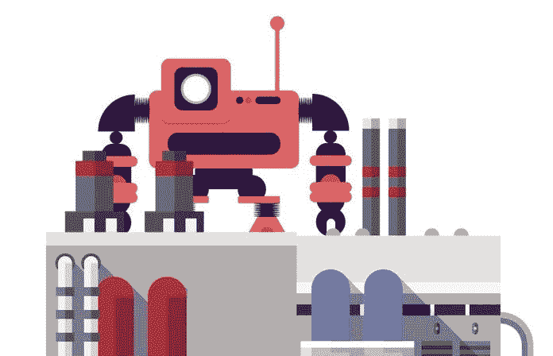

# 借助 RPA 和流程智能加速您的数字化转型|数据驱动型投资者

> 原文：<https://medium.datadriveninvestor.com/accelerating-your-digital-transformation-with-rpa-and-process-intelligence-data-driven-investor-85a8511dd011?source=collection_archive---------13----------------------->

环顾四周，机器人过程自动化不仅仅是一些遥不可及的未来概念。数字领导者正在采用 RPA 来简化运营并消除不必要的低效。其他公司正在将 RPA、业务流程管理和[人工智能](https://www.datadriveninvestor.com/glossary/artificial-intelligence/)相结合，以改善客户体验并实现更快发展。

有许多文章谈到了成功的自动化带来的众多好处。经常被忽略的是谁能从中受益以及他们面临什么样的挑战。尽管这些可能会带来令人担忧的问题，但 RPA 可以是相对平稳的过渡，通过适当的信息、准备和控制，可以节省时间和资金。

# 快速的事实

具有高频率重复性任务的公司有望通过成功部署 RPA 实现**50–70%的成本节约**。然而，现在预计企业正在**错过 50%的自动化机会**。这意味着使用 RPA 有很大的机会，尤其是在选择正确的流程进行自动化时。

 [## 挑战你对人工智能和社会看法的 4 本书|数据驱动的投资者

### 深度学习、像人类一样思考的机器人、人工智能、神经网络——这些技术引发了…

www.datadriveninvestor.com](https://www.datadriveninvestor.com/2019/02/28/4-books-on-ai/) 

Hadoop 的研究人员估计，到 2025 年****公司将**体验到 **RPA** 的**潜在节省**在**5 万亿到 7 万亿美元**之间。在 RPA 上每投资 10，000 美元，您通常需要再投资 100，000 美元进行咨询，以确定哪些流程将受益于自动化。**

**RPA 部署的投资回报率可能会有很大差异(从 30%到 200%)，具体取决于自动化与流程的协调程度。**

****

****41%的**公司**不会将**切换到 RPA，因为**缺乏业务流程的清晰度**(来源:“2017 年自动化状况”样本:企业购买者= 400)**

# **机器人、流程、自动化、数据和您**

**无论您的 RPA 项目侧重于自动化简单的结构化数据任务，还是将机器人与人工相结合的更复杂的操作，都有一个成功的关键因素:对当前流程执行的深入了解。我们每个人是如何实现这一目标的，这是一个不同的故事……并且可能是业务的一个主要竞争限制。您的组织如何识别自动化的高 ROI 机会？你百分之百确定这些选择是准确的吗？您如何从企业数据中获得更具可操作性的见解，以帮助您的业务合作伙伴更快地应对 RPA 等新机遇？您的组织如何找到自动化的最佳流程机会？您的组织仍在进行时间和运动研究吗？**

**正确使用 RPA 很困难。然而，企业正在生成大量数据，但大多数企业不能有效地利用这些数据来提高工作效率，大多数企业也很难理解自己的业务是如何运营的。手动流程评估仍然是 RPA 前流程发现和评估的常用方法。有更好的方法。**

****提示:过程智能。****

**每个人都知道并理解好的商业智能解决方案的好处，但许多人都在努力寻找深入的流程智能解决方案。虽然流程[挖掘](https://www.datadriveninvestor.com/glossary/mining/)和 BPM 可以在流程智能的某些领域提供帮助，但它们缺乏完整的功能来提供对复杂业务流程的宝贵见解，这些流程是我们在现代企业中经常看到的大多数“案例管理”之类的流程。**

**对于任何试图通过有效部署 RPA 来提高业务成效的组织来说，流程智能都是必备的。**

1.  **在准备阶段确定适合 RPA 实施的流程**
2.  **监控端到端的业务流程，并提供一种简单的方法来管理和控制众多的后端系统**
3.  **减少操作中的错误和低效，并通过人工智能支持的预测确保积极的结果**
4.  **提供 RPA 性能的监控和分析，促进 RPA 在实施后阶段的持续改进**

# **过程智能和机器人过程自动化一起可以…**

**开箱即用的解决方案和过程智能的额外优势是数字化转型计划取得成功所必需的关键技能。**

# **您可以将过程智能与 RPA 结合使用来做什么？**

*   **连接到任何现有系统的流程(SAP、 [Oracle](https://www.datadriveninvestor.com/glossary/oracle/) 、custom 等)。)来识别自动化潜力并对现状进行基准测试**
*   **基于真实数据构建业务案例，并获得管理层的认可**
*   **根据最高投资回报率(ROI)确定工作的优先级**

# **发现自动化潜力并进行基准测试**

*   **监控混合、数字和人力劳动力，以确保成功，并在潜在问题恶化之前解决这些问题。**
*   **比较部署前和部署后，量化成果并计算投资回报**
*   **发现调整部署的新机会，以确保持续的流程优化。**

# **监控和衡量活动**

**RPA 实施可能会给组织带来巨大的好处，但也会带来巨大的风险。停止依赖旧的繁琐，往往不准确的方法。使用先进的过程智能技术，公司可以大幅降低风险，并确保其 RPA 计划在企业范围内取得成功。**

****

## **瑞安·m·赖克，工商管理硕士**

**ABBYY 高级产品营销经理**

**Ryan Raiker 是一名出色的商业顾问，拥有与中小型企业以及州政府和地方政府合作的经验。在收购 TimelinePI 后，他于 2019 年加入 ABBYY，Ryan 负责管理公司的营销。在 ABBYY，Ryan 专注于 ABBYY Timeline 产品的品牌管理和产品开发。Ryan 学习商业分析和运营管理，后来在威得恩大学获得了工商管理硕士学位。Ryan 继续在 Widener 担任商业技术和管理的兼职讲师。**

**https://www.linkedin.com/in/ryan-raiker/**

***原载于 2019 年 12 月 9 日*[*https://www.datadriveninvestor.com*](https://www.datadriveninvestor.com/2019/12/09/accelerating-your-digital-transformation-with-rpa-and-process-intelligence/)*。***