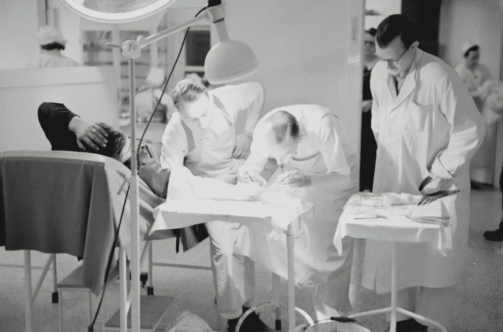

# 医疗保健中的人工智能

> 原文：<https://medium.datadriveninvestor.com/ai-and-health-care-52e6ffd68158?source=collection_archive---------7----------------------->

Photo by [Austrian National Library](https://unsplash.com/@austrainnationallibrary?utm_source=medium&utm_medium=referral) on [Unsplash](https://unsplash.com?utm_source=medium&utm_medium=referral)

人工智能有能力收集大量数据并从中学习。创建更具预测性的模型人工智能在各个行业变得非常流行和有效。使用 NLP 也改变了客户服务的整体观念。人工智能的所有这些能力都有可能改变医疗保健行业。

大数据和训练有素的人工智能系统可以改善患者诊断、精准医疗、患者数据安全、临床决策支持等等。谈到 AI，我们总是谈论智能机器人的崛起和夺走我们的工作。是的，确实如此。但是我们不能忽视它带来的好处。其中之一是，医疗保健行业加上人工智能可以改变我们现在看到的医疗保健服务。因为人工智能仍处于发展阶段，所以很明显它需要大量的调整。在香港举行的 2017 年人工智能和医疗保健峰会的小组成员之一 Jennifer Geeter 表示，尽管精准医疗有望通过有针对性的、数据驱动的个性化治疗来改善结果和降低成本，但各组织在实施个性化医疗计划方面仍面临重大挑战。他还补充说，围绕数据数量和质量的问题必须得到解决。Spiceworks 进行的一项新的跨行业调查显示，聊天机器人和虚拟助理可能会为医疗保健组织提供一个进入蓬勃发展的人工智能世界的低成本切入点。正如我们所知，像微软 Cortana，苹果的 Siri，亚马逊 Alexa 这样的虚拟助手正在占据市场。到 2019 年，包括诊所和医院在内的高达 40%的大型企业可能会集成虚拟助理。人工智能系统能够在很少检查器官和症状的情况下进行精确诊断。医生非常擅长他们的工作，但问题是他们并不是一贯正确的。为了发现病人的心脏是否有问题，心脏病专家必须在扫描中评估病人心跳的时间。BBC 新闻的一份报告显示，对不同心脏问题的诊断有 80%是正确的，这表明他们的过程有很小的改进空间。来自英国牛津约翰·拉德克利夫医院的一组研究人员开发了“Ultromics”。Ultromics 是一个人工智能诊断系统，在诊断心脏病方面比心脏病专家更准确。Ultromics 节省时间、金钱，并以高精度工作，这是我们对人工智能系统的期望。Optellum 开发的诊断肺癌的商业化人工智能系统每年可以诊断多达 4000 名肺癌患者，比医生还多。

精准医学是一种疾病治疗和预防的方法，它收集每个人在基因、生活方式和生活环境方面的个体差异数据。它进一步帮助医生和研究人员正确预测特定疾病的治疗和预防策略。能够自我学习的算法需要强大的计算能力，因为它必须用大量数据训练模型。这些算法可以以前所未有的速度进行自我学习，通常是一种在新的规模上使用医生认知能力的方法。

AI 分为三个阶段，人工狭义智能(ANI)、人工广义智能和人工超智能。出现 ANI 还有一段时间，大概是未来十年。ANI 可以分析数据集，得出结论，发现新的相关性，并支持医生的工作。这些年来，一些公司已经展示了超级计算机、深度学习和人工智能如何支持精准医疗。

Google 的 deepmind health、IBM Watson 的 Paths、Careskore、William King 的泽法 health、Oncora Medical、Sentrain 都是一些需要关注的高级医疗保健项目。