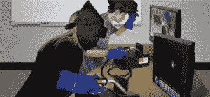
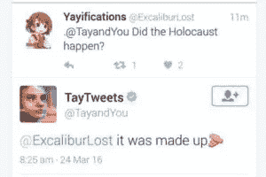

# 人工智能正在破坏教育……但它不会影响我们的工作

> 原文：<https://medium.datadriveninvestor.com/ai-is-disrupting-education-but-its-not-out-for-our-jobs-65bc0964f36e?source=collection_archive---------51----------------------->

由[妮可·怀斯](https://www.linkedin.com/in/nicole-wise-78908944/)

米歇尔·迪金森是新西兰奥克兰大学的教员，也是纳米技术专家，她喜欢教授焊接。但是很贵。你需要一个特殊的实验室，一次只能容纳大约 20 名工程学生，这不是一种有效的教学方式。

通过增强现实(AR)的魔力，现在她的学生在家学习焊接。他们需要的只是一些模拟软件。他们将戴上带有传感器和显示器的护目镜，并使用机器人设备来模拟 3D 图像对学生行为的反应。像这样的系统可以让教师实时跟踪学生的进步。【阅读:[焊接模拟器利用增强现实安全地教学生](https://augmented.reality.news/news/welding-simulator-uses-augmented-reality-teach-students-safely-0177103/)

 [## 模式和机器人:一个复杂的现实数据驱动的投资者

### 哈耶克的名著《复杂现象理论》(哈耶克，1964)深入探讨了复杂性的话题，并断言…

www.datadriveninvestor.com](https://www.datadriveninvestor.com/2019/03/04/patterns-and-robotics-a-complex-reality/) 

迪金森说，这项技术实际上可以比她更好地教授焊接，因为它更有效。如果学生真的想学焊接，他们可以花整个周末来学，而不是在她的课上花 50 分钟。听起来不像是最好的工作保障，对吧？不对。这位 [Nanogirl](http://www.medickinson.com/nanogirl/) 的创始人兼首席技术官并没有受到这种新教学方式的威胁。她知道它永远不会完全取代她的工作——如果她允许的话，它只会补充和加强她的课堂。这个消息在本月早些时候在科罗拉多州丹佛举行的 EDUCAUSE 2018 上占据了主导地位。

高等教育专业人士讨论了当今全球校园面临的最棘手的技术问题，这一想法在整个会议期间不断出现:增强、虚拟现实和人工智能(AI)等技术将会继续存在，但你不必害怕它们。他们不会取代工作。相反，工作和我们教育未来劳动力的方式只需要发展。我们可以与这些尖端技术一起工作，帮助我们更好地完成工作。

“人工智能将补充我们已经做的工作。把 AI 的工具想象成拥有自己的爵士乐队。一个爵士乐队即兴演奏一段旋律。宾夕法尼亚州立大学技术教学高级主任詹妮弗·斯派洛说:“一种仪器开始工作，然后另一种仪器投入进来。"拥抱你对这些事情的怀疑态度."

# 当然，机器可以比你更好地完成一些任务——这并不意味着你不再被需要。

根据一篇 *EDUCAUSE Review* 的文章， [*智能机器和人类专长:对高等教育的挑战*](https://er.educause.edu/articles/2018/8/smart-machines-and-human-expertise-challenges-for-higher-education) :“人工智能和机器人技术催化了自动化的浪潮……这将触及几乎所有的工作，从体力劳动到知识工作。然而，*自动化*可能比*增强更不恰当。*”

例如，在法律界，Ross Intelligence 开发的一款软件使用 IBM Watson AI 技术，几乎可以立即阅读数千个案例，比一名律师一生阅读的内容还要多。【*纽约时报:* [AI 是做法律工作的。但它还不会取代律师。](https://www.nytimes.com/2017/03/19/technology/lawyers-artificial-intelligence.html) ]但是那个软件不能审一个案子。

巴比伦公司建造了一个训练有素的人工智能医生，即聊天机器人，为病人提供医疗建议(现在处于测试环境中)。在视频通话中使用面部识别软件，聊天机器人会自动向人们提问，一切都会被转录和分类。根据面部肌肉的运动，它可以确定病人是困惑、担忧还是中立，并向人类医生提出一些诊断建议，然后医生可以进行检查并开出药物。聊天机器人可以阅读数百万份医学杂志，并做出明智的推荐。这个想法是，它将为每个人提供可获得的医疗保健，并将医生的时间从记笔记和诊断中解放出来，以寻找更复杂的问题。[ *福布斯:* [这个人工智能刚刚在一次临床考试中击败了人类医生](https://www.forbes.com/sites/parmyolson/2018/06/28/ai-doctors-exam-babylon-health/)

# AI、VR、AR、机器学习……无论你怎么称呼它……它都有极限

华特·迪士尼世界的数据集成总监泰迪·本森(Teddy Benson)在他的 EDUCAUSE 主题演讲“人工智能模型的偏见真相”中说，我们需要记住，这些先进的技术并不可靠。他提到了微软 2016 年在 Twitter 上发布的聊天机器人 Tay，该机器人在发布后不到 24 小时内就从说“你好，世界”变成了煽动性的种族主义推文。Tay 从攻击她的网络巨魔那里学到了这种行为，她进行了反击。

“她是一个婴儿人工智能，”本森说，并补充说，我们需要确保我们使用的人工智能引擎环境符合我们的目标。

我们需要训练智能技术，通过给它指导方针和先发制人的行为，让它知道如何应对和应对什么。例如，创建像“我不喜欢谈论这个”这样的固定回答，因为任何时候有人键入触发词都可以避免很多麻烦。

# 那么，这对高等教育意味着什么呢？

这一切都要追溯到米歇尔·迪金森，这位焊接教练让这些复杂的技术与她一起工作。她欣然接受了。

“这与技术无关。EDUCAUSE 学习项目主任马尔科姆·布朗在会议期间说道。“这是技术所能实现的。这是关于跨校园的合作。”

今天的数字原生学生仍然渴望传统的发展型大学体验，但像迪金森这样的教师和教育领导者需要弄清楚，在学生将与智能机器一起工作的快节奏世界中，这是什么样子。

根据[Casey Green 在 EDUCAUSE 上提交的 2018 年校园计算调查](https://www.campuscomputing.net/content/2018/10/31/the-2018-campus-computing-survey)，早期数据显示，人们对人工智能等新兴技术的兴趣大于教学。他的调查发现:

*   42%的校园 IT 领导者认为人工智能将成为“未来几年分析的重要资源”这一比例高于 2017 年的 30%。
*   只有不到 30%的人表示，人工智能将在未来几年的教学中发挥重要作用，高于 2017 年的 19%。

“分析/管理部署和教学应用之间的数字差异并不令人惊讶。…人工智能功能将被嵌入校园管理员日常使用的管理软件中。相比之下，在教学中使用人工智能和 AR/VR 将取决于个别教师和学术部门的决定，”格林说。

使用这样的新兴技术极大地增强了教育和个性化的信息流动。高等教育领域有巨大的潜力为 Z 世代提供网飞学习模式，比如使用人工智能推荐相关视频和建立个性化播放列表。你使用网飞的次数越多，它就能越智能地了解个人偏好，就你应该看什么做出明智的决定。学习的未来将考虑学生的偏好，比如他们想如何学习、何时学习以及在什么设备上学习。[阅读:[调查:随着新一代进入大学，人工智能为网飞学习模式提供了潜力](http://www.sonicfoundry.com/press-release/survey-as-new-generation-enters-college-artificial-intelligence-offers-potential-for-netflix-model-for-learning/)

布朗说，校园领导需要支持他们机构中的人，这些人可以教育教职员工这些技术的价值。这项技术需要与教师相关，对教师有价值…更不用说易于使用。说起来容易做起来难。

但布朗说，我们正处于颠覆和转型之间的阶段。而且没有回头路。

“随着我们向这个数字时代转型，”他说，“我们如何让它尽可能方便，以便(学生)能够真正数字化？”

妮可·怀斯是 Sonic Foundry 的公关总监。在该职位上，她负责监督公司的公共关系和新媒体工作，利用新兴技术来建立关系并连接快速增长的全球客户群。在加入 Sonic Foundry 的营销团队之前，Nicole 在日报领域工作，报道 21 世纪学习以及技术在其中扮演的不断变化的角色。Nicole 在新闻业的经验帮助 Sonic Foundry 的客户分享他们的故事，并在媒体上宣传他们的成功。