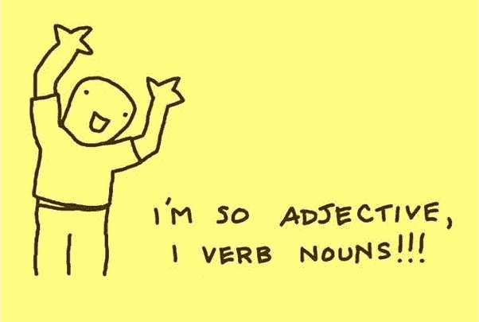

# Ai POS-(词性)tagger #PART-1

> 原文：<https://medium.datadriveninvestor.com/ai-pos-parts-of-speech-tagger-part-1-a3d6bd77ce5e?source=collection_archive---------5----------------------->



在当今不断发展的人工智能领域中，[人工神经网络](https://en.wikipedia.org/wiki/Artificial_neural_network)已经成功地应用于计算词性标注，并取得了很好的性能。**词性标注**几乎是任何自然语言分析的主要组成部分之一。它仅仅意味着用适当的词类如名词、动词等来标记单词。

我们还需要为我们的机器学习、深度学习模型设置标签。NLTK 默认 tagger，斯坦福 CoreNLP tagger，宾州树库等。最著名的是[宾州树木银行。](https://www.ling.upenn.edu/courses/Fall_2003/ling001/penn_treebank_pos.html)我们将利用这一点。

这里有一个简单的词性标注的例子。

```
from nltk import word_tokenize, pos_tag print pos_tag(word_tokenize("I'm learning NLP")) # [('I', 'PRP'), ("'m", 'VBP'), ('learning', 'VBG'), ('NLP', 'NNP')]
```

虽然有各种方法可以用 Ai 进行词性标注，但我们将把这个系列分成三部分，第一部分(*使用决策树*)，[第二部分(*使用条件随机场* )](https://medium.com/@i_am_manish/ai-pos-parts-of-speech-tagger-part-2-fcf55f891d10) ，[第三部分](https://medium.com/@i_am_manish/ai-pos-parts-of-speech-tagger-part-3-c94b116a93e3) ( *使用 LSTMs/GRUs)。那么，让我们开始第一部分吧。*

第 1 部分-使用决策树

首先，我们下载带注释的语料库:

```
import nltk nltk.download('treebank')
```

正在加载带标签的句子…

```
from nltk.corpus import treebank sentences = treebank.tagged_sents(tagset='universal')import random print(random.choice(sentences))
```

这产生了，

(术语，标签)作为

```
[('Mr.', 'NOUN'), ('Otero', 'NOUN'), (',', '.'), ('who', 'PRON'), ('apparently', 'ADV'), ('has', 'VERB'), ('an', 'DET'), ('unpublished', 'ADJ'), ('number', 'NOUN'), (',', '.'), ('also', 'ADV'), ('could', 'VERB'), ("n't", 'ADV'), ('be', 'VERB'), ('reached', 'VERB'), ('.', '.')]print "Tagged sentences: ", len(tagged_sentences) print "Tagged words:", len(nltk.corpus.treebank.tagged_words()) ** # Tagged sentences:  3914** **# Tagged words: 100676**
```

*这变成了一个多类分类问题，有四十多个不同的类。于是，* [*监督了*](https://dataconomy.com/2015/01/whats-the-difference-between-supervised-and-unsupervised-learning/) *的问题。*

接下来，特征工程…

我们的功能非常简单。对于每个术语，我们根据从中提取术语的句子创建一个特征字典。这些属性可以包括关于前一个和后一个单词以及前缀和后缀的信息。但是我们可以这样想，**两个字母的后缀是过去时态动词**的一个很好的指示器，以*‘ed’*结尾，三个字母的后缀有助于识别以 *ing* 结尾的现在分词。

```
def features(sentence, index):
 //sentence: [w1, w2, ...],
index: the index of the word     
return {  'word': sentence[index], 
'is_first': index == 0, 
'is_last': index == len(sentence) - 1,    
'is_capitalized': sentence[index][0].upper() == sentence[index][0],      'is_all_caps': sentence[index].upper() == sentence[index],     'is_all_lower': sentence[index].lower() == sentence[index],        'prefix-1': sentence[index][0],       
'prefix-2': sentence[index][:2],      
'prefix-3': sentence[index][:3],       
'suffix-1': sentence[index][-1],     
'suffix-2': sentence[index][-2:],      
'suffix-3': sentence[index][-3:],     
'prev_word': '' if index == 0 else sentence[index - 1],    'next_word': '' if index == len(sentence) - 1 else sentence[index + 1],   
'has_hyphen': '-' in sentence[index],  
'is_numeric': sentence[index].isdigit(),   
'capitals_inside': sentence[index][1:].lower() != sentence[index][1:]  }  
import pprint  pprint.pprint(features(['This', 'is', 'a', 'sentence'], 2)) {'capitals_inside': False, 'has_hyphen': False, 'is_all_caps': False, 'is_all_lower': True, 'is_capitalized': False, 'is_first': False, 'is_last': False, 'is_numeric': False, 'next_word': 'sentence', 'prefix-1': 'a', 'prefix-2': 'a', 'prefix-3': 'a', 'prev_word': 'is', 'suffix-1': 'a', 'suffix-2': 'a', 'suffix-3': 'a', 'word': 'a'}
```

我们为每个带标签的术语移除标签

```
def untag(tagged_sentence):   return [w for w, t in tagged_sentence]
```

现在，就像在机器学习中一样，我们需要分割数据集来进行训练和测试。我们预留了. 75*len(tagged_sentences)之前的标记句进行训练和休息测试。

```
part=int(.75 * len(tagged_sentences)) training_sentences = tagged_sentences[:part] test_sentences = tagged_sentences[part:] def transform_to_dataset(tagged_sentences):  X, y = [], []      for tagged in tagged_sentences:         for index in range(len(tagged)):    X.append(features(untag(tagged), index))              y.append(tagged[index][1])       return X, y  X, y = transform_to_dataset(training_sentences)
```

现在，我们的神经网络将向量作为输入，因此我们需要将我们的字典特征转换为向量。
继续， [sklearn](http://scikit-learn.org/) 有一个名为[字典矢量器](http://scikit-learn.org/stable/modules/generated/sklearn.feature_extraction.DictVectorizer.html)的内置函数，它提供了一个简单的方法来完成这项工作。它的实现是

```
from sklearn.feature_extraction import DictVectorizer # Fit our DictVectorizer with our set of features dict_vectorizer = DictVectorizer(sparse=False) dict_vectorizer.fit(X,y)
```

在这里，我们都设置为训练分类器，这里是[决策树分类器](http://scikit-learn.org/stable/modules/generated/sklearn.tree.DecisionTreeClassifier.html)。我们可以在这里用 n 个分类器进行实验。

```
from sklearn.tree import DecisionTreeClassifier from sklearn.feature_extraction import DictVectorizer from sklearn.pipeline import Pipeline ## w**e will create a pipeline including DictVectorizer & our classifier.It's easier that way round.** classifier=Pipeline([('vectorizer', DictVectorizer(sparse=False)),('classifier', DecisionTreeClassifier(criterion='entropy'))])  classifier.fit(X[:10000], y[:10000])   # Use only the first 10K samples if you're running it multiple times. It takes a fair bit 🙂Here, we are done with the training part. Next,  X_test, y_test = transform_to_dataset(test_sentences)
```

现在，我们测试我们的模型的准确性…

```
print "Accuracy:", clf.score(X_test, y_test)
```

对于决策树分类器来说，在这样的数据上，这不是太差的准确性。

让我们测试我们的分类器，

```
def pos_tag(sentence): tags = clf.predict([features(sentence, index) for index in range(len(sentence))]) return zip(sentence, tags) print pos_tag(word_tokenize('This is my friend, Manish.'))
```

[('This '，u'DT ')，(' is '，u'VBZ ')，(' my '，u'JJ ')，(' friend '，u'NN ')，('，'，u '，')，(' Manish '，u'NNP ')，('。，u '。')]

我们可以提高精确度，也可以使用以下工具进行调整:

*   pystruct
*   各种分类器
*   三元标记符
*   使用不同的数据集和更大的数据集

如果你想知道如何使用条件随机字段 crf 或 keras(LSTMs/GRUs)进行词性标注，请阅读[第二部分](https://medium.com/@i_am_manish/ai-pos-parts-of-speech-tagger-part-2-fcf55f891d10) & [第三部分](https://medium.com/@i_am_manish/ai-pos-parts-of-speech-tagger-part-3-c94b116a93e3)

也看看我收集的一些有用的资源:

[https://nlp.stanford.edu/software/tagger.shtml](https://nlp.stanford.edu/software/tagger.shtml)

[https://medium . freecodecamp . org/an-introduction-to-part-of-speech-tagging-and-the-hidden-Markov-model-953d 45338 f24](https://medium.freecodecamp.org/an-introduction-to-part-of-speech-tagging-and-the-hidden-markov-model-953d45338f24)

[https://www.nltk.org/book/ch05.html](https://www.nltk.org/book/ch05.html)

[https://becoming human . ai/词性标注教程深度学习库-d7f93fa05537](https://becominghuman.ai/part-of-speech-tagging-tutorial-with-the-keras-deep-learning-library-d7f93fa05537)

*原载于 2018 年 11 月 3 日 blog.lipishala.com**的*[T22。](https://blog.lipishala.com/2018/11/03/ai-pos-parts_of_speech-tagger/)