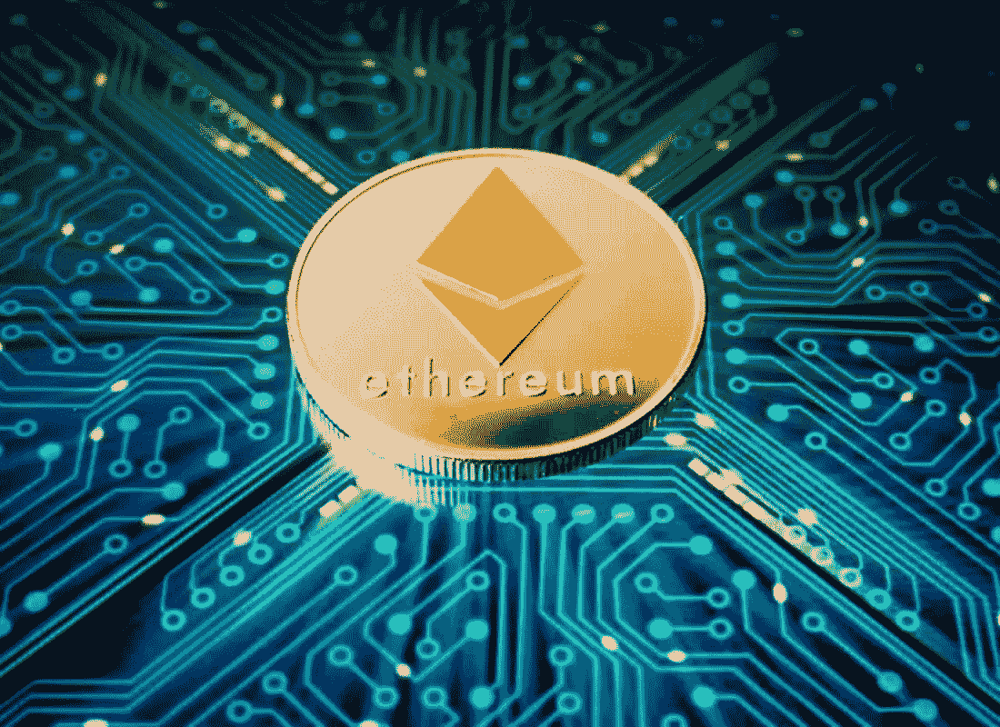

# 使用 Web3j 和 Infura 在 Android 上开发以太坊的介绍

> 原文：<https://medium.datadriveninvestor.com/an-introduction-to-ethereum-development-on-android-using-web3j-and-infura-763940719997?source=collection_archive---------2----------------------->

最近，我决定更深入地研究以太坊的开发，因为区块链技术一直吸引着我，但我从未真正用它做过项目。由于 Android 是我最喜欢的环境，我决定将它作为我的平台。然而，在开始时，我注意到很难找到太多关于以太坊移动开发的信息，这导致了本文的产生，在本文中，我将向您展示如何在以太坊测试网 Rinkeby 上使用 web3j 创建一个简单的以太坊应用程序。

# **1。在您的项目中设置 Web3j**

在 Android 中使用 Web3j 的第一步是将其添加到您的项目中。由于 web3j 有一个 maven 插件，这非常容易:只需将 mavencentral 添加到您的项目 build.gradle 文件中，然后将 Web3j 作为依赖项添加到您的应用程序 build.gradle 文件中(确保您使用的是 Android 版本)。

因为我们将使用互联网与以太坊网络交互，所以在 android manifest 文件中指定这个权限。

# **2。决定使用哪种类型的节点并通过它进行连接**

当与以太坊区块链通信时，必须通过一个节点。解释什么是节点超出了本文的范围，但是，重要的是，它们用于向以太坊区块链发送信息和从以太坊接收信息。

现在，要在移动设备上设置其中一个，您可以选择在设备上运行一个私有节点，或者通过云中的一个节点运行，在我们的例子中，云中的节点是由 Infura 提供的。我决定使用 Infura 的原因是，运行任何节点都要求它与以太坊网络同步，这意味着在第一次初始化这样的节点时，启动需要一点时间和大量内存(对于移动设备标准)，这是我希望避免的(如果您仍然对运行私有节点感兴趣，我建议查看 go-Ethereum mobile)。

你可以在 [Infura](https://infura.io) 轻松注册一个 API 密匙。一旦完成，使用您的端点链接创建一个新的 Web3j 对象并连接到 Rinkeby Testnet:

如果一切顺利，你就可以连接到 Rinkeby 以太坊测试网了。恭喜你！(如果没有，请确保您正在使用。sendAync()。获取()而不是。发送()，作为。在撰写本文时，send()已经损坏。

# 3.创建钱包

让我们创建一个钱包，这样我们接下来可以发送和接收 testnet 以太网。为此，我们需要在用户的设备中创建一个钱包文件:

同时，我们还将保存所述钱包的位置，以便稍后能够与之交互。

# 4.获取地址并装入钱包

太好了，现在我们有了一个钱包，让我们获取它的地址，这样我们就可以从 Rinkeby [水龙头](https://faucet.rinkeby.io/)加载一点 Testnet ether。

# 5.发送交易

在我们的钱包里装满了乙醚之后，让我们试着把它送回去:

# 结论

就是这样！您刚刚创建了一个简单的 Android 应用程序来处理能够发送和接收以太的以太坊区块链。这一切的代码可以在[这里](https://github.com/nschapeler/Ethereum-Android-Intro)找到。

感谢您的关注！

尼古拉斯

*如果你喜欢这个，请为这个故事鼓掌，让更多的人看到它！*

如果你喜欢这个，请给我买杯咖啡:)

以太坊:0x 190d 71 ba 3738 f 43 DC 6075 f 5561 e 58 AC 9d 4 e 3 DFC 2

比特币:1 brucwzs 2 vnrkfmbfs 14 zqerw 74 a1 h1 ke

lite coin:lbnfojftfvcj 7 gfaautwqhithjcj 3m 8y 3v