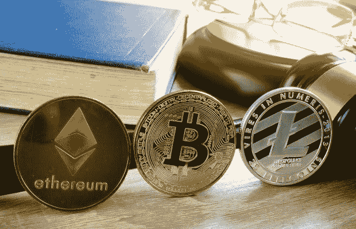

# 律师关于区块链技术、加密货币和智能合同的入门指南

> 原文：<https://medium.datadriveninvestor.com/an-introductory-guide-for-lawyers-on-blockchain-technology-cryptocurrencies-and-smart-contracts-a5ceb858cc09?source=collection_archive---------3----------------------->

你是一名想知道区块链和加密货币如何导致职业生涯中断的律师吗？

区块链法律随着技术的发展而发展，它有可能渗透到生活的许多不同方面，因此也渗透到法律的许多不同方面。律师保持对这个话题的了解是很重要的，尤其是在他们选择的焦点的背景下。

这里有一个区块链技术的概述，以及它如何影响那些负责制定法律决策的人。

# 什么是区块链？

[区块链](https://www.investopedia.com/terms/b/blockchain.asp)指的是一种特定类型的语言或分类账系统，其中包含多组带时间戳的记录。它描述了像[比特币](https://bitcoin.org/en/)等加密货币背后的技术。这些信息“块”是静态的，因此创建了资产和其他世界商品移动的永久数字记录。

所有这些记录都被加密并连接到网络上，从而对发生的每一笔交易进行实时记录。每一个信息块都以这样一种方式与另一个信息块相连，所有的信息都是公开的，正是这种透明的元素使得它如此有效和受欢迎。

区块链有不同的形式，可以是公共的、私有的或混合的。比特币是最受欢迎的，但只是多种格式中的一个例子。然而，这项技术不仅仅被用作一种货币形式，它也是一种在全球范围内追踪各类资产的手段。

律师们应该意识到，他们不仅要处理科技行业的纠纷，还可能涉及音乐、房地产、金融和医疗保健等一系列行业的纠纷。

# 是什么让区块链不可破解？

使用这种技术完成的交易，以及比特币等加密货币都是高度安全的[，不可能被黑客攻击](https://www.pcmag.com/article/351486/blockchain-the-invisible-technology-thats-changing-the-wor)。这意味着事务记录具有高度的完整性，不能被修改或删除——至少目前不能。

基于这种技术(如加密货币)构建的系统已经被黑客攻击，但实际的链是安全的。组成“链条”的账本实际上存储在不同的计算机中，并且在同一时间处于不同的位置，其中大块的信息可以添加到任何节点。

数据也很难穿透，因为它被[散列](https://searchsqlserver.techtarget.com/definition/hashing)(缩短)，并且这是存储在给定集合或块中的内容。这组数据被加密并存储在区块链中。哈希数据实际上无法解密，因此底层的详细数据仍然是安全的。这意味着，即使有人试图入侵系统，他们最终得到的也只是散列数据，而不是实际数据。此外，还有由于计算机网络而产生的冗余。

分类账也基本上是根据共识操作的，而不是可以更改的私人记录(例如，一家银行的财务记录)。因为不可能被黑客入侵，区块链代表了一种极其隐私和真实的存储数据的方法。

# 标题和认证

尤其是涉及到区块链技术的时候，[律师们应该意识到一些特定的问题，例如，超出涉及勒索软件的刑事法律案件。比特币还可以延伸到任何金融领域，包括离婚和黑客纠纷。](https://www.techradar.com/news/7-ways-blockchain-will-change-the-legal-industry-forever)

对这些案件有利的一些方式是所有权和真实性的证明。例如，区块链将拥有与财产有关的明确信息，从而限制与共享财产或产权转让有关的虚假或误导信息的可能性。但与此同时，重要的是要注意，律师必须明白如何以同样的方式记录进一步的交易。

区块链还可以证明财产的真实性，例如在交易或处理古董和艺术品的情况下——原始交易中会包含数据，这些数据将提供原创性的证明。这是可以用来防止财产欺诈交易的许多例子之一。这可以延伸到几乎任何层面的监管链和所有权问题。

# 区块链技术应用

我们将从哪里开始更频繁地看到这项技术？这里只是[几个例子](https://medium.com/nona-web/6-ways-blockchain-is-changing-the-world-870c2c107147)说明各行各业将如何融入区块链技术。

**能源**——我们可能会看到越来越多的此类技术应用于与能源电网交换相关的交易。

**金融**-金融科技是支撑这一新兴技术的关键领域，包括电子商务支付处理和其他需要高度安全性的技术平台。它也将在更大的贸易交易和其他涉及高层资产交换的交易中暴露出来。

**Health**–在提高安全性和减少欺诈方面，医疗保健领域有许多可行的应用。区块链是管理和传输患者记录等高度机密数据的一个极其可行的选择。它还可能应用于医学研究创新的共享和安全。

**艺术**——特别是在音乐行业，区块链可能会成为保护知识产权的领先技术。在艺术品交易的情况下，它可以用来证明作品的真实性。

**房地产**——区块链有可能减少错误、文书工作和彻头彻尾的欺诈，这些都是目前困扰公共和私营部门房地产的问题。例如，已经在开发记录和转让财产契约的程序。

# 智能合同

区块链是只读数据库，因此它们得到了公众共识的确认——换句话说；他们是坚定的记录和事实，所以到目前为止，他们基本上是无可争议的。它们如此无可争议的部分原因是它们与加密合同或智能合同相关联。

智能合同是计算机化的合同，主要跟踪数字资产的移动。这些合同包含规则和处罚——它们就像普通合同一样，只是因为它们被集成到区块链体系中，所以它们有能力“执行”某些处罚。

这些可以是复杂的，并且可以应用于各种领域。律师需要意识到，他们的知识范围无疑需要包括智能合同及其工作方式。

虽然智能合同不能完全防止纠纷，但它们可以帮助指导律师对具体交易做出正确和公正的决定。

*原载于 2018 年 8 月 17 日*[*www.datadriveninvestor.com*](http://www.datadriveninvestor.com/2018/08/17/an-introductory-guide-for-lawyers-on-blockchain-technology-cryptocurrencies-and-smart-contracts/)*。*