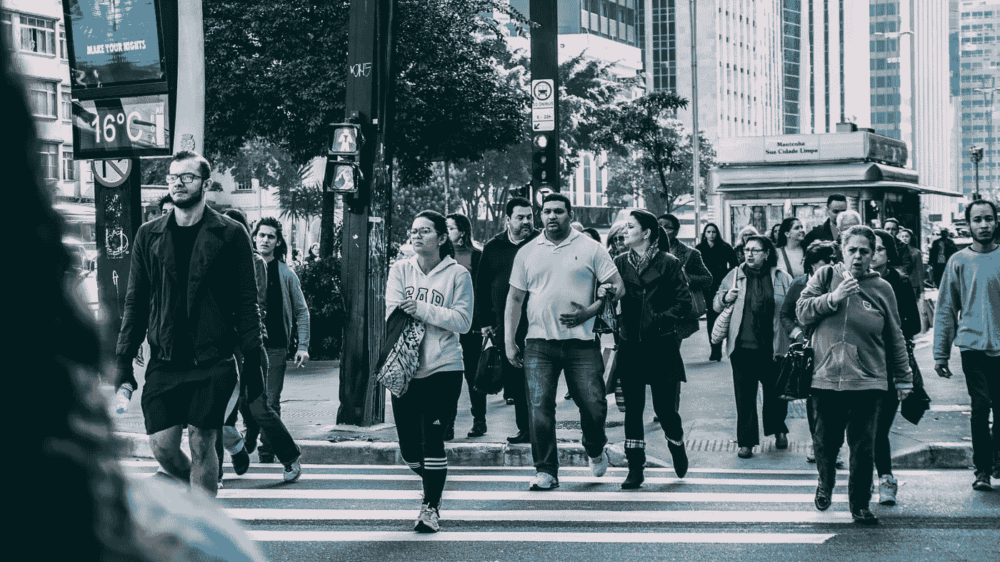

# 区块链在全球的应用概述

> 原文：<https://medium.datadriveninvestor.com/an-overview-on-how-blockchain-is-being-used-around-the-world-3687d723d83b?source=collection_archive---------8----------------------->

## 介绍

自从数字货币比特币的创造者开创区块链以来，这项技术已经获得了很大的牵引力。区块链的实施发现自己正迅速超越加密货币，进入越来越多的公司和组织。一些人怀疑比特币在未来会持续多久，但大多数技术专家都认为区块链肯定有未来。在世界各地，区块链正在被开发用于各种各样的方式，包括允许公司，例如；打击中国的假冒商品，帮助在基于云的环境中保持云数据比以往任何时候都更安全，甚至改变各国政府记录、存储和共享敏感数据的方式。

事实上，世界各国政府都在区块链技术上投入了越来越多的时间和资金。根据 IBM 在 2017 年进行的一项研究，到 2018 年，十分之九的政府将投资于区块链的研究、创新和采用。这是大多数政府观点的转变，他们之前对这项技术持怀疑态度，主要是因为担心它与比特币和其他加密货币的联系。然而，现在政府被区块链的潜力所折服，并热衷于探索将其应用于当前流程的方法。

## 国际区块链项目

韩国政府计划在 2019 年底前投资 9 亿美元用于区块链开发。他们的计划包括希望与其他各国政府合作，在公共部门开展区块链试点，工作将主要集中在通关、房地产交易、在线投票和跨境电子文档分发等领域。主要目标是使用分布式网络来提高公共服务中的信息共享效率和透明度。

荷兰政府(荷兰已经成为最欢迎加密货币的国家之一)一直在探索区块链在各个领域的应用，包括与一家名为 *Blockchain Pilots* 的金融科技初创公司合作，后者帮助机构测试区块链项目。截至 2017 年底，本届政府正在测试 30 多个项目，涉及税收、物流、身份和自动驾驶汽车等领域。阿姆斯特丹正在努力为其公民提供一种更有效、更简单的方式来使用区块链申请个人医疗保健预算，并试图在医疗保健流程中创建一个清晰的授权概览。鹿特丹正在开发一个区块链流程，以更有效地征收旅游税，埃因霍温正在开发一个使用区块链加快地块转让过程的案例。

莫斯科市实际上有自己的投票平台，这将是第一个实施基于电子投票区块链系统的城市。在其平台上的每一次投票都将形成一个智能合同，该合同将是公开可见和透明的，因此投票过程将是安全的，总体上大大减少了第三方干预或欺诈的机会。

在投票过程中使用区块链真的可以动摇一个受到低投票率等问题困扰的系统，当然还有提到的欺诈问题。它可以开辟在线投票的曙光，作为纸质选票或我们已经习惯的电子投票机方法的替代。通过提供这些其他投票方法，投票人数很可能会增加(这是世界各地政府迫切关注的问题)，因为在线投票对许多人来说更方便，并且提供额外的格式可能会出于各种原因增加活跃用户的数量。还有一种观点认为，在线投票甚至可以解决选举的安全性和完整性问题。一些专家认为，区块链可能会导致互联网投票成为一个全球性的过程。

随着该技术在社会中的广泛使用变得更加普遍，政府认为有可能通过使用区块链来改善的活跃系统可能会在很大程度上继续存在。区块链代表着政府能够实现系统现代化的机会，提高效率和安全性，并使过程“比目前实施的方法更加透明”。众所周知，许多公民并不信任政府活动的每一个方面，平心而论，历史上各种政府都存在腐败，因此失去信任并不奇怪。但如果政府想要重建形象，赢回信任，区块链的实施可能会在一定程度上实现这一理念。理论上，这有助于提高他们的可信度，因为由于区块链的透明度，公民对政府(反之亦然)的信任度被降至最低。公民将能够公开查看政府活动，就像政府可以查看他们在区块链主导的系统运行区域内的活动一样。想象一个“共同透明的未来”，在那里，记录在一个人身上的所有数据都是公开的，没有被截取、篡改或隐藏的可能性——这是一个强大的想法，我相信你会同意。

公共福利、医疗保健、教育和政府能力是区块链有能力改善和发展的领域。然而，区块链的高影响力潜力并不仅限于政府。不，正如我们所知，它有助于改变世界的面貌，包括缩小富国和穷国之间的差距。

一个巨大的积极因素是，区块链是廉洁的，完全透明的，可以绕过任何形式的审查。分解来看，区块链是一个虚拟的公共账本，以安全透明的方式记录一切，这是它在社会中保持积极变化的一个关键原因。这种技术将有助于解决政府内部以及个人、公司或其他组织内部的腐败问题，无论是金融还是其他方面，因此，是的，它可能代表着巨大的社会变革。

## 积极的融资渠道

如何通过区块链为世界上最贫穷的人创造积极的金融途径？以它在难民危机中的作用为例。今年，UNWFP 向 10，000 多名叙利亚难民发送了基于加密货币的代金券，帮助数千名难民使用加密货币购买食品。关键是，区块链可以作为一个类似银行的机构，用于那些没有银行账户的人，这是许多人的情况。只要有某种形式的智能手机，就可以通过这种方式存取资金。加密货币的另一个额外好处是那些需要向另一个国家汇款的人——没有典型的传统方法所涉及的费用，为需要向家人汇款的移民、移民和难民节省了费用。这尤其会对非洲产生影响，在非洲，如果不是通过加密货币进行的话，这类交易是世界上最昂贵的。

然后，通过了解区块链如何帮助商业，也值得看看世界上较贫困地区的财富方面。毕竟，如果一个企业做得很好，他们能够雇用更多的工人，那么这将对社区做出积极的贡献。改善工作量的一种方法是通过供应链管理。 [*区块链技术*](http://starktechnologies.co.uk) 具有可追溯性和实际成本效益的好处，因为它可以用于跟踪货物的完整移动、其原产地、数量和其他关键属性。该流程简化了所有权转移、生产、保证，当然还有支付。区块链的使用将再次提高现有系统的透明度，从而帮助依赖供应链管理的企业简化和加强工作负载。

区块链肯定是长期以来讨论最多的技术之一。当然，它不能被视为解决个人、公司或组织的每一个数据导向系统的解决方案。但希望正如上面的一些已经向你展示的那样，如果以正确的方式在正确的领域实施，它是值得大肆宣传的，并可能导致一些非常有趣的变化，其中一些现在已经看到，但我们可以期待在不久的将来看到更多的变化。