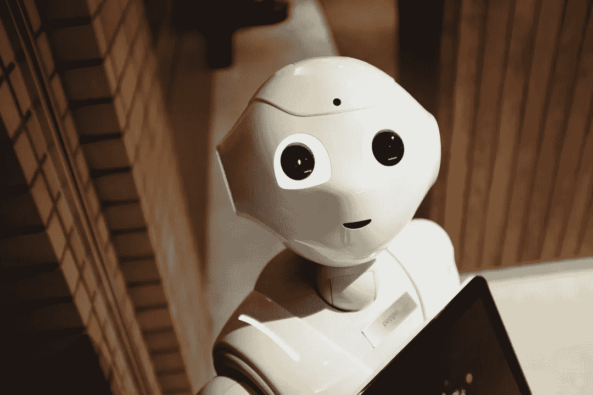
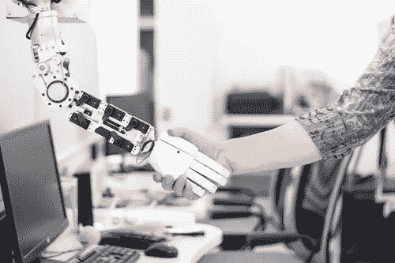

# 机器人会取代我们的工作吗？

> 原文：<https://medium.datadriveninvestor.com/are-robots-coming-after-our-jobs-7647adb9a4fa?source=collection_archive---------26----------------------->

人工智能正逐渐渗入我们的生活，有报告称，未来 15 年，英国现有工作岗位的 30%和美国的 40%将被人工智能取代。可能被机器人取代的工作岗位的潜在数量，显然是一个令人担忧的社会、经济和伦理后果的原因。

但是什么是人工智能，我们为什么要关注它？人工智能基本上被定义为源自机器的智能。众所周知，机器可以解决涉及处理大量数据的问题，并且比人类更快更好地执行重复性任务。但人工智能更进一步，它能够比人类更好地自我学习和发现数据模式。

众所周知，自动化大大提高了制造业的效率，从而降低了生产成本和消费者的价格。从包装巧克力的装配线到裁剪和制作服装的工厂——这些发展让终端消费者受益匪浅。

技术工作面临风险

虽然我们还没有到达机器人像人类一样的时代，如强大而感人的科幻电视剧《西部世界》或《玛奇纳前传》中描述的角色，但人工智能和机器人现在正在追求曾经被认为是人类专属的工作。阿里巴巴和微软开发的人工智能系统现在能够在斯坦福阅读测试中比人类更好地阅读和理解，这提高了人工智能可以应用于许多应用的前景，例如客户服务和在线回答医疗咨询，这有望以前所未有的方式减少对人类输入的需求。

在自动化好处的推动下，拥有大量高技能工作的行业正在接受人工智能来提高生产率。法律行业正在接受人工智能，这减少了对通常由律师助理和实习律师执行的工作的需求。人工智能经过训练，可以解析数百万份法律记录和合同，提供比人类快得多的洞察力。

会计岗位也不能幸免。越来越多的复杂软件进入市场，以帮助管理账户和会计的其他技术方面，如税务准备和审计，将减少对训练有素的会计师的需求。

虽然金融服务行业已经在后台办公室采用自动化来提高效率和生产力，但人工智能应用程序正逐步被引入前台办公室。以瑞士联合银行(UBS)为例，机器人正在走向交易大厅，帮助交易员更好地工作。自动化系统正在逐步引入，以处理客户的交易后分配请求，机器学习将用于代表客户开发新的交易波动策略。

但是在涉及人类互动的工作中，我们仍然胜过机器人

尽管机器人能够自动完成数百万份工作，但它们还不能在涉及复杂的人类互动和推理的环境中工作。最近，[法比奥，爱丁堡一家零售店的机器人店员](https://www.rt.com/uk/416681-robot-supermarket-fired-margiotta/)，仅仅工作了一周就因为表现不符合角色要求而被解雇。虽然 Fabio 很可爱，也很友好——它会顽皮地击掌并拥抱顾客，但它不会在商店里走动，也不会帮助顾客定位商品。一些顾客不满意它没有指引他们去啤酒区。

顾客并不喜欢法比奥，但员工们看到机器人离开时很难过，这是一个惊喜，因为机器人正在争夺他们的工作。但是机器人帮助员工做了他们不感兴趣的工作，比如回答在商店哪里可以找到商品的问题。

这项研究应该提醒人们，当机器人辅助人类时，它们的工作效率会更高。

The future of work

自动化确实有几个好处，人工智能的发展有望提高生活质量，问题不是工作是否会被取代，而是何时被取代。虽然以前的工业革命创造了新的就业机会，增加了全球繁荣，但人工智能是一个未知的领域，如果不加控制，它不一定会导致就业岗位的净增加。

为了在这个勇敢的新世界中茁壮成长，我们将不得不适应和发展一系列补充机器的技能。我们必须深入了解我们的工作，开发机器还无法复制的专业知识。随着人工智能成为主流，我们与他人合作、开发和领导团队以及与他人共情的能力将变得更有价值。

这似乎是一个悖论，但机器人的出现最终会让我们重视人类的互动。

## 来自 DDI 的相关故事:

 [## 数据科学和软件工程哪个更有前途？

### 大约一个月前，当我坐在咖啡馆里为一个客户开发网站时，我发现了这个女人…

medium.com](https://medium.com/datadriveninvestor/which-is-more-promising-data-science-or-software-engineering-7e425e9ec4f4)  [## 用 7 个步骤解释深度学习

### 和猫一起

medium.com](https://medium.com/datadriveninvestor/deep-learning-explained-in-7-steps-9ae09471721a)