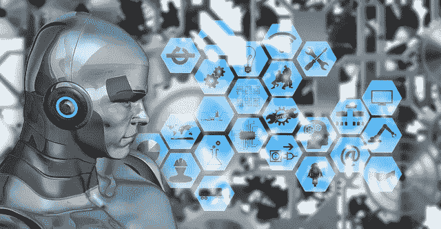

# 人工智能更深入航空应用

> 原文：<https://medium.datadriveninvestor.com/artificial-intelligence-goes-deeper-into-aviation-applications-39c4a1f8be75?source=collection_archive---------4----------------------->

Courtesy Pixabay.com

多年来，航空业一直在利用某种形式的人工智能(AI)技术。计算技术和电力、通信和传感技术的进步，所有这些结合在一起，带来了航空领域的新一代人工智能，重大举措正在进行中。

在本文中，我试图涵盖一些应用程序和关键领域，在这些领域中，这项技术产生了重大影响。由于技术发展的不断进步，这些进步在过去几年可能是不可能的或经济上不可行的，但现在是这样了。让我们探索一下外面发生了什么。

 [## 危机管理乘“飞机”飞行真相|数据驱动的投资者

### 当埃塞俄比亚航空公司的一架 737 Max 飞机起飞后不久坠毁，整个国家陷入危机。最好的…

www.datadriveninvestor.com](https://www.datadriveninvestor.com/2019/03/26/crisis-management-flies-on-plane-truth/) 

**航空公司/运营商收入管理&运营**

相对于收入管理和航班运营管理，航空公司、包机和公务机运营商已经使用一些早期形式的人工智能有一段时间了，但今天的人工智能和数据分析的结合将推动该行业更好地管理自己。这可以通过如何更快更精细地收集数据来实现，这为人工智能算法提供了一个信息库，通过它可以做出更定制的决策。

***收入管理***

收益管理是一个包罗万象的术语，涵盖了动态定价和价格优化等领域。除了航空业，许多其他行业也在这样做，例如在线零售(亚马逊是零售商如何根据需求、以前的客户购买、一年中的时间和库存来改变定价的完美例子)、按需运输(优步和 Lyft 不仅根据供求来为他们的服务定价，还根据预定的活动来为他们的服务定价，例如某个地理区域的音乐会和体育赛事，这些活动可能会在短时间内推动需求高峰)和酒店——这些都是根据需求和供过于求来不断调整定价的早期先驱之一。

过去，总的来说，私营航空业在部署技术管理运营和帮助客户更好地使用其服务方面落后于许多更成熟的商业航空公司。这有许多原因，但成本和提供基于自动化和直观自学的服务以满足高要求客户群(私人飞机)的每一项需求的能力，与处理数百万客户相比是一个不同的挑战。虽然商业和私人航空收入管理之间存在重叠，但其中一个更关注最大化业务量，而另一个则更关注提供更好的服务以留住客户。但两者都在适应这种方式。互联网技术正在推动人工智能算法和关于模式的机器学习。

动态定价是航空公司能够更好地优化其基本公布票价的一个领域，这些票价已经根据航班长度、特定的细分市场特征和广泛的细分市场策略进行了计算，然后在衡量有关查询旅客和市场环境的数据后进一步微调这些票价价格。这种技术的一些版本已经被航空公司使用了几十年，但是现在它已经从宏观级别移动到微观级别，在微观级别，它可以基于寻求购买机票的客户的历史而改变。集成数据库和历史数据的使用增加(例如，您在过去几年中购买的航班、座位升级、您喜欢的座位类型:靠窗/靠过道/高级加等。旅游购买、酒店类型)支持更多捆绑选项和各种类型升级的销售。航空公司/运营商或旅游预订网站或应用程序关于你的信息越多(你最近搜索了哪些航班以及何时搜索的，你的常旅客账户状态，酒店积分账户，你的浏览历史，与你相关联的社交媒体档案)，人工智能算法就能更好地找到优化价格和产品供应的方法，以吸引你，并吸引你现在购买。

具有不同需求的其他客户(或者关于他们的可用信息较少，例如，如果他们没有登录网站)可能会看到不同的定价和捆绑包。各种类型的人工智能和跟踪软件可以使用 cookies 和网络信标来创建某种类型的个人资料。软件还能够在很大程度上区分潜在的商务旅行客户和寻找度假旅行的人，并提供适当的升级或套餐。如果你已经搜索了 Expedia 和 Priceline，然后去了一个航空公司的网站，而没有在任何地方登录，在你的浏览器在某个时候被清除之前，算法将使用跟踪数据来开发你的某种类型的个人资料。

我们已经在航空公司和旅游网站上看到这种情况很多年了，但是，现在有了在线用户跟踪和更深入的数据挖掘，机器学习可以识别以前的软件(当然不是人)可以识别的微妙模式。人工智能定价算法进行的这种更深入、更粒度的数据挖掘可以允许定义更优化的价格，从而为运营商带来收入。没有隐私，但至少你可以在搜索旅游选择时获得特价奖励！

价格(或收入)优化是另一个相关的主题，因为出于各种原因，例如低成本运营商的持续扩张，价格优化变得越来越困难。这与动态定价密切相关，但通过利用人工智能算法，航空公司可能能够在更长时间内优化销售收入，以确保通过分析历史趋势和研究跨市场的宏观定价来优化所有航班的预订。

价格并不总是万能的(尤其是对私人航空而言)，所有的航空公司都必须平衡利润最大化、提供更好的客户旅行体验和客户服务的需求。这可能是相当平衡的行为。

***航班延误***

航班延误是旅行者的一大烦恼，对航空公司/运营商来说更是如此。在过去的几十年里，航空公司、航空货运公司和私人飞机运营商已经将管理此类事件变成了一种艺术形式，随着通过机场和导航服务提供商提供的近实时天气机制和信息捕获更多数据，基于人工智能的系统将能够更好地处理此类事件。这不仅是对由于恶劣天气或维护问题造成的延误的预测，也是为了更好地处理由此产生的混乱，并最大限度地减少对乘客和货物的影响。事实上，如果航空公司能够提前做出安排，比如联系他们，通知他们即将发生的延误，以便提前管理旅行计划，乘客会很感激。

**操作飞机**

一些形式的自动化系统已经在商业航空中使用了很多年，并且可以说使得飞行比以往任何时候都更安全。自动飞行系统实际上已经变成了副驾驶(除去善意的玩笑)。诸如机动特性增强系统(MCAS)等新系统的出现，有助于在因飞机操纵特性而需要调整时提供更高的安全性。这种系统使用各种传感器数据来根据飞行条件自动管理飞机的操纵面。在更好的传感器被添加/升级到飞机之前，在更大的数据总线将更多数据移动到飞行控制系统以及人工智能算法被集成到驾驶舱系统之前，这并不完全可能。像空客 A350 双喷气飞机这样的飞机有 50，000 个传感器，在一个典型的飞行日可以收集大约 2.5 万亿字节的数据，波音公司的新飞机也必须有类似的能力。

由于 MCAS 是一个较新的系统，可能会有问题，灾难性的狮子航空 610 说明了这一点。根据公布的报告，飞行员不知道防失速系统的功能，这在很大程度上被飞机的操作手册所忽略(调查仍在进行中)。狮航波音 737 MAX 8 于 2018 年 10 月 29 日从印度尼西亚雅加达起飞后不久坠毁，根据错误的迎角(AOA)信息激活了自动配平系统。根据印度尼西亚国家运输安全委员会发布的初步报告，飞行员没有一个可以提醒他们注意错误的可选功能。

诸如此类的情况表明，不仅需要正确地记录新系统，而且还需要更多的培训。即使训练有素的飞行员也不能指望在没有适当支持的情况下适应全新的系统，尤其是在生命受到威胁的时候。

需要在帮助机组人员安全操作飞机和变得依赖这种自动化系统之间取得适当的平衡。而这对于任何行业、任何家庭的任何 AI 驱动的系统都是成立的。当传感器出现故障，系统需要被覆盖时，用户需要完全意识到这种情况的可能性。

为了更好地设计新的人工智能系统，更多的利益相关者需要尽早参与进来，以创建尽可能容纳更多观点的解决方案。空中客车公司采取了一种新的方法，建立了空中客车 AIGym。这是一个在线平台，专注于通过人工智能(AI)和机器学习(ML)解决空中客车特定的挑战(第三个挑战最近完成)。这一最新挑战是识别受监控系统行为中新的和意外的变化，以及更高效、更快速地分析潜在故障和失效的可疑行为。空客向所有人开放这一点；公司、初创企业、研究实验室、学校或个人。最近开始的竞赛利用了三个数据集，涵盖了直升机、卫星和商用飞机商业领域的案例。

2018 年，波音公司推出了一项名为颠覆性计算和网络(DC&N)的新业务，其任务是研究和开发人工智能(AI)、安全通信和复杂系统优化方面的解决方案，用于商业和政府应用。这家新公司将与该公司的投资部门 HorizonX 进行互动，以确定可以合作的外部公司。据报道，DC&N 将专注于处理复杂问题和模式检测的计算和神经形态处理器，并随着时间的推移增加其他领域。载人和无人飞行器的全球空中交通路线的实时分析和优化是早期项目之一。

2018 年底，波音公司和 SparkCognition 宣布推出合资企业 SkyGrid，该公司将建立一个人工智能和区块链驱动的空域管理软件平台。SkyGrid 将创建一个软件平台，以确保在同一空域运行的客运飞行器和自主货运飞行器的安全集成。SkyGrid 的平台将基于安全的区块链技术，并使用人工智能支持的动态交通路由和数据分析，提供超越当今无人驾驶飞机系统(UAS)交通管理(UTM)的更大功能。该平台将使 SkyGrid 客户能够安全地跟踪飞行中的无人驾驶飞行器，并为自动驾驶车辆分配交通走廊。

位于硅谷的美国宇航局艾姆斯研究中心(NASA Ames Research Center)正在开展一个项目，利用商业航空的数据集识别“异常操作”，这可能会对严重问题提供早期预警。根据 Ars Technica 最近的一篇文章，NASA 正在开发与异常检测和事件前兆识别相关的算法，并开始收集行业对其方法的评论。这里预期的结局是，美国宇航局正在开发的分析是，人工智能可以识别飞行数据中的异常模式，这些模式可以识别商用飞机的系统问题。

**MRO**

在售后支持领域，软件公司、航空公司/运营商和 MRO 供应商在开发主动识别问题的方法方面进行了大量投资，所有这些都是为了预防导致计划外飞机停飞的问题。这些年来提供了许多解决方案，并且随着飞机、发动机和零件生命周期和跟踪方面的数据越来越多，这些解决方案也在不断发展。

基于人工智能的预测分析已经出现，可以帮助确定飞机各部分的维护需求，试图在故障发生前预测故障。获得正确(或几乎正确)的回报是巨大的，这可以降低飞机支持成本和相关支出(零件库存、维护人员成本和外包成本)。

2017 年，空客宣布与 Palantir Technologies 合作开发新的航空数据平台 Skywise，Palantir Technologies 是大数据集成和高级分析领域的早期先驱之一。Skywise 旨在将来自整个行业不同来源的数据汇集在一起，如工作订单、组件数据、备件库存、飞机和机队配置、飞机机载传感器数据和航班时刻表，并将所有这些数据呈现在基于云的平台的用户界面中。该软件将被配置为使用过去可能不太容易获得的数据，并绕过所有行业和公司都面临的常见“数据孤岛”问题。

Skywise 旨在汇集所有这些信息，并帮助航空公司“通过预测性和预防性维护提高机队运营的可靠性；提高传统车队的运营效率；在用问题的快速根本原因分析；通过飞行操作数据分析优化每架飞机的性能；随着时间的推移跟踪维护效率，一键式报告工作流，包括向监管机构提交复杂的报告。”

达美航空是第一家与空中客车签署多年协议的美国主要航空公司，使用 Skywise 开放数据平台和相关的预测性维护服务。达美航空将使用 Skywise 跟踪和分析其空客 A320 / A330 飞机的运营和性能数据，以评估飞机零件的故障概率，从而在问题发生前预测维护任务。

一家名为 SparkCognition 的初创公司一直在与波音公司和美国空军合作进行预测性维护和故障排除活动。SparkCognition 的人工智能解决方案旨在在飞机相关故障发生前发出警告，它们跨多个行业工作，因此在识别事件方面有一个有趣的视角。他们使用自然语言处理，通过自动分类故障代码和推荐最佳纠正措施，以及获取以前的机械师经验，来减少故障排除时间。

**最后**

人工智能和机器学习如何改变航空业的例子有数百个，我们试图在这里捕捉其中的一些。可以说，在自动化决策和运营任务方面，行业的发展速度比许多人想象的要快得多。接下来的 20 年将被证明是有史以来最有趣的 20 年之一，不仅对这个行业，对整个世界都是如此。我们有新型的飞机和推进器进入市场，或者不会太远。在如何管理我们的旅行需求以及航空公司/运营商如何维护和支持他们的机队方面，我们有更多面向客户的变化。在引擎盖下，曾经是航空公司、OEM 和 mro 核心部分的一切都将几乎完全改变。