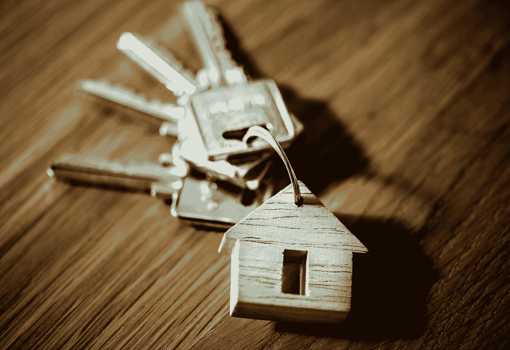

# 人工智能将为房屋所有权开创一个新时代

> 原文：<https://medium.datadriveninvestor.com/artificial-intelligence-will-usher-a-new-era-for-homeownership-697713687384?source=collection_archive---------27----------------------->

By [rawpixel](https://unsplash.com/@rawpixel?utm_source=medium&utm_medium=referral) on [Unsplash](https://unsplash.com?utm_source=medium&utm_medium=referral)

拥有住房是一种渴望。不是因为它给我们提供了一个栖身之所，而是因为它常常意味着财富、稳定和收入。“土地所有者”的地位总是胜过所有其他的丧失资格。直到一个世纪前，妇女才被赋予投票权，但是“拥有土地”的妇女可以例外。然而，今天英国和美国的房屋拥有率正在崩溃。在过去的 20 年里，在英国拥有住房的机会已经减少了一半以上。几代人之间的财富不平等正在扩大。“代租”已经在大多数大都市扎根，他们的收入主要被分配给房租、优步和学生贷款。

2008 年，在次贷危机之后，许多独户住宅被遗弃在美国市场上。它们的价值缩水，银行面临新的问题，即如何为作为其承销抵押品的资产找到流动性。这一机遇催生了一个新的资产类别——单人家庭租赁单元。像喜达屋、黑石和殖民地资本这样的机构投资者分拆出他们的新子公司，并收购了大量的投资组合，这些投资组合被出租给那些不再拥有这些房屋的家庭。这些公司创造了稳定的租金收入流，然后上市，为一种资产类别提供了一种流动性形式，否则这种资产类别就会成为银行资产负债表上的非流动性负债。他们的论点并不独特。这是投机取巧。房地产最大的问题是流动性差，价格贵。资产由其所有权计划的物理边界定义，然后根据这些边界内的位置、砖块和收入进行估价。房地产是一种与通胀挂钩的资产类别。任何人为操纵其价值的行为都会动摇其利益的基础。

> 试图让房地产“买得起”意味着寻找解决其“非流动性”和作为实物资产的定义的方法。房地产大而固定。这就是问题所在。

# 投资资产

房地产投资信托基金的合法化使得将房地产聚集成一个产生收入的资产类别制度化了。作为 1960 年雪茄消费税扩展的一部分，艾森豪威尔总统根据“房地产投资信托法案”下令建立房地产投资信托基金。它为投资者提供了一个机会，以一种节税的方式投资于多样化的产生收入的房地产。这是实物资产交换民主化的开始。为了获得资格，房地产投资信托基金需要以股息的形式分配 90%的收益。超过 75%的收入来自房地产相关活动。1965 年，第一只房地产投资信托基金上市。房地产投资信托行业的资产估值从 10 亿美元增加到 1975 年的 200 多亿美元。“抵押贷款房地产投资信托”的出现现在允许股票和债务部分在公开市场上交易，允许从房地产的收入流中受益，而无需实际持有实物资产。到 20 世纪 90 年代，房地产投资信托基金结构已成为持有任何房地产创收资产的首选模式。世界其他地方也纷纷效仿，将房地产投资信托合法化。1992 年，比尔·克林顿的综合预算法案允许养老金计划投资房地产投资信托基金。通过允许养老基金参与房地产投资信托基金，房地产资产现在被允许纳入普通人的退休投资组合。你可能没有房产，但你的养老金计划中有一部分是房地产收益。这个概念，即一个人可以拥有房地产的一部分回报，而不拥有实物资产，继续发展到 2000 年代。低成本投资选择以 REIT ETFs 的形式出现。ETF 或交易所交易基金是一篮子资产，复制了所有权和回报指数。对于大多数散户投资者来说，这是一种规模较小的低成本管理工具。通过将实物资产转化为可交易和可交换的资产，房地产投资信托基金在其短短 50 年的生命周期中发挥了巨大作用，迈出了让所有人都能获得房地产的一步。2016 年，房地产投资信托基金的股票市值超过 1 万亿美元。房地产机构化的趋势不会有任何进展。事实上，它只会变得更大。但是这种规模带来了额外的挑战。

# 运营资产

“管理家庭”是我们大多数人每天都会经历的事情。传统上，妇女的工作是确保所有的家务活都有人打理。电费单和抵押书被打开，放在丈夫面前写支票。花园被修剪过了，房子总是温暖地迎接放学的孩子和下班的丈夫。传统的女性实际上是一个财产管理者。这个人仍然决定何时再融资，何时买入或卖出，所以他是资产经理。现在想象一下那对夫妇有 50，000 套房子。房地产投资信托基金的运作正是如此。大房东不仅仅是负责在每个月收的房租上数零。他们还需要执行多项任务。他们的角色包括交易、维护、管理、租赁、会计、广告、安全、看门、建筑，更不用说股权管理。然而，收取的租金或资产的“市场价值”并不与这些业务的成本挂钩。它是由市场供求力量驱动的。

为了使房地产成为一种可交易的资产，它需要与其经营脱钩，并转化为一种可交易的商品。1991 年美国房地产崩盘是房地产投资信托基金自 30 年前成立以来首次面临真正的低迷。在私人房地产价格下跌之前，房地产投资信托基金的股票价格已经下跌，同样，在实际资产价值发生任何变化之前，股票价格已经出现回升。市场力量完全独立于资产组合的运作方式而定价。对“效率”的需求不仅仅是基于做好工作，而是围绕着将支出与市场交易力量脱钩的概念。人工智能对房地产至关重要的观点就是基于这一理论。人工智能自动化交易、维护、管理、租赁、会计、营销和股权管理的潜力，允许资产的运营实际上是可预测的和静态的。人工智能的潜力允许创造可扩展和可预测的交易成本。

如果今天整个世界决定将世界上所有的房地产投入到一个大资金池中，并接受资金池中的同等部分作为证券化资产，它仍然需要有人来管理这个全球投资组合。和每一个共管公寓的业主一样，你的投资将受困于不可预测的、不断增加的管理多项资产的成本。将房地产转化为流动资产类别的最大障碍是其管理危机，唯一可能的解决方案是投资人工智能。

# 新资产

20 世纪上半叶，大多数大庄园被分割成较小的部分。这些大房子慢慢被改造成了公寓。今天，这些公寓正被改造成房间和宿舍。Airbnb & WeWork 等新入局者造成的破坏表明了市场对流动性和可交易资产类别的需求。虽然共同工作和共享生活的理念代表了对用户灵活性的需求，但它也与房地产的所有权结构有关。在全球范围内，房地产所有权可以分为“机构所有权”或“阶层所有权”。机构所有人是拥有整个建筑或地产的房东，其“所有权”范围内的一切都是房东的责任。产生的收入归他们所有，责任和费用也归他们所有。“阶层”所有者代表由法律实体组成的投资组合，这些法律实体可能没有物理连接。当投资者购买共管公寓的房产时，他们购买的是在公寓或房子的墙壁范围内拥有物理空间的权利。阶层所有权模式的管理通常会导致“聚合者”的诞生，这些“聚合者”会帮助扩大运营规模。今天，这些聚合者是代理人、财产和资产管理人。在阶层所有权中，你甚至可以让多个利益相关者在土地租赁、街区所有者和公寓所有者之间进行协调。对于要被证券化为可交易部分的房地产，它需要是一种没有任何泄漏的稳定资产。传统的长期租赁代表了这种稳定性。这种有保证的收入流降低了市场风险，租赁条款通常也减轻了经营风险。但是，更短的租期和灵活性的出现要求定价是实时的和优化的，但同时降低(如果不能保持稳定的话)这样做的运营成本。

房地产的未来将在很大程度上取决于我们今天对自动化的投资。在一个可以使用人工智能的可扩展性来管理资产，并通过工厂驱动的自动化流程来构建资产的世界里，房地产交易将不再需要租赁和所有权的分离。利用技术创造虚拟代币和市场，可以为该资产类别创造一种新的证券化形式。当人们谈论房地产对人工智能和区块链的需求时，他们通常指的是这个世界的可能性，即房地产所有权和收入流变得对所有人都很容易。新的资产类别将是交易所交易的代币，可能通过区块链技术进行认证。这些代币代表你的房间或者你居住的房间的四分之一，此外还有纽约的一个小办公室。为获得在房间里停放床的权利而支付的“租金”或“收入”将与你的房地产权挂钩。当你收拾好宿舍搬到你第一个家时，你会交换你的代币并购买新的代币来升级到你的第一个单间公寓，这种交换会产生收益或损失。

通过拥抱人工智能及其使房地产流动和可获得的能力，我们可以给房屋所有权赋予新的定义，并创造新一代的房地产证券化。

# 关于作者

Tripty Arya 是 Travtus 的创始人，trav tus 是一种人工智能驱动的物业管理解决方案。Travtus 是“Adam”的家，这是一个自动机器人，可以与所有利益相关者通话、发短信和聊天，以协调互动。她在康奈尔大学接受过建筑师培训，并拥有哥伦比亚大学的 MBA 学位。在她 10 年的房地产行业经验中，Tripty 在孟买开发了住宅项目，在新加坡经营了一家建筑公司，然后将伦敦作为她追求技术的大本营。