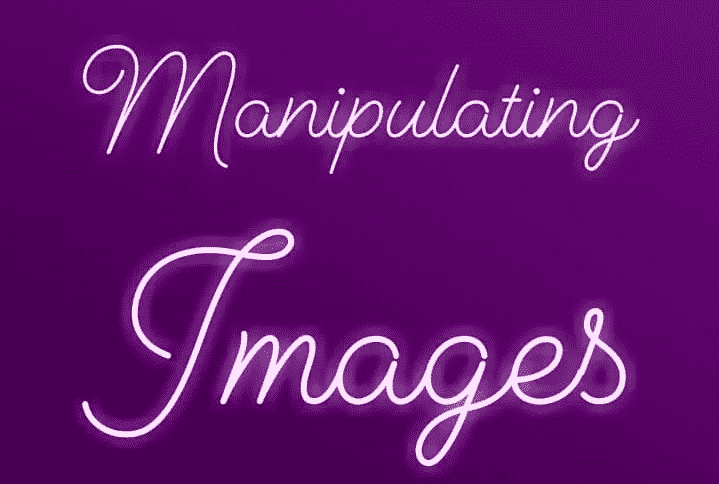

# 自动化枯燥的东西:处理图像

> 原文：<https://medium.datadriveninvestor.com/automate-the-boring-stuff-manipulating-images-33d67c70427d?source=collection_archive---------23----------------------->



你一定用过各种图像/照片编辑工具或应用程序或软件，用更好的方式润色图像总是很有趣的。假设你需要编辑数百张图片，为此，你必须一张一张地编辑它们，这将变得既费时又无聊。但是在 Python 中， [**枕**](https://pillow.readthedocs.io/en/5.3.x/) 可以让你轻松完成这样的任务。

Pillow 是一个用于与图像文件交互的第三方 Python 模块。该模块有几个功能，可以很容易地裁剪，调整大小和编辑图像的内容。通过此模块，您可以节省编辑图像数量的时间。

计算机程序通常将图像中的颜色表示为 RGBA 值。
RGBA 值是一组指定颜色中红色、绿色、
蓝色和 alpha(或透明度)数量的数字。这些组件值
中的每一个都是从 0(完全没有)到 255(最大值)的整数。

在 Pillow 中，RGBA 值由四个整数值的元组表示。例如，红色用(255，0，0，255)表示。这种颜色有最大量的红色，没有绿色或蓝色，最大的阿尔法值，这意味着它是完全不透明的。

> Pillow 提供了 ImageColor.getcolor()函数，这样您就不必为想要使用的颜色记忆 RGBA 值。

要从 [Pillow](https://pillow.readthedocs.io/en/5.3.x/) 导入功能，需要先安装，建议安装在虚拟环境中:

```
pip install pillow
```

在您的交互式 shell 中输入以下内容:

```
>>> from PIL import ImageColor 
>>> ImageColor.getcolor('red', 'RGBA') 
(255, 0, 0, 255)
```

它给出了你传递给它的颜色的 RGBA 值。

让我们通过一个项目 ***定制座位卡，让您更加了解我们可以用枕头做什么。*** 你也会在一定程度上知道如何使用枕头。

# 项目:定制座位卡

描述:使用枕头模块为您的客人创建定制座位卡的图像。对于在 http://nostarch.com/automatestuff/,[的参考资料中的 guests.txt 文件中列出的每个客人，生成一个带有客人姓名和一些华丽装饰的图像文件。在 http://nostarch.com/automatestuff/](http://nostarch.com/automatestuff/,)[的参考资料中有一个公共域花卉图像。
为确保每张座位卡的尺寸相同，在邀请函图像的边缘添加一个黑色矩形
，这样当图像打印出来时，
将会有一个切割指南。Pillow 生成的 PNG 文件被设置为每英寸 72 像素，所以一个 4×5 英寸的显卡需要一个 288×360 像素的
图像。](https://nostarch.com/automatestuff/)

## 步骤包括:

**第一步**:首先你需要制作一张 288×360 像素的卡片，在卡片上粘贴花的图像。

```
import os 
from PIL import Image, ImageDraw, ImageFont #To create a new image 
card = Image.new('RGBA', (360, 288), 'white') #To open an existing image 
flower = Image.open('cropFlower.jpg') #Copy image 
flowerCopy = flower.copy() #Pasting flower image on card 
card.paste(flowerCopy, (0,110))
```

**第二步:**现在你将创建另一张黑卡，并将之前的一张粘贴到上面，然后用保存。' png '扩展名:

```
card2 = Image.new('RGBA', (364, 392), 'black') 
card2.paste(card, (2,2)) #Saving the image with .png extension 
card2.save('card2.png')
```

**第三步:**创建一个在卡片上写名字的函数:

```
#creating a function  
def creating_card(guestsnames):  
    ceatingCard = Image.open('card2.png')  
#Adding font   
    font = ImageFont.truetype('coolvetica rg.ttf', 15)  
#Drawing Text on Image  
    draw  = ImageDraw.Draw(ceatingCard)  
    draw.text((120, 100), guestsnames, fill = 'blue', font = font)
    ceatingCard.save(guestsnames + '.png')
```

**步骤 4:** 遍历猜测列表，并对每个名字调用函数:

```
with open('guests.txt') as g:  
    guests = g.readlines()
for guest in guests:
    creating_card(guest)
```

你会在[https://nostarch.com/automatestuff/](https://nostarch.com/automatestuff/)上找到名为' *guests.txt '的宾客名单。*

在上面的项目中，你可以看到我们如何使用枕头的不同功能来操作图像。您可以使用一些函数对图像做任何您想做的事情，例如:

*   RGBA 值
*   。大小
*   。新()
*   。裁剪()
*   。复制()
*   。粘贴()
*   。保存()
*   。旋转()

因此，开始以你的创造性方式编辑图像，享受吧。

要了解更多关于操作图像的信息，你可以阅读“[用 python 自动化枯燥的东西](https://automatetheboringstuff.com/chapter7/)”。在那里，你会发现更多关于操作图像的细节和一些相关的项目。为了使博客更具关联性，本博客中使用的例子取自书中。

也可以关注我的 [Github](https://github.com/bansalshivam) 资源库[https://Github . com/bansalshivam/Projects-Chapter-17-Manipulating-Images-Automate-the-boring-stuff](https://github.com/bansalshivam/Projects-Chapter-17-Manipulating-Images--Automate-the-boring-stuff)针对本章给出的不同项目，

关于正则表达式的视频教程或者学习本书的相同主题，可以去[Udemy.com](https://www.udemy.com/)。Udemy.com上的在线课程[用 Python 编程自动化枯燥的东西](https://www.udemy.com/automate/?couponCode=FOR_LIKE_10_BUCKS)涵盖了这本书的大部分内容。如果你更喜欢学习编程的视频格式，你可以使用折扣代码 [FOR_LIKE_10_BUCKS](https://www.udemy.com/automate/?couponCode=FOR_LIKE_10_BUCKS) 获得 80%的折扣。您可以终身访问课程内容，并可以在课程论坛上提出问题。