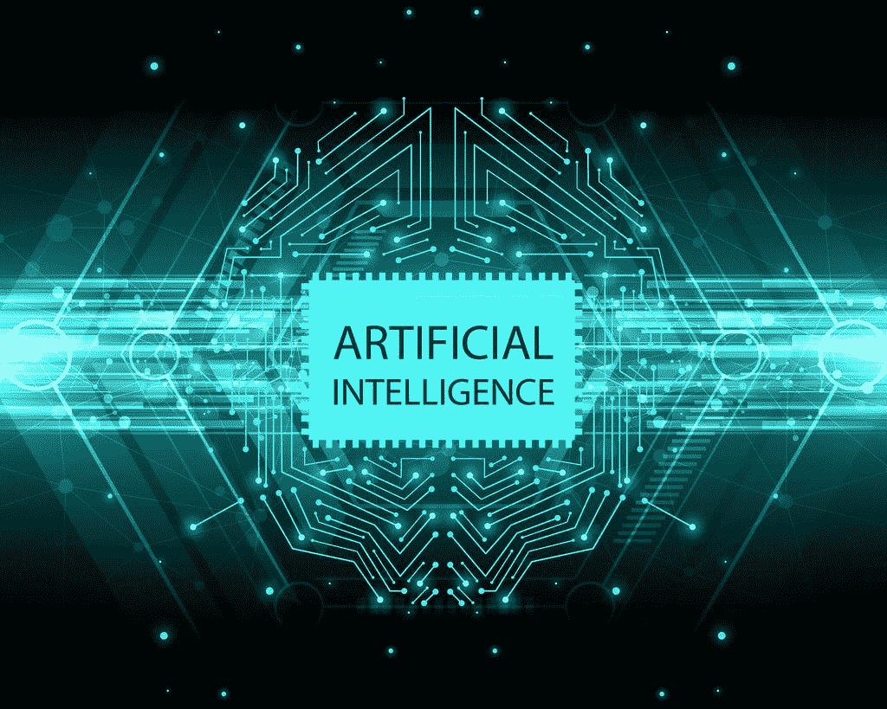

# AutoML:机遇与挑战

> 原文：<https://medium.datadriveninvestor.com/automl-3803e315d5cd?source=collection_archive---------15----------------------->

Image source: [www.vpnsrus.com](http://www.vpnsrus.com))

我在机器学习(ML)方面的工作向我展示了 AutoML 可以多么容易地扰乱市场并推动经济和社会转型。AutoML 本质上是自动化的 ML。它是一个 ML 框架，接受原始数据，运行各种算法(K-Means 聚类、PCA、时间序列等)。)在数据中寻找模式并处理数据，将数据拆分成折叠，然后构建不同 ML 模型(DRF、GLM、GBM、ANN、SVM 等)的数百到数千次迭代。)并运行自动超参数搜索以优化模型 CV 性能。由于其自动化的数据处理，它与它接收的数据无关，因此可以在任何领域的任何数据集上运行。

AutoML 会有很大的影响。既然可以在任何地方使用，很快就会无处不在。目前的计算能力允许它被快速有效地使用。随着并行处理能力随着快速 GPU 改进和量子计算而爆炸，ML 算法中使用的线性代数运算变得指数级更快；AutoML 将变得更加可行。

AutoML 也是真正民主的，因此易于采用和应用。使用它不需要资质或数据科学专业知识。它的用户只需输入一个数据集就能看到结果。它甚至可以使用 LIME 框架独立分析结果，从而深入了解决策和重要特征或关系。随着数据产生更多的价值，正如人们可以看到的谷歌和脸书的市场主导地位，AutoML 可以接管数据分析和解决方案的实施，其成本只是雇用一名数据科学家的一小部分，特别是在短缺的时候。

我们已经看到了价值的产生。在商业中，AutoML 可以在市场分析和客户细分中发挥关键作用。它已经被用来创造颠覆性的产品。在金融服务业，我看到越来越多的人可以获得信贷和保险，因为 ML fintech 模型可以为更多人提供比保险商更有效的利率。随着政府产生/访问更多的数据，政府在自动使用有效的宏观资源分配方面存在巨大的潜力。集成 AutoML 以更低的成本和风险交付更高质量的产品。因此，它的采用可以带来巨大的经济和社会变化。

它的主要优势是能够分析大型数据集，并在更短的时间内做出比人更好的决策。如果人类试图在准确性和时间上竞争，直觉将发挥作用，因为在一小时左右的时间内分析数百万行数据是不可能的。因此，人们会做出假设，偏见也会随之而来。因此，AutoML 的一个重要优势是做出公正的决策。

唉，偏见总有办法。一个数据集就是 AutoML 的整个宇宙；除此之外，它一无所知，因此在最初的数据生成、训练数据选择和最终结果分析中，软件开发人员和环境会产生偏见。对于 AutoML，偏差将导致次优性能。例如，如果一个基于倾斜数据集的贷款发放模型发现，在一个特定地区，人们平均有 80%的可能性还清贷款，但只有 50%的可能性还清贷款，那么这个地区的人们可能会拒绝向本该还清贷款的人发放贷款。在这里，借款人和贷款人都因偏见而遭受损失，投资的任何正外部性都丧失了。

偏见也会对 AutoML 的采用造成重大障碍。以微软的 Twitter 聊天机器人 Tay 为例，由于众包数据中的偏见，它变成了种族主义者。结果，众包学习和产品改进的潜力被关闭了。亚马逊的招聘机器人也发生了同样的事情，它使招聘更有效率，更不容易出现人类偏见，最终变得性别歧视，因为它处理的数据是这么教它的。正如奇点大学和 EXO 大学的 Salim Ismail 概述的那样，进化使我们天生更容易对负面刺激做出反应，因此每当算法出错，市场或立法力量就会导致项目关闭，以免公司失去商誉。因此，由于偏置，损失了大量的正电势增益。

因此，可以采取各种措施来消除偏差。软件工程师必须有坚实的道德基础，这样他们才能在模型构建过程中考虑他们的选择的含义，而不仅仅是模型性能。开发环境中的多样性也会产生制衡。更多的视角会产生更具包容性的算法。

需要为公司和个人开发者建立公平的激励机制。规范机器伦理和发展需要科技立法。市场和监管机构应该对机器如何做出决策进行更多审查，并应该更严厉地惩罚违规行为。

鉴于 AutoML 仍然是一项新兴技术，必须对机器伦理及其实现背后的理论进行更多的研究，并更好地理解 ML 模型如何做出决策/推理及其影响。