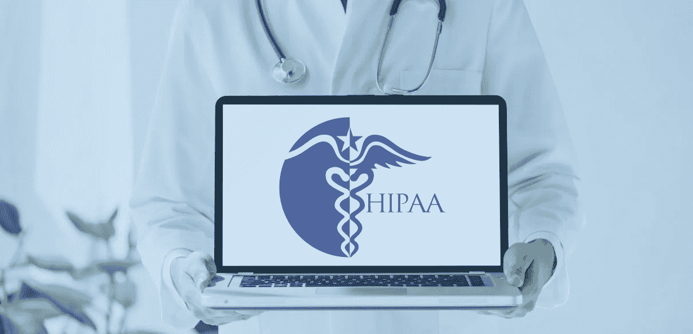

# Azure 和 HIPAA 合规性:您需要知道什么？

> 原文：<https://medium.datadriveninvestor.com/azure-and-hipaa-compliance-what-you-need-to-know-14be8a199c59?source=collection_archive---------6----------------------->

Azure and HIPAA Compliance

健康保险可携带性和责任法案(HIPAA)是 1996 年推出的一项具有里程碑意义的美国立法，旨在保护患者信息和传输的安全。所涵盖的实体(CE)和业务伙伴(BA)应遵守 HIPAA 法规。医疗保健提供商、医疗保险计划和医疗保健票据交换所属于 ce 的管辖范围，而业务伙伴可以是为所涵盖的实体提供第三方服务和活动的个人或实体，这涉及访问受保护的健康信息(PHI)。根据美国法律，由承保实体创建、收集或传输并与个人身份信息相关联的任何有关健康状况、医疗保健提供或医疗保健服务支付的信息均被视为 PHI。

## **HIPAA 监管规则**

医疗保健组织一直在采用云来降低成本和提高护理质量。虽然采用云对于医疗保健实体来说是至关重要的一步，但遵守 HIPAA 法规也同样重要。HIPAA 确立了安全处理 PHI 的标准，确保了护理人员和消费者的宝贵利益。

 [## 大笔资金和尖端技术:人工智能/人工智能投资将如何革新医疗保健…

### 在过去几年人工智能(AI)和机器学习(ML)的显著发展中…

www.datadriveninvestor.com](https://www.datadriveninvestor.com/2018/03/22/big-money-and-cutting-edge-technology-how-investment-in-ai-ml-will-revolutionize-the-healthcare-industry/) 

HIPAA 法规分为几个主要的标准或规则，例如:

**1。隐私规则:**作为 HIPAA 法规的主要支柱之一，这一复杂的规则为保护患者的医疗记录和 PHI 制定了国家标准，并定义了授权使用和披露。这项规则还赋予个人查阅其健康记录和要求改正的权利。有了这一权利，个人还可以获得关于何时以及如何与他人共享其医疗记录和数据的记录。

**2。安全规则:**该 HIPAA 规则规定了如何保护电子病历或 e-PHI 的机密性、完整性和可用性。安全法主要描述了相关实体和业务伙伴需要实施的安全措施，以保护 e-PHI 免受任何类型的预期威胁或危害。安全规则中定义了三个级别的保护措施——管理保护措施、技术保护措施和物理保护措施。

1.  *行政保障*被定义为管理 HIPAA 安全合规团队的行政措施、政策和程序。它主要由九个标准组成——安全管理流程、分配的安全责任、员工安全、信息访问管理、安全意识和培训、安全事件程序、应急计划、评估、业务合作合同和其他安排。
2.  *技术保障*定义了电子健康信息安全加密和认证的技术方面和程序的使用。它主要由五个标准组成——访问控制、审计控制、完整性、认证和传输安全。
3.  *物理防护*处理物理措施、政策和程序，以保护组织设施内存储 PHI 的设施和设备免受环境危害、未经授权的入侵、盗窃等。它由四个标准组成—设施访问控制、工作站使用、设备和媒体控制。

**3。执行规则:**顾名思义，该规则详细说明了违反 HIPAA 的合规、调查、听证和处罚。任何未能确保受保护健康信息的隐私和安全的相关实体将因违反 HIPAA 合规性和管理简化要求而被处以高额罚款和处罚。

**4。违反通知规则:**该规则要求 HIPAA 覆盖的实体和业务伙伴在违反 PHI 后通知个人受害者、媒体和监管机构。无论何时出现危及 PHI 安全或隐私的不允许使用或披露，都被视为违规。在这种情况下，CE 必须在发现违规后 60 天内提供通知。

## **违反 HIPAA 的行为**

美国卫生与公众服务部(HHS)民权办公室(OCR)负责监督 HIPAA 合规性。违反 HIPAA 法规可能会导致重罚和罚款。对美国最大的保险公司 Anthem 提起的诉讼就是一个很好的例子。被认为是历史上最大的医疗保健数据泄露事件，这次攻击泄露了 7900 万患者的个人健康信息。该公司不得不支付创纪录的 1.15 亿美元来解决患者提起的诉讼。根据 OCR 的数据，仅在 2019 年，HHS 就从医疗保健组织和保险公司那里收集了 2870 万美元用于 HIPAA 执法。因此，如果你正在参与或计划开发一个网站或移动应用程序来存储、记录或传递受保护的健康信息，那么学习并遵守 HIPAA 法规是至关重要的。

## **如何让一个 App 或网站符合 HIPAA？**

每当您在网站上或通过移动应用程序处理任何敏感的医疗信息时，保证 HIPAA 合规性至关重要。希望利用[云计算](https://www.logiticks.com/azure-app-development/)或移动应用技术的医疗保健组织应确保实施适当的隐私和安全保护措施，以符合 HIPAA 法规。一个移动健康应用程序或网站必须有一个清晰定义的架构，在开发的每个阶段进行详细周到的审查也是必不可少的。强烈建议寻求合格的安全专家的专业知识，对您的网站或移动应用程序的安全要求和标准进行全面审核。审计期间发现的风险和漏洞需要尽早缓解和修复。另一个关键领域是 PHI 的传输，加密在其中扮演着重要角色。数据在存储和传输时必须经过验证和加密。确保通过在不活动后强制重新认证和删除推送通知来加强应用环境。

**Azure HIPAA 兼容吗？**

如果所涵盖的实体计划使用像 Azure 这样的云服务来构建、迁移、管理和支持他们的业务应用程序，那么事先与微软签订业务合作协议(BAA)是很重要的。这使得 Azure HIPAA 兼容吗？不幸的是，没有。尽管 Azure 负责底层平台的安全，但这并不意味着它真正符合 HIPAA。事实上，HIPAA 合规性不是关于云平台和特性，而是关于应用程序或用户如何使用云计算服务。Azure 的企业级功能可以以不同的方式使用，微软不对因滥用其服务而导致的 HIPAA 违规负责。根据 HIPAA 法规和安全标准配置 Azure 云服务是所涵盖实体的唯一责任。

**收尾**

最终，HIPAA 合规性可能看起来单调乏味且令人头疼，但解决 PHI 的隐私和安全问题有助于保护患者的敏感健康信息。确保网站或移动应用程序符合 HIPAA 标准需要投入大量精力和资金，但最终证明这是值得的。

*原载于*[*https://www.logiticks.com*](https://www.logiticks.com/blog/azure-and-hipaa-compliance-what-you-need-to-know/)*。*