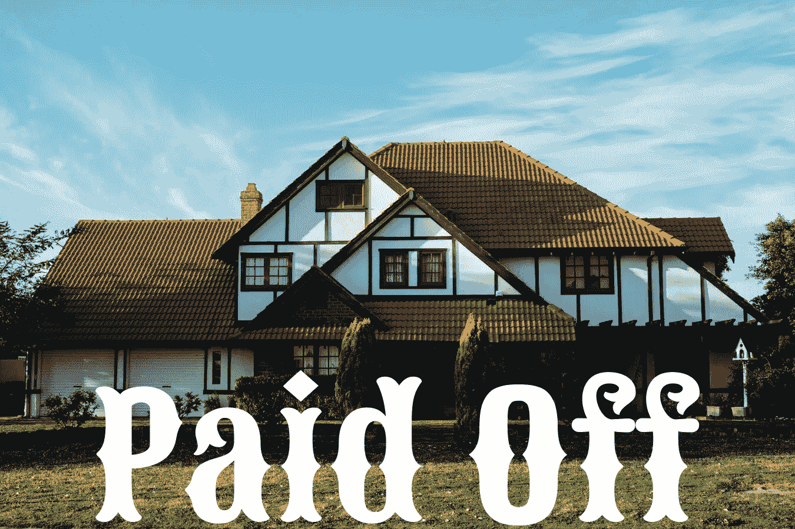

# 还清抵押贷款的好处以及你应该这样做的理由。

> 原文：<https://medium.datadriveninvestor.com/benefits-of-paying-off-your-mortgage-and-the-reasons-on-why-you-should-de13ba693d39?source=collection_archive---------16----------------------->

支付或不支付你的抵押贷款。这是个问题。

这是多年来许多金融专家争论的话题。关于什么是正确的事情，有许多想法和观点。答案可能不像看起来那么简单。

让我们来看看关于你是否应该拥有自己的房子的几个主要讨论点。

 [## 金融科技初创公司正在扰乱世界各地的银行业-数据驱动的投资者

### 传统的实体银行从未真正从金融危机后遭受的重大挫折中恢复过来…

www.datadriveninvestor.com](https://www.datadriveninvestor.com/2018/10/20/fintech-startups-are-disrupting-the-banking-industry-around-the-world/) 

# 还清抵押贷款的好处包括:

1.降低每月开支

2.降低整体债务

3.增加整体财富

4.退休准备

# 以下是偿还抵押贷款的一些缺点:

1.税务注销的减少

2.投资这笔钱可以获得更高的回报

3.在紧急情况下，房子不是流动资产

现在让我们来讨论一下这些都意味着什么，是否对你有益。

首先，考虑一些好处，包括显而易见的，比如通过降低每月开支来释放每月的现金流。住房成本可能高达一个人月收入的 40%，因此通过偿还抵押贷款，这可以减轻家庭的财务压力，并给你更多的资源进行投资或储蓄——从长远来看，这一举措可以为你带来更高的回报。

其次，它会减少你的整体债务。很多人一想到债务就只想到信用卡债务。他们认为，既然他们必须住在某个地方，有一种交通方式，这些费用就不是债务。他们错了！你欠别人的每一块钱，不管是银行的还是你爱的人的，都被认为是债务。因此，如果你拥有一栋房子，有汽车贷款，可能还有一些信用卡债务，你的债务实际上可能接近 20 万美元——40 万美元。这当然取决于你的时间和汽车花费的多少。现在想象一下，如果你去掉房屋成本，你的债务会大幅下降。所有这些都会对你的信用评级产生影响。

第三，拥有自己的房子也可以增加你的整体财富，并成为未来的一个伟大的储蓄。还清贷款的最明智的理由之一是你将节省的利息。一笔 250，000 美元的 30 年期贷款，利率为 4.5%，光利息就要花掉你 200，000 美元！这意味着当贷款全部还清时，你的房子实际上要花掉你 45 万美元。所以，你越早还清贷款，回报就越大。想象一下，如果我给你一台售价 1000 澳元的新 iPad，并告诉你在未来几年内你还得多付 1000 澳元。你不会买的。但如果我告诉你，你可以提前还清，只需多付 100 英镑，你就会欣然接受这个机会。你应该这样看待你的家。为什么要花 45 万美元买一栋 25 万美元的房子。这不仅没有意义，而且谁又能说你 30 年后卖掉房子会赚那么多呢？

最后，还清你的抵押贷款也有助于退休，降低你每月的家庭开支，并进一步延长你的退休金。

作为一个还有几个月就要还清房贷的人，最令人满意的理由是能够拥有自己的房子。只有很少一部分美国人真正拥有自己的房子，并且伴随而来的成就感是无法定义的。

当你看到一些不利因素时，原因并不像有利因素那么明显。

你可能会问，偿还巨额债务怎么会是个坏主意？

**还清我们的抵押贷款不正是我们被教导要为之奋斗一生的事情吗？**

然而，还清你的抵押贷款并不总是最好的主意。投资你用来偿还债务的钱“可以”用来投资，给你一个更好的回报率，比你从抵押贷款中省下的钱赚得更多。记住，因为你不能预测市场，这不是一个保证。如果你的抵押贷款利率是 4.5%，你偿还抵押贷款的回报率只有 4.5%。但投资的平均年化回报率更接近 7%至 8%，明显更高。

另一个问题是你的房子不是流动资产。这意味着如果你在紧急情况下需要钱，你的钱被套牢在你的家里，而不是一项可以迅速获得的投资。有了这些知识，你应该确保你有足够的应急资金，然后再考虑还清你的抵押贷款。抵押贷款利息也有税收减免，但随着新税法将标准扣除额增加一倍，声称利息对大多数人来说很可能是过去的事情。

说到“该不该”这个问题，没有对错之分。这很可能归结为个人偏好和对你来说什么是重要的。

对我个人来说，拥有一个家是我多年来一直努力的个人目标。在确保我最大化我的 401(k)后，我有一个 6 个月的流动应急基金，我能够继续支付更多的贷款本金。这将允许我在 50 岁之前自由地拥有自己的房子。

实现目标的满足感是你在其他任何地方都得不到的，所以无论你的目标是拥有自己的房子还是增加你的财富，记住保持专注和专注，你会实现你的愿望，因为没有正确或错误的答案，而是只有对你个人情况最好的答案。