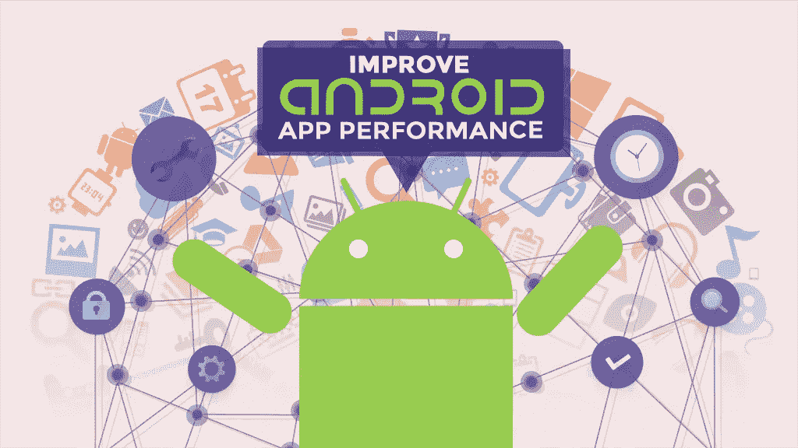

# 开发人员的最佳性能提示

> 原文：<https://medium.datadriveninvestor.com/best-performance-tips-for-developers-9c6571268b37?source=collection_archive---------12----------------------->

[](http://www.track.datadriveninvestor.com/1B9E)

[Photo by blog.cyscorpions](http://blog.cyscorpions.com/post/143573546204/tips-to-improve-android-appperformance)

选择正确的算法和数据结构应该始终是我们的首要任务，但这超出了我们在这里讨论的范围。我们应该将本文中的技巧作为通用的编码实践，您可以将这些实践融入到您的习惯中，以获得通用的代码效率。

写高效代码有两个基本规则:

*   ***不做自己不需要做的工作。***
*   ***能避免就不要分配内存。***

在微优化 Android 应用程序时，我们总是面临的最棘手的问题之一是，我们的应用程序肯定会在多种类型的硬件上运行。不同版本的虚拟机在不同的处理器上以不同的速度运行(即 android N、O、P)。通常情况下，你甚至不能简单地说“器件 P 比器件 Q 快/慢 F 倍”，然后将结果从一个器件扩展到其他器件。

特别是，仿真器上的测量很难告诉您任何设备上的性能。有和没有 JIT 的设备之间也有巨大的差异:对于有 JIT 的设备来说最好的代码并不总是对于没有 JIT 的设备来说最好的代码。

为了确保您的应用程序在各种设备上运行良好，请确保您的代码在所有级别上都是高效的，并积极优化您的性能。

## 以下是要讨论的 10 个要点


Photo by [rawpixel](https://unsplash.com/@rawpixel?utm_source=medium&utm_medium=referral) on [Unsplash](https://unsplash.com?utm_source=medium&utm_medium=referral)

*♣*T12*避免创建不必要的对象*t15】

***♣喜欢静态胜过虚拟***

***♣用静终为常数***

***♣使用增强的 for 循环语法***

***♣考虑用私有内部类*** 包代替私有访问

***♣避免使用浮点***

***♣知道并使用图书馆***

***♣谨慎地使用原生方法***

***♣表演神话***

***♣总测量***

## *1)* ***避免创建不必要的对象***


Photo by [Carli Jeen](https://unsplash.com/@carlijeen?utm_source=medium&utm_medium=referral) on [Unsplash](https://unsplash.com?utm_source=medium&utm_medium=referral)

众所周知，对象创建从来都不是免费的。具有针对临时对象的按线程分配池的分代式垃圾收集器可以降低分配成本，但是分配内存总是比不分配内存更昂贵。

随着我们在应用程序中分配更多的对象，我们将强制进行定期的垃圾收集，从而在用户体验中造成一些“小问题”。Android 2.3 中引入的并发垃圾收集器很有帮助，但是不必要的工作应该避免。

因此，我们应该避免创建不需要的对象实例。有些 ***的例子*** ***的东西可以帮助*** p:

*   如果有一个方法返回一个字符串，并且您知道它的结果将始终追加到`StringBuffer`中，那么更改您的签名和实现，以便函数直接进行追加，而不是创建一个短暂的临时对象。
*   从一组输入数据中提取字符串时，请尝试返回原始数据的子字符串，而不是创建副本。您将创建一个新的`[String](https://developer.android.com/reference/java/lang/String.html)`对象，但它将与数据共享`char[]`。(代价是，如果你只使用了原始输入的一小部分，那么沿着这条路走下去，它就会一直存在内存中。)

一个更激进的想法是将多维数组分割为并行的单个一维数组:

*   `int`对象的数组比`Integer`对象的数组好得多，但这也可以推广到这样一个事实，即两个并行的 int 数组也比`(int,int)`对象的数组高效得多**。这同样适用于基元类型的任何组合。**
*   如果我们需要实现一个容器来存储`(Foo,Bar)`对象的元组，请记住两个并行的`Foo[]`和`Bar[]`数组通常比单个自定义`(Foo,Bar)`对象的数组好得多。(当然，这种情况的例外是当您正在设计一个 API 以供其他代码访问时。在这些情况下，为了实现良好的 API 设计，通常对速度做一个小的折衷会更好。但在您自己的内部代码中，您应该尽量提高效率。

一般来说，尽量避免创建短期的临时对象。创建的对象越少，意味着垃圾回收的频率越低，这将直接影响用户体验。

# 2)更喜欢静态而不是虚拟

如果我们不需要访问一个对象的字段，那么让你的方法成为静态的。调用速度将提高 20%-30%。这也是很好的做法，因为我们可以从方法签名中看出，调用方法不能更改对象的状态。

# 3)使用静态 final 作为常数

例如，在类的顶部考虑以下声明:

```
static int intVal = 369;
static String strVal = "Hello, Prags!";
```

编译器生成一个名为`<clinit>`的类初始化方法，在类第一次被使用时执行。该方法将值 42 存储到`intVal`中，并从 classfile 字符串常量表中为`strVal`提取一个引用。当以后引用这些值时，可以通过字段查找来访问它们。

我们可以用“ **final** ”关键字来改善问题:

```
static final int intVal = 369;
static final String strVal = "Hello, Prags!";
```

该类不再需要一个`<clinit>`方法，因为常量被放入 dex 文件的静态字段初始化器中。引用`intVal`的代码将直接使用整数值 369，对`strVal`的访问将使用相对便宜的“字符串常量”指令，而不是字段查找。

这种优化只适用于原始类型和`[**String**](https://docs.oracle.com/javase/9/docs/api/java/lang/String.html)`常量，不适用于任意引用类型。尽管如此，尽可能声明常量`[**static**](https://docs.oracle.com/javase/tutorial/java/javaOO/classvars.html)[**final**](https://docs.oracle.com/javase/tutorial/java/IandI/final.html)`是个好习惯。

# 4)使用增强的 for 循环语法

增强的`for`循环(有时也称为“for-each”循环)可以用于实现`[Iterable](https://docs.oracle.com/javase/9/docs/api/java/lang/Iterable.html)`接口的集合和数组。对于集合，分配一个迭代器对`hasNext()`和`next()`进行接口调用。使用`[ArrayList](https://docs.oracle.com/javase/9/docs/api/java/util/ArrayList.html)`，手写的计数循环大约快 3 倍(有或没有 JIT)，但是对于其他集合，增强的 for 循环语法将完全等同于显式迭代器的使用。

遍历数组有几种替代方法:

**alpha()** 最慢，因为 JIT 还不能优化通过循环的每次迭代获得数组长度的开销。

**甜菜()**更快。它将所有东西都提取到局部变量中，*避免查找*。只有数组长度提供了性能优势。

**gama()** 对于没有 JIT 的设备来说是最快的，对于有 JIT 的设备来说与 **one()** 没有区别。它使用 Java 编程语言 1.5 版中引入的增强 for 循环语法。

因此，默认情况下应该使用增强的`for`循环，但是对于性能关键的`[ArrayList](https://docs.oracle.com/javase/9/docs/api/java/util/ArrayList.html)`迭代，应该考虑手写的计数循环

# 5)考虑用包代替私有内部类的私有访问

```
public class MyExample {
  public static void main(String[] args) {
    System.out.println("Hello Prags!");
  }
  private static class P {
    P(){}
  }
}
```

以上产生了以下*。类文件:

```
-rw-r--r--    1 michaelsafyan  staff   238 Feb 07 00:11 MyExample$P.class
-rw-r--r--    1 michaelsafyan  staff   474 Feb 07 00:11 MyExample.class
```

现在，如果我移动类文件，删除`private`修饰符，并重新编译，我得到:

```
-rw-r--r--    1 michaelsafyan  staff   238 Feb 07 00:15 MyExample$P.class
 -rw-r--r--    1 michaelsafyan  staff   474 Feb 07 00:15 MyExample.class
```

如果我们查看关于类文件的 [VM 规范，我们会看到有一个固定大小的位字段用于指定访问修饰符，所以生成的文件大小相同并不奇怪。](http://java.sun.com/docs/books/jvms/second_edition/html/ClassFile.doc.html)

简而言之，我们的访问修饰符不会影响生成的字节码的大小(它也不应该有任何性能影响)。我们应该使用最有意义的访问修饰符。

我们还应该补充一点，如果我们将内部类从声明为`static`改为不声明为`static`，会有一点点不同，因为这意味着一个引用外部类的额外字段。这将比声明内部类`static`占用更多的内存，但是你会疯狂地为此进行优化(在有意义的地方使用`static`，并且在你需要它成为非静态的地方，使它成为非静态的，但是不要仅仅为了在这里或那里保存一个内存指针而扭曲你的设计)。

# 6)避免使用浮点


Photo by [James Orr](https://unsplash.com/@orrbarone?utm_source=medium&utm_medium=referral) on [Unsplash](https://unsplash.com?utm_source=medium&utm_medium=referral)

根据经验，在 Android 驱动的设备上，浮点运算大约比整数运算慢 2 倍。

在速度方面，在更现代的硬件上`float`和`double`没有区别。空间方面，`double`大了 2 倍。和台式机一样，假设空间不是问题，你应该更喜欢`double`而不是`float`。

此外，即使对于整数，一些处理器也有硬件乘法，但没有硬件除法。在这种情况下，整数除法和模数运算是在软件中执行的——如果您正在设计哈希表或进行大量数学运算，这是值得考虑的。

在金融领域，当我们说 1.23 美元时，实际上是 123 美分。永远，永远，永远用这些术语来计算，我们会没事的。有关更多信息，请参见:

*   马丁·福勒的[数量](http://martinfowler.com/ap2/quantity.html)和[金钱](http://www.martinfowler.com/eaaCatalog/money.html)模式
*   书籍 [*企业应用架构*](http://www.martinfowler.com/books.html#eaa) 模式和 [*分析模式*](http://www.martinfowler.com/books.html#ap)
*   维基百科上的[银行家的舍入](http://en.wikipedia.org/wiki/Banker%27s_rounding#Round_half_to_even)

# 7)了解并使用图书馆


Photo by [Jonathan Simcoe](https://unsplash.com/@jdsimcoe?utm_source=medium&utm_medium=referral) on [Unsplash](https://unsplash.com?utm_source=medium&utm_medium=referral)

除了喜欢库代码而不是滚动自己的库代码的所有常见原因之外，请记住，系统可以自由地用手工编码的汇编程序替换对库方法的调用，这可能比 JIT 为同等 Java 生成的最佳代码更好。这里典型的例子是`[String.indexOf()](https://docs.oracle.com/javase/9/docs/api/java/lang/String.html)`和相关的 API，Dalvik 用一个内联的内部函数替换了它们。类似地，`[System.arraycopy()](https://docs.oracle.com/javase/9/docs/api/java/lang/System.html)`方法比带有 JIT 的 Nexus One 上的手工编码循环快 9 倍。

**提示:**参见[乔希·布洛赫的](https://www.oracle.com/technetwork/articles/java/bloch-effective-08-qa-140880.html) [*有效 Java 的*](http://mishadoff.com/blog/effective-java/)

# 8)小心使用本地方法


Photo by [Markus Spiske](https://unsplash.com/@markusspiske?utm_source=medium&utm_medium=referral) on [Unsplash](https://unsplash.com?utm_source=medium&utm_medium=referral)

使用安卓 NDK 用本机代码开发你的应用并不一定比用 Java 语言编程更有效率。

当你有一个现有的原生代码库要移植到 Android 时，原生代码主要是有用的，而不是为了“加速”用 Java 语言编写的 Android 应用程序的部分。

如果你确实需要使用本地代码，你应该阅读我们的 [JNI 提示](https://developer.android.com/guide/practices/jni.html)。

**提示:**参见[乔希·布洛赫的](https://www.oracle.com/technetwork/articles/java/bloch-effective-08-qa-140880.html) [*有效 Java*](http://mishadoff.com/blog/effective-java/) *第 54 项*

# 9)性能神话


Photo by [NeONBRAND](https://unsplash.com/@neonbrand?utm_source=medium&utm_medium=referral) on [Unsplash](https://unsplash.com?utm_source=medium&utm_medium=referral)

在没有 JIT 的设备上，**事实是**通过一个精确类型的变量调用方法比通过一个接口调用方法要稍微有效一些。(*因此，举例来说，调用* `*HashMap map*` *上的方法比调用* `*Map map*` *上的方法要便宜，尽管在这两种情况下映射都是* `*HashMap*` *。*)并不是说这个是 **2x 慢**；实际差别更像是慢了 7%。此外，JIT 使得这两者实际上无法区分。

在没有 JIT 的设备上，缓存字段访问比重复访问字段快 20%。使用 JIT，字段访问的成本和本地访问的成本差不多，所以这不是一个值得的优化，除非你觉得它使你的代码更容易阅读。(***final、static 和 static final 字段也是如此。*** )

# 10)经常测量


Photo by [Fleur Treurniet](https://unsplash.com/@yer_a_wizard?utm_source=medium&utm_medium=referral) on [Unsplash](https://unsplash.com?utm_source=medium&utm_medium=referral)

在我们开始优化之前，请确保您有我们需要解决的问题。确保我们能够准确地衡量我们现有的绩效，否则我们将无法衡量我们尝试的替代方案的好处。

对于 android，我们可能还会发现 [Traceview](https://developer.android.com/tools/debugging/debugging-tracing.html) 对于分析很有用，但重要的是要认识到它目前禁用了 JIT，这可能会导致它错误地将时间分配给 JIT 可能能够赢回的代码。在根据 Traceview 数据的建议进行更改后，确保在没有 Traceview 的情况下运行时结果代码实际上运行得更快，这一点尤其重要。

要获得更多关于分析和调试我们的应用程序的帮助，我们应该查阅以下文档:

*   [使用 Traceview 和 dmtracedump 进行分析](https://developer.android.com/tools/debugging/debugging-tracing.html)
*   [使用 Systrace 分析用户界面性能](https://developer.android.com/tools/debugging/systrace.html)

[参考文档:——开发者 Android](https://developer.android.com/guide)