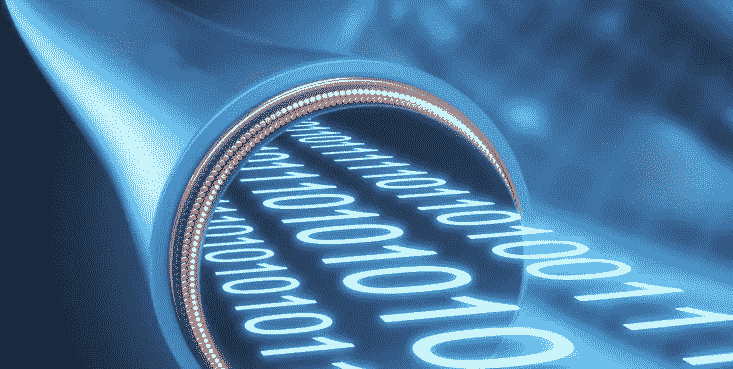

# 构建数据驱动的业务模型的最佳实践

> 原文：<https://medium.datadriveninvestor.com/best-practices-for-building-a-data-driven-business-model-f675085acec2?source=collection_archive---------50----------------------->

How Can You Make Money From Data?

“数据是新的石油”这句话被广泛使用，但是公司如何实际使用数据来创建新的创新商业模式呢？这篇文章探讨了数据被商业利用的一些方式，并解释了正在考虑开发数据驱动的商业模式的公司应该做些什么。

谷歌和脸书展示了互联网上流动的数据是如何被组织和重新打包以创造数十亿美元的价值的。虽然这些巨头自成一派，但越来越多的小型初创公司以及老牌公司正在以创新的、潜在的、非常有利可图的方式使用数据。

尽管在互联网发展的现阶段，开发更好的搜索引擎或社交网络可能不是最佳商业策略，但创造新的数据来源、开发组织和分析数据的服务和技术，以及重新包装现有数据来源，都有可能成为成功商业模式的基础。剑桥大学 T2 分校 T3 和牛津大学 T4 分校 T5 最近的研究展示了公司在建立数据驱动的商业模式时采用的一系列策略。这些研究项目的关键发现之一是将数据紧密集成到核心业务运营中的重要性，而不是事后才考虑将数据商业化。

构成物联网(IoT)的许多设备和我们在手机上使用的应用程序正在以越来越快的速度和越来越大的量抛出数据。还有一些系统被部署来简化工业流程，这通常涉及到在机器和设备上安装传感器。从这些技术中收集的数据不仅有助于更好地了解提高运营效率的方法，还能创造新的服务和收入来源。能够通过收集和分析运营数据来增加实物产品的价值，正在帮助劳斯莱斯、卡特彼勒、通用电气和博世等公司发展成为服务提供商。在过去的两年里，博世已经投资超过 3 亿美元开发人工智能(AI)服务，以补充其向客户提供的服务和产品。作为一种商业模式开发策略，拥有独特的、专有的数据集提供了显著的竞争优势，并使竞争对手更难提供竞争服务。

正如 Capitol One 在 20 世纪 90 年代使用了一种非常成功和创新的“基于信息的战略”来区分他们的信用卡产品和更大的竞争对手一样，保险公司在 2018 年正在开发新的方法来更好地了解消费者数据。这导致了针对非常精确的群体开发保险产品，而不是更传统的“一刀切”的方法。美国的 Goji 正在使用机器学习技术和专有分析来更好地瞄准客户，同时提供更高效的销售和服务流程。根据金融分析师 CB Insights 的数据，Goji 在 2017 年筹集了 1.1 亿美元的资金来开发新的服务产品。基于利用内部开发的软件并允许对大型客户数据集进行独特洞察的商业模式，可以为盈利性收入增长提供高度防御性的策略。

仅仅基于实体产品高效生产和销售的商业模式越来越难以盈利。汽车行业几十年前就发现了这一点，并转向提供金融服务来帮助客户购买汽车，以及从利息支付和服务费中获取利润。随着技术越来越多地嵌入到家用和工业产品中，新的价值来源以及随之而来的商业模式正在出现。利用现有产品和服务提供的数据的公司越来越倾向于建立平台，将客户和第三方联系起来，提供增值服务，并能够利用网络效应来推动进一步增长和提高竞争力。通用电气正在通过其 Predix 软件平台来收集和分析工业设备的数据，而 Airbnb 已经通过其连接业主和租户的房间预订服务做到了这一点。今年早些时候，Airbnb 的估值为 310 亿美元，比希尔顿酒店集团(Hilton Hotels Corp .)高出 70 亿美元。该公司成功的关键是它建立了一个平台，不仅提供了一个匹配买家和卖家的双边市场，还提供了关于租户和业主评级的独特信息。正如易贝和优步发现的那样，这种平台让竞争对手极难开发出竞争产品。这并不是说，这是不可能的(当然可以)，但它需要一种商业模式，这种模式至少可以为市场的一方重新配置价值主张。

我在过去几年的学术研究为任何考虑开发数据驱动的商业模式的人提供了许多经验教训(显然这些经验并不适用于所有公司):

*   在商业模式中建立防御策略。这可能是通过开发难以复制的专有软件或利用网络效应；
*   如果可能，开发或获取他人难以获取或创建的独特数据；
*   确保你的公司拥有操纵和组织数据的技能；
*   确立与数据驱动服务相关的核心价值主张；
*   与合作伙伴和客户一起增加数据的价值，也许是通过开发一个连接互补资产的平台。最近推出的数据交换，铽铽，就是一个很好的例子。

预测技术将如何塑造商业环境通常是一件愚蠢的差事，但有一些大趋势似乎可能会持续下去，任何建立数据驱动的商业模式的人都应该记住:

*   在不久的将来，人工智能和机器学习将继续改变产品和服务开发的经济学。能够利用软件来更好地了解客户需求和市场条件，将为那些仍然根据以前的趋势和直觉做生意的人提供显著的竞争优势；
*   与客户和供应商合作，为各方提供附加值将非常重要，因为低摩擦平台减少了沟通和信息共享的障碍；
*   正如软件应用在过去 20 年中改变了业务流程和价值创造与获取，这种与数据收集和处理的结合将在未来几年中产生同样的效果。商业模式不承认这一点并相应发展的公司将会走上柯达、百科全书布列塔尼卡和百视达的道路。

*原载于 2018 年 9 月 17 日*[*【informationmatters.net*](https://informationmatters.net/best-practice-data-driven-business-model/)*。*