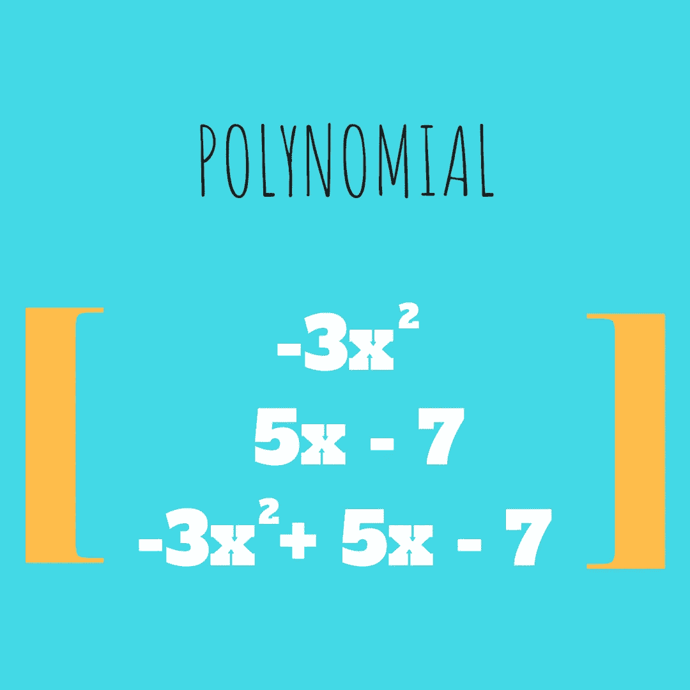
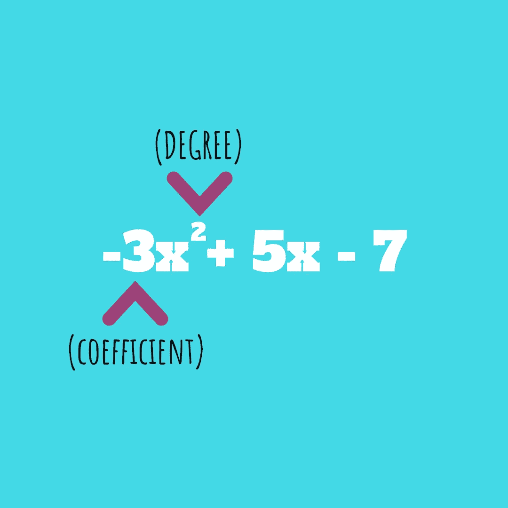
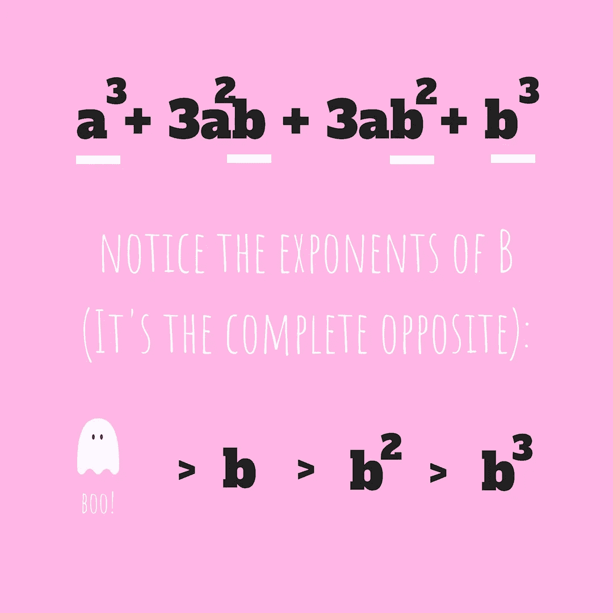
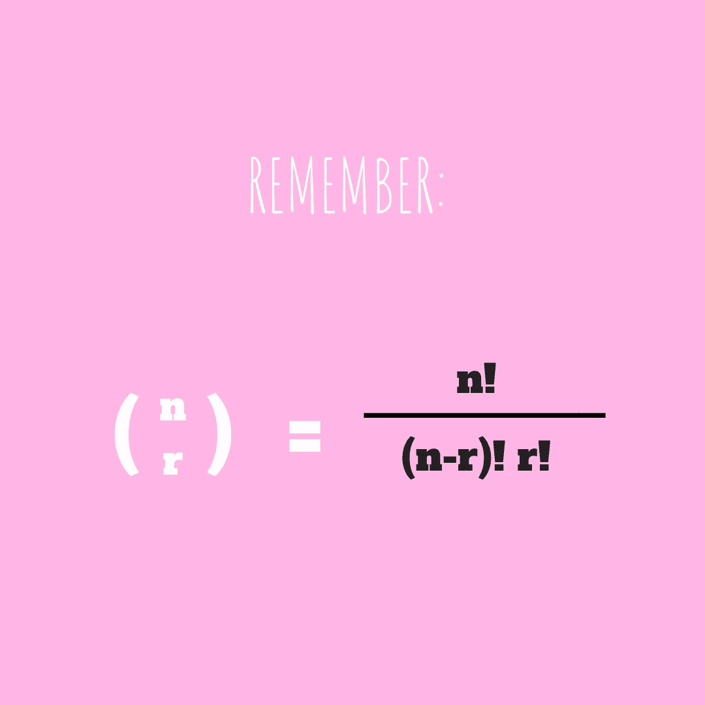
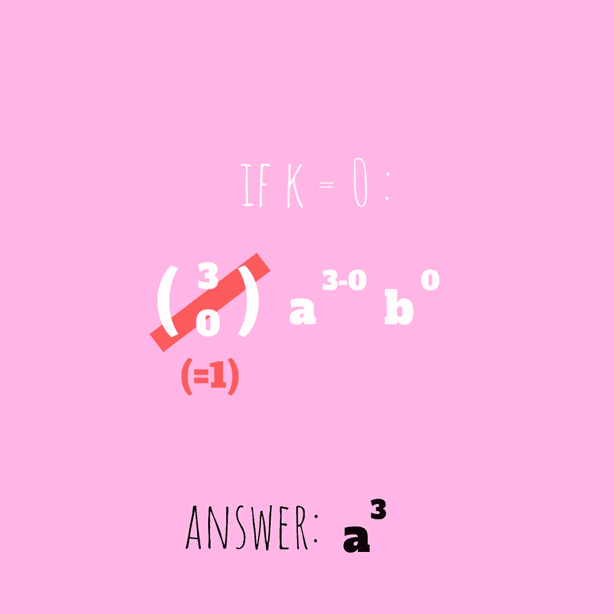
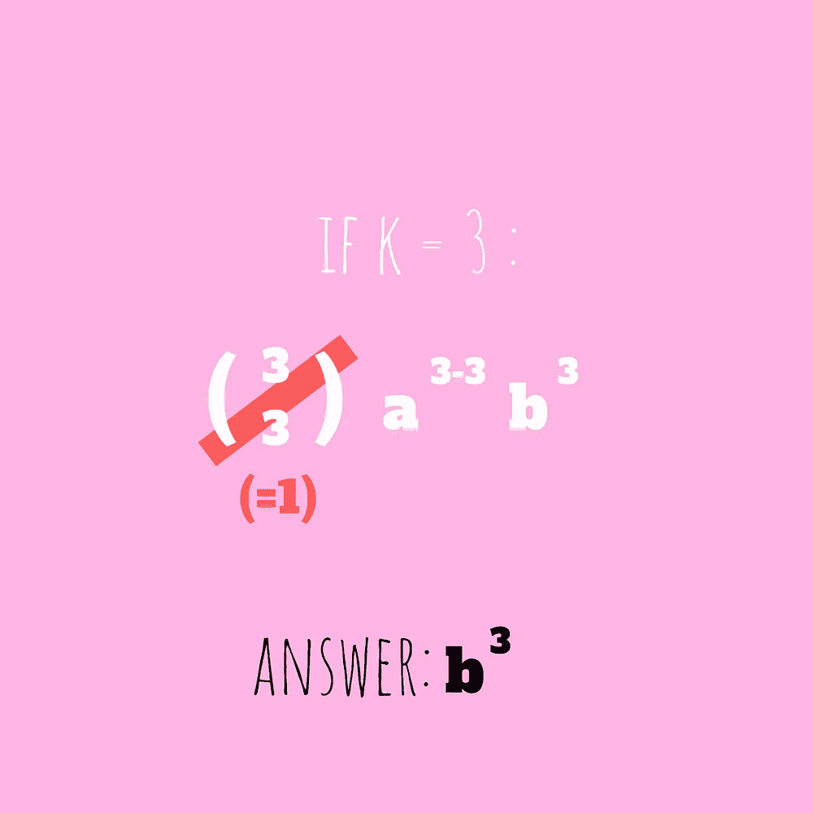

# 二项式定理

> 原文：<https://medium.datadriveninvestor.com/binomial-theorem-cecfb0224183?source=collection_archive---------1----------------------->

如果你像我一样——多年没有接触数学/统计，但试图解决机器学习的概念——这里有一个非常简单的方法来理解**二项式定理**:

但是也许即使阅读“二项式”这个术语也会让你感到害怕。(*四年前我在微积分课上做过噩梦*。)

你需要记住的第一件事是多项式是一个表达式。用简单的英语，把多项式想象成包含不同“单词”的“句子”。

根据多项式有多少个“词”，它有不同的项。

**系数**是变量前的数字(本例中“-3”是系数，“x”是变量)。**度**是变量的最高幂。

好了，既然“二项式”、“多项式”和“系数”听起来不那么吓人，现在让我们来算出**二项式定理**:

binomial theorem formula

我知道，看起来很可怕，但也没那么糟。

让我们举个例子:

一旦你把答案分解成“a”s 和“b”，这个定理就变得更容易理解了:

现在如果我们回到公式上…

k 会一直增加(0 > 1 > 2 > 3)直到达到 3。

a 会随着 k 的增加而不断减小(3–0 > 3–1 > 3–2 > 3–3)。

b 会随着 k 的增加而不断增加(0 > 1 > 2 > 3)。

“3 选 k”是会根据“k”值变化的系数。

现在你要做的就是得到当 k=0，k=1，k=2，k=3 时所有结果的总和。

我希望这有所帮助，但如果这仍然没有意义，我强烈推荐这个来自可汗学院的视频。

祝你好运:)