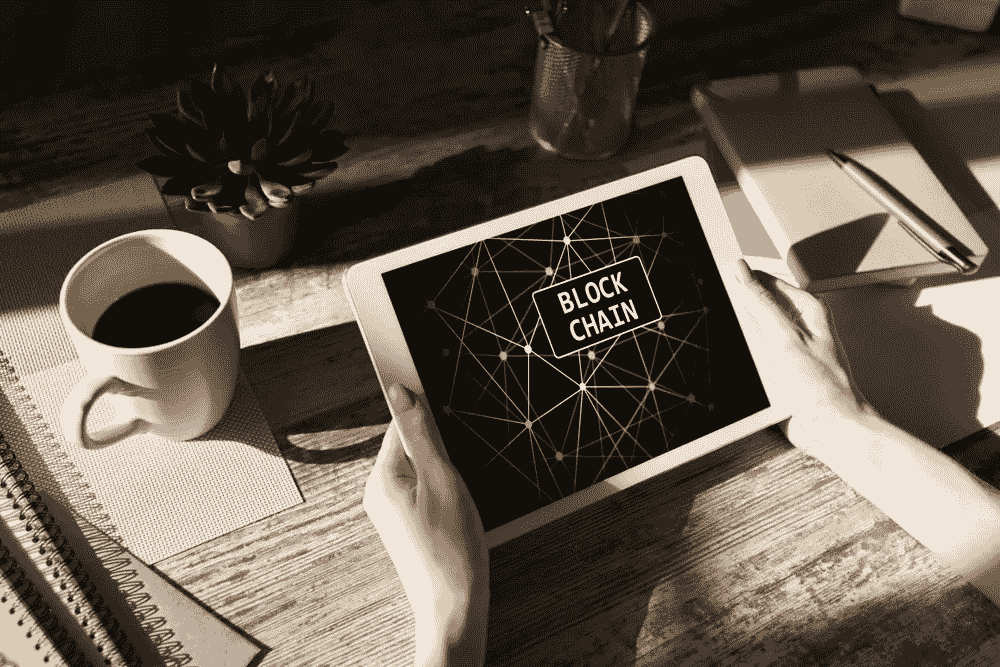

# 艺术的区块链:2019 年每个人都在准备什么

> 原文：<https://medium.datadriveninvestor.com/blockchain-for-art-what-everyone-is-looking-forward-to-in-2019-4aa9a5231f5b?source=collection_archive---------13----------------------->

Image by [Wright Studios](https://www.shutterstock.com/g/Kirill+Wright)

区块链炒作周期终于要结束了。

说实话，这是好事。业内那些留下来的人实际上会长期留下来，继续开发大家都在谈论的应用程序。

说到为艺术界建造什么，我认为区块链理工分为三个领域。

1.  首先，将有一个有趣的、基于项目的部门。这个空间将类似于游戏工作室——非常注重趣味性和艺术性，利用游戏化的平台，人们可以在这里投资、玩耍、接受教育，并尝试将区块链融入艺术的不同方式
2.  第二个领域将集中于构建更加用户友好的应用程序。这些将使用区块链理工大学的“引擎盖下”，就像我们今天认为的基于互联网的应用程序一样，如 Twitter 或 Instagram，只是处理数据存储和交易的方式和方法不同。
3.  第三个领域包括正在构建重型基础设施的公司，如协议、网络以及区块链实施所需的各种软件和硬件。这种基础设施的大部分将集中在围绕认证和互操作性的技术上，因为这是艺术界一些最棘手的问题所在。

所有这三个部分都将为那些对艺术和区块链感兴趣的人开辟大量的机会，所以现在是时候了解更多关于这种技术以及使用这种技术的公司如何增加真正的价值了。

以下是对未来一年该领域的预期:

# 基于分布式账本技术的产品和解决方案将会更加人性化。

为了让区块链有价值，它必须达到技术发展的临界点。

过去，人们一直对在消费者层面使用分散技术持谨慎态度，因为它很危险，而且与加密货币市场的波动性有关。现在，我们已经进入了它的开发和社会化的几年，事实上，几乎每个涉及技术或供应链的大公司都有一个专注于区块链的部门，更大的公众越来越接受主流采用的想法。

但我们仍在等待区块链与其他技术更好地融合，这将使公司及其产品得以生存和发展。

虽然我们今年可能不会像 2018 年那样看到很多新的用例，但令人兴奋的是，我们实际上会看到越来越多来自 Snark 等公司的可用解决方案。Art，Swarm，DADA，还有我们自己在区块链艺术集体的团队。

## 现在市场上的很多产品，以及最终会被制造出来的产品，最终都会消亡。

这将为重要的长期项目留出发展空间。

面向消费者的应用程序和相关基础设施将继续被那些希望支持权力再分配的人开发、部署和采用，因为它涉及到基于互联网的产品和服务、数据所有权和对等交易。

# 基于艺术的技术的私人实现将会持续下去。

由于艺术界潜在的重大变化，像佳士得这样的大公司[已经和 Artory 这样的公司一起涉足区块链——这种趋势将会继续下去。](https://www.forbes.com/sites/elenazavelev/2018/11/26/is-blockchain-the-right-solution-for-the-auction-houses/#45e100e331bf)

人们意识到新的所有权方式将会改变艺术市场，传统的参与者需要保持警觉才能成功应对。更大的企业和更传统的公司将专注于采用区块链的私有和混合解决方案，通过互操作性、自动化和数据安全性来创造商业价值。

艺术界也将开始从学术角度探索更大的行业联盟的形成，同时建立自己的解决方案。正如我们在城市规划中看到的那样，艺术行业现在有机会开始在基础设施层面进行协调，而不是在所有东西都以不同的目标建成后，不得不改造和连接脱节的组件。

# **艺术品市场将会增长，因为投资和清算的门槛降低，艺术品买卖双方之间的信任增加**

[通过令牌化获得部分所有权](https://medium.com/blockchain-art-collective/how-tokenization-is-turning-art-into-a-commodity-and-changing-monetization-d7eaee7b46c9)为拥有各种净值的个人开辟了投资机会，但也改变了那些已经有能力投机艺术品的人的投资前景。

这也可能增加已经商品化的艺术，这有其积极和消极的一面。

然而，更多的艺术家将能够通过更多的清算活动资助新艺术品的创作，更多的博物馆和画廊将能够出于同样的原因资助新的收购或资本项目。随着时间的推移，所有权数据变得与艺术品直接相关，艺术品的买家和卖家将有更多机会获得真实性和出处记录。

所有这些变化只是意味着更多的人将被吸引到艺术社区，调查它的潜力，并试图找到他们如何参与或继续与空间一起发展。

# **数字、加密和人工智能生成的艺术将成为继后互联网和当代艺术浪潮之后的下一个艺术流派。**

作为一个行业，我们将会看到更多的新技术融入到艺术品的实际创作中，包括符号化、游戏化，以及一类新的计算机艺术家，他们通过机器学习算法来制作有拍卖价值的艺术品。

在艺术界的创作方面，数字平台的使用将继续增长，这将对艺术品的购买和观看方式产生影响。艺术投资者和收藏家将需要新的方式来展示他们的艺术——这将产生对改进的数字显示器的需求，以取代更传统的绘画或印刷。

对这些新艺术媒体的需求甚至达到了一个点，即新艺术学院将于今年春天在纽约市举办首届加密和数字艺术博览会(CADAF)。像 Artnome 这样的平台的存在是为了在检查技术与艺术结合的成功和增长领域时充当一个关键和客观的声音。

# **新老公司将使用更传统的融资和资源配置方式。**

虽然 ICO 炒作在 2018 年蓬勃发展，但你不能一转身就不撞上一家推出这些产品的公司。

我在这里不严格地使用“公司”这个术语。

很多区块链项目都是由烟雾、镜子和一张激动人心的白纸组成的——仅此而已。但现在炒作已经降温，美国证券交易委员会已经介入，我们将看到长期参与其中的公司寻求更传统的融资。通过首次公开募股、二次公开募股、风险资本和证券代币发行融资将被视为可行的选择。

> 随着向更传统融资方式的回归，区块链公司将继续增加真正的商业价值。

我们将会看到独立或自治的工作组的崛起——以及之前提到的[行业联盟](https://blog.chronicled.com/blockchain-industry-consortiums-when-they-work-and-why-they-fail-2e02851b651f?source=user_profile---------30------------------),它们将会找到工具来一起工作。个人加入这些工作组的动机可能会与供应链库存、财务跟踪和艺术品保险的实际解决方案相关联。

随着这些团体的发展，他们将慢慢学习新的实践，为整个行业开辟前进的道路。

# 技术和业务的整合将会增加。

媒介和艺术形式总是在不断发展，区块链、机器视觉、人工智能、虚拟现实和增强现实的加入将有助于这种变化。

长期以来，我们可以将手机对准二维码，获取更多相关信息。但是，如果我们可以用它们来扫描一幅图像或一件艺术品，并立即获得关于这件艺术品的所有信息，那会怎么样呢？

艺术家、时间段、历史、估价范围——这些都可以在你的手机上立即出现。

像 Smartify 这样的公司已经在研究这个用例，还有许多其他公司正在为艺术界创造令人兴奋的解决方案。Cre8.xyz 是另一个平台，可以让你在不同的创意领域建立综合声誉，比如自由设计和社区建设工作。

总而言之，如果你是一个对技术有偏好的艺术爱好者，那么关注下一年发生的事情是值得的。

**感谢阅读！**

**我们区块链艺术集体的团队希望确保艺术世界的变革者和创新者——无论是个人还是机构——对这个不断增长的生态系统产生影响。**

听起来像你？ [**填写表格**](https://blockchainartcollective.com/ecosystem/) **向区块链艺术集体工作组提出申请。**