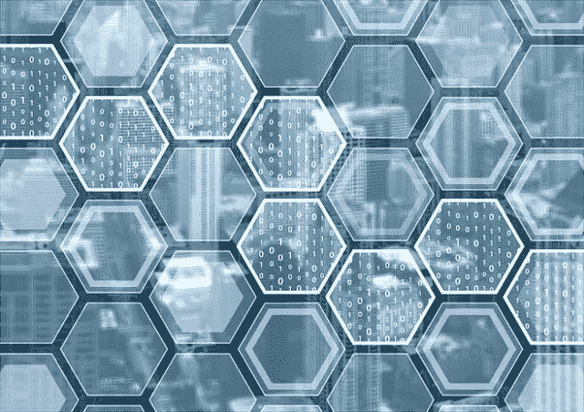

# 医疗保健中的区块链；这里没有隐秘的冬天，它正全速前进

> 原文：<https://medium.datadriveninvestor.com/blockchain-in-healthcare-no-crypto-winter-here-its-full-steam-ahead-f8fd27baf0bd?source=collection_archive---------6----------------------->

医疗保健正在成为区块链和人工智能技术的早期和雄心勃勃的采纳者。长期以来，该行业在运营技术采用方面一直落后，但现在发现区块链特别适合这个高度分散和受监管的行业。该行业开始研究区块链如何作为提供者、支付者、患者、供应商、研究机构和公共卫生机构之间的公共数据交换平台。这些平台然后可以与人工智能(AI)和物联网集成。医疗保健工作者资格认证、解决棘手的医疗供应链问题以及自动化索赔处理的用例正在从实验室走向实施。此外，由大型供应商、付款人、制药公司和技术公司组成的几个机构联盟正在全球范围内形成。

> [DDI 编辑推荐—认证区块链开发者](http://go.datadriveninvestor.com/blockchain-dev/matf)

由于加密货币正在努力摆脱自称的加密冬天，技术专家们正忙于完善区块链机制，并与行业合作开发解决方案，这些解决方案将很快产生可见和可衡量的影响。一个更强大的区块链支持的基础设施的轮廓正在形成，医疗保健正在成为适应的有前途的领导者。

很快，新的区块链创新将大幅提高吞吐量和交易速度，降低费用和更完善的治理模式，从而加快适应。数字技术在医疗保健中的部署可以为其他行业提供见解，从这一新兴技术中寻求指导。

**医疗保健趋势中的区块链**

医疗保健是人工智能与区块链数字配对的受益者之一。这两者的结合是一个强大的工具，不仅为医疗保健研究的大数据分析增加了新的功能，还简化了低效的索赔解决流程，建立了更安全可靠的医疗供应链。

S ***tronger 在一起；人工智能和区块链的结合形成了新的医疗保健解决方案，这种结合正在增加。***

值得注意的是，人工智能指的是几种技术，例如:

*深度学习和机器人流程自动化-* 通过使用脚本和智能代理来辅助而不是取代人工处理，从而支持业务流程。

*自然语言处理(NLP)——*通过统计和机器学习方法促进对句子结构和意义、情感和意图的理解，从而使用和支持文本分析。

*决策管理-* 是一个将规则和逻辑插入 AI 系统的引擎，用于初始设置/训练和自动化决策。

区块链可以作为公共数据管道，为数据增加一层信任、证明、来源和安全性，因此，可以由人工智能工具访问，用于高级分析、智能处理和机器学习系统。许可的区块链也可以被用作人工智能代理执行操作并将结果返回给区块链的接入点。

B**锁链和 AI 作为流程自动化的使能器。**

对于消费者和医疗保健机构来说，由提供者和支付者进行的医疗保健索赔的处理传统上是一个昂贵、耗时和令人沮丧的过程。医疗索赔处理成本估计超过 5000 亿美元。据估计，需要人工干预的索赔平均成本高达 118 美元。来自 ConsenSys 的 Endjinn 最近的工作是使用深度学习和其他人工智能工具开发一个自动化代理，该代理可以从人类索赔代理那里快速学习如何通过语音和文本交互处理索赔。名为 Jann 的人工智能代理可以通过许可的私有区块链访问，从而实现更快的部署和安全的处理通道，该通道旨在维护患者的敏感数据。人工智能代理 Jann 与人工索赔代理配合，可以在当前时间和成本的一小部分内编码和处理索赔。

数字自动化可以解决困难的多方流程，并作为一种工具而不是替代品与人类一起工作。

名为 Jann 的自动化代理不是取代人类处理器，而是向人类处理器学习并与之合作，然后人类处理器充当人工智能代理工作的主管。尽管 Endjinn 的第一个用例是索赔处理，但它很快将被部署到其他手动密集型流程中。

**结盟**

区块链通过将数据共享到大型池中进行深入分析，为竞争对手创造了合作的机会，同时也是一种降低处理成本的方法，同时继续作为医疗服务的提供者和支付者进行竞争。

T ***区块链联盟和竞合的出现。***

区块链技术在促进共享或汇集特定数据集的机构联盟解决困难的流程瓶颈和/或提供可靠的分析见解方面特别有效。大型供应商和付款人正在结成联盟，集中资源，以解决共同的问题，同时继续在其他领域竞争，从而从纯粹的竞争走向合作竞争。

随着医疗成本不断攀升，同时技术进步不断融合，为提高医疗效率和改善医疗服务创造了新的机遇，形成新联盟的动机从未像现在这样强烈。

B ***锁链是公共卫生和疾病研究领域大数据研究的推动者。***

在国家和全球范围内分析人口健康数据的机会受到大多数医疗保健组织维护的数据仓库的限制。保护患者隐私、安全问题、竞争以及各方之间缺乏信任都加剧了数据孤岛的保留。区块链通过提供不变的真实记录来解决这些问题，同时在新的共享数据环境中增加了一层信任和透明度。在这种情况下，人工智能工具现在可以在共享环境中更好地访问更大的数据集。

**联盟**

Humana、United Health Group、Atena 和 Ascension 与两家技术公司 Multiplan 和 Optum 合作，成立了 Synaptic Health Alliance，以探索区块链技术如何实现医疗保健服务的现代化。

最近，企业和科技巨头摩根大通(JP Morgan Chase)与亚马逊(Amazon)和伯克希尔哈撒韦公司(Berkshire Hathaway)合作，开始重新审视如何利用技术提供医疗保健，同时控制螺旋上升的成本。

Aetna 刚刚从制药巨头 CVS 收购回来，宣布它将加入 IBM 医疗设施网络区块链医疗保健计划，该计划旨在改善敏感数据的共享方式、医疗保健交易的处理方式以及区块链生态系统框架内的一切。他们将与现有成员 Anthem(美国最大的健康计划提供商之一)、Health Care Service Corporation(美国最大的客户拥有的健康保险提供商)和 PNC Bank 一起加入该联盟。这些提供商加在一起，拥有近 1 亿份医疗保健计划。IBM 计划包括其他卫生组织、医疗保健提供商、初创公司和技术公司。根据 IBM 的说法，所有联盟成员都获得了平等的股份，因为这些竞争对手并肩工作，努力消除医疗保健系统中的大量浪费。

B ***lockchain、AI 和 IOT 结合起来，创建了一个新的数字化、智能供应链，解决了许多棘手和困难的追踪相关问题。***

**假药**

世卫组织估计，大约 10%到 30%的药品和 8%的医疗器械是假冒的，每年的总价值超过 2000 亿美元。国际刑警组织估计，从 2011 年到 2014 年，假币业务的数量增长了 9 倍。

根据最近实施的药品供应链安全法案(DSCSA ),每个药品包装都需要用唯一的产品标识符进行序列化或贴条形码。欧洲也有类似的法规，称为伪造药品指令(FMD)。这些规定的目的是促进对每件售出产品的验证和真实性。

MediLedger 项目——一家总部位于美国的财团正在建立一个行业拥有的许可区块链网络，该网络是基于开放标准和规范专门为制药行业开发的。去年 10 月，该组织推出了可销售退货的目录和验证路由服务。美国每年有 3-7%的药物被退回给制造商以平衡库存。如果公司能够验证其真实性，这些药物就可以重新出售。

区块链可以帮助确保供应链符合环境存储标准。许多药物必须储存在特定的温度、空气质量和湿度水平下，以保持其药效。如果不保持推荐的环境条件，疫苗特别容易变质。

据估计，全球有 20%的疫苗因运输和储存过程中的不当暴露而变质。在某些情况下，会使用监控设备(物联网)来跟踪产品在供应链中移动时的温度和湿度水平。然而，当数据在制造商、运输商和供应商之间移动时，通常是不共享的。

诺华目前参与了欧洲制药行业和欧盟之间的联盟网络，称为创新药物倡议(IMI)-区块链支持的医疗保健计划。IMI 是世界上最大的公私合作医疗机构，通过 EFPIA 和“地平线 2020”项目，总预算为 50 亿€。该联盟由区块链中小企业公司、大学、临床实验室、医院、病人代表和其他机构组成；旨在探索假药检测、供应链、患者数据和临床试验中的用例。

**未使用的药品**

对美国处方药浪费的估计是惊人的，尤其是来自疗养院和绝症患者。据估计，美国养老院使用的所有非常好的药物中有 20%被扔掉。未使用药物的安全处置也是一个问题，因为这些潜在致命药物中的大部分经常被冲入供水系统或扔进垃圾桶，对环境造成未知的后果。美国环境保护署 2015 年估计，每年约有 740 吨药物被养老院浪费。来自健康政策中心和纪念斯隆·凯特林的研究人员分析了前 20 大销售癌症药物产生的废物，并得出结论，保险公司每年向制药商支付 18 亿美元的废弃量。

另一方面，世界上有无数的人负担不起适当的药物治疗。根据北卡罗来纳大学的一项研究，美国 20%的癌症患者负担不起他们的处方化疗。

B ***lockchain 可以帮助管理供应链售后服务，减少浪费和管理处置，同时帮助那些有需要的人。***

总部位于田纳西州纳什维尔的初创公司 Good Shepard Pharmacy 正在使用区块链技术(RemediChain)管理主要来自已故患者家属的未使用化疗药物捐赠，并以很低或零成本将其重新分配给需要的人。在全球范围内推广类似项目的潜力可能会产生有意义的影响。这是一个重要的例子，说明如何利用区块链来促进向有需要的人捐款。

数字技术正开始改变医疗保健领域。以前习惯于在竞争孤岛中运营的机构现在正在建立新的联盟，通常与技术公司合作，这可能会重塑行业。区块链和人工智能工具是许多这些新联盟的共同基础设施和技术。随着联盟的成熟和适应性的增加，合作竞争将成为一种重要的动力，可以通知其他行业，并有助于整个区块链/人工智能生态系统的发展。