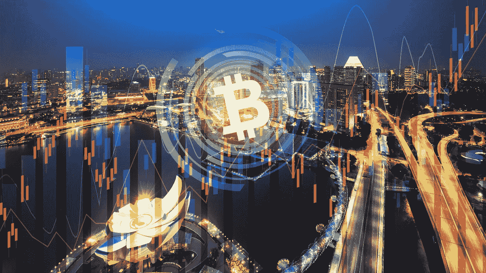

# 区块链和数据交换:智能城市的信息基础设施

> 原文：<https://medium.datadriveninvestor.com/blockchains-and-data-exchanges-information-infrastructure-for-smart-cities-5cd2b1c491cd?source=collection_archive---------2----------------------->

## 智能城市发展系统

Blockchains and Data Exchanges will be the bedrock of the next-generation of smart city applications

作者:Kishore Jethanandani

**简介**

区块链和数据市场正准备重塑智能城市的信息基础设施。新兴的信息基础设施将催生新的城市应用，并增强运输、应急管理和城市维护等其他服务类别的区域服务。

针对特定用例的智能城市应用程序开发的当前实践，其影响并不显著。例如，十字路口的交通管理对缓解整个城市的交通拥堵没有什么作用。相比之下，区块链和数据交换将有助于优化交通流量，堵塞城市范围内的阻塞点，而不管交通模式如何。

智能城市发展新架构的基石将是有或没有区块链的数据市场。虽然区块链的价值在一些圈子里有争议，但我们遇到了大量的[证据](https://www.nlc.org/sites/default/files/2018-06/CSAR_Blockchain%20Report%20PRINT.pdf)表明他们将发挥重要作用。

数据市场将创建在应用开发平台上开放使用的数据池。数据将从众多数据源聚合，尤其是那些从物联网设备实时流出的数据。目前，开放数据平台主要提供其城市外围运营的历史数据。数据市场将[互连数据源](https://readwrite.com/2017/10/06/smart-data-exchange-smart-city/)以捕捉城市活动及其区域的动态。

 [## 你对智能凭证了解多少，J-Coin & c-闪电-数据驱动型投资者

### 无数区块链/加密项目在我们周围涌现，承诺不同的真实世界用例。正在搜索…

www.datadriveninvestor.com](https://www.datadriveninvestor.com/2019/03/06/what-do-you-know-about-smart-credentials-j-coin-c-lightning/) 

**建立数据交换**

我们采访了电信行业解决方案联盟( [ATIS](https://www.atis.org/) )负责技术和解决方案的副总裁 Mike Nawrocki，他领导 ATIS[计划](https://www.atis.org/scde/)为下一代智能城市制定规范和蓝图。“第一代智能城市数据交换主要在美国以外，主要是通过政府发起的自上而下的计划开发的。Copenhagen 的计划是通过额外使用供应商投资(Hitachi Vantara)建立的，并被宣传为世界上第一个开放式数据市场。Mike Nawrocki 告诉我们:“ATIS 希望通过一套公共规范来鼓励智能城市数据交换，这些规范由城市自愿采用，邀请广泛的合作伙伴社区来开发应用程序。

为了推进这一目标，ATIS 正在与 [US Ignite](https://www.us-ignite.org/) 合作，后者长期以来一直在将联邦政府机构的资金与市政府的需求联系起来。ATIS 研究了智能城市发展的现有实践中的共同挑战，并将数据交换视为城市的一个重大机遇。2018 年，它发布了数据共享框架。同年 9 月，ATIS 开始与美国 Ignite 合作，与城市和行业共同开发数据交换规范。“各种规模的许多思想领先的以数据为中心的城市已经出现，并正在对大数据进行投资。Nawrocki 指出:“通过与行业合作，这些城市可以为数据交换和开放数据市场创造蓝图，展示数据作为关键城市资产的价值。

ATIS 一直在探索数据市场的新机遇，这些市场将提供比城市现有数据商店更多的价值。它发现，城市，如西雅图周围的城市，倾向于共享数据，并为他们的地区创建一个池。“城市之间的数据共享是一个复杂的过程，没有一个通用的方法，因为城市正在部署不同的数据管理平台。在数据交换适当且有价值的情况下，城市可以通过公共数据交换框架与其他实体共享数据。Mike Nawrocki 推测道:“跨智能区域的区域应用，如交通或促进经济发展的应用，可以利用数据交换来更好地支持跨城市边界的应用。

不可避免的是，在许多合作伙伴参与的情况下，数据的安全和隐私是一个问题。ATIS 正在探索分布式账本技术(DLT)，像区块链一样，与它的成员。尽管没有在 ICT 行业广泛部署，DLT 解决方案已经开始获得市场价值。Nawrocki 承认:“最终，分布式账本方法可以为复杂的隐私和安全挑战提供创新的解决方案。”

城市在数据交换中的作用可能包括从许多来源提供原始数据、汇总数据或实时数据。在应急响应数据的情况下，他们可以结合来自公民的众包数据。对于商业用途，它们可以帮助将历史数据与实时物联网数据融合在一起。城市也可以对数据进行分类，使其更有价值。这些数据可以免费提供，以促进经济发展，或者当城市通过对其进行分类来增加价值时，可以收取费用。

最后，应用程序开发最好由私营部门完成，数据市场是 it 购买数据的一种便捷方式。“政府中的实体都不愿承担风险，尤其是像去中心化区块链和数据市场这样未经测试的前沿技术，而且他们没有资金或人员来执行这些技术，风险太大了。IDC 全球智能城市战略项目主管 Curt Savoie 告诉我们:“数据共享通常需要一年或更长时间的法律修改。

**智慧城市的未来应用**

[学术界](https://www.sciencedirect.com/science/article/pii/S0264275118315968?via%3Dihub)和咨询界已经认识到数据市场和区块链在加速采用智能城市应用方面的重要性。我们采访了总部位于堪萨斯城的 Think Big Partners 的管理合伙人和联合创始人 Herb Sih，他已经为数十个智能城市提供了咨询，并了解由区块链和数据市场支持的下一代应用程序的实施情况。“区块链记录数据的来源，跟踪所有活动、人员、流程以及相关的绩效和成就，从而建立系统的完整性，”Herb Sih 告诉我们。“车队管理的势头越来越猛，城市可以使用区块链来跟踪他们的车辆资产。它们的位置、状况、空闲时间、速度、维护都将被了解，以便优化它们的使用，”Herb Sih 解释道。

对区块链的活动跟踪是目前正在丹佛实施的 V2V(车辆对车辆)通信的基础。来自车辆的数据可以用来提醒司机潜在的碰撞、安全变道和街道拥堵管理。“汽车制造商正在努力解决包含所有汽车的问题。像特斯拉这样的一些汽车比其他汽车更加互联。5G 将使采用 V2V 技术更具吸引力，消息通信只有毫秒级的延迟，”Herb Sih 告诉我们。

V2V communications will improve transportation security and manage congestion in cities

无人机已经越来越被城市社区接受，用于应急管理。“人们将能够通过在智能手机上输入电话号码来呼叫四轴飞行器。无人机将通过智能手机显示的位置信息找到他们，使用红外探测地面上的活动，并在火灾或绑架等情况下向人们发送救生索，”Herb Sih 告诉我们。“在国内恐怖主义案件中，无人机将绘制关键参考点，如受伤或面临危险的人，以便执法部门利用来自区块链的可靠数据锁定他们的战略选择，”Herb Sih 根据他对智能城市当前试点的了解透露。

Drones will respond to calls for help from smartphones to manage emergencies

新兴应用将跨越城市和地区的长度和宽度，CubeMonk 就说明了这一点，该公司已着手通过提高利用率来减少街道上的卡车数量，从而减少智能城市道路上的拥堵。它为拥有单一物流信息来源的承运人和托运人建立了一个集中的数据交换系统，以帮助特定地点的运输能力供应与运输需求相匹配。“我们有一个物联网层，嵌入了测量上下文信息的 GURU 设备。它验证货物位于何处、货物是什么、货物去往何处以及货物的所有者是谁。另一面是设备的供应。CubeMonk 的创始人兼总裁托德·哈塞尔霍斯特告诉我们:“需求和供给可以被分割成可以用标准立方体来衡量的小单元。Todd Haselhorst 解释说:“物联网设备创建了一个网状网络，可以与城市基础设施进行通信，并 pings 关于哪个立方体或卡车中包含什么以及它将如何在供应链中移动的信息。”

区块链支持的物流信息基础设施为应用程序开发奠定了基础。“在 2019 年第二季度，我们将创建像立方体这样的可租赁货运资产，但这种模式也可以适用于卡车，集装箱，仓库，”托德·哈塞尔霍斯特透露。这些信息将揭示产能规划的市场信号。

区块链的分散版本将很快推出，将在通往目的地的最不拥挤的道路上向卡车司机提供信息。“我们正在开发一种设备，它可以跟踪驾驶员从 A 点到 B 点的进度状态数据，并与其他驾驶员的数据进行比较，以确定哪条路径是最佳路径，”托德·哈塞尔霍斯特透露。

**与区块链一起实现智能离网**

没有政府的任何帮助，城市也可以变得更加智能。城市居民个人可以成为数据来源，通过使用未经许可的频率的网络传输，在私人开发的区块链上管理，用代币支付城市服务，填补市政当局留下的空白。MXC 与 Match X 和 Citiesense 合作，正在纽约市实施这样一个计划。

“垃圾清理是纽约市的一个系统性问题，我们的试点项目位于一些最繁忙的商业区，那里的商业改善区或 BIDs 等当地团体补充了市政当局的工作，”Citiesense 的首席执行官 Starling Childs 告诉我们。Starling Childs 解释说:“最初在三个商业区进行的试点将收集有关垃圾体积和重量、垃圾箱利用率以及垃圾清理频率的数据，以帮助了解优化垃圾管理和卫生设施的问题。”Starling Childs 告诉我们:“这些数据将使用未经许可的频率从 Match X gateways 收集，当私人废物运输者购买这些数据并用 MXC 硬币支付时，这些数据最终可能会被货币化。”

**结论**

鼓励私营部门更多参与的制度变革将加速智能城市应用的增长。市政府可以通过促进对支撑下一代应用的信息基础设施的投资来帮助创造一个环境，而不是单个项目。数据交换和区块链有助于创造一个开放的环境来释放私营部门的创造力。未来的智能城市应用将成为城市生活的一部分，他们的影响将在他们的每一次活动中感受到