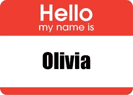

# 基于 Elixir/Phoenix 构建的 Bot 编排框架

> 原文：<https://medium.datadriveninvestor.com/bot-orchestration-framework-built-on-elixir-phoenix-3198fa68fc7a?source=collection_archive---------3----------------------->


Photo by [Daniele Levis Pelusi](https://unsplash.com/@yogidan2012?utm_source=medium&utm_medium=referral) on [Unsplash](https://unsplash.com?utm_source=medium&utm_medium=referral)



# 奥利维亚是谁？

我将这个框架命名为**奥利维亚**。Justus Eapen 的[大师](https://github.com/justuseapen/virtuoso)给了奥利维亚很大的启发。Olivia 旨在支持与 IBM Watson Assistant 或 Wit 的对话。您可以使用 Facebook Messenger 或 WebApp，并使用 webhook 或 socket 进行连接。

源代码你可以在这里找到。

[](https://www.datadriveninvestor.com/2018/08/02/making-the-leap-from-speech-to-dialogue-the-challenge-for-human-to-machine-communication/) [## 从语音到对话的飞跃:人机交流的挑战

### 机器人无处不在，几乎无所不在。我们甚至已经开始与他们交谈，在这种情况下…

www.datadriveninvestor.com](https://www.datadriveninvestor.com/2018/08/02/making-the-leap-from-speech-to-dialogue-the-challenge-for-human-to-machine-communication/) 

# 创建项目

首先，您必须创建一个新项目。姑且称之为`my_project`。

```
mix phx.new <my_project>
cd <my_project> 
```

将奥利维亚和[毒药](https://github.com/devinus/poison)添加到`mix.exs`文件中的`my_project`项目中。

```
{:olivia, git: "https://github.com/marceloreichert/olivia.git"}
{:poison, "~> 3.1 }
```

更新依赖关系:`mix deps.get`。

# 设置您的项目

Olivia 允许你使用 3 种不同的界面类型:Facebook Messenger、带有 webhook 的 WebApp 和带有 channels 的 WebApp。

如果你使用 Facebook Messenger，你需要包含到 webhook 的路径。你的 Facebook Messenger 也应该设置同样的 webhook。

```
pipeline :webhook_fb_messenger do
  plug :accepts, ["html"]
  plug :fetch_session
  plug :fetch_flash
  plug :put_secure_browser_headers
endscope "/chat/messenger", OliviaWeb.Chat do
  pipe_through :webhook_fb_messenger
  get "/", MessengerController, :verify
  post "/", MessengerController, :create
end
```

如果您决定将自己的 WebApp 与 webhook 一起使用，请将此 webhook 添加到路由器:

```
pipeline :webhook_webapp do
  plug :accepts, ["json"]
end

scope "/chat/webapp", OliviaWeb.Chat do
  pipe_through :webhook_webapp
  post "/", WebAppController, :create
end
```

如果您决定将自己的 WebApp 用于通道，请将套接字配置添加到端点:

```
scope "/chat/webapp", OliviaWeb.Chat do
  pipe_through :webhook_webapp
  post "/", WebAppController, :create
end
```

现在，添加新文件`/lib/<project_name>/orchestra.ex`。在这个文件中，您可以捕获消息并进行操作，而无需通过任何 NLP。

```
defmodule <MyProject>.Orchestra do
  def run(impression) do
    impression
  end
end
```

在文件`config/dev.exs`的末尾，添加一个调用来添加环境变量。

```
# config/dev.exs...import_config "dev.secret.exs"
```

现在添加`dev.secret.exs`文件。注意，你需要决定是使用 **nlp** 还是`:watson_assistant`还是`:wit`。并添加您的 Facebook Messenger、Watson 或 Wit 的登录数据。

```
use Mix.Config

config :olivia,
  fb_page_recipient_id: "",
  fb_page_access_token: "",
  wit_server_access_token: "",
  watson_assistant_id: "",
  watson_assistant_token: "",
  watson_assistant_version: "",
  default_nlp: :watson_assistant or :wit,
  bot_name: <MyProject>
```

# 运转

一切都准备好了，现在让我们的机器人开始工作。

```
mix ecto.create
mix phx.server
```

# 它是如何工作的？

入口点是`lib/olivia/chat/interface/` `fb_messenger` ou `web_app`中的`entry.ex`文件。对于来自接口的输入数据，我们经历处理阶段，直到向接口返回响应。我们有`Translation`、`Conversation`、`Thinker`和`Dispatcher`模块。

示例:

```
payload
 |> Translation.process_messages
 |> Conversation.received_message
 |> Thinker.run
 |> Dispatcher.build_response(sender_id, token)
```

## 翻译(奥利维亚。Chat.Interface.FbMessenger .翻译)

从 Messenger 或 WebApp 接口接收原始消息，并将其存储在 struct `%Impression{}`中。

## 对话(奥利维亚。聊天。对话)

使用 GenServer 维护对话状态。

## 思想者(奥利维亚。聊天.思考者)

负责调用`Olivia.Chat.Thinker.WatsonAssistant.Thinking`，ou `Olivia.Chat.Thinker.Wit.Thinking`模块并根据你正在使用的接口配置。向 Watson 发送传入消息，并获取意图、涉及的实体和响应。

## 调度员(奥利维亚。聊天.界面. FbMessenger.Dispatcher)

处理向 Facebook Messenger 返回响应的 POST 请求。

你还需要有一个 IBM 账户，然后[助手](https://cloud.ibm.com/docs/services/assistant?topic=assistant-getting-started#getting-started)就会回答你的问题。

现在我需要帮助添加测试和新的接口和新的 NLP。

下次见。