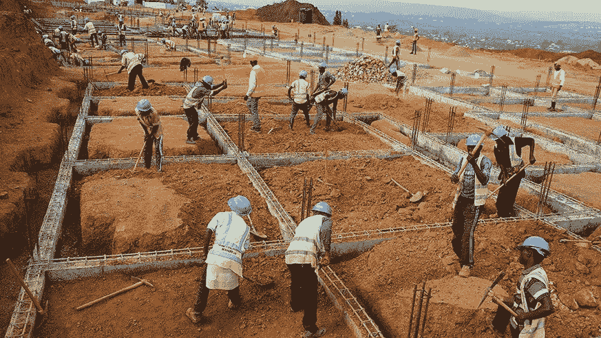

# 构建自动化工具

> 原文：<https://medium.datadriveninvestor.com/build-automation-tools-a231c445cdd6?source=collection_archive---------1----------------------->

最近，我大学毕业，开始了软件工程师的工作。与我个人热衷的项目相比，这是从生产级代码的转变。因此，我不得不关注建筑自动化软件，这是我在个人机器上编译代码时通常不会担心的事情。

如果你像我一样，在我的第一周，你可能需要复习一下什么是构建自动化软件以及为什么使用它。由于敏捷开发周期在公司中的快速采用，构建自动化在最近几年又重新流行起来。构建指的是将文件转换成可消费形式或最终形式的过程。如果您是 Java 开发人员，您可能对 jar 文件很熟悉。对于更广泛的受众，您很可能已经与 zip 文件进行了交互。这两个文件都是构建将编译后的文件打包成压缩文件的方式。这个过程是自动化的，在 Java 环境中，有三个主要的构建自动化工具可以完成这个过程。

 [## 不管准备好了没有，革命就在我们面前|数据驱动的投资者

### “对于技术如何影响我们的生活和重塑经济，我们必须形成全面的全球共识……

www.datadriveninvestor.com](https://www.datadriveninvestor.com/2019/02/12/ready-or-not-the-revolution-is-upon-us/) 

## 蚂蚁——梅文——格拉德勒

这三个构建自动化工具是 Java 或 JVM 生态系统中最常见的。它们的起源都可以追溯到最初的构建自动化工具。然而，为了改变需求，其他的构建自动化工具应运而生。

## 蚂蚁

Ant 是“另一个简洁工具”的首字母缩写，是专门为 Java 生态系统构建的，因为 Java 在那个时期没有专门针对该语言的自动化工具。在最初几年，c 是大人物。但是，它也可以用于非 Java 应用程序。在 2000 年代早期，它发布了，起源于 Apache Tomcat。该文件是一个 build.xml 文件，与基于 Unix 的 Make 不同，后者有 Makefiles。

## 阿帕奇 Maven

像 Ant 一样，Maven 使用 XML 作为构建文件。它允许开发人员专注于设计构建应该做什么，并为其执行提供一个框架。此外，它还内置了对依赖管理的支持。

配置文件称为 pom.xml 文件。它包含构建和依赖管理指令。在 Maven 中，不需要定义构建的每个阶段。您可以简单地调用内置命令。如`maven compile`。Maven 也是目前最常用的 Java 依赖管理器。

## 格拉德勒

最后但同样重要的是，Gradle 是建立在 Ant 和 Maven 的基础上的。有相当多的组织使用它，尽管它还没有像 Maven 那样被广泛使用。它是用 build 建造的。从 Ant 和 Maven 的 XML 文件中分离出来的 gradle 文件。主要的特性差异是更小的配置文件，因为该语言被用于特定领域的问题。

Gradle 最常与 Spring 连用。

这是对构建自动化，特别是 Java 构建自动化工具的简要概述。