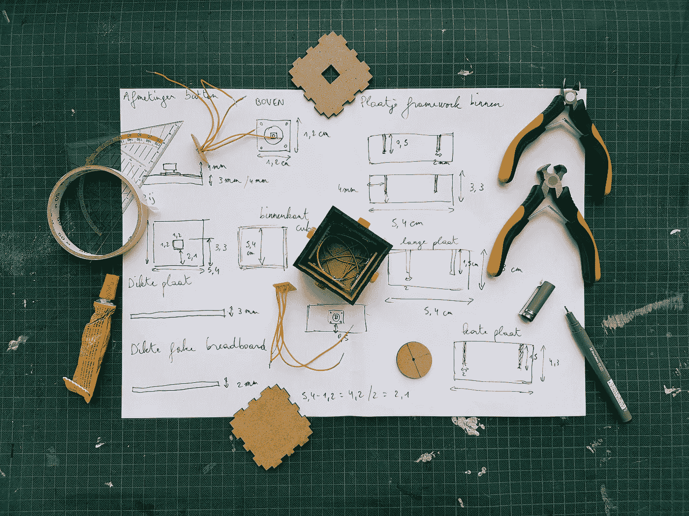

# 打造半个产品，而不是半吊子产品

> 原文：<https://medium.datadriveninvestor.com/build-half-a-product-not-a-half-assed-product-edf9a24b1df?source=collection_archive---------30----------------------->

[https://www.pexels.com](https://www.pexels.com)

通常，当我们在开发一个新产品时，我们通常会梦想它会拥有的所有功能，可以用它做的一系列事情，并倾向于想象很多用户每天都在使用它。不幸的是，梦想和现实是不一样的，我们必须非常小心新产品的范围，除非我们想在没有出版的情况下开始无尽的开发之旅。

随着时间的推移，我们不得不考虑 MVP 和原型。这是完美的，我完全同意这一愿景。问题是，我们中的一些人最终对原型中应该包含什么感到困惑。

就我个人而言，我经历过几次这种情况，真的很想带你远离它。所以做一些这篇文章的笔记，我们来发货吧！

# 模仿你的想法。完全地

作为软件开发人员，我们总是希望尽快开始编码。如果这是一个永远不会曝光的测试项目，那就太好了，但是如果我们想要发布我们的项目，那么我们必须首先关注其他事情。

我们在 [Regos](https://regosdevstudio.com/) 中遵循的一个策略是在[vision](https://www.invisionapp.com/)或 [Sketch](https://www.sketchapp.com/) 中制作一个原型，这样我们就可以想象出我们想要构建的完整概念。它有好几个用途:

*   允许您在构建用户工作流程之前检查并修复它们。
*   您可以与团队分享，并立即获得反馈。
*   因为它只是一个原型，你可以随意修改，而不需要重写代码。
*   你会意识到你的产品的真实尺寸。

# 问问你自己，你的用户是否需要所有这些

一旦你的原型完成，是时候问自己一个大问题了。

> 我的用户真的需要所有这些吗？

对你和你的团队诚实，想想你的最终用户是否需要所有这些特性。大多数情况下，你的应用程序只有你想象中一半的功能可用。当然，我们不是在谈论摧毁你的产品，我们是在谈论有选择性地关注那些对你的用户真正重要的功能。永远记住:

> 打造半个产品，而不是半吊子产品

一些用于选择功能的技术是采访或在互联网和其他类似产品上的一些基础研究。这里需要注意的重要一点是，即使其他类似于你的服务提供了更多的东西，你也不一定需要构建所有的东西，最好是识别并关注核心。

另一个好主意是想象你自己在使用你的产品，并思考你将遵循的主要行动，以实现最终目标。如果你没有在一个基本流程中使用一些特性，也许这些是你的应用程序的未来迭代，而不是要包含的初始特性。

# 假装你有一半的时间来建造它

如果这是你第一次做这样的事情(没有人天生就是专家)，你可能仍然会保留一些功能，只是因为“你喜欢它们”，不想在没有它们的情况下发布产品。我们喜欢的一些特性是很容易拥有的。

多花一点时间问你:

> 如果我有一半的时间，我应该包括这些功能吗？

如果答案是否定的，请不要仅仅因为你爱他们就把他们包括进来。你以后会有时间工作并把它们包含在你的产品中。但是集中精力变得真实，而不是建造一个永远见不到光的巨人。

我们希望这篇文章对你的下一个项目有所帮助。如果你想分享一些你的团队在选择这些核心功能时使用的经验或技术，请写在评论框中。我们会很高兴听到他们。

[Regos Dev Studio](https://regosdevstudio.com/) 是一家产品开发公司，为吉拉、Confluence 和 LiveChat 构建附加组件，并以多种语言开发定制解决方案。

不要忘记查看[我们的网站](https://regosdevstudio.com/)，访问我们的 [Atlassian marketplace 列表](https://marketplace.atlassian.com/vendors/1215096/regos-dev-studio)和我们的[live chat 应用](https://www.livechatinc.com/marketplace/apps/regos-notes/)。您也可以[在 Twitter 上关注我们](https://twitter.com/regosdevstudio)并关注我们的更新！