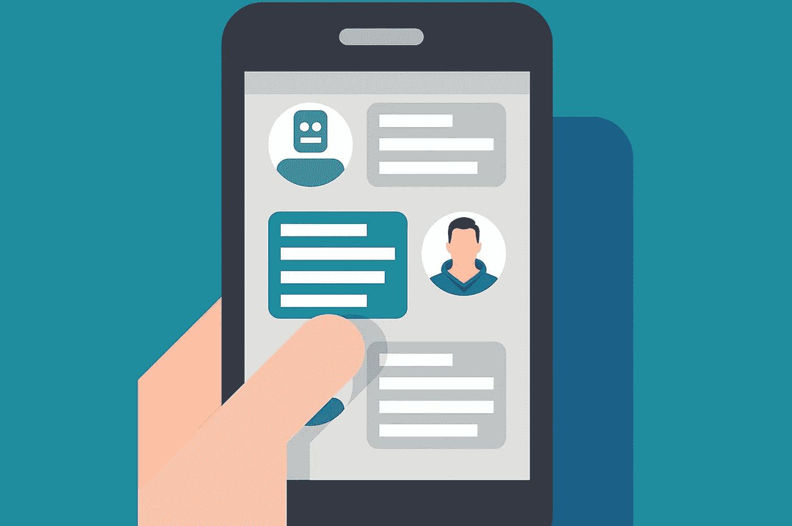

# 用 flask 框架和 python 构建机器学习聊天机器人

> 原文：<https://medium.datadriveninvestor.com/building-a-machine-learning-chat-bot-with-flask-framework-and-python-2c24b2def49b?source=collection_archive---------0----------------------->



创建聊天机器人或在你的网络应用中添加聊天机器人功能总是很好的，它让你的应用看起来对你的用户更友好。你可以用 python 通过不同的方式实现这一点，比如使用 [NLTK](https://www.nltk.org/) 、 [Tensorflow](https://www.tensorflow.org/api_guides/python/) 这样的库，但在这里我将解释我们如何使用一个名为 [chatterbot](https://chatterbot.readthedocs.io/en/stable/) 的库来实现这一点。ChatterBot 是一个 Python 库，它使得自动响应用户输入变得容易。使用 chatterbot，我们将在控制台中使用 python 创建我们的聊天机器人应用程序，然后我们使用 flask 将代码迁移到 python web base。

*   第一类 pip 安装聊天机器人安装聊天机器人
*   创建一个 main.py 文件或您选择的任何文件名

我们需要从 chatterbot 和我们的操作系统中导入一些东西

```
from flask import Flask, render_template, request
from chatterbot import ChatBot
from chatterbot.trainers import ListTrainer
import os
```

*   我们需要为我们的聊天机器人创建数据集来学习，因为它将是一个机器学习聊天机器人
*   创建名为 base 的文件夹
*   在 base 中，我们将有一个名为 dataset.txt 的 txt 文件

您可以添加您希望聊天机器人学习的聊天记录，您可以添加

```
hi 
hello 
how you doing 
what up 
hey 
am good 
lol
funny 
yes it is funny
```

用 dataset.txt 保存

*   将以下代码添加到 main.py 中

```
bot = ChatBot('Friend') *#create the bot*bot.set_trainer(ListTrainer) *# Teacher**#bot.train(conv) # teacher train the bot*for knowledeg in os.listdir('base'):
	BotMemory = open('base/'+ knowledeg, 'r').readlines()
	bot.train(BotMemory)
```

这段代码将循环遍历我们的 base 文件夹，查找里面的任何文件，因为我们有一个 txt 文件，它将逐行读取它们，然后我们的聊天机器人将一个接一个地学习我们需要升级我们的代码并将其与 flask 相关联

```
app = Flask(__name__)@app.route('/home')
def index():
	return render_template('index.html')@app.route('/process',methods=['POST'])
def process():
	user_input=request.form['user_input'] bot_response=bot.get_response(user_input)
	bot_response=str(bot_response)
	print("Friend: "+bot_response)
	return render_template('index.html',user_input=user_input,
		bot_response=bot_response
		) if __name__=='__main__':
	app.run(debug=True,port=5002)
```

索引路径是将 index.html 呈现到屏幕上，然后您将能够在屏幕上显示 html 内容。流程路线是从 html 表单接收用户输入，并将其发送给机器人，机器人将接收它并输出结果

*   在保存 main.py 的目录下创建一个新文件夹，命名为 templates

*添加以下 html 代码，并将其保存为模板文件夹内的 index.html*

```
< html >
< head>
	< title>Friend Chatbot
	< link rel="stylesheet" href="[https://maxcdn.bootstrapcdn.com/bootstrap/4.0.0/css/bootstrap.min.css](https://maxcdn.bootstrapcdn.com/bootstrap/4.0.0/css/bootstrap.min.css)" integrity="sha384-Gn5384xqQ1aoWXA+058RXPxPg6fy4IWvTNh0E263XmFcJlSAwiGgFAW/dAiS6JXm" crossorigin="anonymous">
	< script src="[https://code.jquery.com/jquery-3.2.1.slim.min.js](https://code.jquery.com/jquery-3.2.1.slim.min.js)" integrity="sha384-KJ3o2DKtIkvYIK3UENzmM7KCkRr/rE9/Qpg6aAZGJwFDMVNA/GpGFF93hXpG5KkN" crossorigin="anonymous">< /script>
< script src="[https://cdnjs.cloudflare.com/ajax/libs/popper.js/1.12.9/umd/popper.min.js](https://cdnjs.cloudflare.com/ajax/libs/popper.js/1.12.9/umd/popper.min.js)" integrity="sha384-ApNbgh9B+Y1QKtv3Rn7W3mgPxhU9K/ScQsAP7hUibX39j7fakFPskvXusvfa0b4Q" crossorigin="anonymous">
< script src="[https://maxcdn.bootstrapcdn.com/bootstrap/4.0.0/js/bootstrap.min.js](https://maxcdn.bootstrapcdn.com/bootstrap/4.0.0/js/bootstrap.min.js)" integrity="sha384-JZR6Spejh4U02d8jOt6vLEHfe/JQGiRRSQQxSfFWpi1MquVdAyjUar5+76PVCmYl" crossorigin="anonymous">< body>
< div class="container">
	< div class="alert alert-primary" role="alert">
User: {{user_input}}< div class="alert alert-dark" role="alert">
  Freind: {{bot_response}}
< /div> < form  action="/process" method="POST">
  < div class="form-group">
    < label for="exampleInputEmail1">Friend Chatbot
    < input type="text" name="user_input" class="form-control" id="exampleInputEmail1" aria-describedby="emailHelp" placeholder="Talk to my friend"> < button type="submit" class="btn btn-primary">Send
< /form>
< /div>
< /body>
< /html>
```

完整代码

```
from flask import Flask, render_template, request
from chatterbot import ChatBot
from chatterbot.trainers import ListTrainer
import os
bot = ChatBot('Friend') *#create the bot*bot.set_trainer(ListTrainer) *# Teacher**#bot.train(conv) # teacher train the bot*for knowledeg in os.listdir('base'):
	BotMemory = open('base/'+ knowledeg, 'r').readlines()
	bot.train(BotMemory)app = Flask(__name__)@app.route('/home')
def index():
	return render_template('index.html')@app.route('/process',methods=['POST'])
def process():
	user_input=request.form['user_input']bot_response=bot.get_response(user_input)
	bot_response=str(bot_response)
	print("Friend: "+bot_response)
	return render_template('index.html',user_input=user_input,
		bot_response=bot_response
		)if __name__=='__main__':
	app.run(debug=True,port=5002)
```

源代码:[https://github . com/Abdul kerem/flask-machine-learning-chatbot](https://github.com/Abdulkereem/flask-machine-learning-chatbot)

视频教程

[https://www.youtube.com/watch?v=ZEHSqhZYPZA&list = PLH _ wdpqeuqe 7 eecsqcfl 9 _ 3c CQ 7-qev mm](https://www.youtube.com/watch?v=ZEHSqhZYPZA&list=PLH_WdPqEuqE7eEcSqCFl9_3CcQ7-qEVmM)