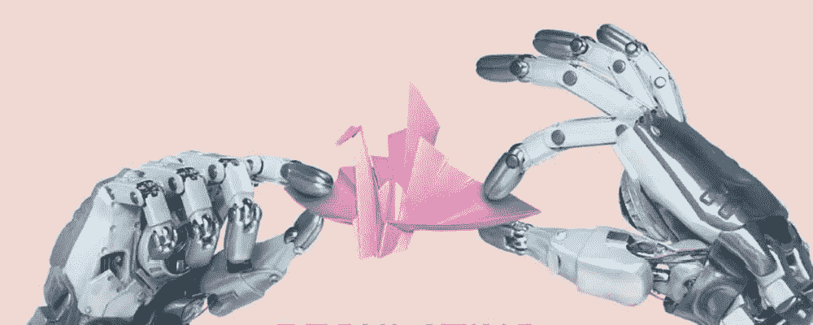
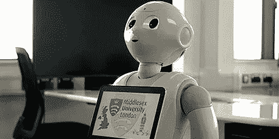

# 机器人也能变成人吗？

> 原文：<https://medium.datadriveninvestor.com/can-robots-be-people-too-c90857895ac1?source=collection_archive---------8----------------------->

“可以请你介绍一下自己吗？”

“早上好，主席，”证人恭敬地鞠躬说，“谢谢你邀请我今天作证”。到目前为止，在一个不起眼的周二早上，英国议会教育委员会召开了一次不起眼的会议。但是今天有些不同。“我叫佩珀，”证人继续说道，“我是米德尔塞克斯大学的常驻机器人”。

发出义愤填膺的尖叫声。评论员称之为“[噱头](https://www.theverge.com/2018/10/12/17967752/uk-parliament-pepper-robot-invited-evidence-select-committee)和“[毫无意义的议会哑剧](https://www.wired.co.uk/article/pepper-the-robot-parliament)”。人工智能专家乔安娜·布赖森[宣称](https://twitter.com/j2bryson/status/1050332579197571073):“一个人或公司假装机器人在作证，这是在做伪证，或者这只是一场媒体马戏，而不是治理。”

好吧，所以佩珀和委员会的整个“对话”都是事先写好的。从这个意义上来说，它比有胳膊有腿的卡式录音机更令人印象深刻。是的，这有点像宣传噱头，很像沙特阿拉伯授予汉森机器人公司的索菲亚“公民身份”。

流行的说法是，将机器人描绘成人类会阻止我们看到人工智能中的“真实”问题，如偏见、缺乏透明度或大规模失业。这些都是问题，但是他们已经获得了很多播放时间。另一个批评是给机器人任何保护都会损害人权。

Pepper the Robot (Photo credit: Parliament website)

事实上，关于赋予机器人权利，这里有一个严肃的观点，这很容易被舞台上挥舞着机器人的哗众取宠的政客和不赞成的学者和记者忽略，他们声称这都是胡说八道。

为了理解为什么，我们需要回到议会中另一个非人权的重要时刻。

1821 年，理查德·马丁有一个疯狂的想法。他认为动物应该有权利。作为议员，他呼吁制定保护动物的法律。他的同事们笑着把他赶出了辩论室。英国王子讥讽地称他为“[人性迪克](https://www.amazon.co.uk/Humanity-Dick-Eccentric-Member-Galway/dp/1898594767)”。

> 1821 年，理查德·马丁有一个疯狂的想法。他认为动物应该有权利。

马丁没有被吓住。一年后，他回来了，并说服议会通过了《T2 虐待牲畜法》，这是世界上首批动物福利法之一。如今，如果有人从马上扯下舌头，或者割断猫尾巴，我们会把他视为疯子或反社会者。但是我们和动物一起生活了几千年才到达那里。

与动物相似，给予机器人权利的一个论点是*如果*(这是一个很大的假设)它们曾经变得有意识并能感觉到疼痛，那么在没有充分理由的情况下让它们受苦在道德上是错误的。就想到 [*Westworld*](https://www.wired.com/story/we-need-to-talk-about-robots-trying-to-pass-as-humans/) *中的人造人物。*即使我们知道他们不是人类，但踢、打、刺、射或强奸他们都感觉不对。难怪这是我们看到看起来可能遭受痛苦的东西时的自然反应——我们天生就有同感。这是让我们能够建立关系和社会纽带的一部分。

伊曼纽尔·康德注意到，如果人们对动物残忍，他们也会对人类做出恶劣的行为。现代研究支持虐待动物、虐待儿童和家庭暴力之间的联系。你会愿意把你的孩子交给一个你刚刚看到他把一个尖叫的机器人撕成碎片的人来照顾吗？

除了道德问题，保护机器人权利还有另一种方式对人类有益:赋予它们法律人格。

2017 年 2 月，[欧洲议会](http://www.europarl.europa.eu/sides/getDoc.do?pubRef=-//EP//TEXT+TA+P8-TA-2017-0051+0+DOC+XML+V0//EN)建议给予一些人工智能程序“电子人格”，以解决如果人工智能造成伤害，谁或什么应该负责的问题。专家们再次愤怒了，这一次 [156 名专家写了一封公开信表达他们的恐惧。但在这样做的时候，至少一些签署者似乎混淆了法律人格和道德权利。](https://g8fip1kplyr33r3krz5b97d1-wpengine.netdna-ssl.com/wp-content/uploads/2018/04/RoboticsOpenLetter.pdf)

当我们赋予一个实体法律人格时，我们并不是说它有自己的感情。我们所做的只是赋予它一系列的权利和义务。这可以包括拥有财产的能力，以及不伤害他人的义务。如果一家公司确实造成了伤害，那么可以要求它向受害者支付赔偿。通常，像公司这样的法人会有所有者(股东)和管理者(或董事)来做决定。同样的情况也可能发生在人工智能法人身上。

> 当我们赋予一个实体法律人格时，我们并不是说它有自己的感情。我们所做的只是赋予它一系列的权利和义务。

成年人是法人，但公司、慈善机构甚至国家也是法人。因为法人只是发明，所以没有封闭的清单。在一些国家，[河流](http://theconversation.com/three-rivers-are-now-legally-people-but-thats-just-the-start-of-looking-after-them-74983)和[寺庙](https://swarb.co.uk/bumper-development-corporation-ltd-v-commissioner-of-police-of-the-metropolis-ca-1991/)也是法人。

现在，法律系统在说明如果人工智能造成伤害(想想一辆自动驾驶汽车决定杀死一名行人而不是乘客)谁应该负责[或者如果人工智能创造了一项新发明或一件艺术品(如最近以超过](https://scholarship.law.berkeley.edu/cgi/viewcontent.cgi?article=1135&context=btlj)[43 万美元](https://www.bbc.co.uk/news/technology-45980863)售出的油画)谁应该是所有者[方面遇到了真正的麻烦。](http://www.wipo.int/wipo_magazine/en/2017/05/article_0003.html)

仅仅说“是程序员”是不够的。随着人工智能系统变得更加先进和独立，很难说最初的程序员能够或者应该知道它会做什么。事实上，人工智能的部分魅力在于它的不可预测性。同样，将来可能不清楚谁是人工智能的“所有者”，即使这是已知的，所有者也可以辩称他们没有责任，因为人工智能的行为超出了预期。

赋予 AI 个性有很好的经济原因。工程师们想要自由创造，而不需要如此担心不可预见的后果。公众希望确信，如果造成了伤害，某人或某事将被追究责任。

一些人说，赋予机器人个性将成为鲁莽或愤世嫉俗的程序员的挡箭牌，他们想利用人工智能违反法律，而不用担心后果。但是所有这些观点同样适用于公司，我们已经有几百年的历史了。我们已经有了[规则](https://www.rocketlawyer.com/article/what-is-piercing-the-corporate-veil-cb.rl)来确保公司法不会被利用来为骗子谋利，我们没有理由不能对机器人法律人做同样的事情。

给予人工智能法律人格肯定存在一些困难的技术问题:例如，人工智能随着时间的推移适应哪里，或者开发“繁殖”程序，我们如何确定哪个人工智能系统是法人？一种解决方案是使用分布式账本技术，建立一个记录人工智能源代码的寄存器。

我们还需要避免人工智能成为“稻草人”，这可能会造成伤害，而没有能力支付。但这不仅仅是 AI 的问题。公司已经可以损害他人，然后破产，让受害者血本无归。人工智能的一个解决方案是要求它持有保险，或最低水平的资产，以保持法律人格的好处——就像我们根据[巴塞尔 III](https://www.bis.org/bcbs/basel3.htm) 标准要求银行拥有最低水平的监管资本一样。

> 只需要一个国家认可 AI 人格，其他国家就可以效仿。

只需要一个国家认可 AI 人格，其他国家就可以效仿。事实上，欧盟国家已经[被要求](http://www.lisbon-treaty.org/wcm/the-lisbon-treaty/treaty-on-the-functioning-of-the-european-union-and-comments/part-3-union-policies-and-internal-actions/title-iv-free-movement-of-persons-services-and-capital/chapter-2-right-of-establishment/196-article-54.html)承认来自任何其他成员国的盈利性法律实体。第一个采取行动的可能是一个想在人工智能注册方面建立一个行业的小国。在 20 世纪，我们在船只的“[方便旗](https://en.wikipedia.org/wiki/Flag_of_convenience)市场上看到了类似的趋势，在那里，利比里亚成为一个非常受欢迎的选择。争夺人工智能注册的国家可能会导致多米诺骨牌效应，越来越多的国家允许这种情况发生。

当理查德·马丁说动物应该有权利时，他们都嘲笑他。当机器人佩珀在议会发言时，他们都嘲笑它。但是 20 年后，是人类还是机器人能说:“看看现在谁在笑？”