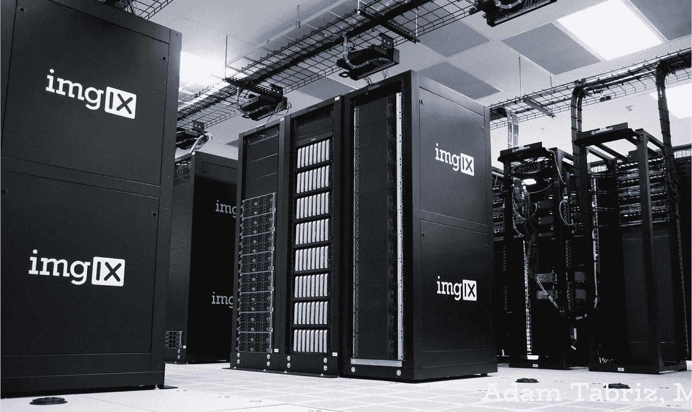

# 21 世纪医疗保健中医生角色的变化

> 原文：<https://medium.datadriveninvestor.com/changing-role-of-physicians-in-21st-century-healthcare-2beb26188d07?source=collection_archive---------2----------------------->

医生的角色在他们的职业中是典型的，他们用他们的技能来治疗病人。医患关系是经受住时间考验的最基本的方面之一。但是 21 世纪的许多力量正在试图破坏这种关系，改变医生的角色。

其中最重要的是与医疗保健行业相结合的技术进步，如人工智能、机器人、传感器、物联网、3D 打印、材料科学、大数据和分析、实时社交网络，以及越来越多的应用程序正在产生庞大的数据云。这些发展使得历史学家称 21 世纪为“数据主义”的时代

# 但是医生不高兴！

医疗保健 IT 技术的当前情景让医生们感到沮丧。由于缺乏透明度和无法将技术应用于实践，他们无法信任该系统。甚至这些技术在实施之前也没有在功能上与护理标准保持一致。

每一项倡议都遵循自上而下的方法，结果必然不尽如人意。这就导致了很多创业公司，逐利的公司交付开发了一半的产品赚快钱。未来似乎充满风险，因为人工智能等技术正在突飞猛进，并有望对医疗保健有益，尽管它们并不合适。

> 我们是否陷入了错误的协议、错误的算法和错误的技术让医生负责的境地？

这是系统疏忽的后果，从长远来看会让医生付出代价。医生作为个人、实体和整个社会的角色正在发生变化。我们必须面对各种困难和挑战，必须克服这些困难和挑战才能提供适当的治疗。我们必须适应、改变和调整，然后撤退和挑战，以变得高效和富有成效。所有这些变化都必须落实到我们的日常生活中，才能取得胜利。

> **医学是一个类似的领域**

每个行业或市场都是由其成员和利益相关者组成的，他们参与特定行业的日常活动。他们是唯一有资格和合法的人来改变场景，并带来准确性、安全性和有效性。

例如，开发银行部门的商业软件需要来自战略、会计和首席财务官的财务专家的参与。只有这样，软件才会适合特定的行业，并被证明是成功的。

这种趋势在实践中一直存在，将来也不会改变。今天的技术变革比以前发生得更快，旨在满足不断变化的需求。因此，变革的实施速度更快，一些行业跟不上。这种趋势将导致一种情况，即技术的不及时实施将在没有行业专家监督的情况下造成真空。这种技术仍然容易受到攻击和滥用，并将为错误提供空间。

> 我们过去经历过同样的事情！

# 技术必须在行业专家的监督下发展

在当今时代，技术已经成为我们生活的一部分。它可以使我们的生活更轻松，并为我们的客户和患者提供安全和效率。但是，如果这项技术不能被行业专家控制或改造，我们将面临灾难性的后果。

政府必须确保医生和医疗保健团体参与技术开发，以便能够成功验证和使用。对于人工智能等技术，需要有算法透明性，并符合护理和隐私标准。医生需要学习如何使用这些技术和操作人工智能机器。

政府还需要确保问责制。在没有首先创建一个透明的过程来说明技术和发展的情况下，对医生和医疗保健提供者引入单方面的授权是不公平的——这对医生、护理人员和患者都是不公平的。相反，需要让所有各方都参与进来，这样他们才能同步工作。它只是有助于实现更好的医疗实践。

我们已经受够了与电子健康记录、人工智能和机器学习相关的流行词汇。我们听说，未来医疗保健将被能够接触到病人每一个细节的公司接管。然而，没有足够的手段来确保护理标准和医疗服务的合规性。

这些变化必须在地方和各州实施，并应考虑到州政府机构，如卫生与人类服务部和医学委员会。政府也应该整合独立医师的做法，也应该结合变化。它应该借助技术不断地从卫生保健界收集反馈，以保证质量。

必须对医生进行培训，以便他们对不断发展的基础技术的理解能够得到提高。这个过程应该从医学院开始，从他们的实践开始就熟练掌握这些技术。

医生的技能必须得到协调，并被引导到正确的道路上，以创建有助于医疗保健等领域的正确工具。只有到那时，医生才能使用它们来实现积极的结果，并正确地帮助他们的病人。我们必须考虑医疗保健社区利益相关者的决策和判断，以便技术能够得到最佳利用。