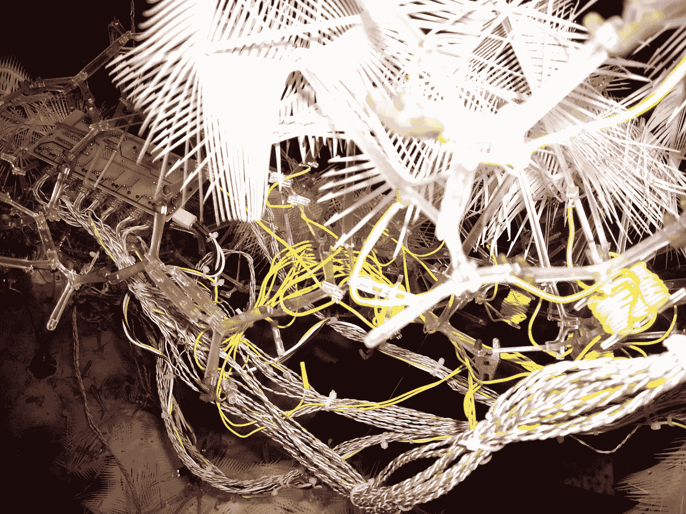

# 人工智能革命中的儿童权利(上)

> 原文：<https://medium.datadriveninvestor.com/child-rights-in-the-ai-revolution-6fdd7b5364b7?source=collection_archive---------8----------------------->

工业革命导致了儿童剥削的激增:在 19 世纪早期的英国，儿童开始工作的平均年龄是 10 岁；[在 1900 年的美国，18%的工人是儿童](https://www.history.com/topics/industrial-revolution/child-labor)。

直到 1989 年通过《T4 儿童权利公约》后，才建立了一个保护儿童免受经济剥削和确定最低就业年龄的国际框架。

> 随着人工智能革命的临近，儿童和年轻人越来越容易受到新方式的剥削。对儿童的数据剥削可能会成为人工智能革命的一部分，就像童工对于工业革命一样。

儿童和年轻人尤其容易受到新兴技术意想不到的负面影响，因为他们往往是早期采用者。例如，皮尤研究中心发现 [59%的美国青少年曾在网上受到欺凌或骚扰](http://www.pewinternet.org/2018/09/27/a-majority-of-teens-have-experienced-some-form-of-cyberbullying/)并且[智能手机的使用与青少年抑郁率的上升有关](https://theconversation.com/with-teen-mental-health-deteriorating-over-five-years-theres-a-likely-culprit-86996)。考虑到根据年龄限制使用在线技术的挑战性，这些风险非常严重。

儿童也往往不知道他们使用技术的方式受到监视，很少能够提供知情同意。例如，Privacy International 强调了 [ICE(美国移民、海关和执法局)如何使用一种商业搜索工具，称为 Giant Oak Search Technology](https://privacyinternational.org/feature/2216/who-supplies-data-analysis-and-tech-infrastructure-us-immigration-authorities) 。Giant Oak 的工具搜索网络的每个角落，包括社交媒体，大概是为了让 ICE 追踪个人。鉴于社交媒体在儿童和年轻人中的广泛使用，Giant Oak 很可能在利用儿童的数据。

> 物联网、虚拟现实、算法决策和机器学习的融合有可能在人工智能革命中加大对儿童的剥削。

收集的儿童数据量将呈指数级增长，这些数据的潜在使用案例也将呈指数级增长。随着人工智能革命进入教室、医疗保健和负责保护儿童的政府机构，新技术对儿童发展和身份造成持久和意想不到的变化(积极和消极)的能力也将大幅增加。

技术专家(和科幻小说作者)正在提高公众对人工智能革命风险的意识。然而，政策制定者仍在努力寻找最佳应对方式。基于人权的方法可以提供一条前进的道路。

本系列的第 1 部分将探讨基于人权的方法如何不同于监管方法，并介绍一些假设情景，以梳理人工智能革命对儿童的人权影响。第 2 部分将深入探讨知情同意的问题。第三部分待定。

# 为什么要采取基于人权的方法？

技术变革的速度超过了世界各地的政府。在这种情况下，对技术使用的监管方法是无效的。监管在本质上往往是具体的和禁止性的，监管者往往对新技术的采用做出反应，而不是积极主动地指导采用。欧洲隐私政策的演变凸显了这一点:脸书于 2008 年在都柏林建立了国际总部；直到 2018 年,《欧洲通用数据保护条例》( GDPR)才生效(虽然早在 2018 年之前就有数据保护计划，但 GDPR 是第一个应对脸书数据使用的完整范围的国家)。

GDPR 还强调了以权利为基础的新兴技术的变革机会。GDPR 的“[隐私源于设计](https://gdpr-info.eu/issues/privacy-by-design/)”原则为技术人员创造了考虑隐私的积极责任，并默认在他们产品的设计和开发中实现更大的隐私。这种积极的责任实际上是技术中立的:保护隐私的责任与所采用的技术无关。而且，这种积极的责任是可以执行的:监管机构有权要求技术专家证明他们在设计产品时是如何考虑隐私影响的。

随着新技术的出现，我们现有的人权框架需要更新。通过像 GDPR 这样的工具，我们扩展并完善了言论自由的概念。例如，被遗忘的权利实际上是试图让言论自由权与 1948 年难以想象的无处不在的信息获取方式兼容。

> 顾名思义，ICT 革命重塑了我们交流、收集和分享信息的方式。与信息和通信技术革命最密切相关的人权是见解和言论自由权，这并非巧合。当 ICT 革命让位于人工智能革命时，更广泛的人权将受到影响，兼容性挑战比比皆是。

下面，我概述了四个思想实验，旨在展示各种技术如何融合在一起影响儿童和年轻人，以及这些技术带来的一些人权挑战。每个思想实验都是一个假设场景，想象现有的和新兴的技术在未来十年将如何被采用。

# 孩子能同意什么？

*查理是一个 13 岁的孩子，他喜欢锻炼。生日那天，她要了一个 Fitbit 来帮助她跟踪自己的锻炼情况，她的父母给了她。Charlie 喜欢 Fitbit，并在接下来的五年里继续使用 Fitbit 产品。*

*快进。查理现在 18 岁，她的 Fitbit 已经收集了她五年的数据。与此同时，Fitbits 也变得更加复杂。Fitbit 关于 Charlie 的数据集现在包括她每天走了多少步，她的心率，每天消耗的卡路里，以及 GPS 定位。Fitbit 还刚刚宣布了两项新的合作关系:一个是与健康保险公司的合作，该公司将为经常锻炼的人提供特殊的医疗保健计划，另一个是与一家医疗初创公司的合作，该公司使用 Fitbit 的心率数据来识别心脏疾病患者。*

*一天早上，Charlie 的 Fitbit 收到了一条“看医生——心律不齐”的提醒。几年后，当 Charlie 开始研究健康保险时，一个提供者告诉她，她的先存疾病已经被计入她的保险费。*

# 儿童和他们的监护人应该有透明的权利吗？

*维多利亚州政府最近启动了一项新的开放数据计划，该计划使许多政府部门(包括教育部、卫生与公众服务部和警察局)收集的实时数据可供这些部门的每个人访问。*

*Mika 是墨尔本的一名数据科学家，为维多利亚警方工作。米卡感兴趣的是，他能否建立一种算法，可以预测儿童何时处于危险之中，并向相关政府机构建议行动。*

*Mika 使用少量关于可能的风险因素的初始假设(如果孩子连续三天缺课，如果父母最近被逮捕，如果父母最近开始接受 Centrelink 付款)对算法进行编程，然后向算法输入关于儿童虐待事件的历史数据档案，并使用机器学习程序来完善算法的预测能力。*

*米卡启动算法，它迅速开始实时识别处于危险中的儿童。根据这些建议，卫生与公众服务部能够更好地为有风险儿童的父母提供额外的支持。最重要的是，随着该算法的使用和开放数据计划在更多政府部门的扩展，该算法能够不断完善自己，提高准确性。最终，为了进一步提高准确性，该算法被连接到脸书和 Instagram 以及开放银行系统的公开数据。*

# 如果人工智能驱动的初创公司取代了学校，受教育权应该如何更新？

*丹两岁了。他的妈妈在硅谷工作，在一家专注于早期学习的教育初创公司工作。这家初创公司刚刚开发了一种新产品，一种旨在帮助非常年幼的儿童学习阅读的人工智能导师。人工智能导师还没有公开，但丹的妈妈可以使用它，并为丹安装在 iPad 上。*

*人工智能导师对丹来说非常成功。人工智能导师监控丹的眼球以跟踪他的注意力，并随着时间的推移学习如何让丹参与学习。最重要的是，人工智能导师还连接到丹的婴儿车和他父母的汽车，因此它可以跟踪丹的位置，并根据他访问的地方给丹提供新的课程。*

一晃三年过去了，丹已经上小学了。他的人工智能导师培养了他对阅读的热爱，他的阅读和写作能力已经远远超过了他的同龄人。人工智能导师还可以直接接入他的学校网络，这样他的新老师就可以看到丹的个人资料、他的阅读习惯和他的学习风格。丹远远领先于他的同龄人。

# 年轻人有权利做出贡献吗？

张莉今年 28 岁。高中毕业后，她在墨尔本大学学习医学，现在她的医学实习即将结束。她需要找到她的第一份工作，但正面临着危机。机器人、人工智能和虚拟现实改变了医院。他们现在的效率大大提高了。少数医生和专家可以治疗世界上任何地方的病人。诊断几乎完全自动化，机器学习算法识别疾病并开出治疗处方，比任何人类医生都要准确得多。大多数医院现在雇佣的数据科学家比医生还多。

张莉的大部分医学培训现在都是多余的，她正与数百名其他毕业的医生竞争仅有的几个职位。她可以接受护士再培训，但这需要几年时间，而且不能保证在她接受再培训时，护理工作不会实现类似的自动化。张莉一直认为她的生活会遵循一个特定的过程——学习、毕业、开始职业生涯、组建家庭、退休——但她现在不确定自己是否能被雇佣。

# 制定基于人权的方法

> 政策制定者和技术专家需要采取积极的基于人权的方法来保护那些在人工智能革命中面临剥削风险的人。真正基于人权的方法必须从受影响最大的人群开始:儿童和年轻人。

这里探讨的问题是一个更大范围的对话的起点。人工智能革命将带来的潜在变革广度和深度无法用政策制定者的被动监管方法来充分应对。

第二部分将探讨知情同意和数字时代的儿童。假设年龄限制实际上仍然不可能，我们将着眼于政策和产品干预，使儿童能够提供知情同意，并在不可能知情同意的情况下保护儿童的数据。