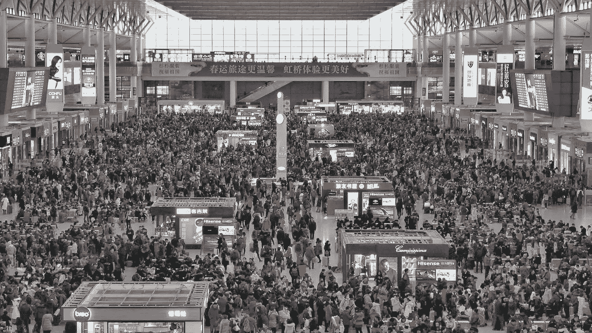

# 中国农民工:返乡

> 原文：<https://medium.datadriveninvestor.com/chinese-migrant-workers-homecoming-22dedf5f7185?source=collection_archive---------19----------------------->

《国际经济学杂志》最近的一篇论文揭示了贸易政策的不确定性是如何促使中国工人在中国境内大规模迁移的。根据该报援引的 2014 年统计数据，这场全国性的运动导致超过 20%的人口，即 2.78 亿人，在外生活和工作。

然而，随着美国和中国之间的贸易战升级，一些工人不得不怀着悲伤的心回家。

捷[报](https://www.sciencedirect.com/science/article/pii/S0022199619300352#s0090)把我们带回到 21 世纪初，那时中国被欢迎加入世界贸易组织(WTO)并准备开放。2000 年代初，中国出口商面临的贸易壁垒——以美国对世贸组织成员适用的最惠国关税和对非最惠国适用的威胁关税之间的差距来衡量——有所下降。随着中国获得最惠国待遇，贸易政策的不确定性减少，导致大量移民工人流入出口部门。农村人口离开家园，用他们灵巧的手指生产越来越多运往美国的商品

 [## 在中国做生意:如何优化您的运营|数据驱动的投资者

### 中国是一个受本地和外国公司欢迎的商业中心。在一个国家设立实体存在…

www.datadriveninvestor.com](https://www.datadriveninvestor.com/2019/03/17/doing-business-in-china-how-to-optimize-your-operations/) 

由于这一现象的巨大规模,“大迁徙”是必不可少的。正如作者所说，“如果中国的内部移民是一个独立的国家，他们将成为世界第四大移民国。”

Now, the trade war is sending these workers home. Three months before the Spring Festival of 2019, the social media of China has reported [migrant workers going home earlier](http://www.chinatimes.net.cn/article/82601.html) than in previous years. The annual “Chunyun (春运, [Spring Festival travel season](https://www.wikiwand.com/en/Chunyun)) usually sets off 15 days between the Festival. But in late 2018 and early 2019, exporters started announcing longer “holidays” for the year. [A textile factory gave its workers an extended holiday, from December 1 to March 10](https://3g.163.com/dy/article/E1FAUHJT05484YGV.html). [Samsung closed down its plant in Tianjin and sent 2600 workers home](https://www.reuters.com/article/us-samsung-elec-smartphones-china/samsung-to-shut-mobile-phone-plant-in-chinas-tianjin-idUSKBN1OB0YP). [Another phone manufacturer also closed its production line in Dongguan, Guangzhou](https://tech.sina.com.cn/digi/2018-11-18/doc-ihnyuqhh8420360.shtml). After the Chinese New Year, [some workers never set off to work in a new job](https://www.scmp.com/economy/china-economy/article/3008285/chinas-army-migrant-workers-becoming-older-and-less-mobile). As the stand-off between China and the U.S. president Trump escalates, [the exacerbating export sector would drive away more workers](https://www.scmp.com/economy/china-economy/article/3019916/us-trade-war-has-cost-china-almost-2-million-industrial-jobs).

中国劳动力市场目前的状况与杰论文中描述的美好前景正好相反。贸易壁垒曾经被拆除，现在又被放回去，让中国与美国脱钩。除了[飞涨的猪肉价格](https://www.wsj.com/articles/import-limits-effects-of-swine-fever-hit-pork-prices-in-china-11566990454)，正在进行的贸易战导致的更多苦难再次由已经悲惨的[农民工承受。](https://www.theatlantic.com/international/archive/2019/05/china-migrant-workers-miserable/589423/)

更多阅读和观看内容:

网飞最近的一部纪录片揭示了工作场所的文化冲突，让人们深入了解了中国工人勤劳和坚韧的天性，以及他们缺乏美国工人所享有的权利。