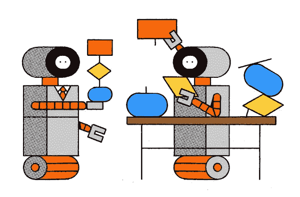

# 为您的分类模型选择最佳算法。

> 原文：<https://medium.datadriveninvestor.com/choosing-the-best-algorithm-for-your-classification-model-7c632c78f38f?source=collection_archive---------1----------------------->



在机器学习中，有一个叫做“[没有免费的午餐](http://www.no-free-lunch.org/)”的定理，意思是没有一种算法能很好地解决所有问题。这在预测模型中广泛适用，在预测模型中，我们根据算法训练数据集，然后使用训练好的模型对新数据进行预测。

因此，您应该尝试许多不同的算法来解决您的问题，同时使用一个“测试集”来评估性能并选择获胜者。

在这篇博客中，我们将完全按照上面所说的去做，我们将在不同的算法上训练我们的模型，然后选择最好的一个来对新数据进行预测。


> 如果你对机器学习概念完全陌生，我强烈推荐你通过我的 [**博客**](https://link.medium.com/OupfnHV3OS) 来熟悉机器学习概念。

让我们列出为实现目标要完成的任务

**读取数据**

**根据我们的从属和独立特征创建从属和独立数据集**

**将数据分成训练集和测试集**

**为不同的分类算法训练我们的模型，即 XGB 分类器、决策树、SVM 分类器、随机森林分类器。**

**选择最佳算法**

我们将使用鸢尾花分类数据集，这对于初学者来说是完美的，因为我希望这个博客对初学者友好。

我们的目标是正确地对花的类型进行分类，根据其属性，花可以是 setosa、versicolor、virginica 类型，即我们数据集中的 ***物种*** 列，我们还将确定最适合此问题的算法。

你可以从[这里](https://www.kaggle.com/uciml/iris/version/2)下载数据集

```
*#Import Libraries and Read the data*import pandas as pd 
import numpy as np
from sklearn.metrics import accuracy_score, confusion_matrix
from sklearn.ensemble import RandomForestClassifier
from sklearn import svm, tree
import xgboost
from sklearn.model_selection import train_test_splitdata  =  pd.read_csv("D://Blogs//Iris Multiple Algo//Iris.csv")*#Create Dependent and Independent Datasets based on our Dependent #and Independent features*X  = data[['SepalLengthCm','SepalWidthCm','PetalLengthCm']]
y= data['Species']*#Split the Data into Training and Testing sets with test size as #30*%X_train, X_test, y_train, y_test = train_test_split(X,y,test_size=0.3, shuffle=True)
```

现在，我们将创建一个分类器数组，并将不同的分类模型添加到数组中。

```
model1 = xgboost.XGBClassifier()
classifiers.append(model1)model2 = svm.SVC()
classifiers.append(model2)model3 = tree.DecisionTreeClassifier()
classifiers.append(model3)model4 = RandomForestClassifier()
classifiers.append(model4)
```

我们将在训练数据集上的分类器阵列中拟合我们的算法，并检查不同算法给出的测试数据集预测的准确性和混淆矩阵

```
for clf in classifiers:
    clf.fit(X_train, y_train)
    y_pred= clf.predict(X_test)
    acc = accuracy_score(y_test, y_pred)
    print("Accuracy of %s is %s"%(clf, acc))
    cm = confusion_matrix(y_test, y_pred)
    print("Confusion Matrix of %s is %s"%(clf, cm)
```

让我们来看看输出，它包含了分类器数组中每个算法的准确度和混淆矩阵

```
Accuracy of XGBClassifier is 95.55
Confusion Matrix of XGBClassifier is [[ 9  0  0]
                                      [ 0 15  1]
                                      [ 0  1 19]]Accuracy of SVC is 95.55
Confusion Matrix of SVC is [[ 9  0  0]
                            [ 0 16  0]
                            [ 0  2 18]]Accuracy of DecisionTreeClassifier is  88.88
Confusion Matrix of DecisionTreeClassifier is [[ 9  0  0]
                                               [ 0 15  1]
                                               [ 0  4 16]]
Accuracy of RandomForestClassifier is  84.44
Confusion Matrix of RandomForestClassifier is [[ 9  0  0]
                                               [ 0 15  1]
                                               [ 0  6 14]]
```

从我们的输出中可以清楚地看到，对于这个问题，XGBClassifier 和 SVC 优于决策树分类器和随机森林分类器，并且在我们的情况下证明是预测花类型的最佳算法。

您可以将上述技术应用于任何其他预测模型，以便在不同算法中找出最佳算法。

如果你喜欢这个博客，给它一些****与你的朋友分享*** ，你可以在这里 找到更多有趣的文章 [**，敬请关注更多有趣的机器学习技术和概念。**](https://medium.com/search?q=Rahil%20Hussain%20Shaikh)*