# 在 Google 云平台上使用 GPU 完成 Keras 迁移学习的分步指南

> 原文：<https://medium.datadriveninvestor.com/complete-step-by-step-guide-of-keras-transfer-learning-with-gpu-on-google-cloud-platform-ed21e33e0b1d?source=collection_archive---------0----------------------->


> 在本指南中，我选择了一个过期的[](http://www.kaggle.com)*竞赛— [**植物种苗分类**](https://www.kaggle.com/c/plant-seedlings-classification) 作为模板项目。该指南由五部分组成。*

*a.Google 云存储利用
b .初始化 GPU 计算引擎
c .安装 CUDA、cuDNN & Tensorflow-GPU
d .安装 Jupyter 笔记本
e .用 GPU 运行 Keras 迁移学习模型*

## *第一部分:谷歌云存储利用*

***步骤:1**
一开始，我们需要申请一个 [***谷歌云平台(GCP)***](https://cloud.google.com/) 账户，新客户在前 12 个月会有 300 美元的信用消费。*

*一旦我们登录到 GCP 控制台，我们需要创建一个新的项目，以便使用 GCP 服务。只需点击 ***新建项目*** 按钮，输入项目名称。同时，它会为您的项目分配一个唯一的项目 ID，我们需要使用它来访问终端中的 GCP。*

***步骤:2**
现在，我们将在存储中创建一个存储桶。有三种方法可以在存储中创建一个存储桶。*

> *1.Web UI
> 2。命令行
> 3。程序化(不打算谈论它)*

****Web UI:***
我们只需点击**创建桶**按钮，配置桶设置即可。*

**

****命令行:***
这个有点棘手。首先，我们需要用 Python 2.7 创建一个环境。然后，我们会安装谷歌云 SDK。既然我用 MacOS，我就把它作为 [***的例子***](https://cloud.google.com/sdk/docs/downloads-interactive) 。要安装和初始化 Google Cloud SDK，我们只需要在终端中键入三行代码。*

*   *在命令提示符下输入以下内容:*

```
*curl [https://sdk.cloud.google.com](https://sdk.cloud.google.com) | bash*
```

*   *重新启动外壳:*

```
*exec -l $SHELL*
```

*   *运行 gcloud init 来初始化 gcloud 环境:*

```
*gcloud init*
```

*运行“gcloud init”后，我们只需选择创建的目标项目，并使用我们的 Gmail 登录。这里有一个 [***安装快速入门指南***](https://cloud.google.com/sdk/docs/quickstarts) ，你可以根据你的机器设置选择合适的方法。*

*现在，我们可以开始使用 [***gsutil***](https://cloud.google.com/storage/docs/gsutil) 工具了。这里有几个主要的功能。*

```
*#Create a bucket:
**gsutil mb gs://<bucket_name>**#Copy some files to the bucket:
**gsutil cp <file_name_*> gs://<bucket_name>**#List the files in the bucket:
**gsutil ls -l gs://<bucket_name>**#Copy a file from our bucket back to the target directory
**gsutil cp gs://<bucket_name>/<file_name_*> /<target_dir>**#Delete the files:
**gsutil rm gs://<bucket_name>/<file_name_*>**#Remove the bucket:
**gsutil rb gs://<bucket_name>***
```

*这里有一些我们需要上传到桶的东西:
-训练&测试数据
-预训练模型*

*我创建了一个名为“plant-weekend”的文件夹，其中有两个子文件夹“Train”和“Test”来分别存储数据。还有，我们可以在这里下载[***vgg 16***](https://gist.github.com/baraldilorenzo/07d7802847aaad0a35d3)&[***vgg 19***](https://gist.github.com/baraldilorenzo/8d096f48a1be4a2d660d)的预训练模型权重。一旦它完成了将这些文件上传到 bucket，我们就可以继续下一部分了。*

## *第二部分:初始化 GPU 计算引擎*

***第一步:**
首先，我们需要点击进入 GCP 控制台的计算引擎页面。*

*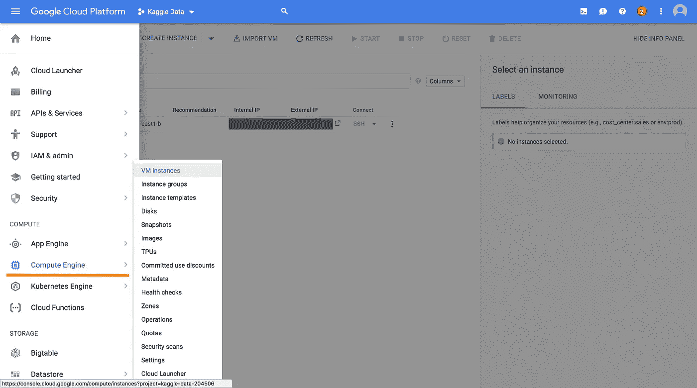*

*然后，我们需要点击顶部栏中的“ ***创建实例*** ”按钮，我们将进入该页面。*

***第二步:**
在这个阶段，我们需要在创建实例之前配置实例设置。*

*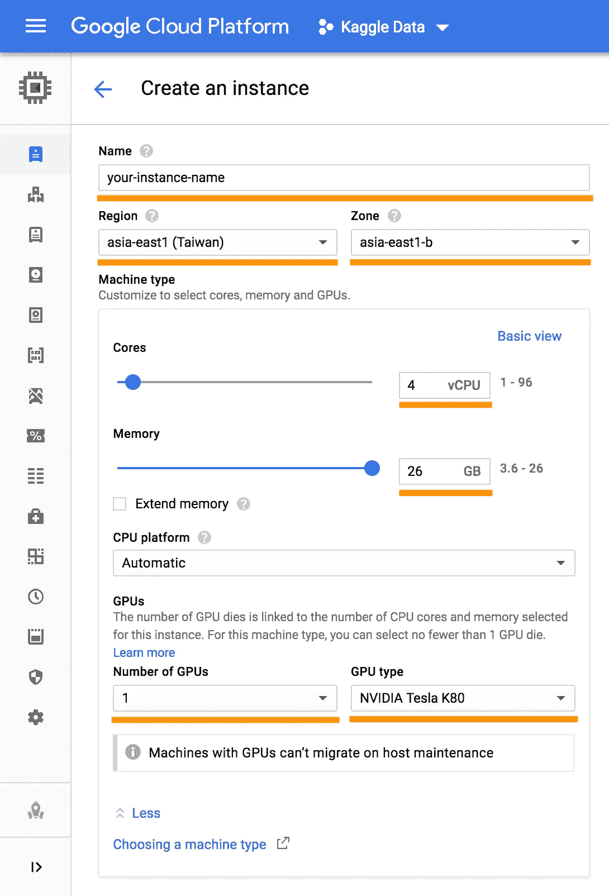*

*在上图中，我强调了一些我们应该改变的项目。首先，我们需要为这个实例分配一个惟一的名称。然后，我们必须为实例选择地区和区域。请注意，只有部分地区会提供 GPU 实例服务。我们可以通过这个链接查看信息:[https://cloud.google.com/compute/docs/gpus/](https://cloud.google.com/compute/docs/gpus/)*

*之后，我们需要决定机器类型，不用担心，因为我们可以在任何时候改变机器类型，即使实例已经创建。在这种情况下，我选择一个高内存 4 核 CPU 的机器，配 1 个 NVIDIA Tesla K80 GPU。您可以根据自己的需求调整机型，也可以在这里用 [***GCP 价格计算器***](https://cloud.google.com/products/calculator/) 查看价格。*

*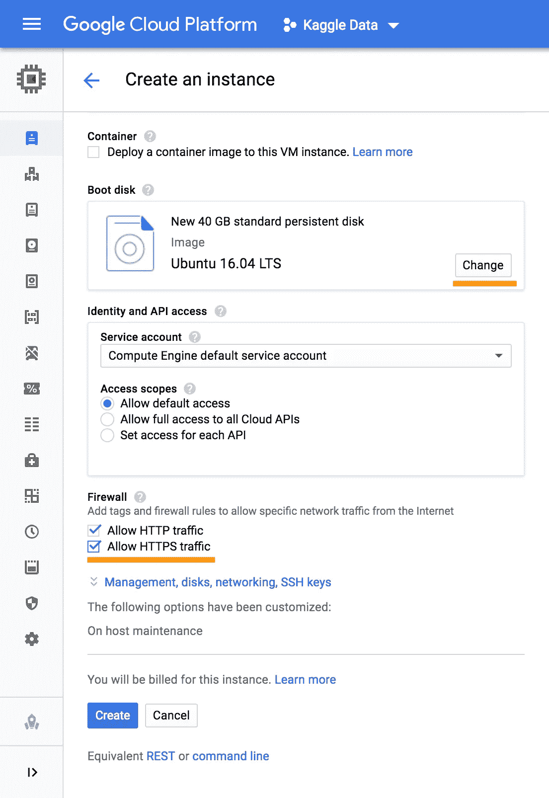*

*在配置页面的下半部分，我们将选中防火墙上的 HTTP 和 HTTPS 流量框。然后，我们单击启动盘部分的“更改”按钮。(默认是 10 GB 内存的 Debian GNU/Linux 9 (stretch)*

**

*一旦我们点击进入，我们可以选择 Ubuntu 16.04 LTS 磁盘，并将大小更改为 100 GB，因为我们有数千个图像要训练，需要为预训练权重和最佳训练模型保留内存空间。*

***步骤 3:**
在启动我们的实例之前的最后一步，我们需要请求 Google 增加我们的 GPU 配额，因为默认配额为零，通常只需要几个小时就可以获得批准。*

**

*通常，如果我们现在启动我们的 GPU 实例，它会在右上角弹出这个通知。我们需要做的是单击“请求增加”按钮。*

*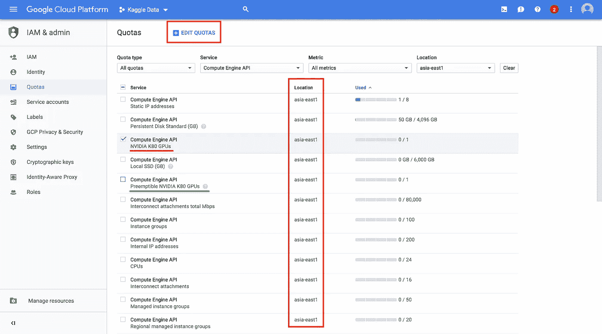*

*要编辑配额，我们需要使用我们在机器类型设置中选择的相同 GPU (NVIDIA K80)单击**计算引擎 API** ，位置必须与实例的区域相同。**善意提醒**不要选择可抢占的 NVIDIA K80，因为它是用于可抢占的实例，24 小时后会自动删除。然后我们可以点击顶部的**编辑配额**按钮来增加 GPU 配额，等待 Google 的批准。*

*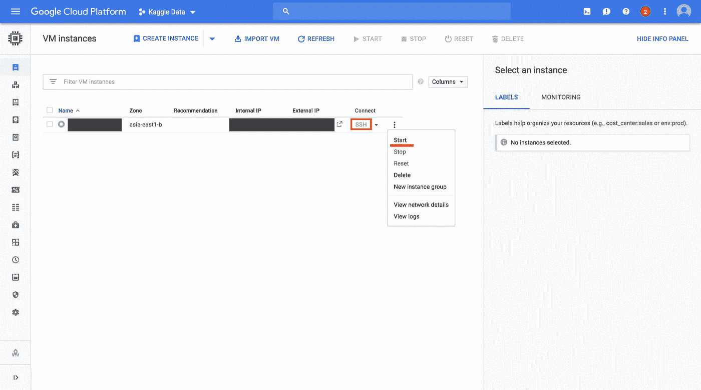*

*恭喜，我们终于可以通过点击开始按钮来启动我们的第一个 GPU 实例了！*

> *警告:一旦你打开它，实例将开始充电，因此，如果你不使用它，请提醒停止它。*

***步骤 4:**
在这一部分中，我们将启动实例并创建一个 Python 3 虚拟环境。*

*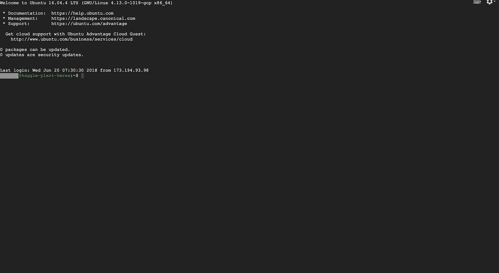*

*一旦我们点击 SSH 按钮，它将弹出一个新的窗口，有一个终端视图。然后我们只需要一步一步地运行这几行代码来设置我们的 python 环境。*

```
*# Download the Anaconda3
**wget** [**http://repo.continuum.io/archive/Anaconda3-4.0.0-Linux-x86_64.sh**](http://repo.continuum.io/archive/Anaconda3-4.0.0-Linux-x86_64.sh)# Install Anaconda3 **bash Anaconda3-4.0.0-Linux-x86_64.sh**# It will ask you this question and we would enter yes
**Do you wish the installer to prepend the 
Anaconda3 install location to PATH 
in your /home/haroldsoh/.bashrc ? 
[yes|no][no] >>> yes**# Use it right away
**source ~/.bashrc**# Create a Python 3 virtual environment
**conda create -n <env_name> python=3.5**# Activate our environment
**source activate <env_name>***
```

## *C 部分:安装 CUDA，cuDNN & Tensorflow-GPU*

**

***步骤 1:**
要在我们的实例中使用 GPU 函数，我们需要下载几个包。第一个是 CUDA 工具包，我们可以通过运行这些代码来安装它。*

```
*# Activate your environment
**source activate <env_name>**# download the CUDA 9.2
**curl -O** [**https://developer.download.nvidia.com/compute/cuda/repos/ubuntu1604/x86_64/cuda-repo-ubuntu1604_9.2.88-1_amd64.deb**](https://developer.download.nvidia.com/compute/cuda/repos/ubuntu1604/x86_64/cuda-repo-ubuntu1604_9.2.88-1_amd64.deb)# install the CUDA
**sudo dpkg -i cuda-repo-ubuntu1604_9.2.88-1_amd64.deb**# Downgrade it to 9.0 since tensorflow-gpu can only use v9.0
**sudo apt-get update
sudo apt-get install cuda-9-0**# check if CUDA is installed
**nvidia-smi***
```

*如果 CUDA 成功安装，它会显示类似这样的内容:*

*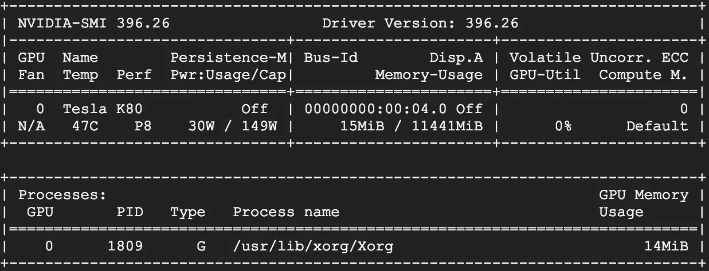*

*还有另一种安装 CUDA 的方法，因为有时 curl 可能不太好用。我们可以在这里 下载 CUDA 包 [*并将其上传到 bucket，然后运行这两个命令将文件复制到实例。*](https://developer.nvidia.com/cuda-downloads?target_os=Linux&target_arch=x86_64&target_distro=Ubuntu&target_version=1604&target_type=debnetwork)*

```
*# Initialize GCP in the instance
**gcloud init**# Transfer the file to your instance
**gsutil cp -r gs://<bucket_name>/<file_path> /home/<username>**# install the CUDA
**<Follow the upper commands>***
```

***第二步:** 在我们安装 cuDNN 之前，我们需要先注册一个 [***的 Nvidia 开发者账号***](https://developer.nvidia.com/) 。然后，我们需要 [***下载***](https://developer.nvidia.com/rdp/cudnn-download) 两个用于 Ubuntu 实例的包。*

*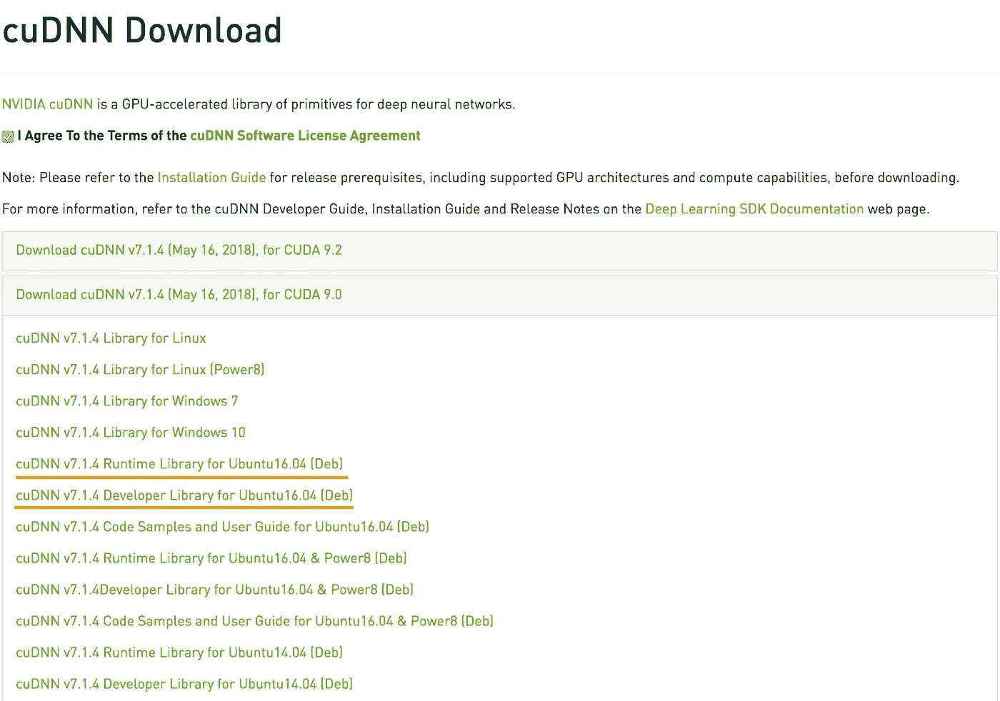*

> *我们要下载:
> -cud nn v 7 . 1 . 4 Ubuntu 16.04 运行时库(Deb)
> -cud nn v 7 . 1 . 4 Ubuntu 16.04 开发者库(Deb)*

*接下来，我们可以使用我上面提到的 bucket upload & file transfer 方法将这两个文件放入实例主路径。*

*最后，我们将运行这些命令来安装包。请记住先安装运行时库，否则会返回错误。*

```
*# install the cuDNN Runtime Library
**sudo dpkg -i libcudnn7_7.1.4.18-1+cuda9.0_amd64.deb**# install the cuDNN Developer Library
**sudo dpkg -i** [**libcudnn7-dev_7.1.4.18-1+cuda9.0_amd64.deb**](https://storage.cloud.google.com/kaggle-data-archive/libcudnn7-dev_7.1.4.18-1%2Bcuda9.2_amd64.deb)*
```

***第三步:***

*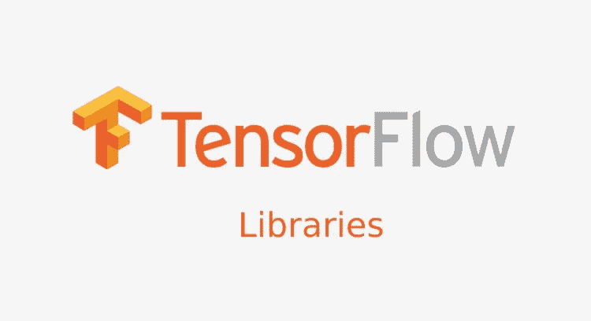*

*安装 tensorflow-gpu 包是本指南中最简单的部分。我们只需要运行两个代码。*

```
*# install the tensorflow-gpu
**pip3 install tensorflow-gpu**# Make sure the package is up to date
**pip3 install --upgrade tensorflow-gpu***
```

***第四步:**
为了验证 GPU 是否准备好使用，我们必须运行这几行代码。*

```
*# enter python 
**python**# check tensorflow **>>>import tensorflow as tf
>>>from tensorflow.python.client import device_lib**
**>>>print(device_lib.list_local_devices())***
```

*如果一切安装正确，它应该会返回如下内容:*

*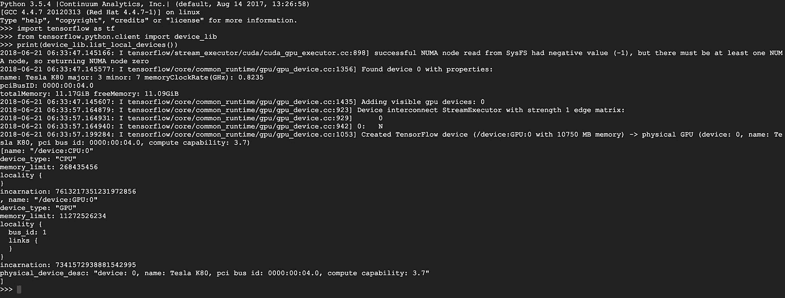*

## *D 部分:安装 Jupyter 笔记本*

*在我们安装 Jupyter 笔记本之前，我们需要配置实例网络设置。*

**

***步骤 1:**
由于初始 IP 是动态的，所以我们需要进入 VPC 网络>外部 IP 地址页面，将 IP 类型从短命配置为静态。*

**

***第二步:***

**

*在我们点击进入外部 IP 地址选项卡下的防火墙规则页面后。我们需要创建一个新的防火墙规则。*

**

*我们将在配置设置中插入两个项目。*

*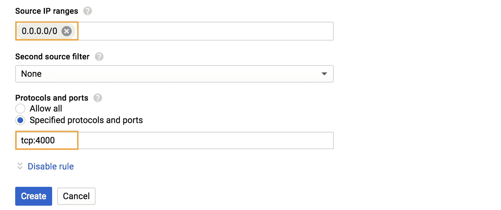*

*我们将为源 IP 范围输入“ **0.0.0.0/0** ”，并将协议和端口指定为“**TCP:<port _ number>**”，我选择了 **tcp:4000** 作为我的规则。*

*在我们继续之前，请确保我们的目标实例正在使用外部 IP 地址。我们可以点击右侧的“更改”按钮进行设置。*

**

***第三步:**
现在，我们可以启动 SSH 终端来安装我们的 Jupyter 笔记本了。*

```
*# Activate your environment
**source activate <env_name>**# download the jupyter notebook to your environment
**pip3 install Jupyter Notebook***
```

*一旦安装了 Jupyter 笔记本包，我们需要配置 Jupyter 笔记本设置。*

```
*# Generate Configuration file
**jupyter notebook --generate-config**# Check if the configure file exist
**ls ~/.jupyter/jupyter_notebook_config.py**# change directory to target path
**cd /home/<uesr_name>/.jupyter/**# open jupyter_notebook_config.py **nano jupyter_notebook_config.py***
```

*我们需要将这几行添加到配置文件中。*

```
***c = get_config()
c.NotebookApp.ip = '*'
c.NotebookApp.open_browser = False
c.NotebookApp.port = <Port Number>***
```

***jupyter _ notebook _ config . py**应该看起来像这样，我用绿色下划线来突出我们应该插入代码的地方。*

*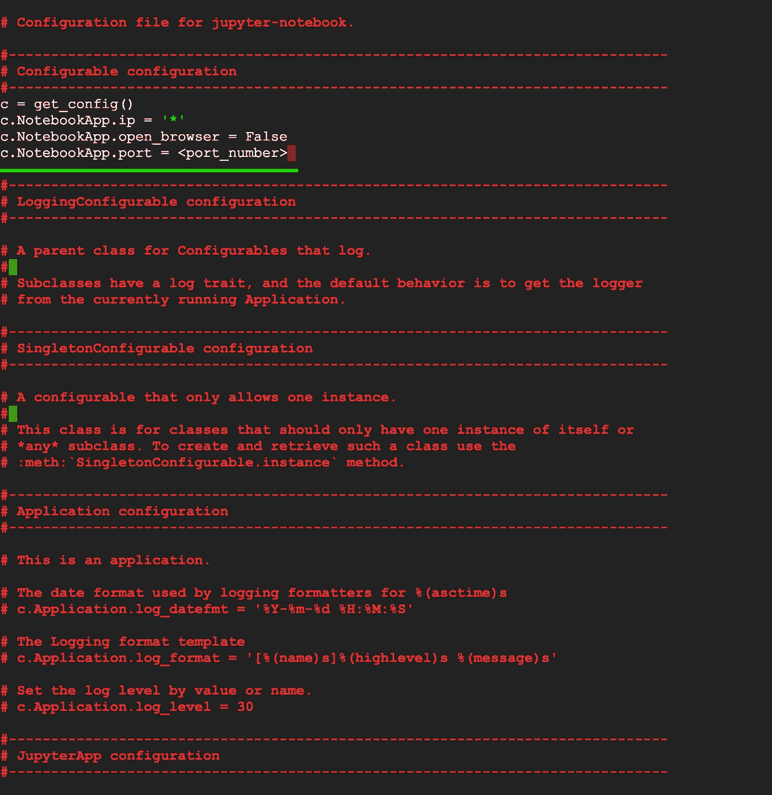*

*保存并退出文件，我们现在就可以启动 Jupyter 笔记本了！*

***第四步:**
在 Google Cloud 实例中启动 Jupyter Notebook 与我们在本地机器上做的有点不同。命令行是可变的，我们需要自己打开笔记本。*

```
*# Launch the Notebook
**jupyter-notebook --no-browser --port=<PORT-NUMBER>**# Insert this url in the browser url section to open notebook
**http://<External Static IP Address>:<Port Number>***
```

*现在我们应该看到这样的内容:*

**

*有时，它可能会显示以下页面，要求您输入密码或令牌:*

*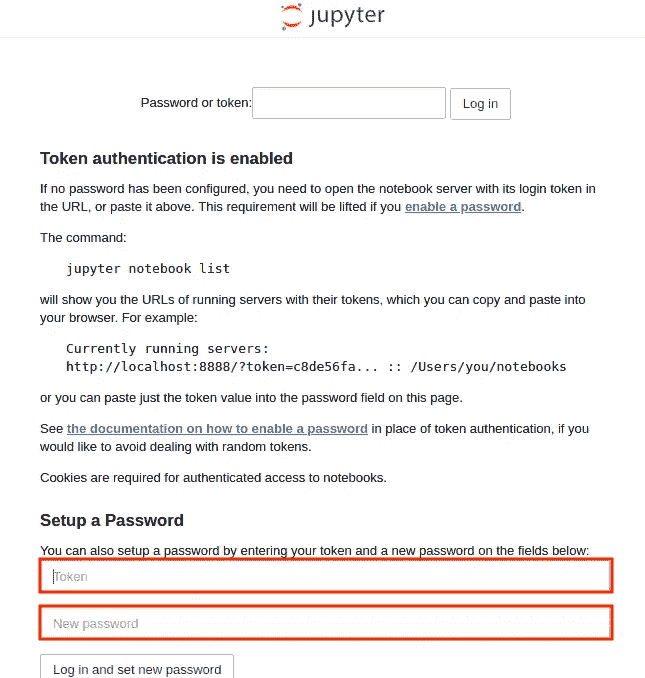*

*别担心，这是 Jupyter 笔记本的正常安全预防措施，以防止您访问的随机网站在您的机器上执行代码。如果我们查找 SSH 终端，您会发现一个这种格式的 URL。*

```
*# First time visit token
**http://<bucket_name>:<port_number>/?token=<token>***
```

*我们只需要复制 **<令牌>** 部分，粘贴到令牌栏，设置新密码，就可以顺利登录笔记本了。*

## *E 部分:使用 GPU 运行 Keras 迁移学习模型*

**

*[***Kaggle 植物幼苗分类***](https://www.kaggle.com/c/plant-seedlings-classification) 项目提供了 4750 幅训练图像，分为 12 类，794 幅测试图像，它们都有不同的分辨率和大小。因此，在输入 Keras 模型之前，我们需要裁剪图像并缩小它们。最重要的是，数据是不平衡的，因为一些类比其他类有更多的样本。这里是对数据的简要浏览。*

```
***~~~~~~~~~~~~~~~~~~~~~~~~~~~~~~~~~~~~~~~~~
The number of category is 12
~~~~~~~~~~~~~~~~~~~~~~~~~~~~~~~~~~~~~~~~~
Here are the training data intel:
- Black-grass 263 images
- Charlock 390 images
- Cleavers 287 images
- Common Chickweed 611 images
- Common wheat 221 images
- Fat Hen 475 images
- Loose Silky-bent 654 images
- Maize 221 images
- Scentless Mayweed 516 images
- Shepherds Purse 231 images
- Small-flowered Cranesbill 496 images
- Sugar beet 385 images***
```

*在这个迁移学习模型中，我采用了 VGG 16 和预先训练好的“imagenet”权重。模型的输入形状为(224，224，3)，输出形状为(12)。我简单地删除了输出形状为 1000 的最后一个密集层，并添加了输出形状为 12 的密集层，“softmax”激活，权重初始值为“glorot _ Norma”l(又名 Xavier Normal)。这是模型的亮点。*

```
***# VGG_16 model above with the last layer**
model.add(Dense(1000, activation='softmax'))    ***# Load VGG_16 pretrained weight*** model.load_weights('./pre_trained_model/vgg16_weights.h5', by_name=True)***# Remove the last softmax Dense layer*** model.pop()***# Add a new Dense layer to output 12 classes*
*# Initialize the weight with Xavier Normal Initialization*** model.add(Dense(12, activation='softmax', kernel_initializer='glorot_normal')) ***# Using SGD as an optimizer with learning rate=0.001 and decay = 0.000001*** sgd = SGD(lr=1e-3, decay=1e-6, momentum=0.9, nesterov=True)***# Compile model with custom fscore metric*** model.compile(optimizer=sgd, loss='categorical_crossentropy', metrics=['accuracy', fscore])*
```

*基本上，通过我们之前所做的所有设置，Jupyter 笔记本将使用 GPU 自动运行。而且，我没有做太多的数据预处理和超参数调整，因为这是一个步行通过指南项目。我简单地运行了 20 个 epoch，批处理大小= 32，每个 epoch 花费了大约 130 秒，而 CPU 每个 epoch 至少需要 6000 秒。因此，精确度不是很高，但是训练 fscore 仍然高于 0.89。*

```
*Epoch 1/20
3800/3800 [==============================] - 144s 38ms/step - loss: 2.4417 - acc: 0.1300 - fscore: 0.0000e+00 - val_loss: 2.4202 - val_acc: 0.1221 - val_fscore: 0.0000e+00.
.
.Epoch 20/20
3800/3800 [==============================] - 126s 33ms/step - loss: 0.2892 - acc: 0.8887 - fscore: 0.8912 - val_loss: 0.4537 - val_acc: 0.8495 - val_fscore: 0.8551*
```

*整个 Jupyter 笔记本可以克隆到我的 Github 上，我的下一篇博文将会谈到如何提高这个项目的准确性。希望它能帮助那些不知道如何在云上训练模型的人，并保持关注！*

*[](http://eepurl.com/dw5NFP)*