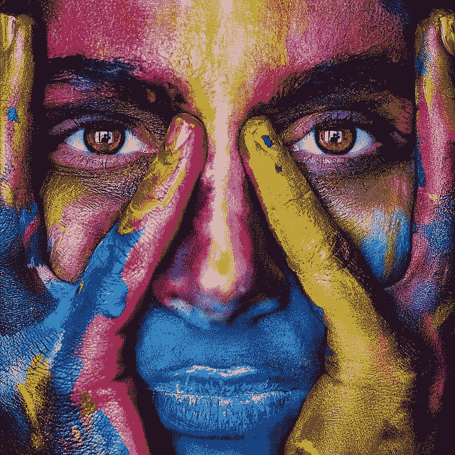

# 人脸计算机视觉(3/3)

> 原文：<https://medium.datadriveninvestor.com/computer-vision-with-human-faces-3-3-c15665228cc?source=collection_archive---------31----------------------->

## 来自面部的颜色信息

在之前的帖子中，我们谈到了出于不同目的从面部提取信息的[广泛应用](https://medium.com/@sosegon/computer-vision-with-human-faces-1-3-18601e0bd252)。然后，我们探索了来自面部的[类型的几何信息。在本帖中，我们将简要探讨不同类型的应用程序所使用的颜色信息类型。](https://medium.com/@sosegon/computer-vision-with-human-faces-2-3-752265f4bbf7)

在计算机视觉中，颜色最显著的特征之一是能够以多种格式表现出来。由于这一特性，可以根据应用领域将图片中的颜色信息从默认颜色空间(通常用红色、绿色和蓝色分量表示)转换为更合适的格式。这个属性被几个系统用于不同的目的，包括显式图像检测[1]和人脸检测[2]。其他利用颜色信息的应用包括面部跟踪[3]和凝视跟踪[4]。

在过去的几年中，几种类型的研究已经广泛地研究了数字图像中的人类肤色。在以前的研究中取得的重大进展之一是确定了研究人类皮肤的适当颜色空间。尽管对几乎任何颜色格式的适当分析都可以在检测皮肤区域的应用中产生良好的结果[5]，但是分离色度和亮度分量的颜色空间(YCbCr)已经证明可以提供最佳的结果。这些结果背后的主要原因是亮度元素(Y 属性)没有给出太多关于皮肤的信息，并且许多系统丢弃了它。

Color is an important type of information in faces.

即使一些皮肤检测应用忽略了亮度信息；其他备选方案需要这些信息来区分人脸和人体其他部位，因为它提供了关于人脸的许多线索。然而，2D 图像的主要缺点是颜色对光照变化的敏感性，这是降低几个系统性能的主要问题。这种操作退化的主要原因是使用在良好控制的照明条件下拍摄的图像，这在现实世界中并不总是可能的。一些方法试图通过使用高斯滤波器和执行主成分分析(PCA) [6]或者增加图像的对比度和从面部过滤最佳特征来解决这个问题[7]。

皮肤并不是颜色的唯一来源，其他面部器官如眼睛和头发也能提供有价值的信息。事实证明，对这些元素的数据分析在视线追踪[8]和个人识别[9]等应用中非常有用。与彩色图像中的眼睛相关的一个显著缺点是红眼效应，这主要是由不良的光照条件和来自照相机的闪光与脉络膜的相互作用引起的。这个事实已经得到了很好的研究，并且已经提出了一些替代方案来纠正它[10]。

类似于几何特征，脸的颜色也容易变化。这里的差异也可能取决于受试者的行为，例如化妆的使用。然而，图像中的大多数颜色可变性来自于捕捉场景的设备的配置(曝光时间、快门速度等)。)，以及环境设置(灯光、阴影等)。).尽管如此，肤色的可变性不仅带来问题，而且还可以用来进行健康相关的分析[11]。

# 结论

在这个系列中，我们探索了来自人脸的两种重要信息类型及其应用。正如所见，人脸是大量信息的来源。可以利用不同类型的数据来处理大量的计算机视觉任务。尽管几何信息和颜色信息各有优缺点，但它们并不是互斥的选择，而是可以结合起来弥补各自的不足，最大限度地提高应用程序的性能。

# 参考

[1]巴西利奥，J. A. M .，托雷斯，G. A .，佩雷斯，G. S .，麦地那，L. K. T .，& Meana，H. M. P. (2011 年)。使用 YCbCr 空间颜色模型作为皮肤检测的显式图像检测。*数学和计算机工程的应用*，123–128。

[2]加西亚和茨里塔斯(1999 年)。基于量化肤色区域合并和小波包分析的人脸检测。 *IEEE 多媒体汇刊*， *1* (3)，264–277。

[3]施沃特、卡尔和詹姆斯·克劳利。"使用颜色进行鲁棒的人脸跟踪."*自动人脸和手势识别，2000。诉讼程序。第四届 IEEE 国际会议于*。IEEE，2000 年。

[4]席勒和韦贝尔(1995 年 6 月)。基于人脸颜色的视线跟踪。在*自动人脸和手势识别国际研讨会*(第 476 卷)。苏黎世大学计算机科学系多媒体实验室。

[5]阿尔比奥尔，a .，托雷斯，l .，&德尔普，E. J. (2001 年 10 月)。皮肤检测的最佳颜色空间。在*ICIP①*(第 122—124 页)。

[6]刘大洪，林国明，沈立山(2005).光照不变的人脸识别。*模式识别*， *38* (10)，1705–1716。

[7]高伟昌、许明春、杨玉英(2010)。光照不变人脸识别中的局部对比度增强和自适应特征提取。*模式识别*， *43* (5)，1736–1747。

[8] Kim，K. N .，& Ramakrishna，R. S. (1999 年)。基于视觉的人机界面视线跟踪。在*系统、人和控制论，1999 年。IEEE SMC'99 会议录。1999 年 IEEE 关于*的国际会议(第 2 卷，第 324-329 页)。IEEE。

[9]y .亚库布和 L. S .戴维斯(2006 年)。毛发的检测和分析。 *IEEE 模式分析汇刊&机器智能*，(7)，1164–1169。

[10]f . Volken，j . Terrier 和 p . vande walle(2006 年 1 月)。基于巩膜和肤色检测的红眼自动去除。在*图形、成像和视觉中的色彩会议*(2006 年第 1 卷，第 359–364 页)。影像科学与技术学会。

[11] Tsumura，n .，Ojima，n .，Sato，k .，Shiraishi，m .，Shimizu，h .，Nabeshima，h .，… & Miyake，Y. (2003 年)。通过提取皮肤中的血红蛋白和黑色素信息进行基于图像的皮肤颜色和纹理分析/合成。 *ACM 图形事务(TOG)* ， *22* (3)，770–779。

嗨，我是[塞巴斯蒂安](http://se-vel.com)。我是软件开发人员和人工智能顾问。我从事与机器学习、计算机视觉和 UX 相关的项目。在 [LinkedIn](http://linkedin.com/in/sosegon/) 上与我联系。