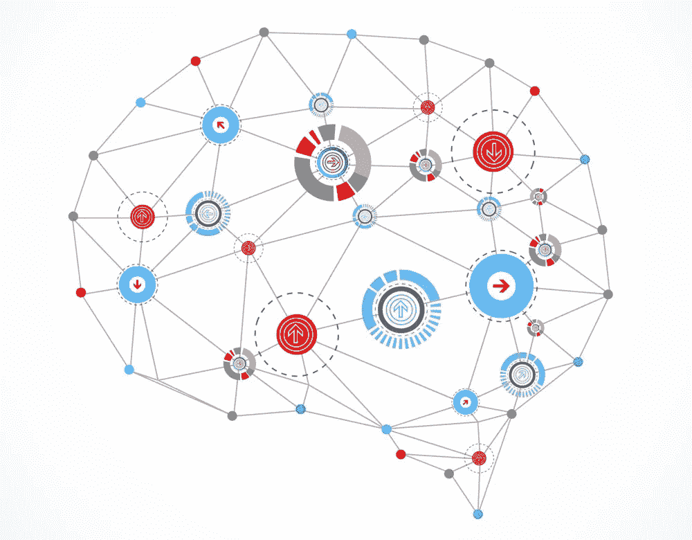

# 带深度学习的字幕

> 原文：<https://medium.datadriveninvestor.com/create-a-caption-with-deep-learning-796680d234f5?source=collection_archive---------9----------------------->

[](http://www.track.datadriveninvestor.com/1B9E)

[image source](http://learning-systems.org/events/deep-learning)

我们将探索如何使用深度学习生成图像标题。读者应该熟悉 python。你需要安装 [keras](https://www.pyimagesearch.com/2016/11/14/installing-keras-with-tensorflow-backend/) 和 [numpy](https://docs.scipy.org/doc/numpy/user/install.html) 库。

Keras 是一个开源的神经网络库，简单易学。我们将使用它来为给定的图片生成标题。让我们开始吧…

```
 from keras.preprocessing import image
# image library  will be used to shape our image in a shape which #our model can understandfrom  keras.applications.vgg16 import VGG16,preprocess_input,decode_predictions# preprocess_input does color normalization 
# decode_prediction  does the  classificationimport os
import numpy as np
```

我们将使用 [VGG16](https://neurohive.io/en/popular-networks/vgg16/) 作为我们的深度学习模型。我们本来可以从头开始训练我们自己的模型，但是这需要时间，而且从头开始构建会更加复杂。深度学习的美妙之处在于你可以使用预先训练好的模型。预训练模型是由其他人创建的模型，可用于解决类似问题。


[VGG16 network architecture](https://neurohive.io/en/popular-networks/vgg16/)

接下来，我们需要检查文件是否是图像格式，

```
if(not os.path.isfile(path)): raise Exception(" File not Found") # check if the file exist
image_format =['jpeg','png','jpg'] # image formatsassert(path[-4:] in image_format or path[-3:] in image_format),"Image format required"  # check if the file is has an 
#image extension 
```

接下来，我们在 VGG16 可以处理的维度上重塑图像。VGG16 只能处理(224，224)形状的图像。

```
#  path is the location of our image to be predicted
# we shall use image library in keras to process our imageimg = image.load_img(path,target_size=(224,224))image_array = image.img_to_array(img)image_array = np.expand_dims(image_array,axis=0)image_array = preprocess_input(image_array)
```

最后一步是创建我们的模型并用它来预测，

```
# we shall load  our model and use it to predictmodel = VGG16(weights='imagenet')predict=model.predict(image_array)predicted = decode_predictions(predict, top=1)print("Predicted:",predicted[0][0][1])#predicted[0][0][1] is shaped in this way to return only the caption
```

现在我们可以将所有的代码合并到一个函数中，

```
from  keras.applications.vgg16 import VGG16,preprocess_input,decode_predictionsfrom keras.preprocessing import imageimport osimport numpy as npfrom keras.utils import  plot_modeldef predict(path,variable=1): if(not os.path.isfile(path)): raise Exception(" File not Found") image_format =['jpeg','png','jpg'] assert(path[-4:] in image_format or path[-3:] in          image_format),"format not known" model = VGG16(weights='imagenet') img = image.load_img(path,target_size=(224,224)) image_array = image.img_to_array(img) image_array = np.expand_dims(image_array,axis=0) image_array = preprocess_input(image_array) predict=model.predict(image_array) predicted = decode_predictions(predict, top=variable) print("Predicted:",predicted[0][0][1])
```

现在，我们的模型开始工作了。让我们称之为

```
path="ADD THE PATH OF YOUR IMAGE HERE"predict(path=path)
```

完成后，我们创建了一个图像标题生成器。！！！

# DDI 特色数据科学课程:

*   [**用于数据科学的 Python**](http://go.datadriveninvestor.com/intro-python/mb)
*   [**深度学习**](http://go.datadriveninvestor.com/deeplearningpython/mb)
*   [**数据可视化**](http://go.datadriveninvestor.com/datavisualization/mb)

**DDI 可能会从这些链接中收取会员佣金。我们感谢你一直以来的支持。*