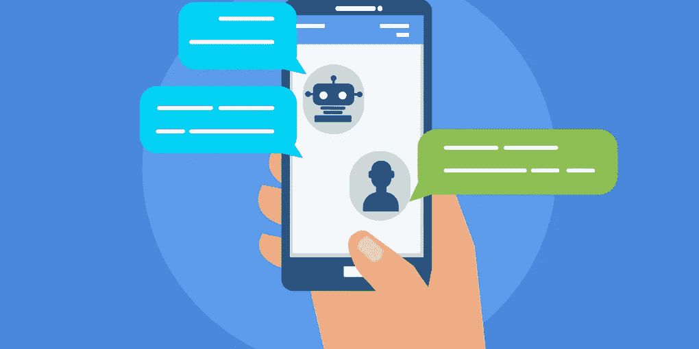

# 使用 ChatterBot 在 Python3 中创建个人聊天机器人(第 1 部分—设置)

> 原文：<https://medium.datadriveninvestor.com/creating-a-personal-chatbot-in-python3-using-chatterbot-part-1-e21e5eff1228?source=collection_archive---------0----------------------->

[](http://www.track.datadriveninvestor.com/1B9E)

我们看到聊天机器人到处涌现，但我们如何利用它们来直接造福于我们自己？也许你想通过对话来学习一门不同的语言。拥有用声音获取股票信息的能力怎么样？聊天机器人可以发信息、打电话、发电子邮件等等。

我们将使用 Python3 来构建我们的聊天机器人。如果您没有安装 Python3，请使用下面的链接之一在您的操作系统上安装它。

**Python3 for Windows**

[](https://docs.python-guide.org/starting/install3/win/) [## 在 Windows 上安装 Python 3——Python 的搭便车指南

### 虚拟环境是一种工具，通过创建……将不同项目所需的依赖关系保存在不同的位置

docs.python-guide.org](https://docs.python-guide.org/starting/install3/win/) 

**OS X 蟒 3 Mac**

[](https://docs.python-guide.org/starting/install3/osx/) [## 在 Mac OS X 上安装 Python 3——Python 的搭便车指南

### Mac OS X 的最新版本 High Sierra 自带 Python 2.7。您不需要安装或…

docs.python-guide.org](https://docs.python-guide.org/starting/install3/osx/) 

如果不想设置 Python 环境，可以使用文本编辑器，如 Atom 或 Sublime Text。两者的链接如下:

**原子**

[](https://atom.io/) [## 21 世纪的可破解文本编辑器

### 在 GitHub，我们正在构建我们一直想要的文本编辑器:从本质上来说是可破解的，但在第一天就变得平易近人…

atom.io](https://atom.io/) 

**崇高的文字**

[](https://www.sublimetext.com/) [## sublime Text——一个复杂的代码、标记和散文文本编辑器

### Sublime Text 是一个复杂的代码、标记和散文文本编辑器。你会喜欢光滑的用户界面…

www.sublimetext.com](https://www.sublimetext.com/) 

在开始之前，我们需要安装所有必要的 pip。打开您的终端并运行以下命令:

## Pip 安装:

```
pip3 install chatterbot
pip3 install python-levenshtein 
```

# 设置聊天机器人

首先新建一个文件，命名为 Chatbot.py，在开始之前，我们需要导入 Chatterbot 因此，我们将采用以下方法:

```
from chatterbot import ChatBot
```

接下来，我们将创建 ChatBot 类的一个新实例。

```
chatbot = ChatBot(‘Brandon’, trainer=‘chatterbot.trainers.ListTrainer’)
```

现在我们需要处理从用户输入中获得响应。使用以下代码从输入“Hello”中获得响应:

```
response = chatbot.get_response("Hi there")print(response)
```

到目前为止，您的 ChatBot.py 文件应该是这样的:

```
from chatterbot import ChatBotchatbot = ChatBot('Brandon',trainer='chatterbot.trainers.ListTrainer')response = chatbot.get_response("Hi there")print(response)
```

# 训练聊天机器人

为了开始训练我们的新聊天机器人，我们将在与 ChatBot.py 相同的目录中创建一个名为 Train.py 的新文件。同样，我们需要导入 Chatterbot，因此我们将使用:

```
from chatterbot import ChatBot
```

现在我们想开始让我们的聊天机器人在我们与它交流时学习。我们的训练方法是设置输入在响应之前，两者用逗号分隔。请看下面的实现，以获得更好的想法。

首先，创建一个聊天机器人的实例。

```
chatbot = ChatBot('Brandon',trainer='chatterbot.trainers.ListTrainers')
```

在这里我们将开始我们的训练。您可以多次运行培训过程，以提高对特定输入的响应。您还可以使用多个对话在给定的 chatbot 实例上进行训练。我们将在另一个时间讨论训练聊天机器人的不同方法。

```
chatbot.train([
    "Hello",
    "Hi there!",
    "How are you doing",
    "I'm doing great, how about you",
    "That is good to hear",
    "Thank you",
    "You're welcome"
])chatbot.train([
    "Good bye!",
    "See you soon!",
])
```

到目前为止，您的 Train.py 文件应该如下所示:

```
from chatterbot import ChatBotchatbot = ChatBot('Brandon',trainer='chatterbot.trainers.ListTrainers')chatbot.train([
    "Hello",
    "Hi there!",
    "How are you doing",
    "I'm doing great, how about you",
    "That is good to hear",
    "Thank you",
    "You're welcome"
])chatbot.train([
    "Good bye!",
    "See you soon!"])
```

# 测试您的聊天机器人

现在您已经创建了您的 chatbot 和训练它的方法，打开您的终端，导航到包含 ChatBot.py 和 Train.py 文件的目录，并运行以下命令:

```
python3 Train.py
```

在所有的进度条都完成加载后，您现在可以使用以下命令运行 ChatBot.py:

```
python3 ChatBot.py
```

结果应该返回“Hello”。您刚刚完成了聊天机器人的设置和测试。请随意在 Train.py 中添加更多对话，并尝试再次测试。添加新对话后，请务必再次运行您的 Train.py 文件。

ChatterBot 的文档可以在下面找到:

[](https://chatterbot.readthedocs.io/en/stable/tutorial.html) [## 聊天机器人教程-聊天机器人 0.8.7 文档

### 本教程将指导您使用 ChatterBot 创建一个简单的命令行聊天机器人。

chatterbot.readthedocs.io](https://chatterbot.readthedocs.io/en/stable/tutorial.html) 

ChatterBot 培训的文档可以在下面找到:

[](https://chatterbot.readthedocs.io/en/stable/training.html) [## 培训-聊天机器人 0.8.7 文档

### ChatterBot 包括一些工具，可以帮助简化训练聊天机器人实例的过程。ChatterBot 的训练过程…

chatterbot.readthedocs.io](https://chatterbot.readthedocs.io/en/stable/training.html) 

请阅读第 2 部分，开始在您的聊天机器人中实现 Microsoft Azure 语言翻译。

[](https://medium.com/@brandonellis_56087/creating-a-personal-chatbot-in-python3-using-chatterbot-part-2-language-translation-9e819d8d971b) [## 使用 ChatterBot 在 Python3 中创建个人聊天机器人(第 2 部分—语言翻译)

### 设置 Microsoft Azure 语言翻译

medium.com](https://medium.com/@brandonellis_56087/creating-a-personal-chatbot-in-python3-using-chatterbot-part-2-language-translation-9e819d8d971b)