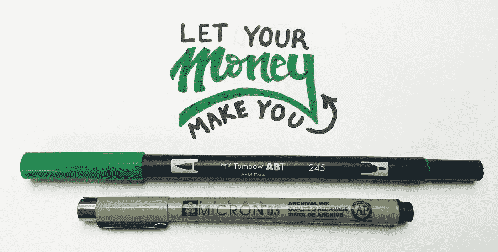

# 信用应该是你的秘密武器

> 原文：<https://medium.datadriveninvestor.com/credit-should-be-your-secret-weapon-25f90d84b38?source=collection_archive---------2----------------------->

# 在我们开始之前，让我们设定一些基本规则:

1.我绝不是金融顾问、金融专业人士、投资银行家、货币专家、国税局员工或专业洗钱者。在过去的 5 年里，我简单地做了几件事，并取得了积极的成果，我很乐意与你分享。

2.这不是关于如何快速致富的解释，也不是致富、赚大钱或过奢侈生活的指南。

既然所有的问题都解决了，让我们开始吧。

我已经活了将近四分之一个世纪，目前正在赚我一生中赚得最多的钱。

如果你把这些声明作为独立的实体来阅读，你可能会推断出我是某个拿着高薪的家伙，或者我是因为发明了某个杀手级应用程序而暴富的。这两件事都是假的。我有一份收入颇丰的全职工作，我拼了命才有了今天的成就——无论是在职业上还是经济上。我在大学的时候就开始了我将要和你分享的一切。所以没有任何借口让你不能现在就开始，不管你的生活/职业/无论你处于什么阶段。

顺便说一句，我没有也不会从任何人/公司/服务那里得到与你分享这些东西的报酬——这只是我，泰勒，作为一个朋友与你交谈。应用或不应用任何或所有这些材料取决于您。

# 我们开始吧。

建立信用很重要，尤其是在你 20 多岁和 30 出头的时候。你应该把你的钱存起来。厌倦了吗？我是。我知道存钱很重要。但是存钱需要时间，更重要的是额外的钱——这两样我都没有，也不觉得我有。因此，我意识到“信用”这个神秘的术语很重要，有一天我可能会需要它，于是我决定要找到一种方法，在不改变我大部分日常习惯的情况下，同时建立信用。

我认为重要的是要指出，你不需要任何人的帮助来做我将要解释的任何事情。我在大学里获得了一些奖学金，但在毕业后开始全职工作之前，我做了 3 份工作。即使是现在，我仍然是自由职业者，经营着一家网店，因为我显然不知道如何放松。

无论如何，我决定先做几件事:

1.开立一个支票账户，该账户不要求您为了保持账户开放(即最低余额、最低交易次数等)而将右臂、左腿和第一个孩子的命名权进行交易。

2.我在那家银行开了一个储蓄账户，并使用了许多银行都有的“自动储蓄”服务。从本质上说，每次我的支票账户因为任何原因被提走，都会多取 1 美元，然后转到储蓄账户。

3.我申请了我的第一张信用卡…但是被拒绝了。

第一次拒绝就像在肚子上打了一拳——我正在想我已经制定好了这个计划，然后那封讨厌的“不”邮件就来了。经过一番思考，我意识到我的目标太高了。由于没有信用基础，我不可能得到一张精美的信用卡。然而，现在市场上有一大堆低风险的卡可以帮助你尝试。我建议从“发现 IT”卡或美国运通蓝卡开始。下面的许多建议是在假设你至少有一张信用卡的情况下写的。不过，不要担心。如果你还没有打开，你仍然可以学习这些技巧，并在获得后立即开始实施。

## 出于我们的目的，信用卡=借记卡(C=D)

像对待借记卡一样对待你的信用卡——我的意思不是说“我有 3 天的时间来收费，而发薪日是在 2 天内，所以从技术上来说这不是透支。”我的意思是，你刷了实体信用卡，但你花的钱永远不会超过你支票账户上的钱，**永远不会。继续写下来，写两遍。这个小原则是财务成功的基石。**

其次，不要把你的余额从一个月转到下一个月。“可是我第一年零利息啊！”我不在乎。付钱吧。全部付清。如果你遵循 C=D 原则，那么你会有足够的钱来支付账单，很容易。就我个人而言，我每个月都会多次还清我的信用卡。这使我的信用卡余额尽可能准确，并防止我错过付款。

众所周知，在紧急情况下，比如医疗账单或汽车传输故障，你会用信用卡来帮助分担财务负担。但是，尽可能快地还清。双重好处是，如果你遵循 C=D 原则，在你不得不“收取”紧急费用的时候，你可以知道你的余额为零。

TL；这里的博士是说，信用卡并不等同于无限的现金流。首先，这是因为它们实际上并不是(你有信用额度)，其次，因为将它们视为无限的塑料货币门户是一个危险的先例。每次购物都使用信用卡，并经常付清。

## 没有返现/积分？不，谢谢你。

不管你有一张牌还是一大堆牌，你最好想一想是哪种牌。你不需要一些懒惰的、免费的信用卡来占用你钱包里的宝贵空间。没有返现或积分？辛娜拉。再见了。阿里瓦德奇。还清欠款，然后退休。

> 等等。这很重要。当我说“注销它”时，我并不是说“关闭帐户”这是一个非常重要的原则，我稍后会谈到。但是现在，把那张卡片放在一边。

仔细看看镜子里的自己，跟着我重复:“自我，我在什么东西上花的钱最多？”确保你对一个真实的答案负责。杂货？气体？餐馆？亚马逊购买？不管是什么，是时候找一张适合这种消费的信用卡了。如果你在亚马逊上订购所有的商品/杂货，为什么你不能获得所有这些购买的 5%的退款？或者，如果你一周加两次油，为什么不从购买中获得 3%的回报呢？找到一张适合你生活方式的卡片，或者它的一个大的方面，让它成为你的黄金标准。

就我个人而言，我不喜欢累积分数的想法——我认为这个过程具有欺骗性，会让你做很多不必要的数学运算。我尽量坚持使用那些有奖励的卡，这些奖励可以很容易地转换成可用的现金，无论是报销某些购物，为我提供商店信用，还是简单地从我的账单余额中扣除一大块。在这方面，每个人都有自己的想法，但如果你问我，现金返还卡是一条出路。(如果旅行是你的目标，我可以建议你用这张卡支付旅行费用，在旅行中赢取积分，然后用积分报销自己的费用吗?)

现在，不要在开业狂欢中试图获得 7 张信用卡。我尽量不开任何卡，但开的时候都是出于战略考虑，每年从不开超过两张。剧透:阅读下一节我认为的“战略原因”

## 大富翁是一个关于金钱的游戏，但 Stratego 是一个让你思考的游戏

> 对于那些不像我一样冷静的人来说，可能不熟悉壮观的 Stratego 游戏…这是一个游戏，你与一个单一的对手比赛，以战略性地击败他们的军队。这是一场你根本无法临场发挥的比赛。回到手头的话题…

假设你在美国柯尔百货公司，你买了一吨新的工作服，因为你是一个业余洗衣工，混合了不应该放在一起的颜色，现在你所有的工作服都被毁了…假设。假设你挑选了一件价值几百美元的衣服，你已经不乐意为它付钱了，但你知道你有钱(C=D 原则)并准备咬紧牙关改正你的错误。突然，这位出色的收银员问了一个我们都听过一千遍的问题，“你今天想开一张美国柯尔百货公司卡并节省 20%吗？”

敦敦敦。十字路口。你看，通常，答案会是，“不，谢谢”，然后我们继续前进。但是，这是我所说的神奇的战略购买之一。你需要这些工作服；我们已经知道了。你已经有优惠券了，因为你提前计划好了。你也有了钱，因为你使用 C=D 原理提前做了计划。伙计，你猜怎么着，今天你可以再节省 20%的费用——这次购买符合战略性购买的条件。

在考虑你的下一步行动是否构成战略性买入时，你应该问自己以下几个问题:

1.我今年开信用卡了吗？如果没有，则继续。

2.我目前购买的这些物品是我生活中某个方面的必需品，还是我已经存了很长时间/计划好的东西？如果是，则继续。

3.我的 C=D 是最新的吗？如果是，请继续。

4.折扣/好处大吗？如果是，请继续。

5.打开卡片。

这是这种战略性购买的最重要的部分:一旦费用支付到卡上，你就可以登录并支付了。然后，把那张有特殊战略用途的卡片放在你的保险箱里(每个人都应该有一个带锁的小保险箱)。这次交易结束了，你对这张卡的使用也结束了(除非它是类似 Bass Pro Shops (BPS)卡的东西，可以让你在 BPS 购物时获得现金返还——那么每次你去那家商店时，你都要带着这张卡)。那个小家伙，现在也还清了，将挂在你的保险箱里，成为你的信用评分和利用率的被动贡献者。

## 更高的信用额度是一件好事

**误区:**信用卡多不好。

**事实:**拥有许多有结余的信用卡是不好的。

计算你的信用评分的最大因素之一是你的信用利用率。信用额度的计算方法是将你的债务总额(余额)与可用信用额度总额(你每张卡的信用额度合计为一个数字)进行比较。记得那张美国柯尔百货公司卡片吗？嗯，它只是在你的最高信用额度上增加了 500 美元的额外奖励。现在，当你像往常一样花 900 美元在账单、购物等方面时。使用你的主信用卡(信用额度为 1000 美元)，你最终只使用了总信用额度的 9/15，而不是 9/10。这听起来可能是一个小数目，但当你的信用额度随着时间的推移而提高时，利用率会越来越低，比如 1/30——这对你的信用评分有好处*疯狂*。

> 所以。多卡；很好。短时间内开一两个以上的账户:不好。所有卡的余额为零:很好。只使用一张卡作为你的主卡，其他卡用于特定的战略性购买:信用动态平衡。

更有意思的是:随着你按时全额付清欠款(每月多次)，并随着时间的推移开立一个临时账户，信用公司会越来越信任你，这意味着你的信用额度会增加。

> **这部分是必不可少的:**你**必须**学会一些自制力。仅仅因为你有 20，000 美元的信用额度，并不意味着你应该改变你的日常计划消费习惯。不要开始应用这些原则，然后搬起石头砸自己的脚，因为你把自己的极限视为挑战。

## 把一切都包起来

当你开始增加你的信用额度，并增加你的累积现金返还，你会开始看到你可以使用信用额度来传达对信用卡公司的信任，从而让你获得更好的信用卡和更好的福利。当你有机会使用更好的卡时，你可以还清欠款，让你不再使用的卡退役，让它们继续为你工作。希望新的福利也能让你获得一些很酷的奖金(visa 礼品卡、亚马逊信用卡、对账单信用卡、旅行报销等)。

你也可以利用一些非常棒的免费工具来帮助你计划和跟踪所有这些事情。我个人用 [Mint](https://www.mint.com) 来管理我的预算，用 [Credit Karma](https://www.creditkarma.com) 来关注我的信用本身。在这些网站上记账。它们是免费的。你没有理由不这么做。

但是等等。你以为我完了。这是最后一块宝石…

## 从你的税款或工作奖金中拿回钱？花掉它…

…把钱存入退休账户。不必深入细节，因为它们保证了自己的一整篇文章空间，你应该利用雇主提供的任何退休基金、401k 或 ROTH。如果他们不提供这些福利，不要担心——你的银行会提供这种类型的账户。401k 与 ROTH 的简单对比:在你人生的这个阶段(如果你刚刚开始你的职业生涯，或者正在重新开始)，对你来说最重要的区别是 401k 从你的账户中提取税前资金(意思是在从你的薪水中扣除税款之前)，而 ROTH 从你的薪水中提取税后资金(在你的薪水中扣除税款之后)。使用 ROTH 而不是 401k 的好处很简单。现在，在你人生的这个阶段，你挣的钱是有史以来最少的(希望如此)，这使你处于最低的税级。也就是说，政府总是会得到他们的钱，所以当你“有资格”获得更低的百分比时，你还不如把他们的钱给他们。现在把他们的钱给他们，意味着当你 65 岁退休时(说实话，我 105 岁前不会退休)，你已经付清了所有的税款，瞧！每一分钱都是你的。有了 401k，你在退休时会受到税收的打击，希望这是你收入潜力的顶峰，这意味着你会被认为处于更高的等级，因此在钱移交给你之前，你必须支付更多的税。Kapeesh？

# /END

感谢阅读，乡亲们。如果你有任何问题，请随意评论。我会尽我所能回答。但最重要的是，如果你学到了什么，那就和朋友分享，或者在社交媒体上分享。干杯！