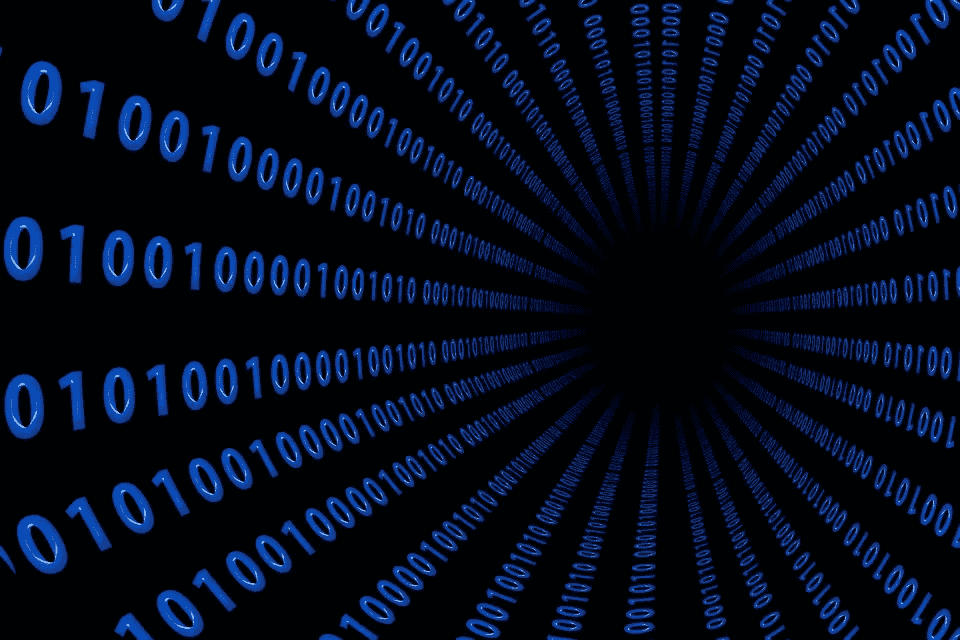

# 数据作为新的生产手段

> 原文：<https://medium.datadriveninvestor.com/data-as-the-new-means-of-production-c34799e346e2?source=collection_archive---------3----------------------->

Wonder what Marx would have said about big corporates owning tons of personal data…

前几天，我在我们的每周研究研讨会上听到一个有趣的政治哲学报告。在演讲中，演讲者建议建立一个基于合作社的经济体系，以对抗资本对劳动力的剥削，马克思认为这是资本主义制度的一个基本特征。

这让我想知道:马克思试图解决的问题(拥有生产资料的人对劳动者的剥削)在我们这个时代仍然适用吗？不要误解我——虽然我绝不是马克思主义者，但我确实认为员工在公平的条件下工作并拥有组织、谈判等权利非常重要。

然而，马克思所认为的资本相对于劳动力的最大优势(拥有生产资料)在当今时代似乎不太适用。毕竟，我们生活在一个创业不需要拥有土地、机器甚至大量资本的时代。一台笔记本电脑和编程知识足以在数字经济中创建一家公司。就资金需求而言，一个相对健康的天使投资者和风险投资公司生态系统可以确保即使是那些年轻、破产、没有经验(但有一个好主意)的人也能获得投资。

如果有什么不同的话，现在最重要的是数据的所有权。不是土地，不是机器，而是用户数据。因此，大型科技公司拥有数字经济中最有价值的资产。然而，鉴于用户(和监管者)对隐私的需求增加，企业家有空间提出新的业务，优先保护用户数据，同时提供良好的用户体验。这样的新企业可以迅速注册新用户，并迅速从边缘走向主流(这里想到了 WhatsApp 的例子)。

This stuff is much more valuable than machines or land these days

还是那句话，创办这样一家公司所需的资源并不大。唯一的问题是监管机构将如何确保科技巨头不会吞并创新创业公司(就像脸书对 WhatsApp 和 Instagram 所做的那样)，从而削弱竞争，剥夺用户的真正选择。

否则，市场的集中度将会增加，大公司将会使初创公司越来越难以竞争。如果发生这种情况，我们将回到马克思预测的富人和穷人之间无休止的斗争，即使今天的资本家不是抽着雪茄，戴着礼帽的运动地主，而是穿着牛仔裤和运动鞋，喝着 Soylent-slurping 的技术亿万富翁，他们喜欢编造他们的公司将如何拯救世界的故事。

