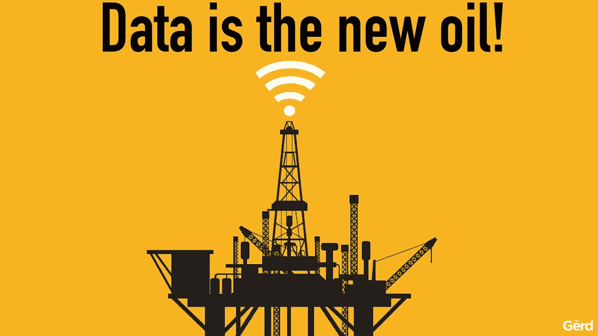

# 数据是新的石油！！那么，气候变化相当于数据泄露吗？

> 原文：<https://medium.datadriveninvestor.com/data-is-the-new-oil-so-what-is-climate-change-equivalent-of-data-spill-32091fcc6bc9?source=collection_archive---------10----------------------->

Image source:[https://www.flickr.com/photos/gleonhard/31254136671](https://www.flickr.com/photos/gleonhard/31254136671)

英国数学家克莱夫·亨比似乎在 2006 年创造了短语[‘数据是新的石油’](https://medium.com/project-2030/data-is-the-new-oil-a-ludicrous-proposition-1d91bba4f294)。这个短语现在广泛用于描述数据的价值和创造盈利活动的潜在应用。数据的价值主张类似于石油，只是数据的可访问性比石油容易得多。数据对石油的另一个作用是，全世界都在推动数据“开放和免费”供任何人和任何人访问。由于访问数据的成本很低，这使得数据有利可图。但是就像石油一样，如果数据有意想不到的后果呢？

石油工业的历史可以追溯到 19 世纪早期和中期，与第二次工业革命相吻合。石油工业实际上推动了大规模制造业的建立和扩张，并催生了我们今天生活和运作的经济。在 20 世纪早期和中期，我们进一步开发石油资源，以满足我们不断增长的商品需求，并建立了汽车和公共交通等需要石油产品作为主要燃料来源的行业。

 [## 气候变化、ESG 和对更好数据的追求——数据驱动的投资者

### 在地球上许多地方经历了另一个令人难以置信的炎热夏季后，来自 S&P 的最新发现…

www.datadriveninvestor.com](https://www.datadriveninvestor.com/2018/08/24/climate-change-esg-and-the-quest-for-better-data/) 

到 20 世纪中后期，发达国家变得更加富裕，发展中国家渴望加入发达国家的行列。一切都很顺利，直到世界意识到过度消耗石油和化石燃料已经对我们生活的星球造成了不可逆转的破坏。我们称之为“全球变暖”，直到有人意识到这不是描述我们气候状况的最佳措辞，然后我们采用了“气候变化”。这个术语不是描述性的，因为它不能准确地表达情感，但这不是本文的重点，所以我们暂时不去管它。

20 世纪末也引发了计算和自动化的第三次工业革命，但尽管我们已经产生了数千年的数据，这个术语在这一时期成为主流。在当今时代，数据和嵌入其中的信息非常重要。与石油类似，数据本身是有价值的，但当算法和机器学习等提炼技术应用于数据时，这种价值会大大提高。它是自动化、增加利润和定制产品以满足客户期望的高效和有效的燃料。这些听起来都是无害的，直到我们深入挖掘并分析数据对人类社会和经济结构的影响。数据和机器学习被广泛用于分析、绘制和预测人类行为；正是这些数据，在未经剑桥分析公司同意的情况下，被用来影响美国的总统选举和英国的英国退出欧盟投票；保险公司很容易使用健身跟踪应用程序的数据来为个人定制保险产品；同样的“公开”数据也暴露了在偏远地区锻炼的军事人员可能会危及他们的任务。当数据实用程序出现严重问题时，这只是冰山一角。

现在很清楚，气候变化是由石油及其提炼成分引起的。数据及其提炼成分的类似缺点也开始浮出水面。算法、机器学习和人工智能只会推动数据的效用，并有巨大的潜力影响我们的社会。就像第二次工业革命中对石油的过度依赖不由自主地导致了气候变化一样，如果不考虑后果就使用第四次工业革命中的数据，会不会给我们的社会带来不可逆转的风险？澳大利亚国立大学通过 3A 研究所发起了一项世界首创的倡议，围绕这一问题展开对话。最近，斯坦福大学启动了斯坦福以人为中心的人工智能研究所。我们希望这些机构能够为数据的道德使用建立框架，以支持和造福人类。与此同时，如果“数据是新的石油”，那么在数据的背景下，“社会变化”可以等同于“气候变化”吗？

关于作者

Hrishikesh Desai 是一名进步领袖，目前是澳大利亚国立大学 3A 学院的学生。赫里什克什在联邦政府的监管、知识产权方面有经验，你可以通过 LinkedIn 和 T2 的 Twitter 与他联系。