# 数据科学:对 2000 年至 2017 年期间在电影院上映的电影的分析

> 原文：<https://medium.datadriveninvestor.com/data-science-analysis-of-movies-released-in-the-cinema-between-2000-and-2017-b2d9e515d032?source=collection_archive---------2----------------------->

# 介绍

互联网电影数据库(IMDb)是一个充当世界电影在线数据库的网站。该网站包含大量关于电影的公开数据，如电影名称、电影上映年份、电影类型、观众、评论家评级、电影时长、电影概要、演员、导演等等。面对这个网站上的大量数据，我认为分析 IMDb 网站上 2000 年至 2017 年间的电影数据会很有趣。

=> **Python 代码在我的** [**GitHub**](https://github.com/nicolaschen1/DataScienceMovies) **上有，在这个** [**链接**](http://nbviewer.jupyter.org/github/nicolaschen1/DataScienceMovies/blob/master/DataScienceMovies.ipynb) **中也有。**

# Python 和 R 的比较

为了对来自 IMDb 网站的数据进行分析，我在 Python 和 r 之间犹豫不决。由于我在不同的个人项目中使用了这两种语言，因此我可以对它们进行比较。以下是我对这些语言的个人观察，供**数据科学**参考:

*   R 语言是一种语法非常简单的语言，使用和操作数据集中的向量和矩阵，然后显示图形非常简单。这显然是一种面向数据分析的语言，通过使用 R 进行实践，我发现这种语言有各种各样的高级图形，尤其是 ggplot2 库。R 语言也已经有了统计功能，并提供了许多软件包来处理数据科学的特定问题。所以对于 R 被统计学家大量使用我一点也不奇怪。R 语言是一种让我想起 MATLAB 语言来制作脚本以便处理工程问题的语言，我经常用这种语言使用向量和矩阵来绘制图形，还可以与 Simulink 模型进行交互(机器人系统、卡尔曼滤波器、垂直飞行的无人机等的建模)。).所以我确信用 MATLAB 来做数据科学也是可能的，尽管这种语言更侧重于数学和工程(工业、机器人、机电一体化和计算机视觉)。
*   Python 是一种比 r 更广泛的编程语言，它是一种面向对象的编程语言(OOP)，也是一种脚本语言。使用 Python，可以开发图形用户界面、软件应用程序、网络(客户端-服务器、TCP、套接字)、游戏、在 Blender 中使用 Python 脚本创建 3D 模型、创建网站，当然还有数据分析(数据科学)。这可能只是一个轶事，但谷歌收购的 YouTube(视频托管网站)是用 Python 开发的。因此，使用 Python 可以比 r 做得更多。Python 也是一种遵循缩进逻辑的语言，它非常适合快速实现复杂的算法，并且是可伸缩的，也就是说，它能够处理大量的数据，并且在数据处理时间上比 r 更有效。

因此，我更喜欢用 Python 来分析 IMDb 网站的数据。

# Python 和数据科学

为了使用 Python 进行数据科学研究，我将 Python 与以下软件库结合使用:

*   **Numpy** :包含了很多用于数值计算的函数(向量、矩阵、多项式等。).
*   **Matplotlib** :允许以图形的形式追踪和可视化数据。
*   **熊猫**:它允许操纵和分析数据(数据帧)。
*   Seaborn :它通过提供有吸引力的统计图形来补充 Matplotlib。

还有允许机器学习的 Python Scikit-learn 库，但我在 IMDb 的数据分析中不需要它。

数据科学家的首要任务是准备数据，如果数据不是 CSV 文件，这一步可能需要很长时间。然后，在数据集准备就绪后，数据科学家必须探索数据并对其进行分析。一旦完成这一步，他必须对数据进行建模、调整和验证。在这个阶段，有可能使用机器学习技术来预测你想要的信息。正如我之前所说，在对 IMDb 的研究中，我不需要使用机器学习，因为我没有试图从 IMDb 的数据中进行预测。一旦数据建模完成，最后一步是可视化结果并解释它们。

事实上，Data Scientist 的主要目的是让数据说话，从大量结构化或非结构化数据中**理解数据**，这些数据是收集的还是分散的，是内部的还是外部的，**到** **提供有用的信息，这些信息将为企业带来附加值，从而增加公司的营业额。**

# 问题的研究

**目标**:分析 IMDb 网站上关于 2000 年至 2017 年期间在电影院上映的电影的数据。

# 准备数据集

在 IMDb 网站上，可以过滤搜索，从而显示一年(如 2017 年)的所有电影。例如，所有 2017 年 IMDb 电影的第一页都可以在以下 URL 下找到:

[http://www.imdb.com/search/title?release_date=2017&sort = num _ votes，desc & page=1](http://www.imdb.com/search/title?release_date=2017&sort=num_votes,desc&page=1)

所以我开始在这个页面上列出所有可用的数据，理解它们的含义，并特别想出一个可以恢复 IMDb 数据的方法。在清点了该页面上的可用数据并理解了每个数据项的含义后，我开始了数据选择阶段，即我希望为我的数据科学研究保留的数据。

以下是我想保留的数据:

*   电影标题
*   电影的类型
*   电影时长(分钟)
*   电影上映年份
*   公众投票数
*   公众评价(满分 10 分)
*   评论家评级(满分 100 分)
*   电影总收入(百万美元)

现在仍然需要恢复 2000 年至 2017 年之间所有电影的这些数据。我在 HTML、CSS 和 Javascript 方面的知识帮助我找到了自动恢复这些数据的方法。像任何网站一样，IMDb 网站的代码是 HTML、CSS 和 Javascript。因此，有必要解析这些 HTML 代码，仅恢复某些 HTML 标签之间的相关数据，并将其应用于几个页面以及 2000 年到 2017 年的所有年份。

所以**我使用 **BeautifulSoup 库**开发了一个 Python 脚本**，它允许解析 HTML 代码，我将每年的解析限制在 8 页，所以从 2000 年开始，我的 Python 脚本在 8 页上检索数据，然后在下一年重复同样的步骤，直到 2017 年。这是一种网络抓取技术。

在我的 Python 脚本中，我定期向 IMDb 站点发送 GET HTML 请求来检索相关页面。在启动 Python 脚本之前，我仍然查看了带有电影列表的 IMDb 网站，我意识到这个 IMDb 网站缺少一些数据。对于一些电影，例如，没有票房，没有投票或没有电影时长。因为有很多电影，很可能还有其他缺失的数据，所以如果我启动了 Python 脚本，我就会得到一个缺失值的数据集。

我一直在思考几种解决方案来解决这个缺失值的数据集问题，如下所示:

1.  删除缺少值的行
2.  用特定值填充空字段
3.  用计算填充空白字段

我选择了第一种解决方案，所以我更新了我的 Python 脚本，这样它就不会考虑解析过程中数据丢失的电影。一旦完成，我就运行我的脚本，并等待半个小时来恢复 2000 年至 2017 年之间的数据。

# 数据分析

因此，我用 Python 脚本恢复了数据集。有了 Pandas 库，就有可能对数据集有一个概述，通过应用 info()、describe()和 head()等函数，我可以检查数据集的内容。

将 head()函数应用于我的数据集后，我显示了数据集的一部分。我已经显示了如下的前 8 个数据:

我们找到选定的数据:

*   电影名称->电影
*   电影的类型->流派
*   电影时长(分钟)-> timeMin
*   电影的上映年份是->哪一年
*   公众投票数->投票
*   公众评分(满分 10 分)->观众评分
*   评论家评级(满分 100) ->评论
*   电影总收入(百万美元)->百万美元

然后，我对数据集应用 info()函数:

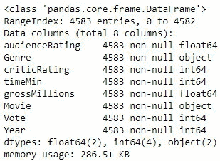

我们可以在上面的图片中看到，我恢复了 8 列 4583 个条目(行)(每列一种类型的数据)。对于每一列数据(收视率、流派等。)，我没有任何缺少的值(非 null)并且数据的类型似乎是一致的，例如，我有一个用于公共注释(audienceRating)的浮点数，一个用于年份和投票数的整数。然而，根据定义，流派和电影列是字符串，Python 将它们解释为对象类型。为了能够使用和可视化这两种数据类型和电影，我必须在类别中键入它们，然后我得到:

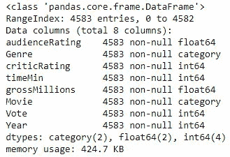

因此，两个数据类型和电影是类别类型。

然后，我用 describe()显示数据集的统计概要。

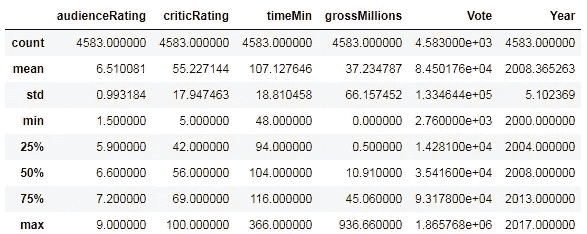

有了这个摘要，我可以访问关于我的数据集的许多信息，比如行数、平均数据、标准偏差、最小值、最大值以及所有三个四分位数。

# 数据的统计建模

如前所述，我选择了以下数据进行统计建模:

*   电影名称->电影
*   电影的类型->流派
*   电影时长(分钟)-> timeMin
*   电影的上映年份是->哪一年
*   公众投票数->投票
*   公众评分(满分 10 分)->观众评分
*   评论家评级(满分 100) ->评论
*   电影总收入(百万美元)->百万美元

从这些数据中，我可以追踪熊猫图书馆允许的各种图形。

# 数据的可视化和数据的解释

我可以根据 2000 年至 2017 年之间上映的所有电影的评论家评级来可视化观众评级(audienceRating)。

**基于 2000 年至 2017 年间评论家评分的观众评分图表:**

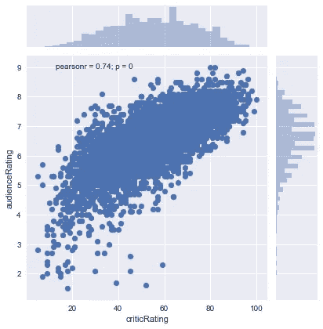

我们看到有一个高度集中的点，沿着一条直线，这意味着在大多数情况下，电影的观众评级与评论家的评级一致。我们还看到，对于公众而言，5/10 和 8/10 之间的分布更强，而评论家在 30/100 和 80/100 之间的分布更强，这证实了在大多数情况下，观众评级和评论家评级之间的一致性。

然而，我们可以看到，对于一些电影，公众与评论家并不一致，例如，一些电影的收视率在 1/10 至 3/10 之间，而评论家的收视率在 40/100 至 60/100 之间。我们也可以看到，其他电影的观众评分(公众评分)在 4/10 至 7/10 之间，而影评人的评分则在 20/100 至 50/100 之间。

在这个图表中，我们可以得出结论，公众通常欣赏电影，通常给 5/10 以上的分数，而评论家更严厉，因为评论家的评级通常低于公众对任何电影的评级。

**基于 2000 年至 2017 年间评论家评分的观众评分六边形表示:**

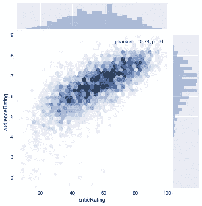

在这张图上，我们可以看到观众和评论家之间的线性关系。

# 2000 年至 2017 年期间最受公众和评论家欢迎的电影

在搜索数据集后，我们可以确定最受公众和评论家欢迎的电影。2000 年至 2017 年间最受大众欣赏的电影有:

*   2002 年上映的《自我的世纪》，评分 9/10。
*   2008 年上映的《黑暗骑士:黑骑士》，评分 9/10。

影评人最欣赏的电影是:

*   2014 年上映的《少年时代》，评分 100/100。

【2000 年至 2017 年间电影长度收视率图表:

在这张图表上，我们看到大多数电影持续时间在 60 分钟到 120 分钟之间，并且收集了最多的分数，这些分数在 4/10 到 8/10 之间，大多数分数在 6/10 以上。

对于一些超过 3 小时(180 分钟)的电影，我们注意到公众欣赏它们，因为它一般给出 7/10 以上的评分。在这个图表中，我们看到最长的电影持续了 366 分钟，即 6 小时 10 分钟，得分为 8.5/10，在数据集中搜索后，它是关于 2003 年上映的电影“我们最好的岁月”，这是一部戏剧电影。

**根据电影在 2000 年至 2017 年之间的持续时间，评论家的评级的图形表示:**

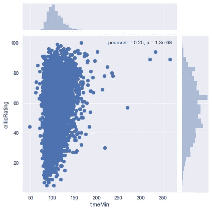

在这张图表上，我们注意到，对于 60 分钟到 120 分钟的电影，评论家的评分更集中，在 10/100 到 98/100 之间变化。

【2000 年至 2017 年间根据公众意见制作的电影总票房图表:

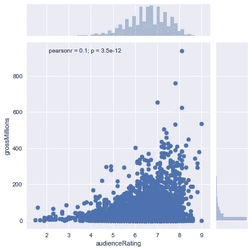

在这张图表上，很明显，受到公众好评的电影是产生了最多数百万美元收入的电影，这是合乎逻辑的，因为如果人们喜欢一部电影，他们就会谈论这部电影，这将鼓励其他人去电影院看这部电影，从而增加这部电影的总收入。观众(大众)收视率更集中在 5/10 到 8/10 之间。

在数据集中，带来百万美元收入最多的电影是**2015 年上映的 9.3666 亿美元的电影《星球大战:第七集——原力觉醒》。**

**根据 2000 年至 2017 年影评人评分的电影总票房图示:**

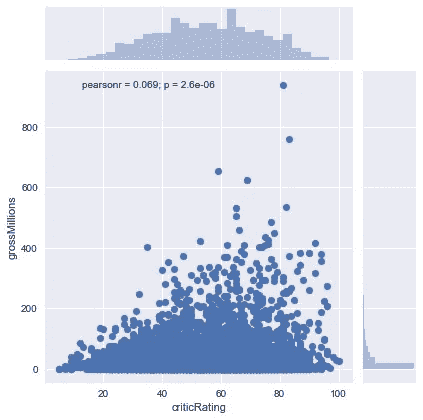

在这个图表中，我们注意到影评人的评分更集中在 30/100 和 80/100 之间，这意味着影评人对电影的要求比大众更高。我们还注意到，影评人评价高的电影是那些赚了很多钱的电影。

**根据 2000 年至 2017 年公众得分的投票数图示:**

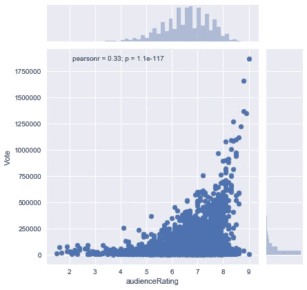

在这张图表上，我们可以看到，人们越喜欢一部电影，他们就越会投票并给予好评。

获得最多选票的电影是电影《黑暗骑士:黑暗骑士》，获得 1865768 张选票。

【2000 年至 2017 年间根据电影时长的电影总票房图示:

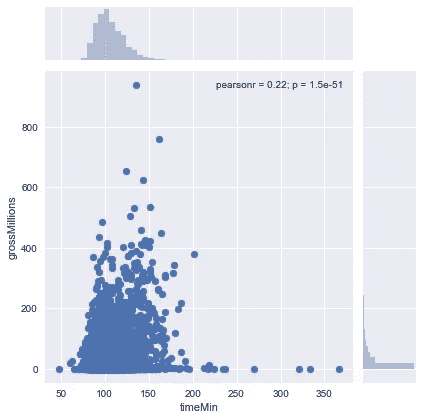

在这个图表上，我们注意到 60 分钟到 150 分钟(2h30)之间的电影带来的收益最多。另一方面，持续时间很长的电影，超过 3 小时，收入少得多，也就是说，低于 100 万美元。

我们推断，导演应该避免制作时长至少为 3 小时的电影，他应该将电影时长限制在 1 到 2:30 之间，以便观众在电影放映期间不会感到疲劳。

**按观众、影评人、时长、票房、票数和年份的分布:**

*   收视率:大部分收视率在 6/10 到 7/10 之间。
*   评论家评分:大多数评论家评分在 40/100 到 70/100 之间。
*   电影时长:大量电影时长为 100 分钟(1h40)。
*   电影总收入:大多数电影的价值在 0 到 1 亿美元之间。
*   票数:多数票数在 0 到 250000 票之间。
*   年份:2000 年、2009 年、2017 年上映了很多电影。

# 2000 年至 2017 年间按类型划分的电影直方图

面对大量的数据，我将我的数据集分成 3 个子数据集，每个数据集按 6 种类型分组，因为我的整个数据集有 18 种类型的电影。

电影的类型有:

*   行动
*   冒险
*   动画
*   传记
*   喜剧
*   犯罪
*   纪录片
*   戏剧
*   家庭的
*   昂贵的
*   恐怖
*   音乐
*   秘密
*   浪漫性
*   科幻小说
*   惊悚片
*   战争
*   西方的

因此，我获得了由 6 个流派组成的三个直方图。

**2000 年至 2017 年电影类型总收入直方图:**

在这个直方图上，我们看到传记、喜剧、犯罪、戏剧和恐怖的电影在 2000 年至 2017 年之间数量最多。这一时期很少有推理片、西部片或战争片。

我们还注意到，票房最高的电影(2 亿到 4 亿美元)是动作片、剧情片和推理片。

【2000 年至 2017 年电影类型收视率直方图:

我们注意到，动作片、冒险片、动画片、传记片、喜剧片、犯罪片、纪录片、剧情片、悬疑片和科幻片最受观众喜爱(得分高于或等于 8/10)。

【2000 年至 2017 年电影流派影评人评分直方图:

我们注意到，冒险、动画、传记、喜剧、纪录片、戏剧、科幻和推理电影是评论家评分最高的电影(得分大于或等于 80/100)。

【2000 年至 2017 年电影类型投票直方图:

与其他电影相比，动画、戏剧和推理电影获得了最多的选票。

**基于 2000 年至 2017 年间电影类型的评论家评分的观众评分图表:**

当我把我的数据集分成 6 种电影类型的 3 个部分时，我得到了 3 个图形。

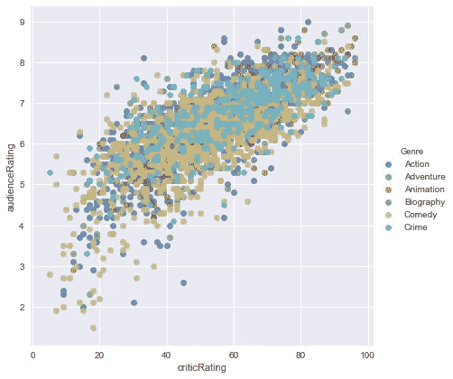

在大多数情况下，公众和评论家对电影的看法是一致的，尤其是喜剧或犯罪电影。动画和冒险电影是最受公众和评论家欢迎的电影。

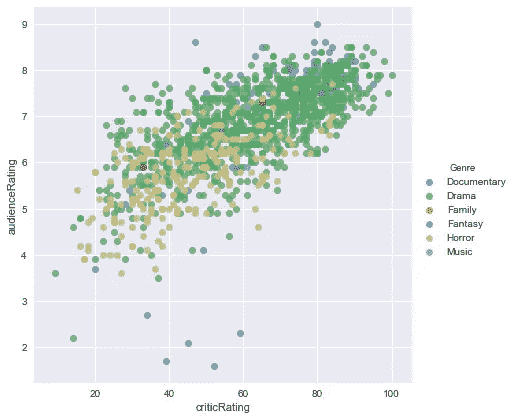

戏剧和纪录片最受公众和评论家的赞赏。

悬疑和科幻电影最受大众和评论家的欣赏。

【2000 年至 2017 年电影类型的部分数据箱线图:

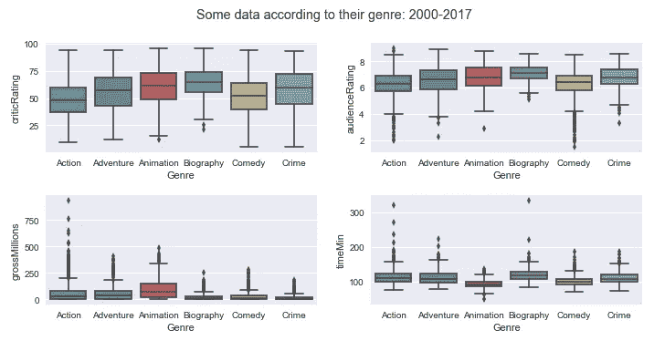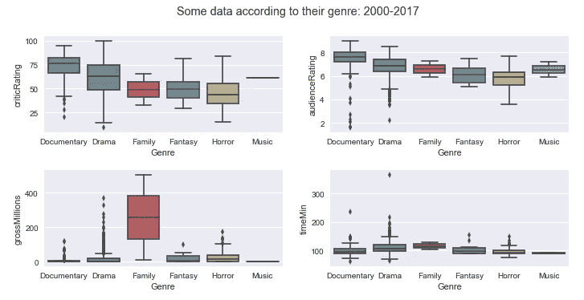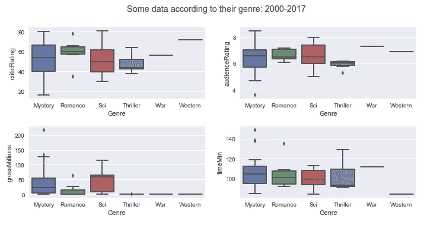

在这些箱线图中，必须参考中位数、最小值和最大值，才能看到中位数周围数据的离差。

*   影评人评分:动画、传记、犯罪、戏剧、悬疑、科幻由影评人评分。
*   观众评分:动画、冒险、传记、犯罪、纪录片、悬疑和科幻是公众评分最高的。
*   电影总收入:动作、冒险、动画、家庭电影是报道最多的。
*   电影时长:动作片、冒险片、传记片、犯罪片、家庭片、剧情片和推理片是时长最长的。

我们也可以用小提琴图(violins)的形式绘制这些箱线图，如下所示:

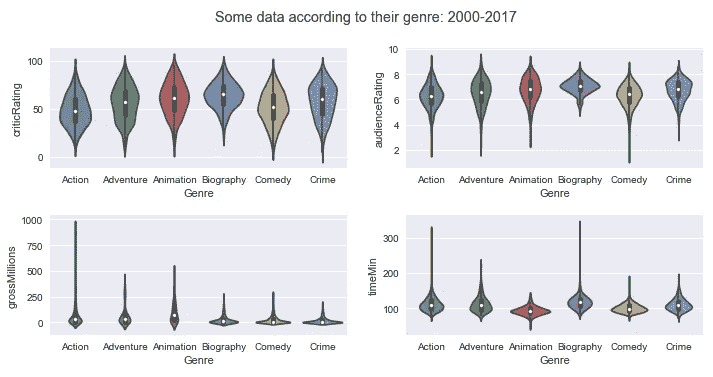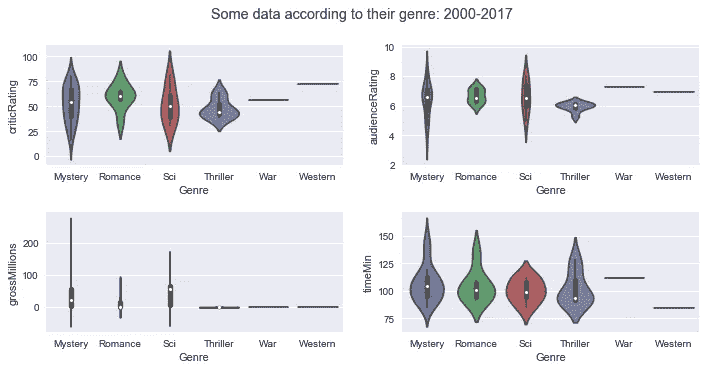

这些图表的解释与箱线图的解释相同。

有了 Pandas 库，我还可以以网格形式显示图表，这允许在同一个图表上显示大量信息。

我能够在同一个图表上显示几个信息，即:

*   y 轴上的收视率
*   x 轴上的评论家评级
*   每行一个流派
*   每列一年

数据集包含 18 年(2000 年到 2017 年)和 18 个流派，所以要显示很多列(18 列)和流派。为了提高知名度，我因此分了 6 年(2000 年到 2005 年，2006 年到 2011 年，2012 年到 2017 年)。

**基于 2000 年至 2005 年对动作、冒险、动画、传记、喜剧和犯罪的评论家评级的观众评级的图形表示:**

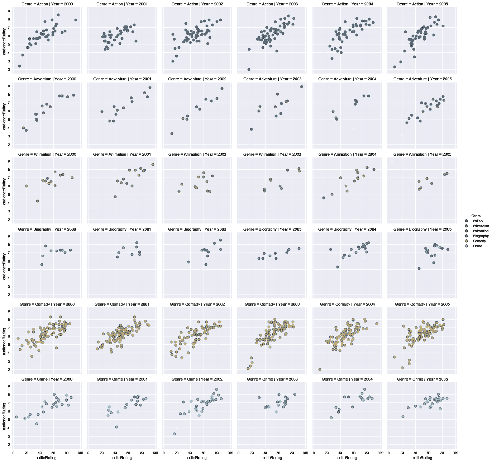

**根据 2000 年至 2005 年评论家对纪录片、戏剧、家庭、奇幻、恐怖和音乐的评分，观众评分的图示:**

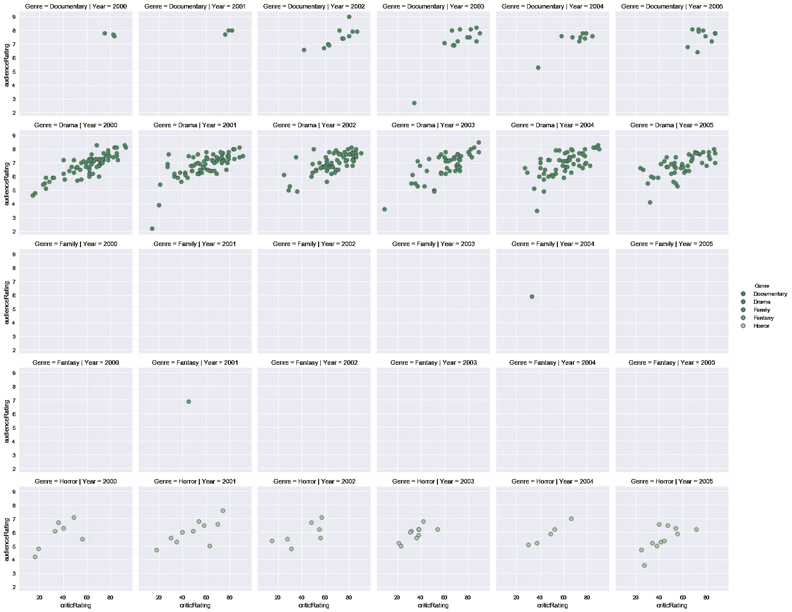

**根据 2000 年至 2005 年对推理片、爱情片、科幻片、惊悚片、战争片和西部片的影评，观众评分的图示:**

**根据 2006 年至 2011 年动作、冒险、动画、传记、喜剧和犯罪电影的评论家评分，观众评分的图形表示:**

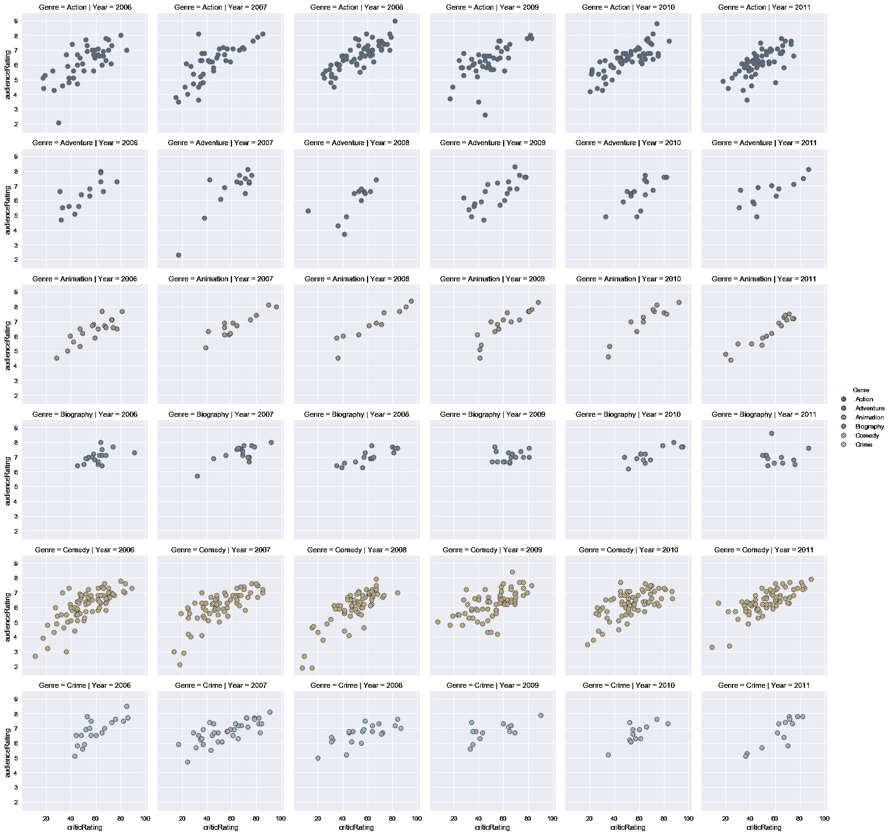

**基于 2006 年至 2011 年纪录片、剧情片、家庭片、奇幻片、恐怖片和音乐片的评论家评分的观众评分图表:**

**根据 2006 年至 2011 年对推理片、爱情片、科幻片、惊悚片、战争片和西部片的评论家评分，以图表形式展示观众评分:**

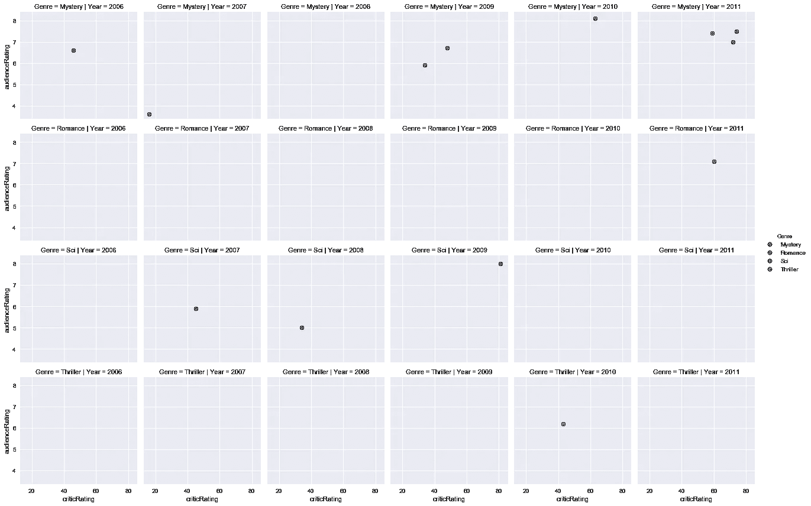

**根据 2012 年至 2017 年影评人对动作、冒险、动画、传记、喜剧和犯罪电影的评分，观众评分的图形表示:**

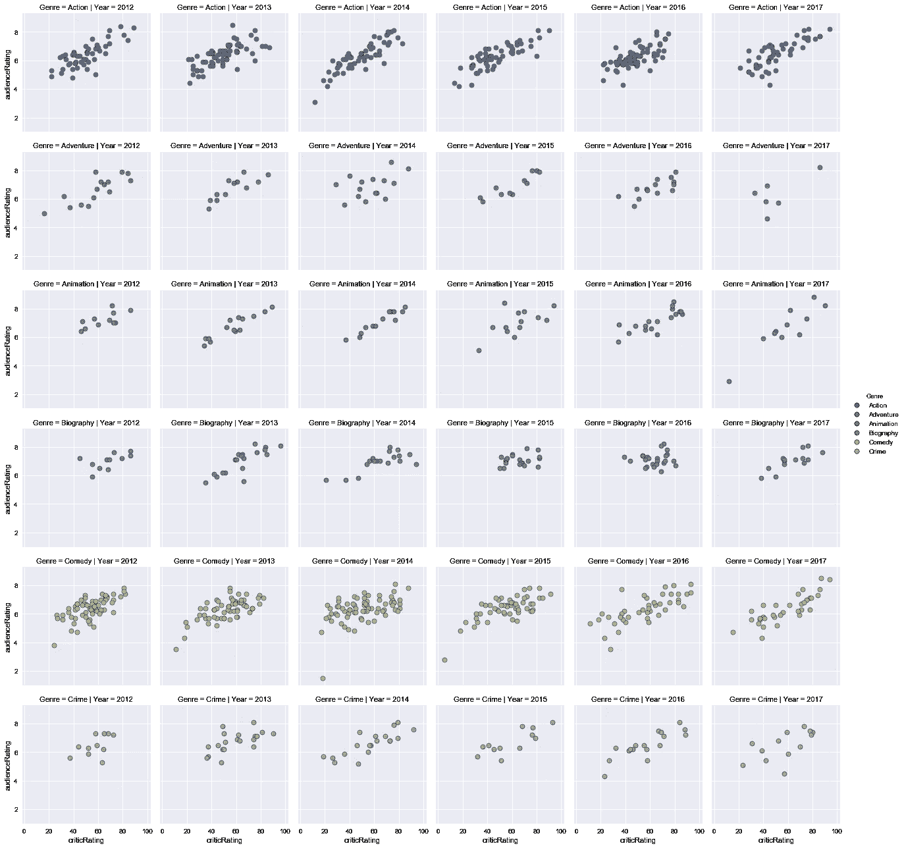

**根据 2012 年至 2017 年纪录片、剧情片、家庭片、奇幻片、恐怖片和音乐片的评论评分，观众评分的图形表示:**

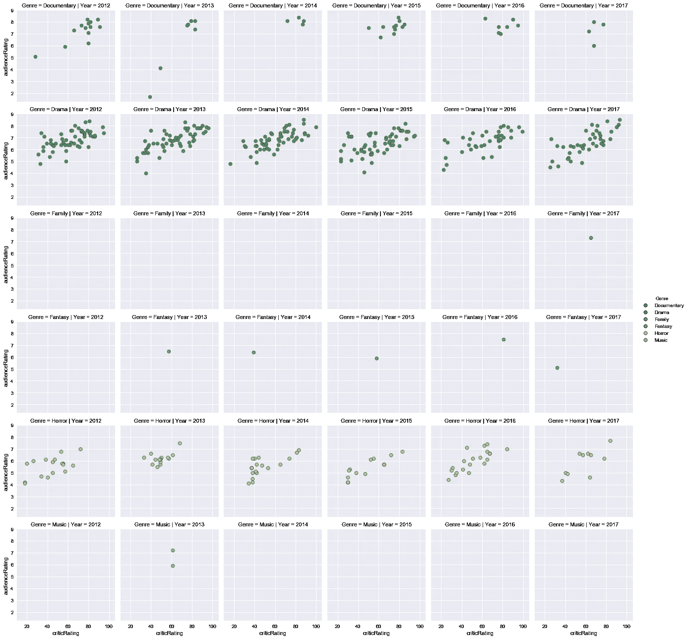

**根据 2012 年至 2017 年推理片、爱情片、科幻片、惊悚片、战争片和西部片的评论评分，以图形方式呈现观众评分:**

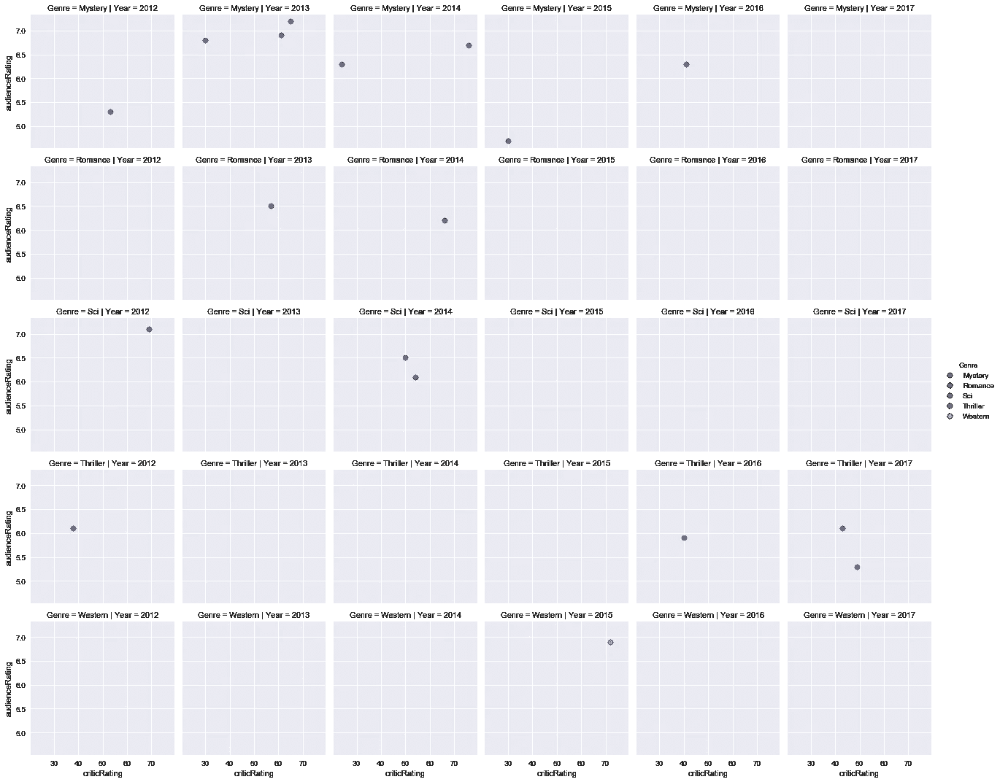

**这些结果的解释**

*   2000 年至 2005 年间，家庭电影、奇幻、推理、言情、科幻、惊悚、战争片很少，2000 年至 2005 年间音乐剧、西部类型片就更少了。大众和评论家的评价是一致的。
*   2006 年至 2011 年间，很少有奇幻电影、推理片、爱情片、科幻片和惊悚片，几乎没有家庭片、音乐剧、战争片和西部片。公众和评论家对大多数电影的看法似乎是一致的。
*   2012 年至 2017 年间，几乎没有家庭电影、奇幻、神秘、浪漫、科幻、惊悚、西部电影，几乎没有战争电影。观众和评论家的评分相当接近。

因此，在 2000 年至 2017 年之间，公众对大多数电影的评分接近评论家的评分，人们可以推断公众和评论家对一部电影的看法相同。

# 仪表盘

我画了 3 个仪表板，每个仪表板分为几组:

*   基于电影食谱的观众评分
*   根据电影总值对影评人的评分
*   根据类型划分的电影总收入
*   基于关键评分的观众评分

第一个仪表盘是 2000 年至 2017 年的动作、冒险、动画、传记、喜剧和犯罪电影。

第二个仪表板用于 2000 年至 2017 年之间的类型电影纪录片、戏剧、家庭、奇幻、恐怖和音乐。

第三个仪表板是 2000 年至 2017 年间的类型电影推理片、爱情片、科幻片、惊悚片、战争片和西部片。

3 个仪表板显示，动作、冒险、动画和家庭电影是报道最多的电影，电影的观众评级与评论家评级非常接近，受到公众和评论家好评的电影是带来大量收入的电影。

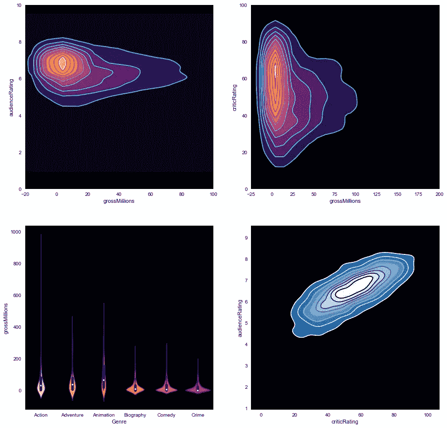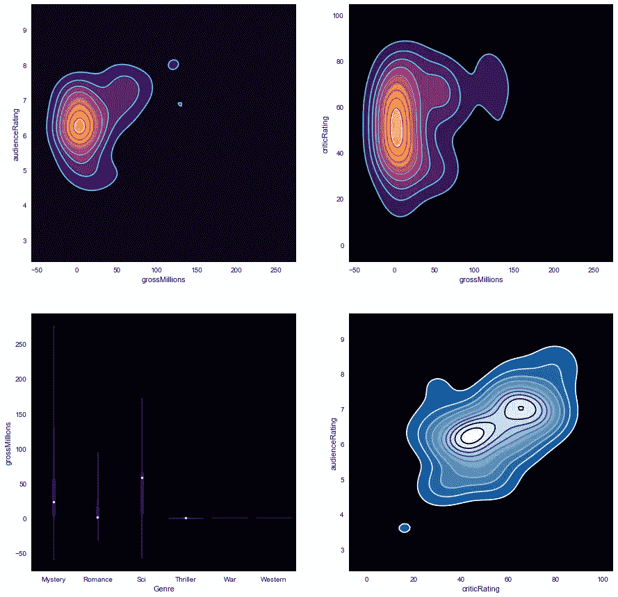

# 结论

数据的准备，这些数据的建模，然后用各种各样的图表可视化这些数据，最后对这些图表的解释，使得对 2000 年至 2017 年之间在电影院上映的电影进行分析和全球观察成为可能。

**这项研究通过大量的数据，让我对 2000 年到 2017 年之间的电影确定了以下几点:**

*   这部电影的观众评分和评论家评分非常接近
*   评论家的评价比公众更严厉
*   大多数电影持续 60 分钟到 120 分钟
*   受到公众和评论家好评的电影赚钱最多
*   公众越欣赏一部电影，他们就越会投票并给出好的评价
*   60 分钟到 150 分钟(2h30)的电影最赚钱
*   超过 3 小时的电影收入最少
*   动画、传记、犯罪、戏剧、悬疑和科幻电影是评论家评价最高的
*   动画、冒险、传记、犯罪、纪录片、悬疑和科幻电影是公众评价最高的
*   动作、冒险、动画和家庭电影是最赚钱的
*   动作、冒险、传记、犯罪、家庭、戏剧和推理电影是持续时间最长的电影
*   传记、喜剧、犯罪、戏剧和恐怖电影数量最多
*   很少有推理片、西部片或战争片
*   赚钱最多的电影是动作片、剧情片和推理片